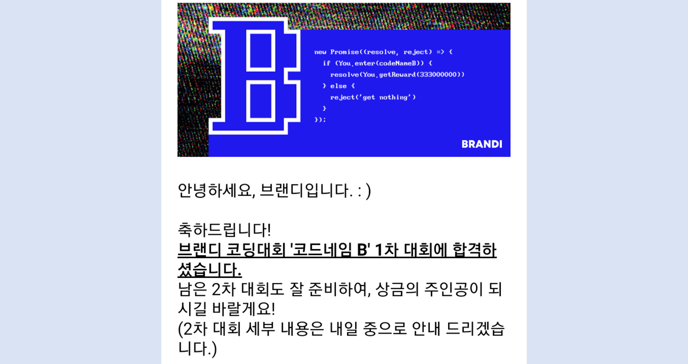

> 벌써 9월이다. 빨리 날씨가 선선해지면 좋겠다🍂

## TIL

- [2020년 9월 1일](#2020년-9월-1일)
- [2020년 9월 2일](#2020년-9월-2일)
- [2020년 9월 4일](#2020년-9월-4일)
- [2020년 9월 5일](#2020년-9월-5일)

## 2020년 9월 1일

### ✅ 오늘 할 일

- ~~백준 단계별 알고리즘 백트래킹 - [BOJ9663 N-Queen](https://www.acmicpc.net/problem/9663)~~ ⭕
- ~~프로그래머스 Level1 - [시저 암호](https://programmers.co.kr/learn/courses/30/lessons/12926)~~ ⭕
- ~~[데이터 구조 및 분석](https://kaist.edwith.org/datastructure-2019s) #1.8 - #1.12~~ ⭕
- [Keras Model for Beginners (0.210 on lb) + Eda + R&D by SKS](https://www.kaggle.com/devm2024/keras-model-for-beginners-0-210-on-lb-eda-r-d) 1차 필사 🔺

### ✨ 오늘 한 일

- **백준의 [N-Queen](https://www.acmicpc.net/problem/9663) 문제와 프로그래머스 [시저 암호](https://programmers.co.kr/learn/courses/30/lessons/12926)를 풀었다.**
  - [시저 암호](https://programmers.co.kr/learn/courses/30/lessons/12926)는 알파벳을 +N만큼 이동하여 암호화시키는 방법이다. 이를 구현하는 것이 문제였고 `ord`를 사용하면 간단히 구현할 수 있다.
  - [N-Queen](https://www.acmicpc.net/problem/9663)는 백트래킹의 대표적인 문제인데 잘 기억이 나지를 않아 [알고리즘 기초](http://www.yes24.com/Product/Goods/37582683) 책을 참고하였다. 그런데 잘 안 돌아가서 몇몇 사람의 풀이를 보면서 풀었다ㅠㅠ **유망하다면 계속 들어가고 유망하지 않다면 부모 노드로 돌아가라**를 꼭 명심해야겠다.
- **[데이터 구조 및 분석](https://kaist.edwith.org/datastructure-2019s) #1.8 - #1.12을 수강하였다.**
  - 겨우 파이썬 문법 파트가 끝났다. 사실 이렇게 질질 끌만한 내용이 아닌데 자꾸 집중이 안 되서 오래 걸렸다. 다음 강의는 UML과 객체지향론에 대해서 배운다. 이것도 아는 내용이니 빨리 끝내야겠다.

### 💡 내일 할 일

- 백준 단계별 알고리즘 백트래킹 - [스도쿠](https://www.acmicpc.net/problem/2580)
- 프로그래머스 Level 1 - [약수의 합](https://programmers.co.kr/learn/courses/30/lessons/12928)
- [파이썬 웹 프로그래밍](http://www.yes24.com/Product/Goods/64100462) 3.7장. 애플리케이션 개발하기 - View 및 Template 코딩까지
- [Keras Model for Beginners (0.210 on lb) + Eda + R&D by SKS](https://www.kaggle.com/devm2024/keras-model-for-beginners-0-210-on-lb-eda-r-d) 1차 필사
- [Keras Model for Beginners (0.210 on lb) + Eda + R&D by SKS](https://www.kaggle.com/devm2024/keras-model-for-beginners-0-210-on-lb-eda-r-d) 2차 필사

### ✍ 메모

 
**브랜디 코드네임 B 1차 대회에 합격했다🎉🎉** 제대로 푼 문제가 한 개 밖에 없어서 당연히 떨어질 줄 알고 다음 코테나 준비해야지 하고 있었는데.. 약간 떨떠름하다. 2차 대회도 이번 주 토요일에 진행된다. 하지만 1차 대회와는 다르게 <u>캠을 키고 문제를 풀어야 해서</u> 조금 더 긴장이 된다.

부스트캠프 2차 코딩테스트도 이랬었는데 그 때도 많이 긴장했던 것 같다. "혹시 캠이 꺼지면 어쩌지", "인터넷 검색 되는 건가" 등등 여러 걱정을 하면서 시험을 치뤘던터라 문제가 잘 풀리지 않았다. 그래도 수상이 아니라 `참여`에 의의를 둔 대회니 부담 없이 봐야겠다.

 

<a href='#'><small class='up-button'>위로 올라가기💨</small></a>

 

## 2020년 9월 2일

### ✅ 오늘 할 일

- ~~백준 단계별 알고리즘 백트래킹 - [스도쿠](https://www.acmicpc.net/problem/2580)~~ ⭕
- ~~프로그래머스 Level 1 - [약수의 합](https://programmers.co.kr/learn/courses/30/lessons/12928)~~ ⭕
- ~~[Keras Model for Beginners (0.210 on lb) + Eda + R&D by SKS](https://www.kaggle.com/devm2024/keras-model-for-beginners-0-210-on-lb-eda-r-d) 1차 필사~~ ⭕
- ~~[Keras Model for Beginners (0.210 on lb) + Eda + R&D by SKS](https://www.kaggle.com/devm2024/keras-model-for-beginners-0-210-on-lb-eda-r-d) 2차 필사~~ ⭕
- ~~[Keras Model for Beginners (0.210 on lb) + Eda + R&D by SKS](https://www.kaggle.com/devm2024/keras-model-for-beginners-0-210-on-lb-eda-r-d) 3차 필사~~ ⭕
- [파이썬 웹 프로그래밍](http://www.yes24.com/Product/Goods/64100462) 3.7장. 애플리케이션 개발하기 - View 및 Template 코딩까지 ❌

### ✨ 오늘 한 일

- **백준의 [스도쿠](https://www.acmicpc.net/problem/2580) 문제와 프로그래머스의 [약수의 합](https://programmers.co.kr/learn/courses/30/lessons/12928)을 풀었다.**
  - [스도쿠](https://www.acmicpc.net/problem/2580) 문제도 저번 [N-Queen](../../problem-solving/boj-9663-n-queen)과 비슷하게 어려웠다. 아직 백트래킹의 감을 못 잡겠다. 그래도 정리하자면 **유망 = 문제의 제약조건**이라는 것이다. 예를 들면, [N-Queen](../../problem-solving/boj-9663-n-queen)의 경우 <u>상하좌우 대각선에 어떤 퀸도 없는 경우</u>이고 [스도쿠](https://www.acmicpc.net/problem/2580)의 경우 <u>가로/세로/3×3그룹 내에 같은 숫자가 없는 경우</u>이다. 이 기준을 만족하면 [N-Queen](../../problem-solving/boj-9663-n-queen)에서는 퀸을 다음 행으로 옮기고 [스도쿠](https://www.acmicpc.net/problem/2580)에서는 채워지지 않은 다음 빈칸으로 옮긴다.
  - 사실 아직도 감이 안 잡힌다. 문제 설명을 들어보면 `dfs`와 혼합되어 자주 나오는 것 같다. 사실 백트래킹도 `dfs`의 일종이니 크게 보면 `dfs`가 맞다고 생각한다. 다만 백트래킹은 더 깊이 들어가기 전에 조건을 만족하지 않으면 상위 노드로 간다. 어쨌든.. **알고리즘 이론을 쓱 한 번 정리해야할 필요성을 절실히 느낀다.**
- **[Keras Model for Beginners (0.210 on lb) + Eda + R&D by SKS](https://www.kaggle.com/devm2024/keras-model-for-beginners-0-210-on-lb-eda-r-d)의 모든 필사를 마쳤다.**
  - 이번 필사는 간단해서 하루 만에 1, 2, 3차 필사를 마쳤다. 다만 오랜만에 딥러닝이라 용어가 낯설어서 찾아가면서 공부했다. `Dropout`, `Decay`, `Conv` 등 너무 오랜만이라 어색했다.. 조금씩 공부를 병행할 걸ㅠㅠ 그래도 전에 정리해놓은 게 있어서 어렵지 않게 넘어가기는 했다.
  - 이 노트북은 *Keras*를 사용하였다. 나는 _Pytorch_ 밖에 사용을 안 해봤는데 *Keras*도 나쁘지 않은 것 같다. 사실 *Pytorch*를 자주 사용하던 때는 **무조건 Pytorch다!**라고 생각했는데 딥러닝 공부를 안 한지 좀 돼서 그런지 *Keras*도 괜찮아보인다. 일단 [이유한님의 커리큘럼](https://kaggle-kr.tistory.com/32)의 딥러닝 베이스는 *Keras*라서 여기서는 *Keras*를 사용하고 실제 모델 설계 때는 *Pytorch*를 사용할 예정이다. (얼른 튜토리얼도 공부해야겠다.)

### 💡 내일 할 일

- 백준 단계별 알고리즘 백트래킹 - [연산자 끼워넣기](https://www.acmicpc.net/problem/14888)
- 프로그래머스 Level 1 - [이상한 문자 만들기](https://programmers.co.kr/learn/courses/30/lessons/12930)
- [데이터 구조 및 분석](https://kaist.edwith.org/datastructure-2019s) #2.1 - #2.3
- [Keras + TF LB 0.18 by wvadim](https://www.kaggle.com/wvadim/keras-tf-lb-0-18) 1차 필사
- [Keras + TF LB 0.18 by wvadim](https://www.kaggle.com/wvadim/keras-tf-lb-0-18) 2차 필사

### ✍ 메모

전에 딥러닝 공부하다가 슬럼프에 빠졌었데 오랜만에 다시 공부하니 참 새롭다. 오히려 새로 공부하는 느낌이라 더 잘 이해가 되는 느낌이 들기도 한다ㅋㅋ **이번에는 정말 제대로 딥러닝과 데이터분석을 뿌셔버릴거다.** 적어도 분석으로 수상🏆까지 해보자!

 

<a href='#'><small class='up-button'>위로 올라가기💨</small></a>

 

## 2020년 9월 4일

### ✅ 오늘 할 일

- ~~백준 단계별 알고리즘 백트래킹 - [연산자 끼워넣기](https://www.acmicpc.net/problem/14888)~~ ⭕
- ~~프로그래머스 Level 1 - [이상한 문자 만들기](https://programmers.co.kr/learn/courses/30/lessons/12930)~~ ⭕
- [데이터 구조 및 분석](https://kaist.edwith.org/datastructure-2019s) #2.1 - #2.3 ❌
- [Keras + TF LB 0.18 by wvadim](https://www.kaggle.com/wvadim/keras-tf-lb-0-18) 1차 필사 ❌
- [Keras + TF LB 0.18 by wvadim](https://www.kaggle.com/wvadim/keras-tf-lb-0-18) 2차 필사 ❌

### ✨ 오늘 한 일

- **백준 백트래킹의 [연산자 끼워넣기](https://www.acmicpc.net/problem/14888)와 프로그래머스의 [이상한 문자 만들기](https://programmers.co.kr/learn/courses/30/lessons/12930) 문제를 풀었다.**
  - [연산자 끼워넣기](https://www.acmicpc.net/problem/14888) 문제는 순열이 쓰여서 백트래킹이고 `permutations`를 쓴다면 브루트포스 문제에 더 가깝다. 그래서 `permutations`를 써서 간단하게 수 조합을 구했고 그 경우의 수를 다 돌면서 최대값과 최소값을 찾았다.
- **오늘도 어제와 같이 아무것도 하지 않고 쉬었다🥰**
  - 어제 아프기도 했고 오늘부터 다시 시작하려는데 늦잠을 자버렸다ㅎㅎ 그냥 그김에 게임을 시작했는데 정말 재미있었다. 이런 날도 있는 게 정말 행복한 것 같다. 쉬는 날을 많이 많이 만들어야겠어!👏👏

### 💡 내일 할 일

- [브랜디 코딩대회 코드네임.B\_](https://www.wanted.co.kr/events/codename_b) 2차 참가
- [데이터 구조 및 분석](https://kaist.edwith.org/datastructure-2019s) #2.1 - #2.3
- [Keras + TF LB 0.18 by wvadim](https://www.kaggle.com/wvadim/keras-tf-lb-0-18) 1차 필사
- [Keras + TF LB 0.18 by wvadim](https://www.kaggle.com/wvadim/keras-tf-lb-0-18) 2차 필사
- [Keras + TF LB 0.18 by wvadim](https://www.kaggle.com/wvadim/keras-tf-lb-0-18) 3차 필사

### ✍ 메모

요새 가장 큰 고민은 `인스타그램`이다. 처음에 아무 생각없이 시작했는데 팔로워가 100명이 넘으니 부담이 되기 시작했다😅 그래서 주차 TIL을 올리고 있는데 여기 블로그에 쓰는 TIL과 뭐가 다른지 모르겠다. 과거를 되돌아보면 간단히 후기를 적던 그 때가 더 좋았던 것 같다. 그래서 다시 초심을 되찾고 내가 쓰고 싶은 글을 적으려한다.

그래서 이번 인스타글 주제는 **TIL 한 달 후기**이다!

 

<a href='#'><small class='up-button'>위로 올라가기💨</small></a>

 

## 2020년 9월 5일

### ✅ 오늘 할 일

- ~~[브랜디 코딩대회 코드네임.B\_](https://www.wanted.co.kr/events/codename_b) 2차 참가~~ ⭕
- ~~[Keras + TF LB 0.18 by wvadim](https://www.kaggle.com/wvadim/keras-tf-lb-0-18) 1차 필사~~ ⭕
- ~~[Keras + TF LB 0.18 by wvadim](https://www.kaggle.com/wvadim/keras-tf-lb-0-18) 2차 필사~~ ⭕
- ~~[Keras + TF LB 0.18 by wvadim](https://www.kaggle.com/wvadim/keras-tf-lb-0-18) 3차 필사~~ ⭕
- [데이터 구조 및 분석](https://kaist.edwith.org/datastructure-2019s) #2.1 - #2.3 ❌

### ✨ 오늘 한 일

- **[브랜디 코딩대회 코드네임.B\_](https://www.wanted.co.kr/events/codename_b) 2차 대회에 참가했다.**
  - 내가 제출한 사람 중 `금메달🥇`이지 않을까?ㅋㅋㅋ 1시간 반만에 제출하고 나왔다. 첫 번째 문제라도 풀겠지 싶었는데 **난 첫 번째 문제도 어려웠다ㅠㅠ** 그래서 두 번째 문제로 넘어갔는데 테스트케이스를 하나도 통과 못시켰다. 흑흑..아마 코딩테스트가 아니라 코딩대회이다 보니까 그런 것 같다. 그래도 좋은 경험했다.
- **[Keras + TF LB 0.18 by wvadim](https://www.kaggle.com/wvadim/keras-tf-lb-0-18)의 모든 필사를 마쳤다!**

  - *Keras*를 이용한 두 번째 필사이다! [저번 노트북](https://www.kaggle.com/devm2024/keras-model-for-beginners-0-210-on-lb-eda-r-d)은 CNN 모델 설계하고 끝!이라서 간단했지만 이번 노트북은 모델 설계가 조금 복잡했다. 주파수(Bandwidth) 데이터와 이미지 데이터로 각각 학습시킨 **기본 모델 2개**에 완전연결 신경망에 들어가기 전 모델을 빼와서 **결합 모델**을 만들었다! 이 모델을 가지고 최종 확률을 예측하는데 약간 머신러닝의 `앙상블`을 보는 듯했다.

### 💡 내일 할 일

일요일은 **Kaggle Study**가 있어서 일요일🌞은 쉽니당!

### ✍ 메모

한 달간 꾸준히 한 것도 있지만 진전이 없던 공부도 있었다. (대표적으로 `Django`와 `자료구조` 공부..) 아무래도 공부 시간이 많이 불규칙해서 그런 것 같다. 원래 <u>집보다는 밖에서 공부를 하는 편</u>인데 코로나🤬때문에 계속 집에 있어야 하니 집중도 잘 안되고 풀어진다. 빨리 코로나가 종식되었으면 좋겠다🙏

 

<a href='#'><small class='up-button'>위로 올라가기💨</small></a>
