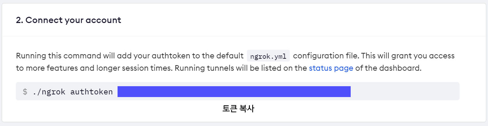
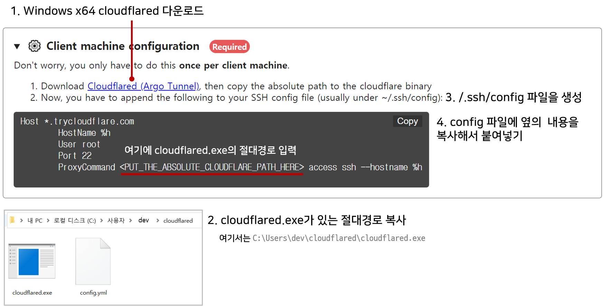
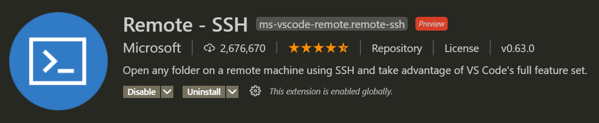
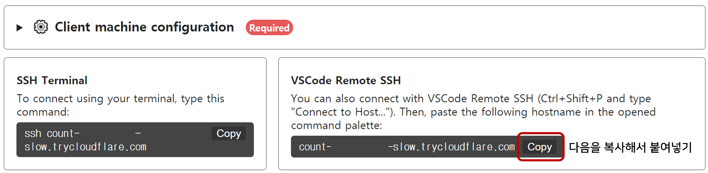
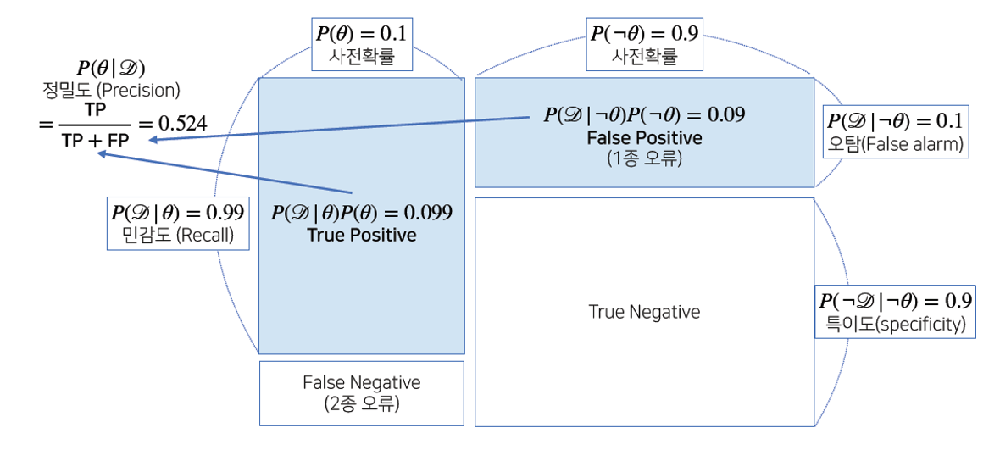
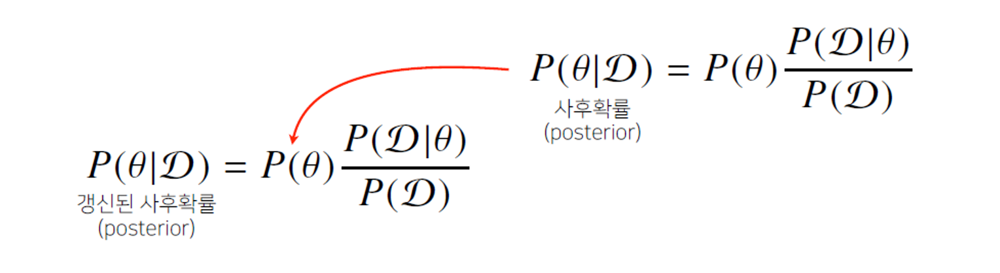
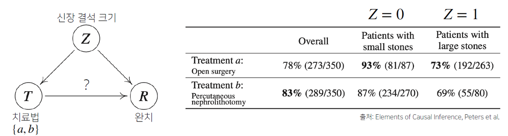
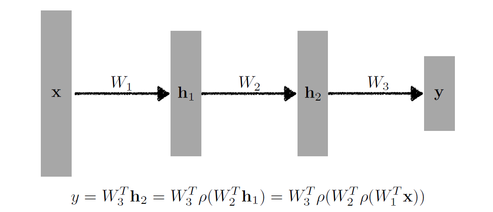

> 🙌은 **QnA에 있는 질문-답변**을 통해 얻은 지식을 표시합니다.

## [👉 피어 세션](https://github.com/boostcamp-ai-tech-4/peer-session/issues/46)

### 질문

- [[히스] 표본분산에서의 N-1](https://github.com/boostcamp-ai-tech-4/peer-session/issues/40)
- [[원딜] softmax 함수의 output이 실제로 확률인가요?](https://github.com/boostcamp-ai-tech-4/peer-session/issues/42)
- [[엠제이] 가능도 추정](https://github.com/boostcamp-ai-tech-4/peer-session/issues/43)
- [[엠제이] 딥러닝에서 최대가능도 추정법](https://github.com/boostcamp-ai-tech-4/peer-session/issues/45)
- [[펭귄] 가능도함수의 모양](https://github.com/boostcamp-ai-tech-4/peer-session/issues/44)

### 기록

- 오늘은 **TED 세미나** 두 번째 시간으로 [히스](https://github.com/Heeseok-Jeong)님이 앱을 개발하고 구글플레이에 등록하는 과정을 발표하셨다. 구글플레이까지 등록하셔서 정말 대단하고 생각했고 전에 미뤄두기만 했던 돌담프로젝트도 조금만 보수과정을 거쳐서 플레이에 등록해볼까 한다. 그 때 밀어붙여서 해볼 걸..
- 저번 주차 강의에 대한 질문이 나왔고 주로 **최대 가능도 추정법(MLE) 관련 질문**이었다.
  - 가능도 함수는 항상 볼록일까? `미분=0`일 때의 모수를 찾는 것이 항상 극대값이 보장이 될까?
  - 딥러닝에서 최대가능도 추정법에서 식에 대한 해석
  - 최대 가능도 추정법 강의에 나온 Further Question에 관한 답변
- MLE가 뭔가 알듯 말듯 해서 더 어려운 것 같다. 더군다나 PPT에 용어도 어렵게 써져 있어서 더 헷갈리는 것 같다. 빨리 정확한 답을 얻을 수 있기를..🙏

## Table of Contents

- [Pytorch Tensor Manipulation](#pytorch-tensor-manipulation)
- [Colab with VSCode](#colab-with-vscode)
- [베이즈 정리](#베이즈-정리)
- [인과관계 추론](#인과관계-추론)
- [다층 퍼셉트론](#다층-퍼셉트론)
- [References](#references)

## Pytorch Tensor Manipulation

[👀 Pytorch Tensor Manipulation Cheatsheet](#)

## Colab with VSCode

구글에서 제공하는 Colab도 하나의 컴퓨터이며, **ssh**를 통해 VSCode에서 Colab을 연결하여 VSCode에서도 Colab 환경을 사용할 수 있다. 개인적인 의견과 교수님의 의견을 종합했을 때 **이러한 개발환경**이 좋은 이유는 다음과 같다.

- **터미널 환경**에서의 작업이 가능하다. 그래서 데이터를 받아올 때 `wget`이나 `git clone`으로 간단히 데이터셋을 받아올 수 있다.
- 실제 서비스 개발 시 터미널 환경에서 코드를 많이 작성하기 때문에 터미널 개발 이점이 있다.

<br/>

<details markdown="1">
<summary><strong>🚀 설치 방법 자세히 보기</strong></summary>

<br/>

`윈도우 10` 환경에서 진행했습니다.

### 필수 조건

- Google Colab 계정 생성
- Visual Studio Code 설치
- [ngrok 계정](https://ngrok.com/) 생성

### 연결 방법

#### Step 1. Google Drive 마운트

왼쪽 탭에 있는 📁 아이콘을 눌러 Google Colab과 Drive 연결을 한다.


#### Step 2. 런타임 유형 GPU

`[런타임] - [런타임 유형]`에 들어가 하드웨어 가속기를 **GPU**로 바꿔준다.

#### Step 3. ngrok의 authtoken 복사

[ngrok 대시보드](https://dashboard.ngrok.com/get-started/setup)에 들어가 **authtoken** 값을 복사한다.



#### Step 4. ssh 연결 준비

Google Colab에 들어가 다음의 코드를 적고, `NGROK_TOKEN`에 authtoken 값을 넣고, `PASSWORD`는 자신이 원하는 값으로 설정한다. (나중에 ssh 연결 후 확인을 위해 비밀번호를 입력하는 창이 뜬다.)

```python
!pip install colab-ssh  # colab-ssh 설치

NGROK_TOKEN = '[토큰값]'  # ngrok 토큰
PASSWORD = '[비밀번호]'   # 비밀번호 설정

from colab_ssh import launch_ssh
from colab_ssh import launch_ssh_cloudflared,init_git_cloudflared
launch_ssh(NGROK_TOKEN, PASSWORD)
launch_ssh_cloudflared(password=PASSWORD)
```

#### Step 5. cloudflared 설치 및 config 파일 생성

위의 코드를 실행하면 다음과 같은 창이 뜨는데 cloudflared를 설치하고 config 파일을 생성하여 호스트 정보를 붙여넣고 저장한다. 이 때 주의할 점은 절대경로는 `/cloudflared.exe`로 끝나야한다.



#### Step 6. VSCode에 Remote - SSH 확장 프로그램 설치

Visual Studio Code로 들어가 **Remote - SSH**를 설치해준다.



#### Step 7. Remote - SSH로 Host랑 연결하기

`Ctrl+Shift+P`를 눌러서 **Remote - SSH: Connect to Host**를 실행시키고 Google Colab에 있는 Hostname을 복사해서 붙여넣는다.



#### Step 8. 운영체제 선택 및 비밀번호

ssh로 Colab과의 연결이 시작되면 몇 개의 팝업이 뜨는 데, 플랫폼 운영체제는 **Linux**를 선택하고 앞서 Google Colab에 설정한 비밀번호를 입력하면 Google Colab과 VScode가 연결된다!

</details>

## 베이즈 정리

### 베이즈 정리란?

베이즈 정리는 조건부확률을 이용하여 **정보를 갱신하는 방법**이다. 이 때, $\theta$는 관찰 불가능한 사건이며, $\mathcal{D}$는 관찰 가능한 결과이다.

$$
P(\theta|\mathcal{D})  = P(\theta)\frac{P(\mathcal{D}|\theta)}{P(\mathcal{D})}
$$

- $P(\theta|\mathcal{D})$: `사후확률(posterior)`로, 데이터가 주어졌을 때 가정 $\theta$가 성립할 확률을 말한다.
- $P(\theta)$: `사전확률(prior)`로, 데이터 관찰 전 추정한 확률분포를 말하며, 계속해서 갱신이 가능하다.
- $P(\mathcal{D} | \theta)$: `가능도(likelihood)`로, 현재 주어진 모수 $\theta$에서 이 데이터가 관찰될 확률을 말한다.
- $P(\mathcal{D})$: `증거(evidence)`로, 데이터 자체의 분포를 뜻한다.

### 예제: COVID-99 검진

COVID-99의 발병률은 **10%**로 알려져있다. COVID-99에 실제로 걸렸을 때 검질될 확률은 **99%**, 실제로 걸리지 않았을 때 오검진될 확률이 **1%**라고 할 때, <u>어떤 사람이 질병에 걸렸다고 검질결과가 나왔을 때 정말로 COVID-99에 감염되었을 확률</u>은 어떻게 될까?

#### 1단계: 사전확률과 가능도

$\theta$를 COVID-99 발병 사건으로 정의하고, $\mathcal{D}$을 검진 결과라고 정의하자. 그럼 **사전확률(prior)**과 **가능도(likelihood)**를 다음과 같이 구할 수 있다. 이 때, $P(\mathcal{D} | \theta)$는 모수 $\theta$에서 데이터가 관찰될 확률을, $P(\mathcal{D} | \urcorner \theta)$는 모수를 부정할 때 데이터가 관찰될 확률을 말한다.

|                             |                                                                                     |
| :-------------------------: | :---------------------------------------------------------------------------------: |
|  **사전확률**<br/>(prior)   |                                  $P(\theta) = 0.1$                                  |
| **가능도**<br/>(likelihood) | $P(\mathcal{D} \| \theta) = 0.99, \qquad P(\mathcal{D} \| \urcorner \theta) = 0.01$ |

#### 2단계: 증거

**증거(evidence)**는 데이터가 관찰될 확률 $P(\mathcal{D})$로 총 확률의 법칙(law of total probability)를 통해 계산할 수 있다.

$$
P(\mathcal{D}) = \sum_\theta P(\mathcal{D} | \theta) P(\theta) = 0.99 \times 0.1 + 0.01 \times 0.9 = 0.108
$$

#### 3단계: 사후확률

1과 2에서 구한 값과 베이즈 정리를 통해 다음과 같이 **사후확률(posterior)**을 구할 수 있다. 이렇게 양성이라 나왔을 때 실제로 감염될 확률은 **약 91.6%**임을 볼 수 있다.

$$
P(\theta|\mathcal{D})  = P(\theta)\frac{P(\mathcal{D}|\theta)}{P(\mathcal{D})} = 0.1 \times \frac{0.99}{0.108} \approx 0.916
$$

만약 오탐율(False alarm) $P(\mathcal{D} | \urcorner \theta)$가 **0.01에서 0.1로** 올라가면 어떻게 될까? 이로 인해 $P(\mathcal{D})$의 값이 바뀌게 되는데 바뀐 값으로 사후확률을 계산하면 다음과 같다. <u>오탐율이 높아짐에 따라 정밀도가 떨어진 것</u>을 볼 수 있다.

$$
P(\mathcal{D}) = \sum_\theta P(\mathcal{D} | \theta) P(\theta) = 0.99 \times 0.1 + \textcolor{red}{0.1} \times 0.9 = 0.189
$$

$$
\Rightarrow P(\theta | \mathcal{D}) = P(\theta)\frac{P(\mathcal{D}|\theta)}{P(\mathcal{D})} = 0.1 \times \frac{0.99}{0.189} \approx 0.524
$$

다음은 오탐율이 0.01일 때와 오탐율이 0.1일 때를 비교한 그림이다. 오탐율이 커지면서 1종 오류(False Positive)가 커지고 이로 인해 정밀도의 분모가 커져 정밀도가 낮아지게 된다.



### 정보 갱신

베이즈 정리를 통해 새로운 데이터가 들어았을 때 앞서 계산한 사후확률(posterior)을 사전확률(prior)로 사용하여 **갱신된 사후확률**을 계산할 수 있다.



오탐율이 0.1일 때, COVID-99 양성 판정을 받은 사람이 두 번째 검진에서 양성을 받았다고 할 때 COVID-99에 걸렸을 확률을 구해보자. 앞서 계산한 사후확률인 $P(\theta | \mathcal{D})$를 사전확률 $P(\theta)$로 두어 증거를 갱신하면 다음과 같다.

$$
P(\mathcal{D}^{*}) = 0.99 \times \textcolor{red}{0.524} + 0.1 \times \textcolor{red}{0.476} = 0.566
$$

갱신된 증거로 사후확률을 다시 계산하면 다음과 같다. 정밀도가 첫 번째 검상 비해 많이 높아진 것을 볼 수 있다. 참고로 한 번 더 검사를 받으면 정밀도가 $0.991%$까지 올라간다.

$$
P(\theta|\mathcal{D}^{*})  = P(\theta)\frac{P(\mathcal{D}|\theta)}{P(\mathcal{D}^{*})} = \textcolor{red}{0.524} \times \frac{0.99}{\textcolor{red}{0.566}} \approx 0.917
$$

## 인과관계 추론

인과관계(casuality)는 **데이터 분포의 변화에 영향을 덜 받는 예측모형**을 만들고 싶을 때 사용한다. 인과관계를 알아내기 위해서는 중첩요인(confounding factor)의 효과를 제거하고 **원인에 해당하는 변수만의 인과관계**를 계산해야 한다.

예를 들면, "키가 크면 지능 지수가 높다"는 가정을 생각해보자. 실제로 조사를 하면 저 가정은 참으로 나온다. 하지만 여기서 고려하지 못한 한 가지가 있다. 바로 **나이의 효과**이다. 보통 나이가 들면서 키가 커지고 지능지수가 높아지는데 <u>앞의 가정은 키와 지능 지수에 영향을 미치는 나이의 효과를 생각하지 않고 잘못된 인과관계를 내놓은 것</u>이다. 만약 나이의 효과를 제거하고 조사를 한다면 저 가정은 거짓이 된다.

### 예제: 신장 결석


<small class="src" markdown=1>

출처: [Elements of Casual Inference](https://library.oapen.org/bitstream/handle/20.500.12657/26040/11283.pdf?sequence=1)

</small>

치료법 $a, b$와 신장 결석 크기 $Z$에 따른 완치율이 다음과 같을 때, 치료법 $a, b$ 중 어느 치료법이 완치율이 더 높을까? 먼저 완치율을 계산하기 위해서는 중첩 요인인 **신장 결석 크기**를 제거해줘야 한다. 이 때, 신장 결석 크기 $Z$에 상관 없이 특정 치료법을 선택하도록 고정하여 완치율을 계산한다.

- 치료법 $a$의 완치율

$$
P^{\mathfrak{C}_a}(R=1) = \sum_{z \in {0, 1}} P^{\mathfrak{C}}(R = 1 | T = a, Z = \mathcal{z}) P^{\mathfrak{C}}(Z = \mathcal{z})
$$

$$
= \frac{81}{87} \times \frac{(87 + 270)}{700} + \frac{192}{263} \times \frac{(263 + 80)}{700} \approx 0.8325
$$

- 치료법 $b$의 완치율

$$
P^{\mathfrak{C}_b}(R=1) = \sum_{z \in {0, 1}} P^{\mathfrak{C}}(R = 1 | T = b, Z = \mathcal{z}) P^{\mathfrak{C}}(Z = \mathcal{z})
$$

$$
= \frac{234}{270} \times \frac{(87 + 270)}{700} + \frac{55}{80} \times \frac{(263 + 80)}{700} \approx 0.7789
$$

## 다층 퍼셉트론

### 신경망

신경망(Neural Network)이란 **행렬 연산(affine transformation)**과 그 이후에 오는 **활성화 함수(nonlinear transformation)**을 쌓아서 함수를 근사한 것이다. 즉, 우리가 정의할 수 없는 함수를 신경망을 통해 최대한 근사할 수 있다.

- `행렬 연산`은 선형 결합이다. 이 행렬 연산만을 여러 층 쌓는 것은 행렬 곱을 더 늘리기만 할 뿐 전체적으로 보았을 때 1개의 층을 이루는 것과 같다.
- 그렇기 때문에 `비선형함수`가 필요한 것이고 행렬 연산 후에 비선형함수인 활성화 함수를 통과시켜 신경망의 **표현력을 극대화**할 수 있다.
- 행렬 연산과 비선형함수로 이루어진 층을 여러 층 쌓게 되면 더 많은 표현력을 가질 수 있게 된다.



### 문제와 손실함수의 관계

보통 문제의 종류에 따라 대표적으로 쓰이는 손실함수(loss function)을 쓴다. 예를 들면, 회귀 문제에서는 [MSE(Mean Squared Error)](https://en.wikipedia.org/wiki/Mean_squared_error), 분류 문제에서는 [CEE(Cross Entropy Error)](https://datascienceschool.net/02%20mathematics/10.03%20%EA%B5%90%EC%B0%A8%EC%97%94%ED%8A%B8%EB%A1%9C%ED%94%BC%EC%99%80%20%EC%BF%A8%EB%B0%B1-%EB%9D%BC%EC%9D%B4%EB%B8%94%EB%9F%AC%20%EB%B0%9C%EC%82%B0.html?highlight=%EA%B5%90%EC%B0%A8%20%EC%97%94%ED%8A%B8%EB%A1%9C%ED%94%BC#id2), 확률 문제에서는 [MLE(Maximum Likelihood Estimation)](https://datascienceschool.net/02%20mathematics/09.02%20%EC%B5%9C%EB%8C%80%EA%B0%80%EB%8A%A5%EB%8F%84%20%EC%B6%94%EC%A0%95%EB%B2%95.html?highlight=%EA%B0%80%EB%8A%A5%EB%8F%84#id1)를 사용한다. 그럼 항상 해당 문제에 대해서 대표적인 손실함수를 쓰는 것이 맞는걸까? **당연히 아니다!** <u>원하는 방향으로 학습시킬 수 있는 손실함수를 선택</u>해야 한다.

예를 들어, 회귀 문제에서는 **MSE**를 대표적으로 사용한다. 하지만 MSE의 경우 오차의 제곱 평균이기 때문에 에러가 클수록 가중치 값을 더 큰 폭으로 업데이트를 하게 된다. 하지만 <u>모델이 에러에 조금 덜 민감하게 반응하도록 하고 싶은 경우</u> MSE는 좋은 선택이 아니다. 이 때는 **MSLE(Mean Squared Logarithmic Error)**가 더 나을지도 모른다. 다른 경우로 데이터에 이상치가 많은 경우 이상치에 견고한 **MAE(Mean Absolute Error)**가 더 좋은 선택일 수도 있다.

이처럼 분류 문제라고 CEE를 쓰고, 회귀 문제라고 MSE를 쓸 필요는 없다. 문제, 데이터, 모델의 목적을 잘 파악한 후 **원하는 결과를 잘 낼 수 있는 손실함수**를 선택해야 한다.

## References

- [베이즈 정리의 의미 - 공돌이의 수학정리노트](https://angeloyeo.github.io/2020/01/09/Bayes_rule.html)
- [How to Choose Loss Functions When Training Deep Learning Neural Networks](https://machinelearningmastery.com/how-to-choose-loss-functions-when-training-deep-learning-neural-networks/)
