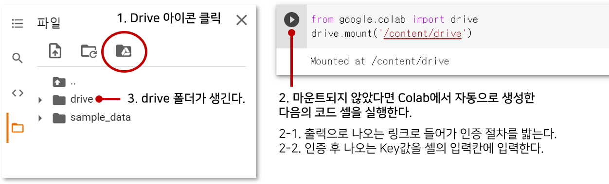
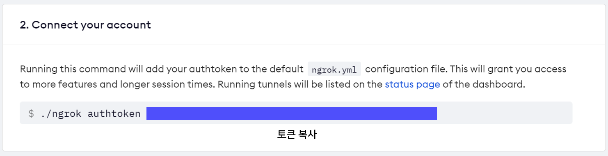
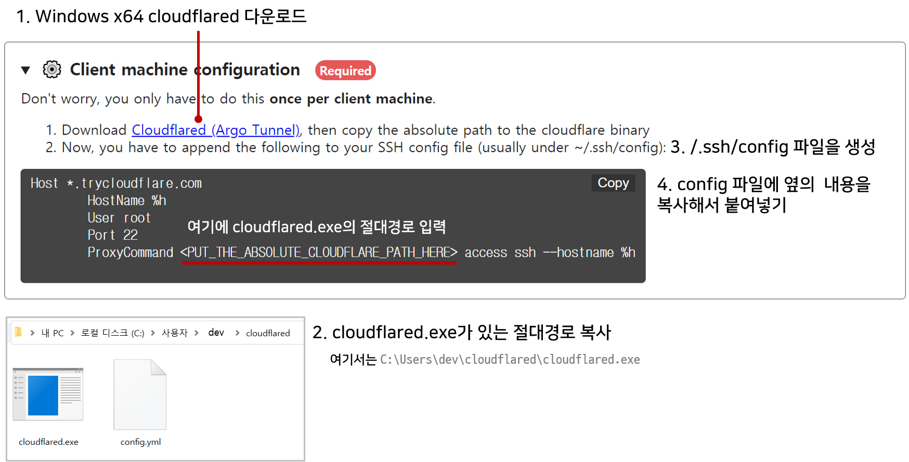
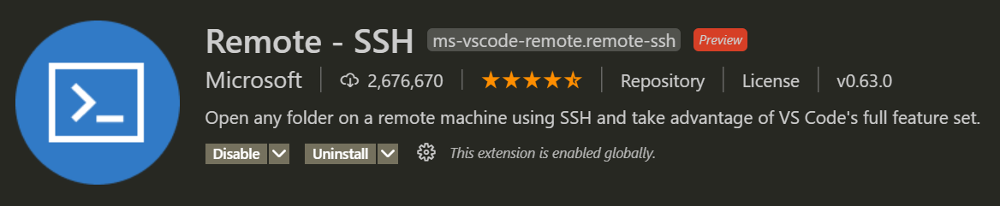
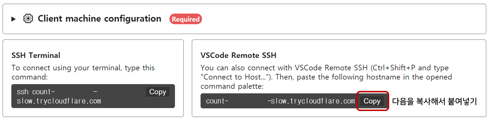
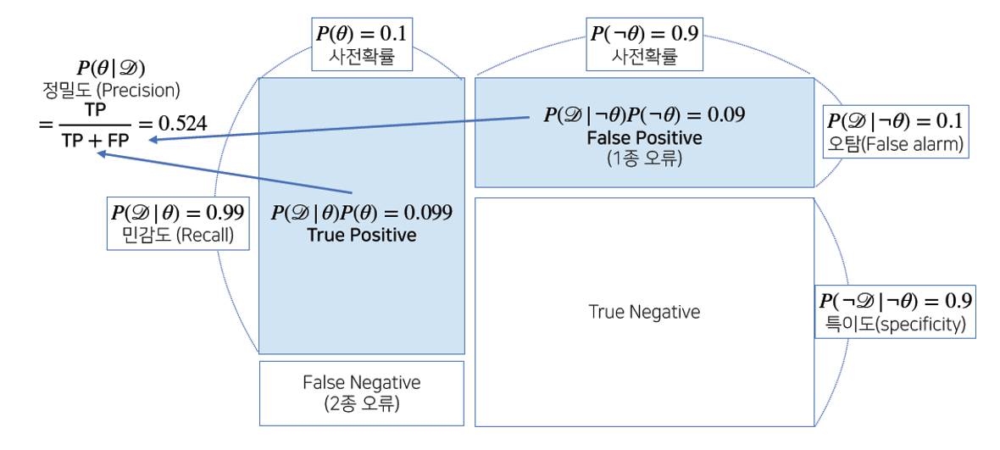
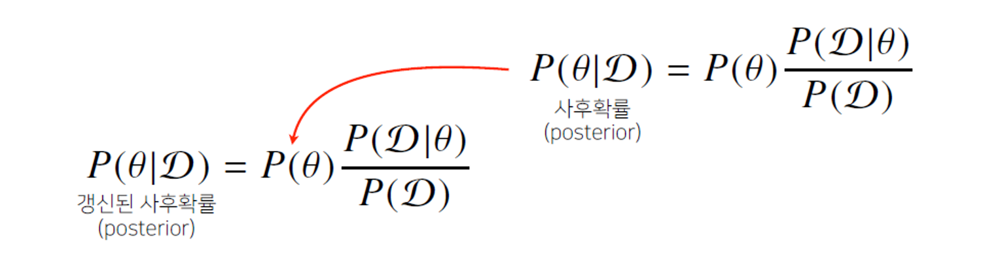
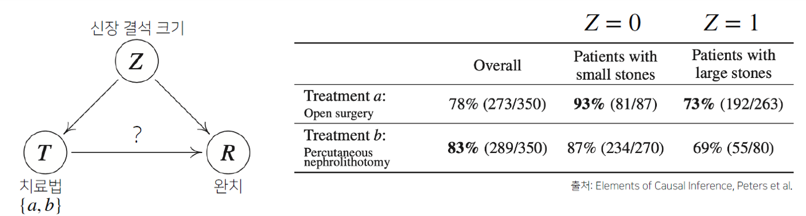

> 🙌은 **QnA에 있는 질문-답변**을 통해 얻은 지식을 표시합니다.

## [👉 피어 세션](https://github.com/boostcamp-ai-tech-4/peer-session/issues/46)

### 질문

- [[히스] 표본분산에서의 N-1](https://github.com/boostcamp-ai-tech-4/peer-session/issues/40)
- [[원딜] softmax 함수의 output이 실제로 확률인가요?](https://github.com/boostcamp-ai-tech-4/peer-session/issues/42)
- [[엠제이] 가능도 추정](https://github.com/boostcamp-ai-tech-4/peer-session/issues/43)
- [[엠제이] 딥러닝에서 최대가능도 추정법](https://github.com/boostcamp-ai-tech-4/peer-session/issues/45)
- [[펭귄] 가능도함수의 모양](https://github.com/boostcamp-ai-tech-4/peer-session/issues/44)

### 기록

- 오늘은 **TED 세미나** 두 번째 시간으로 [히스](https://github.com/Heeseok-Jeong)님이 앱을 개발하고 구글플레이에 등록하는 과정을 발표하셨다. 구글플레이까지 등록하셔서 정말 대단하고 생각했고 전에 미뤄두기만 했던 돌담프로젝트도 조금만 보수과정을 거쳐서 플레이에 등록해볼까 한다. 그 때 밀어붙여서 해볼 걸..
- 저번 주차 강의에 대한 질문이 나왔고 주로 **최대 가능도 추정법(MLE) 관련 질문**이었다.
  - 가능도 함수는 항상 볼록일까? `미분=0`일 때의 모수를 찾는 것이 항상 극대값이 보장이 될까?
  - 딥러닝에서 최대가능도 추정법에서 식에 대한 해석
  - 최대 가능도 추정법 강의에 나온 Further Question에 관한 답변
- MLE가 뭔가 알듯 말듯 해서 더 어려운 것 같다. 더군다나 PPT에 용어도 어렵게 써져 있어서 더 헷갈리는 것 같다. 빨리 정확한 답을 얻을 수 있기를..🙏

## Table of Contents

- [Pytorch Tensor Manipulation](#pytorch-tensor-manipulation)
- [Colab with VSCode](#colab-with-vscode)
- [베이즈 정리](#베이즈-정리)
- [인과관계](#인과관계)
- [딥러닝 역사 톺아보기](#딥러닝-역사-톺아보기)
- [다층 퍼셉트론](#다층-퍼셉트론)

## Pytorch Tensor Manipulation

[👀 Pytorch Tensor Manipulation Cheatsheet](#)

## Colab with VSCode

구글에서 제공하는 Colab도 하나의 컴퓨터이며, **ssh**를 통해 VSCode에서 Colab을 연결하여 VSCode에서도 Colab 환경을 사용할 수 있다. 개인적인 의견과 교수님의 의견을 종합했을 때 **이러한 개발환경**이 좋은 이유는 다음과 같다.

- **터미널 환경**에서의 작업이 가능하다. 그래서 데이터를 받아올 때 `wget`이나 `git clone`으로 간단히 데이터셋을 받아올 수 있다.
- 실제 서비스 개발 시 터미널 환경에서 코드를 많이 작성하기 때문에 터미널 개발 이점이 있다.

<br/>

<details markdown="1">
<summary><strong>🚀 설치 방법 자세히 보기</strong></summary>

<br/>

`윈도우 10` 환경에서 진행했습니다.

### 필수 조건

- Google Colab 계정 생성
- Visual Studio Code 설치
- [ngrok 계정](https://ngrok.com/) 생성

### 연결 방법

#### Step 1. Google Drive 마운트

왼쪽 탭에 있는 📁 아이콘을 눌러 Google Colab과 Drive 연결을 한다.



#### Step 2. 런타임 유형 GPU

`[런타임] - [런타임 유형]`에 들어가 하드웨어 가속기를 **GPU**로 바꿔준다.

#### Step 3. ngrok의 authtoken 복사

[ngrok 대시보드](https://dashboard.ngrok.com/get-started/setup)에 들어가 **authtoken** 값을 복사한다.



#### Step 4. ssh 연결 준비

Google Colab에 들어가 다음의 코드를 적고, `NGROK_TOKEN`에 authtoken 값을 넣고, `PASSWORD`는 자신이 원하는 값으로 설정한다. (나중에 ssh 연결 후 확인을 위해 비밀번호를 입력하는 창이 뜬다.)

```python
!pip install colab-ssh  # colab-ssh 설치

NGROK_TOKEN = '[토큰값]'  # ngrok 토큰
PASSWORD = '[비밀번호]'   # 비밀번호 설정

from colab_ssh import launch_ssh
from colab_ssh import launch_ssh_cloudflared,init_git_cloudflared
launch_ssh(NGROK_TOKEN, PASSWORD)
launch_ssh_cloudflared(password=PASSWORD)
```

#### Step 5. cloudflared 설치 및 config 파일 생성

위의 코드를 실행하면 다음과 같은 창이 뜨는데 cloudflared를 설치하고 config 파일을 생성하여 호스트 정보를 붙여넣고 저장한다. 이 때 주의할 점은 절대경로는 `/cloudflared.exe`로 끝나야한다.



#### Step 6. VSCode에 Remote - SSH 확장 프로그램 설치

Visual Studio Code로 들어가 **Remote - SSH**를 설치해준다.



#### Step 7. Remote - SSH로 Host랑 연결하기

`Ctrl+Shift+P`를 눌러서 **Remote - SSH: Connect to Host**를 실행시키고 Google Colab에 있는 Hostname을 복사해서 붙여넣는다.



#### Step 8. 운영체제 선택 및 비밀번호

ssh로 Colab과의 연결이 시작되면 몇 개의 팝업이 뜨는 데, 플랫폼 운영체제는 **Linux**를 선택하고 앞서 Google Colab에 설정한 비밀번호를 입력하면 Google Colab과 VScode가 연결된다!

</details>

## 베이즈 정리

### 베이즈 정리란?

베이즈 정리는 조건부확률을 이용하여 **정보를 갱신하는 방법**이다.

$$
P(\theta|\mathcal{D})  = P(\theta)\frac{P(\mathcal{D}|\theta)}{P(\mathcal{D})}
$$

- $P(\theta|\mathcal{D})$: `사후확률(posterior)`로, 데이터가 주어졌을 때 가정 $\theta$가 성립할 확률을 말한다.
- $P(\theta)$: `사전확률(prior)`로, 데이터 관찰 전 추정한 확률분포를 말하며, 계속해서 갱신이 가능하다.
- $P(\mathcal{D} | \theta)$: `가능도(likelihood)`로, 현재 주어진 모수 $\theta$에서 이 데이터가 관찰될 확률을 말한다.
- $P(\mathcal{D})$: `증거(evidence)`로, 데이터 자체의 분포를 뜻한다.

질병 관련 문제 일단 언급은 하고

### 조건부 확률 시각화

만약 오탐율(False alarm)이 **0.1에서 0.01로** 내려가면 거짓 양성(False Positive)가 줄어들면서 정밀도(Precision)이 증가하게 된다.



### 정보 갱신

베이즈 정리를 통해 새로운 데이터가 들어았을 때 앞서 계산한 사후확률(posterior)을 사전확률(prior)로 사용하여 **갱신된 사후확률**을 계산할 수 있다.

자세한 내용은 [여기](https://angeloyeo.github.io/2020/01/09/Bayes_rule.html#%EC%98%88%EC%A0%9C-2)를 참고!



## 인과관계 추론

인과관계(casuality)는 **데이터 분포의 변화에 영향을 덜 받는 예측모형**을 만들 때 사용한다. 인과관계를 알아내기 위해서는 중첩요인(confounding factor)의 효과를 제거하고 **원인에 해당하는 변수만의 인과관계**를 계산해야 한다.

예를 들면, "키가 크면 지능 지수가 높다"는 가정을 생각해보자. 실제로 조사를 하면 저 가정은 참으로 나온다. 하지만 여기서 고려하지 못한 한 가지가 있다. 바로 **나이**이다. 보통 나이가 들면서 키가 커지고 지능지수가 높아지는데 <u>앞의 가정은 나이의 효과를 생각하지 않고 잘못된 인과관계를 내놓은 것</u>이다. 만약 나이의 효과를 제거하고 조사를 한다면 저 가정은 거짓이 된다.

### 예제: 신장 결석



치료법 $a, b$와 신장 결석 크기 $Z$에 따른 완치율이 다음과 같을 때, 치료법 $a, b$ 중 어느 치료법이 완치율이 더 높을까? 먼저 완치율을 계산하기 위해서는 중첩 요인인 **신장 결석 크기**를 제거해줘야 한다.

- 치료법 $a$의 완치율

$$
P^{\mathfrak{C}_a}(R=1) = \sum_{z \in {0, 1}} P^{\mathfrak{C}}(R = 1 | T = a, Z = \mathcal{z}) P^{\mathfrak{C}}(Z = \mathcal{z})
$$

$$
= \frac{81}{87} \times \frac{(87 + 270)}{700} + {192}
$$

이거 ppt로 만들어야한다

## 다층 퍼셉트론

### 신경망

신경망(Neural Network)이란 행렬 연산(affine transformation)과 그 이후에 오는 활성화 함수(nonlinear transformation)을 쌓아서 함수를 근사한 것이다.

### 문제와 손실함수의 관계

이거는 자료 좀 더 찾아서 쓸 것

## Reference

- https://angeloyeo.github.io/2020/01/09/Bayes_rule.html
