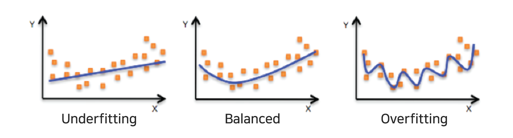
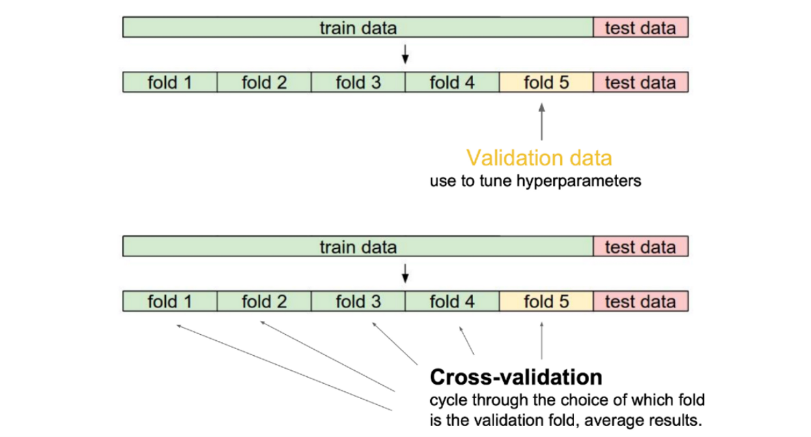
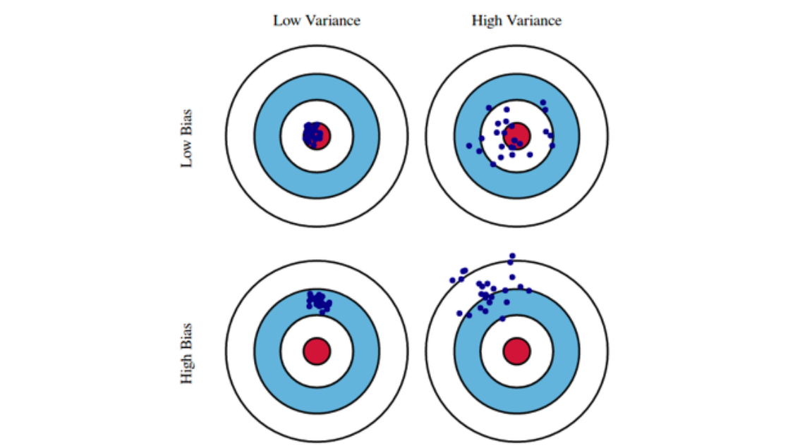
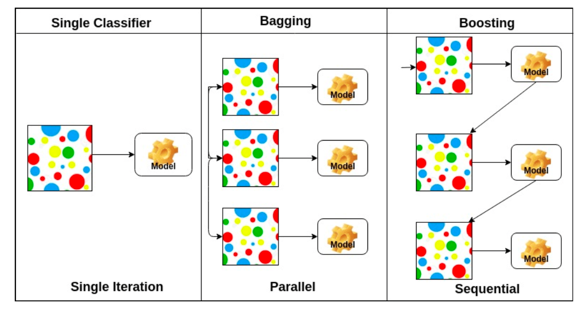
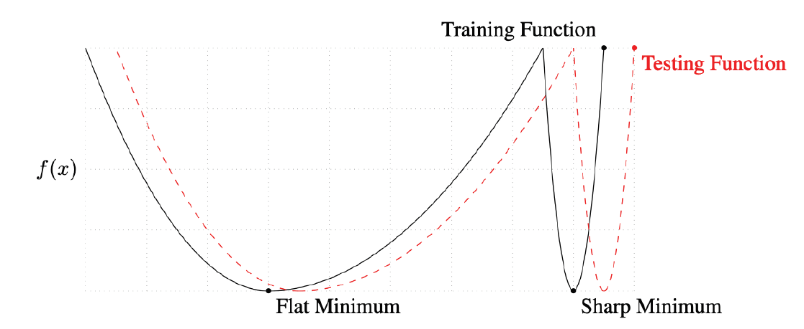
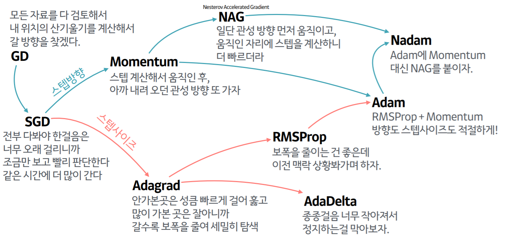
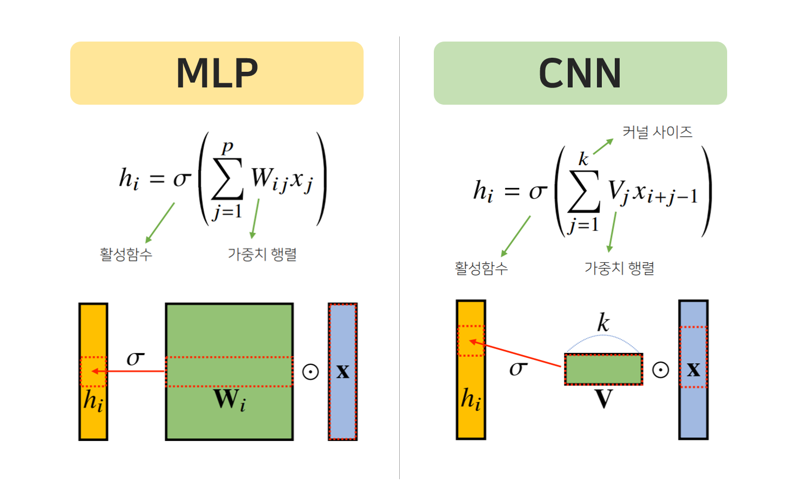
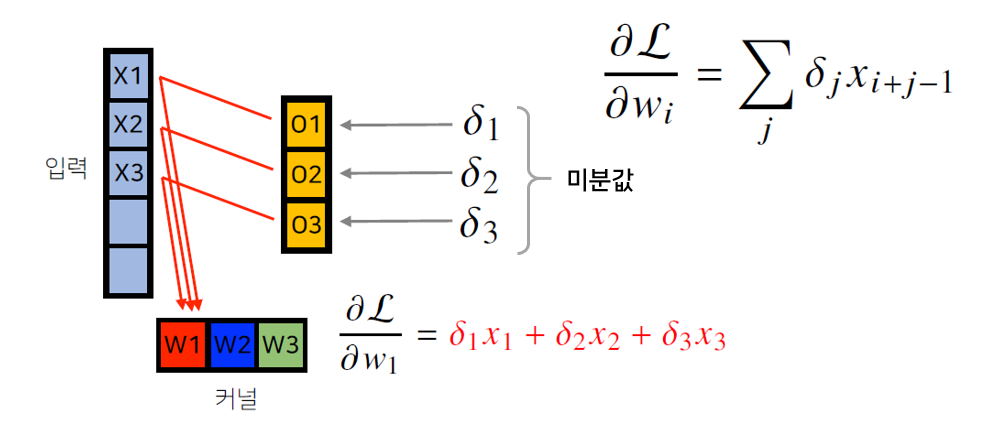

> 🙌은 **QnA에 있는 질문-답변**을 통해 얻은 지식을 표시합니다.

## [👉 피어 세션](https://github.com/boostcamp-ai-tech-4/peer-session/issues/51)

### 질문

- [[후미] CNN에서 커널이 여러개 있을때의 출력](https://github.com/boostcamp-ai-tech-4/peer-session/issues/50)
- [[히스] Valid 데이터와 Test 데이터](https://github.com/boostcamp-ai-tech-4/peer-session/issues/47)
- [[히스] CNN 과 MLP 의 차이](https://github.com/boostcamp-ai-tech-4/peer-session/issues/48)
- [[엠제이] adadelta를 통해서 천억개의 파라미터 연산량을 어떻게 줄여주는것일까?](https://github.com/boostcamp-ai-tech-4/peer-session/issues/49)

### 기록

- 이번 주 **🔥Hot Issue**는 CNN이다. 평소에 보았던 선형결합과는 달리 Covolution 연산을 쓰면서 머리로 그리기가 어려워지는데 그래서 CNN에 관한 이야기가 꽤 나왔다. 나도 작년에 CS231n을 들은 뒤로 쳐다도 안 봤기에 기억이 날듯 말듯하다.

## Table of Contents

- [최적화의 중요한 개념](#최적화의-중요한-개념)
- [경사하강법 톺아보기](#경사하강법-톺아보기)
- [규제 방법](#규제-방법)
- [CNN 속 수학](#cnn-속-수학)
- [References](#references)

## 최적화의 중요한 개념

### 일반화 (Generalization)

Test Error가 Training Error를 어느 정도 따라가다가 점점 차이가 나기 시작하는데 이 둘의 차이를 `Generalization Gap`이라고 한다. 즉, 학습 데이터셋과 테스트 데이터셋을 썼을 때 큰 차이가 나지 않았을 경우 일반화가 잘 되어 있다고 한다. Test Generalization Gap은 단순 차이기 때문에 **일반화가 잘 되어있다고 해서 모델 성능이 좋다고 할 수 없다.** 예를 들면, Training Error가 꽤 큰데 Training과 Test Error의 차이가 별로 없는 경우 일반화가 잘 되어 있지만, 모델 성능은 좋지 않다.

#### 과소적합 vs 과대적합

<small class="src" markdown=1>

출처: [Model Fit: Underfitting vs. Overfitting](https://docs.aws.amazon.com/machine-learning/latest/dg/model-fit-underfitting-vs-overfitting.html)

</small>

- `과소적합(Underfitting)`: 학습이 덜 되 너무 모델이 너무 간단한 경우
- `과대적합(Overfitting)`: 모델이 학습데이터에만 너무 맞게 학습되어 모델이 너무 복잡해진 경우
- 두 경우 모두 좋지 않으며 딱 `적절한 경우(Balanced)`가 우리가 찾고자하는 지점이다.

### 교차 검증 (Cross Validation)

교차 검증(Cross Validation)이란 모델을 평가하는 방법 중 하나로 테스트 데이터(test dataset)로 최종 예측을 하기 전에 **미리 검증 데이터(validation dataset)로 모델을 검증**하는 것이다. 수능을 보기 전 모의고사를 쳐서 내 학습실력을 점검하는 것과 비슷하다. 이렇게 검증한 결과를 바탕으로 하이퍼 파라미터 튜닝 등의 모델 최적화를 좀 더 손쉽게 할 수 있다.

교차 검증의 대표적인 방법으로 **K-Fold 교차검증**이 있으며, $K$개의 데이터 폴드 세트를 만들어 각 $K$번 만큼 각 폴드 세트에 학습과 검증 평가를 반복적으로 수행한다.

<small class="src" markdown=1>

출처: [Cross Validation In Machine Learning Trading Models](https://blog.quantinsti.com/cross-validation-machine-learning-trading-models)

</small>

### 편향과 분산

<small class="src" markdown=1>

출처: [Bias-Variance Tradeoff](https://work.caltech.edu/telecourse)

</small>

- `분산(Variance)`: 데이터를 넣었을 때 **출력이 얼마나 일관하게 나오는지**를 말한다. 데이터가 일관되지 않을수록 분산이 크다고 한다.
- `편향(Bias)`: 데이터 **출력의 평균이 타겟값에 얼마나 가깝게 나오는지**를 말한다. 데이터 출력의 평균이 타겟값에 가깝다면 편향이 작다고 한다.

#### 편향-분산 트레이드오프

타겟값을 $t$와 예측값을 $\hat f$라고 하고 손실함수를 MSE(Mean Squared Error)로 설정하면 비용(cost)는 $\mathbb{E} [(t-\hat f)^2]$이다. 이 비용을 다음과 같이 `편향`, `분산`, `노이즈`로 분해(decompose)할 수 있는데, 이 때 **편향, 분산을 둘 다 최소화할 수 없는 트레이드오프 문제**가 발생한다.

$$
\mathbb{E} [(t-\hat f)^2] = \mathbb{E} [(f - \mathbb{E} [\hat f]^2)^2] + \mathbb{E} [(\mathbb{\hat f} - \hat f)^2] + \mathbb{E}[\epsilon]
$$

$$
= bias^2 + variance + noise
$$

### Bootstrapping

학습데이터에서 **샘플링된 데이터**를 가지고 모델을 만드는 것을 반복하는 과정을 말한다. 샘플링된 데이터로 학습된 모델들의 예측값을 비교해서 **전체적인 모델의 불확실성**을 예측하고자 할 때 사용한다.

#### Bagging과 Boosting

<small class="src" markdown=1>

출처: [AdaBoost Classifier in Python](https://www.datacamp.com/community/tutorials/adaboost-classifier-python)

</small>

- `배깅(Bagging)`: Bootstrapping Aggregating의 줄임말로, 여러 개의 샘플을 **같은 유형의 모델 여러 개로 각각 학습**시켜 나온 결과를 averaging이나 voting을 통해 최종 결과를 예측하는 방법 (=앙상블)
  - 배깅의 대표적인 예로 랜덤 포레스트 알고리즘(Random Forest)이 있다.
- `부스팅(Boosting)`: 모델이 잘 예측하지 못한 부분을 뽑아 다음 학습 데이터에 추가하여 **오류 데이터(weak learner)에 가중치를 부여**하는 방법

## 경사하강법 톺아보기

### 배치 크기

배치 크기에 따라 다음과 같이 경사하강법을 나눌 수 있다.

- **Stochastic Gradient Descent**: 1개의 샘플로 계산된 기울기로 업데이트
- **Mini-batch Gradient Descent**: 데이터의 일부인 미니 배치로 계산된 기울기로 업데이트
- **Batch Gradient Descent**: 전체 데이터로 계산된 기울기로 업데이트

#### 배치크기는 어느 정도가 좋을까?

<small class="src" markdown=1>

출처: [On Large-batch Training for Deep Learning: Generalization Gap and Sharp Minima](https://arxiv.org/pdf/1609.04836.pdf)

</small>

결론부터 말하자면 배치크기는 큰 것보다 **작은 것**이 더 좋다.

위의 그림에서 `Flat Minimum`은 Training Function이나 Testing Function이나 적당히 낮은 값이 나와 Generalization 성능이 높은 것을 볼 수 있다. 반면 `Sharp Minimum`에서 Training Function에서는 낮을지 몰라도 같은 위치에서의 Testing Function은 높은 것을 볼 수 있다. 즉, Generalization 성능이 나쁜 것을 볼 수 있다.

[On Large-Batch Training for Deep Learning: Generalization Gap and Sharp Minima](https://arxiv.org/abs/1609.04836)에 따르면 배치 크기가 **크면** `Sharp Minimum`에, 반대로 **작으면** `Flat Minimum`에 수렴하는 경향이 있다고 한다. 그러므로 Generalization 성능을 위해 **적당히 작은 배치크기**를 설정하는 것이 좋다.

### 여러가지 경사하강법

#### Stochastic Gradient Descent

랜덤으로 추출한 일부 데이터에 대한 가중치를 조절하는 방법

$$
W_{t+1} \leftarrow W_t - \eta g_t
$$

- $\eta$: 학습률(learning rate)
- $g_t$: 기울기(gradient) = $\frac{\partial L}{\partial W}$

#### Momentum

경사하강법에 모멘텀(Momentum)을 더해주는 방법이다. 관성은 **속도와 질량의 곱**으로 나타낼 수 있는데 경사에 $\beta$만큼의 질량을 가진 물체가 $a$만큼의 속도를 낸다고 생각하면 된다.

$$
a_{t+1} \leftarrow \beta a_t + g_t
$$

$$
W_{t+1} \leftarrow W_t - \eta a_{t+1}
$$

- $\beta$: 모멘텀(momentum)으로 주로 0.9로 설정
- $a_{t+1}$: 현재와 과거 기울기의 누적값
  - 단, 학습이 진행될수록 초반의 기울기는 $\beta$의 누적으로 영향력이 작아진다.

#### Nesterov Accelerated Gradient

모멘텀값과 기울기값을 더해 다음 이동방향을 정하는 모멘텀 방식과는 달리 **모멘텀을 미리 더해 도착한 곳에서 기울기를 계산**하는 방법

$$
a_{t+1} \leftarrow \beta a_t + \triangledown\mathcal{L} (W_t - \eta \beta a_t)
$$

$$
W_{t+1} \leftarrow W_t - \eta a_{t+1}
$$

- $\triangledown\mathcal{L} (W_t - \eta \beta a_t)$: Lookahead Gradient
  - 모멘텀을 가중치에 더한 후의 가중치 $W$에 대한 편미분값

#### Adagrad

변수의 **업데이트 횟수에 따라 학습률을 조절**하는 옵션이 추가된 방법이다. 업데이트가 많이 됐을 경우 최적값에 근접했다는 가정하에 많이 된 파라미터는 학습율을 작게, 적게 된 파라미터는 학습율을 크게한다. 하지만 <u>오랫동안 학습을 하게 되면 $G_t$값이 커지면서 업데이트 되는 정도가 줄어 학습이 멈추게 된다.</u>

$$
W_{t+1} = W_t - \frac{\eta}{\sqrt{G_t + \epsilon}} g_t
$$

- $G_t$: 기울기 제곱들의 합(gradient squares) = $\sum g_t ⊙ g_t$
- $\epsilon$: 아주 작은 상수로 0으로 나누어지는 것을 방지

#### RMSprop

Adagrad에서 $G_t$가 무한히 커지는 것을 방지하기 위해 **지수 이동평균(exponential moving average)**로 현재값과 이전값에 가중치를 주는 방법

$$
G_t = \gamma G_{t-1} + (1 - \gamma) g_t^2
$$

$$
W_{t+1} = W_t - \frac{\eta}{\sqrt{G_t + \epsilon}} g_t
$$

- $G_t$: gradient squares의 지수이동평균
  - 현재 기울기는 $\alpha$만큼, 이전 기울기들은 $1-\alpha$만큼의 가중치를 둔다.
  - $1-\alpha$가 1보다 작기 때문에 시간이 지날수록 이전 기울기의 영향력이 줄어든다.

#### Adadelta

이전의 squared gradient를 누적하지 않고 **최근의 $k$개의 squared gradient를 누적시키는 방법**이다. 이렇게 함으로써 $G_t$의 크기는 매우 커지지 않아 학습률이 0이 되는 것을 방지할 수 있다.

$$
G_t = \gamma G_{t-1} + (1- \gamma)g_t^2
$$

$$
W_{t+1} = W_t - \frac{\sqrt{H_{t-1} + \epsilon}}{\sqrt{G_t + \epsilon}} g_t
$$

$$
H_t = \gamma H_{t-1} + (1 - \gamma)(\triangle W_t)^2
$$

- $G_t$: gradient squares의 지수이동평균
- $H_t$: difference squares의 지수이동평균

#### Adam

모멘텀의 **모멘텀**과 RMSprop의 **gradient squares의 지수이동평균**을 결합한 방법

$$
m_t = \beta_1 m_{t-1} + (1-\beta_1)g_t
$$

$$
v_t = \beta_2 v_{t_1} + (1-\beta_2)g_t^2
$$

$$
W_{t+1} = W_t - \frac{\eta}{\sqrt{v_t + \epsilon}} \frac{\sqrt{1-\beta_2^t}}{1-\beta_1^t} m_t
$$

- $m_t$: 모멘텀(momentum)
- $v_t$: gradient squares의 지수이동평균
- $\frac{\sqrt{1-\beta_2^t}}{1-\beta_1^t}$: 불편추정량을 구하기 위한 상수

### 참고자료: 산 내려오는 작은 오솔길 잘찾기의 발달계보

<small class="src" markdown=1>

출처: [자습해도 모르겠던 딥러닝, 머리속에 인스톨 시켜드립니다.](https://www.slideshare.net/yongho/ss-79607172)

</small>

## 규제 방법

규제(Regularization)이란 Generalization 성능이 잘 나오도록 모델에 **제약**을 주는 것을 말한다.

- **early stopping**: validation error와 training error의 차이가 커지는 시점에 학습을 멈추는 방법
- **parameter norm penalty**: weight decay라고도 하며, 비용을 구할 때 손실함수 값에 가중치의 L2 Norm값을 둬서 가중치가 클수록 패널티를 주는 방법
- **data augmentation**: 라벨이 바뀌지 않는 선에서 데이터를 위치이동, 회전, 반전 등 변형하는 방법
- **noise robustness**: input이나 weight에 랜덤 노이즈 추가하는 방법
- **label smoothing**: 2개의 데이터를 랜덤으로 뽑아 입력과 출력을 섞어 decision boundary를 부드럽게 만드는 방법
  - `ex` Mixup, Cutout, CutMix
- **dropout**: 노드 몇 개를 0으로 만들어서 떨구는 방법
- **batch normalization**: 활성화함수에 넣기 전에 선형결합을 정규화시킨 방법

## CNN 속 수학

### MLP vs CNN

- `MLP`: 각 뉴런들이 선형모델과 활성화함수로 모두 연결된 구조
  - $x_i$에 따라 곱해지는 가중치 $\bold{w_i}$도 다르다.
- `CNN`: 커널을 입력벡터 상에서 움직여 선형모델과 합성함수가 적용되는 구조
  - 모든 $x_i$에 대해 적용되는 커널 $V$는 항상 같다.

### Convolution이 뭐죠?

<small class="src" markdown=1>

출처: [Convolution - Wikipedia](https://en.wikipedia.org/wiki/Convolution)

</small>

Convolution 연산은 **신호를 커널을 이용해 국소적으로 증폭 또는 감소**시켜 정보를 필터링한다. 커널은 정의역 내에서 움직여도 형태가 변하지 않고(translation invariant) 주어진 신호에 국소적(local)으로 적용한다. 위의 그림에서 볼 수 있듯이 커널과 신호가 겹쳐지는 부분의 넓이가 Convolution 연산의 결과가 된다.

- Continuous Signal Convolution

$$
[f * g](x) = \int_{\mathbb{R}^d} f(z) g(x-z) dz = \int_{\mathbb{R}^d} f(x-z) g(z) dz = [g*f](x)
$$

- Discrete Signal Convolution

$$
[f * g](x) = \sum_{a \in \mathbb{Z}^d} f(a) g(i-a) = \sum_{a \in \mathbb{Z}^d} f(i-a) g(a) = [g*f](x)
$$

💡

CNN은 Convolution 연산이 아니다!?

CNN 연산은 위의 Convolution 수식에서 -가 아닌 +인 Cross Correlation 연산이다. 엄밀히 말하면 그런데 CNN에서는 크게 차이를 두지 않는다.

### Convolution 연산의 역전파

Convolution 연산은 **커널이 모든 입력데이터에 공통으로 적용**되기 때문에 역전파를 해도 Convolution 연산이 나온다.

$$
\frac{\partial}{\partial x} [f*g](x) = \frac{\partial}{\partial x} \int_{\mathbb{R}^d} f(y) g(x-y) dy
$$

$$
= \int_{\mathbb{R}^d} f(y) \frac{\partial g}{\partial x} (x-y) dy = [f * g'](x)
$$

정말 그런지 확인하기 위해 다음의 예시를 보자. 입력이 $[X_1, X_2, X_3, X_4, X_5]$이고 커널은 $[W_1, W_2, W_3]$이다. 이 둘을 Convolution 연산을 한 결과가 $[01, 02, 03]$이다.

각 Convolution 연산 결과는 다음과 같이 계산된다.

- $01 = X_1 * W_1 + X_2 * W_2 + X_3 * W_3$
- $02 = X_2 * W_1 + X_3 * W_2 + X_4 * W_4$
- $03 = X_3 * W_1 + X_4 * W_2 + X_5 * W_5$

 

이제 각 결과로 들어오는 미분값을 각각 $\delta_1, \delta_2, \delta_3$라고 하자. 이 때 파라미터 $W_1$에 대한 미분값은 어떻게 될까?

$W_1$은 순전파 결과에서 보이듯이 $X_1, X_2, X_3$과 곱셈을 했고 [곱셈 연산의 역전파](../../deep-learning/forward-and-back-propagation/#3-역전파-back-propagation)는 들어오는 입력 신호를 서로 바꿔 곱하는 것이므로, $(\delta_1 X_1, \delta_2 X_2, \delta_3 X_3)$가 된다. 이 때의 $W_1$으로 들어오는 모든 미분값을 더하면 손실함수 $\mathcal{L}$에 대한 $W_1$의 미분값인 $\frac{\partial \mathcal{L}}{\partial W_1} = \delta_1 x_1 + \delta_2 x_2 + \delta_3 x_3$을 구할 수 있다.

결과를 보면 각 커널에 들어오는 모든 미분값을 더하는 것은 **커널로 들어오는 미분값을 커널로 보고 입력값에 Convolution 연산을 한 결과**와 같다는 것을 볼 수 있다.

## References

- [2장. 사이킷런으로 시작하는 머신러닝 - 파이썬 머신러닝 완벽가이드](http://www.yes24.com/Product/Goods/87044746)
- [수식과 코드로 보는 경사하강법 - 흰고래의 꿈](https://twinw.tistory.com/247)
