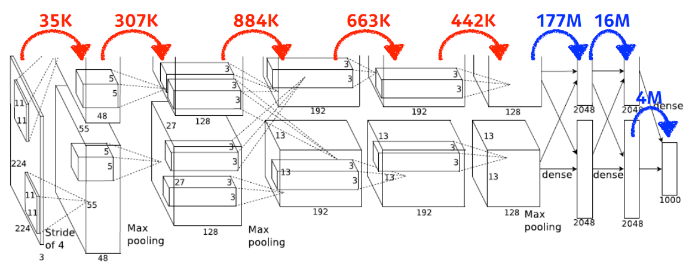
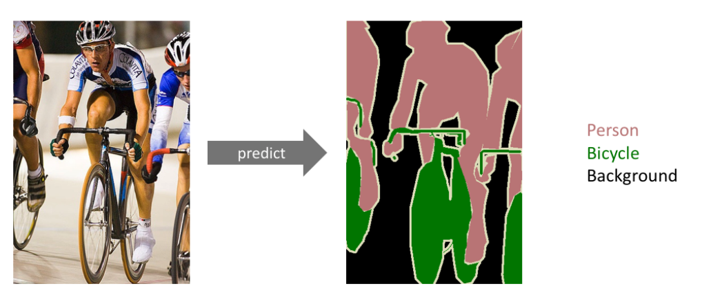
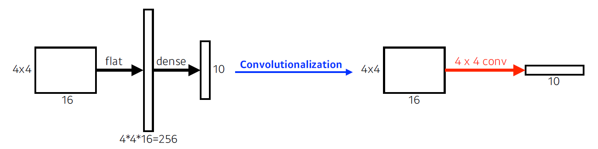
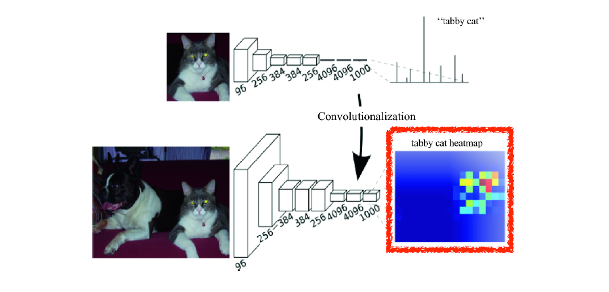
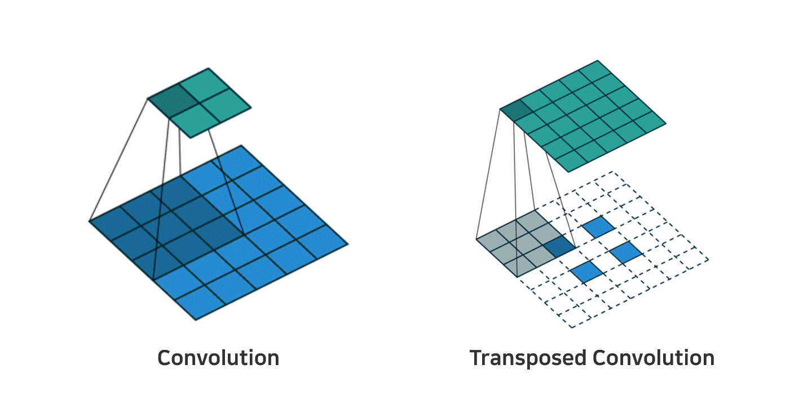
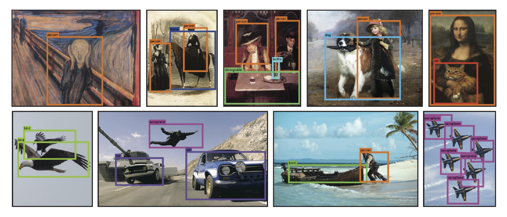

> 🙌은 **QnA에 있는 질문-답변**을 통해 얻은 지식을 표시합니다.

## [👉 피어 세션](https://github.com/boostcamp-ai-tech-4/peer-session/issues/51)

### 질문

- [[히스] CNN 레이어가 깊을 때 각 커널의 역할](https://github.com/boostcamp-ai-tech-4/peer-session/issues/53)
- [[히스] Gradient Vanishing 해결을 위한 ReLU 와 ResNet](https://github.com/boostcamp-ai-tech-4/peer-session/issues/52)

### 기록

- 오늘 **제리님🐹**이 피어세션 깜짝 방문을 하셨다. 오랜만에 다시 보는 CNN이라 많이 헷갈렸는데 제리님이 직관적인(?) 설명을 잘해주셔서 공부했었을 때의 감을 다시 찾을 수 있었다. CNN이 어려운 이유는 데이터의 크기도 채널 포함 3차원이기 때문인 것 같다. 그래서 머릿속으로 그리기가 어렵다..
- 오늘 강의에서 대표적인 CNN 구조를 살펴보았는데, 그 중 resNet의 **잔차(residual)의 개념**이 꽤 어려웠다. 자세한 내용은 [여기]()에서 보자. 어쨌든 왜 잔차를 최소화하는지 찾아봤는데 "이렇게 해보니 결과가 좋더라" 같은 느낌이었다. 딥러닝 공부를 하다보면 이런 경우가 많아서 그냥 받아들이고 있다.

## Table of Contents

- [CNN 톺아보기](#cnn-톺아보기)
- [모던 CNN](#모던-cnn)
- [컴퓨터비전](#컴퓨터비전)
- [References](#references)

## CNN 톺아보기

### CNN의 구성

CNN은 `Convolution Layer`, `Pooling Layer`, `Fully-connected Layer`로 구성된다.

- Convolution Layer과 Pooling Layer로 **이미지의 피처(feature)를 추출**한다.
- Fully-connected Layer는 마지막에 Convolution 결과를 1차원으로 평탄화한 후 **최종 결정**을 내리는 층이다.
  - 예를 들어, 개/고양이 분류 문제에서 개인지 고양인지 결정하는 층이다.

### 파라미터의 개수

CNN에서 가장 중요한 것은 **파라미터의 개수**를 대략적으로 가늠하는 것이다. 정확한 계산까지는 무리일지 몰라도 이렇게 설계하면 파라미터가 어느 정도 필요한지 예상할 수 있어야 한다.

그럼 파라미터는 어떻게 계산할까? 다음은 [AlexNet](https://en.wikipedia.org/wiki/AlexNet)이며 AlexNet의 파라미터를 한 번 계산해보자. 참고로 보기의 편의를 위해 AlexNet을 반으로 잘랐다.

<small class="src" markdown=1>

출처: [ImageNet Classification with Deep Convolutional Neural Networks](https://papers.nips.cc/paper/2012/file/c399862d3b9d6b76c8436e924a68c45b-Paper.pdf)

</small>

#### Convolution Layer의 파라미터 수

> 파라미터 수 = 커널 행의 크기 × 커널 열의 크기 × 입력의 차원 × 출력의 차원

첫번 째 Convolution Layer를 살펴보자. $(11, 11)$ 크기의 커널을 사용하며 stride는 $4$이고 차원이 $3 \rightarrow 48$로 매핑된 것을 볼 수 있다. AlexNet은 GPU 활용을 위해 네트워크를 2개로 쪼개므로 이 때 Convolution Layer의 파라미터를 계산하면, $11 \times 11 \times 3 \times 48 * 2 \approx 35k$이다.

#### Fully-connected Layer의 파라미터 수

> 파라미터 수 = 입력의 노드 개수 × 출력의 노드 수

첫 번째 Fully-connected Layer를 살펴보자. 입력의 크기는 $(128, 13, 13)$이고 출력의 크기는 $(2048, )$이다. 우선 입력의 총 노드 수는 $128 * 13 * 13 \approx 21K$이고 AlexNet이 네트워크 2개를 사용하는 걸 고려할 때, 입력 Fully-connected Layer의 파라미터 수는 $21K * 2 \times 2048 * 2  \approx 177M$이다.

💡

왜 Fully-connected Layer가 Convolution Layer보다 더 많은 파라미터를 사용할까?

Convolution의 경우 각 커널이 같은 위치에서 동일하게 적용되기 때문이다. Fully-connected Layer의 경우 모든 가중치와 입력값을 1:1 매핑하기 때문에 더 많은 파라미터가 필요하다.

### 1×1 Convolution

1×1 Convolution Layer는 너비(width)와 높이(height)는 그대로 유지하고 **차원(dimension)**을 바꿀 수 있다. 1×1 Convolution Layer는 다음과 같은 이유로 사용한다.

- `이유 1` **차원을 축소**하기 위해서
- `이유 2` 네트워크를 깊게 쌓으면서 **파라미터의 수를 줄이기** 위해서
  - 대표적으로 GoogLeNet의 Inception Block에서 1×1 Convolution을 사용하여 파라미터의 수를 획기적으로 줄였다!

## 모던 CNN

현대에 가까워질수록 네트워크의 깊이는 깊어지고 파라미터의 개수는 줄어들며 성능은 향상된다.

| 모델                                                                                                                                                                                  | Key Points                                                                                                                                                                                                                                                      |
| ------------------------------------------------------------------------------------------------------------------------------------------------------------------------------------- | :-------------------------------------------------------------------------------------------------------------------------------------------------------------------------------------------------------------------------------------------------------------- |
| **AlexNet** <small>[자료](https://blueskyvision.tistory.com/421) \| [논문](https://proceedings.neurips.cc/paper/2012/hash/c399862d3b9d6b76c8436e924a68c45b-Abstract.html)</small> | ◾ GPU의 발전과 ImageNet과 같은 많은 양의 데이터셋으로 이루어진 결과 ◾ ReLU / Data Augmentation / Dropout 사용                                                                                                                                             |
| **VGGNet** <small>[자료](https://blueskyvision.tistory.com/504) \| [논문](https://arxiv.org/pdf/1409.1556.pdf)</small>                                                            | ◾ 네트워크 깊이에 따른 모델 성능을 연구 ◾ $3\times 3$ 필터 여러 개로 파라미터의 개수를 최소화하여 더 깊게 쌓을 수 있게 함                                                                                                                                 |
| **GoogLeNet** <small>[자료](https://blueskyvision.tistory.com/539) \| [논문](https://static.googleusercontent.com/media/research.google.com/ko//pubs/archive/43022.pdf)           | ◾ Inception Block의 $1 \times 1$ 필터로 파라미터의 수를 줄이고 여러 개의 피처맵을 생성하고 합쳐 다양한 특성을 도출 ◾ Auxiliary Classifier로 깊이에 따른 기울기 소실 문제를 해결 ◾ FC Layer 대신 Global Average Pooling을 사용하여 파라미터 수를 줄임 |
| **ResNet** <small>[자료](https://blueskyvision.tistory.com/644) \| [논문](https://arxiv.org/pdf/1512.03385.pdf)                                                                   | ◾ 어느정도 깊어지면 학습이 안 되는 degration 문제를 잔차 $F(x)$를 줄여 $H(x)$에 근사하는 것으로 해결                                                                                                                                                       |
| **DenseNet** <small>[자료](https://hoya012.github.io/blog/DenseNet-Tutorial-1/) \| [논문](https://arxiv.org/pdf/1608.06993.pdf)                                                   | ◾ 단순 덧셈 대신 Concatenation을 사용 → 채널 수 ↑ ◾ 피처맵을 concat하는 Dense Block과 차원을 줄이는 Transition Block으로 구성                                                                                                                             |

## 컴퓨터비전

### Semantic Segmentation

<small class="src" markdown=1>

출처: [ImageNet Classification with Deep Convolutional Neural Networks](https://papers.nips.cc/paper/2012/file/c399862d3b9d6b76c8436e924a68c45b-Paper.pdf)

</small>

Semantic Segmentation이란 **이미지 내에 있는 물체들을 의미있는 단위로 분할해내는 것**을 말한다. 정확히 말하자면 이미지의 각 픽셀이 어느 클래스에 속하는지 분류하는 것이다.

#### FCN(Fully Convolutional Network)

FCN(Fully Convolutional Network)란 <u>모든 Layer가 Convolutional Layer인 네트워크</u>를 말한다. 보통 분류 문제에서 CNN 구조를 보면 마지막 층에 FC Layer를 두어 최종 라벨링을 하게 되는데, 이는 객체가 어느 클래스에 속하는지만 알 수 있지 **어디에 있는지**는 알 수 없다. 왜냐하면 FC Layer에 넣기 위해 피처맵을 평탄화(flatten)하면서 위치 정보가 소실되었기 때문이다.

그래서 위치 정보가 소실되지 않으면서 라벨링을 하기 위해 <u>FC Layer를 Convolutional Layer로 바꿔준다.</u> 이렇게 되면 결과적으로 모든 Layer가 Convolutional Layer가 된다. 모든 Convolutional Layer를 거쳐 나온 **피처맵의 개수는 라벨링하려는 클래스의 개수와 동일**하며, 특정 픽셀에 대해 피쳐맵 중 가장 높은 확률이 나온 피처맵의 클래스가 해당 픽셀의 클래스가 된다. 이를 시각적으로 나타내면 아래와 같은 히트맵(heatmap)이 나온다.

#### Transposed Convolutional Layer

이렇게 나온 결과가 최종은 아니다! 여러 Convolutional Layer를 거치면서 이미지의 크기가 작아졌기 때문에 원래 크기를 복원해주는 과정이 필요하다. 이 과정을 **Upsampling**이라고 하며 coarse한 피처맵을 원래 사이즈로 키워준다. 이렇게 나온 segmantation맵을 가지고 각 픽셀을 확률이 높은 segmentation맵의 클래스로 분류해준다.

<small class="src" markdown=1>

출처: [Convolution Arithmetic](https://github.com/vdumoulin/conv_arithmetic)

</small>

> 파란색이 input, 초록색이 output이다

### Object Detection

<small class="src" markdown=1>

출처: [You Only Look Once: Unified, Real-Time Object Detection](https://arxiv.org/pdf/1506.02640.pdf)

</small>

Object Detection이란 <u>객체를 Bounding Box로 나타내어 위치정보를 표시</u>하는 **Localization**과 <u>해당 객체가 어떤 클래스에 속하는지 분류</u>하는 **Classification**을 둘 다 하는 것을 말한다.

| 모델                                                                                                                                                                              | Key Points                                                                                                                 |
| --------------------------------------------------------------------------------------------------------------------------------------------------------------------------------- | :------------------------------------------------------------------------------------------------------------------------- |
| **R-CNN** <small>[자료](https://blueskyvision.tistory.com/694) \| [논문](https://arxiv.org/pdf/1311.2524.pdf)</small>                                                         | ◾ CNN을 이용한 첫 Object Detection 알고리즘 ◾ Selective Search로 ROI를 도출한 후, 각 ROI 당 CNN 수행  → 연산량 ↑ |
| **Fast R-CNN** <small>[자료](https://blueskyvision.tistory.com/702) \| [논문](https://arxiv.org/pdf/1504.08083.pdf)</small>                                                   | ◾ 입력 이미지를 CNN에 통과시켜 추출한 피처맵에  Selective Search로 얻은 ROI를 입힘 → 연산량 ↓                         |
| **Faster R-CNN** <small>[자료](http://incredible.ai/deep-learning/2018/03/17/Faster-R-CNN/) \| [논문](https://arxiv.org/pdf/1506.01497.pdf)</small>                           | ◾ RPN(Region Proposal Network)를 통해 ROI를 뽑아냄  → Selective Search로 인한 Bottleneck 현상 해결                    |
| **YOLO** <small>[자료](https://bkshin.tistory.com/entry/%EB%85%BC%EB%AC%B8-%EB%A6%AC%EB%B7%B0-YOLOYou-Only-Look-Once) \| [논문](https://arxiv.org/pdf/1506.02640.pdf)</small> | ◾ Localization과 Classification을 동시에 수행  → 객체 검출을 위한 Bounding Box Sampling이 필요 X                      |

## References

- [AlexNet의 구조 - bskyvision](https://blueskyvision.tistory.com/421)
- [VGGNet의 구조 (VGG16) - bskyvision](https://blueskyvision.tistory.com/504)
- [GoogLeNet(inception v1)의 구조 - bskyvision](https://blueskyvision.tistory.com/539)
- [ResNet의 구조 - bskyvision](https://blueskyvision.tistory.com/644)
- [R-CNN의 구조 - bskyvision](https://blueskyvision.tistory.com/694)
- [Fast R-CNN의 구조 - bskyvision](https://blueskyvision.tistory.com/702)
- [semantic segmentation의 목적과 대표 알고리즘 FCN의 원리 - bskyvision](https://blueskyvision.tistory.com/491)
- [Object Detection 논문 흐름 및 리뷰 - 제이스핀](https://nuggy875.tistory.com/20)
- [DenseNet Tutorial [1] Paper Review & Implementation details - HOYA012](https://hoya012.github.io/blog/DenseNet-Tutorial-1/)
- [Faster R-CNN - Incredible.AI](http://incredible.ai/deep-learning/2018/03/17/Faster-R-CNN/)
- [논문 리뷰 - YOLO(You Only Look Once) 톺아보기 - 귀퉁이 서재](https://bkshin.tistory.com/entry/%EB%85%BC%EB%AC%B8-%EB%A6%AC%EB%B7%B0-YOLOYou-Only-Look-Once)
