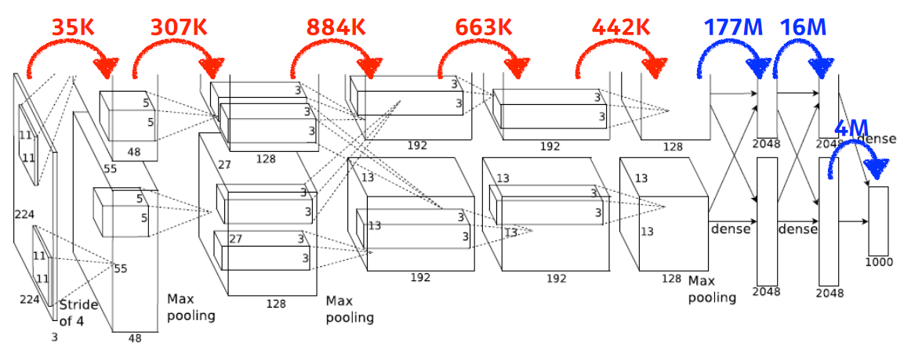
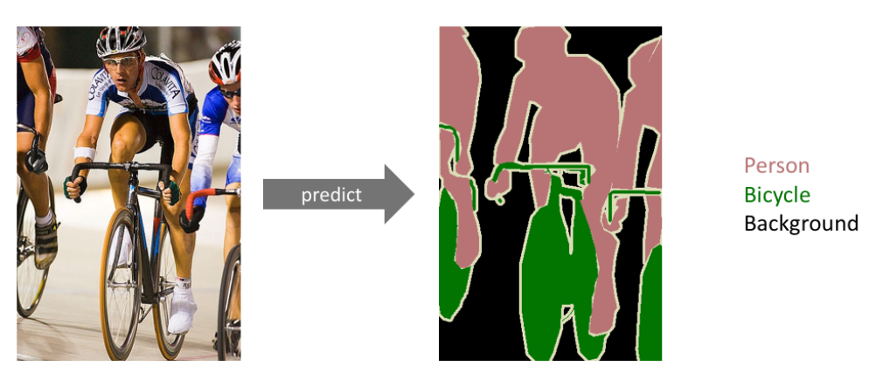

> 🙌은 **QnA에 있는 질문-답변**을 통해 얻은 지식을 표시합니다.

## [👉 피어 세션](https://github.com/boostcamp-ai-tech-4/peer-session/issues/51)

### 질문

- [[히스] CNN 레이어가 깊을 때 각 커널의 역할](https://github.com/boostcamp-ai-tech-4/peer-session/issues/53)
- [[히스] Gradient Vanishing 해결을 위한 ReLU 와 ResNet](https://github.com/boostcamp-ai-tech-4/peer-session/issues/52)

### 기록

- 오늘 **제리님🐹**이 피어세션 깜짝 방문을 하셨다. 오랜만에 다시 보는 CNN이라 많이 헷갈렸는데 제리님이 직관적인(?) 설명을 잘해주셔서 공부했었을 때의 감을 다시 찾을 수 있었다. CNN이 어려운 이유는 데이터의 크기도 채널 포함 3차원이기 때문인 것 같다. 그래서 머릿속으로 그리기가 어렵다..
- 오늘 강의에서 대표적인 CNN 구조를 살펴보았는데, 그 중 resNet의 **잔차(residual)의 개념**이 꽤 어려웠다. 자세한 내용은 [여기]()에서 보자. 어쨌든 왜 잔차를 최소화하는지 찾아봤는데 "이렇게 해보니 결과가 좋더라" 같은 느낌이었다. 딥러닝 공부를 하다보면 이런 경우가 많아서 그냥 받아들이고 있다.

## Table of Contents

- [CNN 톺아보기](#cnn-톺아보기)
- [모던 CNN](#모던-cnn)
- [컴퓨터비전](#컴퓨터비전)

## CNN 톺아보기

### CNN의 구성

CNN은 `Convolution Layer`, `Pooling Layer`, `Fully-connected Layer`로 구성된다.

- Convolution Layer과 Pooling Layer로 **이미지의 피처(feature)를 추출**한다.
- Fully-connected Layer는 마지막에 Convolution 결과를 1차원으로 평탄화한 후 **최종 결정**을 내리는 층이다.
  - 예를 들어, 개/고양이 분류 문제에서 개인지 고양인지 결정하는 층이다.

### 파라미터의 개수

CNN에서 가장 중요한 것은 **파라미터의 개수**를 대략적으로 가늠하는 것이다. 정확한 계산까지는 무리일지 몰라도 이렇게 설계하면 파라미터가 어느 정도 필요한지 예상할 수 있어야 한다.

그럼 파라미터는 어떻게 계산할까? 다음은 [AlexNet](https://en.wikipedia.org/wiki/AlexNet)이며 AlexNet의 파라미터를 한 번 계산해보자. 참고로 보기의 편의를 위해 AlexNet을 반으로 잘랐다.

#### Convolution Layer의 파라미터 수

> 파라미터 수 = 커널 행의 크기 × 커널 열의 크기 × 입력의 차원 × 출력의 차원

첫번 째 Convolution Layer를 살펴보자. $(11, 11)$ 크기의 커널을 사용하며 stride는 $4$이고 차원이 $3 \rightarrow 48$로 매핑된 것을 볼 수 있다. AlexNet은 GPU 활용을 위해 네트워크를 2개로 쪼개므로 이 때 Convolution Layer의 파라미터를 계산하면, $11 \times 11 \times 3 \times 48 * 2 \approx 35k$이다.

#### Fully-connected Layer의 파라미터 수

> 파라미터 수 = 입력의 노드 개수 × 출력의 노드 수

첫 번째 Fully-connected Layer를 살펴보자. 입력의 크기는 $(128, 13, 13)$이고 출력의 크기는 $(2048, )$이다. 우선 입력의 총 노드 수는 $128 * 13 * 13 \approx 21K$이고 AlexNet이 네트워크 2개를 사용하는 걸 고려할 때, 입력 Fully-connected Layer의 파라미터 수는 $21K * 2 \times 2048 * 2  \approx 177M$이다.

💡

왜 Fully-connected Layer가 Convolution Layer보다 더 많은 파라미터를 사용할까?

Convolution의 경우 각 커널이 같은 위치에서 동일하게 적용되기 때문이다. Fully-connected Layer의 경우 모든 가중치와 입력값을 1:1 매핑하기 때문에 더 많은 파라미터가 필요하다.

### 1×1 Convolution

1×1 Convolution Layer는 너비(width)와 높이(height)는 그대로 유지하고 **차원(dimension)**을 바꿀 수 있다. 1×1 Convolution Layer는 다음과 같은 이유로 사용한다.

- `이유 1` **차원을 축소**하기 위해서
- `이유 2` 네트워크를 깊게 쌓으면서 **파라미터의 수를 줄이기** 위해서
  - 대표적으로 GoogLeNet의 Inception Block에서 1×1 Convolution을 사용하여 파라미터의 수를 획기적으로 줄였다!

## 모던 CNN

현대에 가까워질수록 네트워크의 깊이는 깊어지고 파라미터의 개수는 줄어들며 성능은 향상된다.

| 모델                                                                | Key Points                                                                                                                            |
| ------------------------------------------------------------------- | :------------------------------------------------------------------------------------------------------------------------------------ |
| **[AlexNet](https://blueskyvision.tistory.com/421)**                | ◾ ReLU / Data Augmentation / Dropout 사용  ◾ 지금 CNN의 기준이 되는 모델                                                        |
| **[VGGNet](https://blueskyvision.tistory.com/504)**                 | ◾ $3\times 3$ 필터 여러 개로 파라미터의 개수를 최소화                                                                                |
| **[GoogLeNet](https://blueskyvision.tistory.com/539)**              | ◾ `Inception Block`의 $1 \times 1$ 필터로 파라미터의 수를 줄임 ◾ 네트워크가 22 Layers로 매우 깊음                               |
| **[ResNet](https://blueskyvision.tistory.com/644)**                 | ◾ 어느정도 깊어지면 학습이 안 되는 것을 skip-connection으로 해결                                                                     |
| **[DenseNet](https://hoya012.github.io/blog/DenseNet-Tutorial-1/)** | ◾ 단순 덧셈 대신 Concatenation을 사용 → 채널 수 ◾ 피처맵을 concat하는 `Dense Block`과 차원을 줄이는 `Transition Block`으로 구성 |

## 컴퓨터비전

### Semantic Segmentation

Semantic Segmentation이란 **이미지 내에 있는 물체들을 의미있는 단위로 분할해내는 것**을 말한다. 정확히 말하자면 이미지의 각 픽셀이 어느 클래스에 속하는지 분류하는 것이다.

- **[Semantic Segmentation](https://blueskyvision.tistory.com/491)**: 이미지의 픽셀마다 분류를 하는 것
  - Fully-connected Layer를 사용하지 않고 모두 Convolution Layer를 사용한다.
- **[Object Detection](https://nuggy875.tistory.com/20)**: 객체를 찾아 Bounding Box를 씌우고(Localization) 어떤 객체인지 라벨링(Classification)까지 하는 것
  - [R-CNN](https://blueskyvision.tistory.com/694) → [SPPNet](https://yeomko.tistory.com/14) → [Fast R-CNN](https://blueskyvision.tistory.com/702) → [Faster R-CNN](http://incredible.ai/deep-learning/2018/03/17/Faster-R-CNN/) → [YOLO](https://bkshin.tistory.com/entry/%EB%85%BC%EB%AC%B8-%EB%A6%AC%EB%B7%B0-YOLOYou-Only-Look-Once)로 점차 발전
