> 🙌은 **QnA에 있는 질문-답변**을 통해 얻은 지식을 표시합니다.

## [👉 피어 세션](https://github.com/boostcamp-ai-tech-4/peer-session/issues/57)

### 질문

- [[펭귄] Adadelta 수식](https://github.com/boostcamp-ai-tech-4/peer-session/issues/55)
- [[펭귄] LSTM과 GRU 비교](https://github.com/boostcamp-ai-tech-4/peer-session/issues/56)

### 기록

- 오늘 **RNN**을 배웠는데 자연어처리 쪽은 잘 몰라서 피어세션에서 많은 질문을 했다. 특히 **LSTM과 GRU** 쪽에서 궁금한 것이 많았는데 [후미](https://github.com/opijae)님이 잘 답변해주셔서 LSTM은 잘 해결되었다👍 다만 GRU는 마스터님이 자세한 설명을 안해주고 넘어가셔서 이 부분은 추가로 공부해서 보충해야겠다.
- [서폿](https://github.com/keepRainy)님이 **심리학**과 관련해서 이것저것 이야기해주셨는데 정말 흥미로운 내용이 많았다. 심리학 공부 한 번 해본다고 책을 읽으면서 "아 사람 심리가 이렇구나"하면서 수긍했는데 뭔가 속으로 느껴지던 **찝찝함의 이유🤔**가 [서폿](https://github.com/keepRainy)님이 짧은 강의(?)에 있었다. 다음 TED 세미나 때 심리학 주제로 강의를 하시면 재밌을 것 같다.
- 저번 주 마스터님이 직접 데이터셋을 만드는 자습과제를 내주셨는데, 연휴 때 조금 시간을 내서 팀원들과 **👩‍💻사이드 프로젝트👨‍💻**를 해보기로 했다. 주제는 <u>비슷한 얼굴을 가진 연예인 분류하기</u>이고 아직 어떤 연예인의 사진으로 할지 정하지는 않았다. 내일 본격적으로 프로젝트 방향을 이야기해볼 예정이다.

## Table of Contents

- [RNN 속 수학](#rnn-속-수학)
- [시퀀스 모델](#시퀀스-모델)
- [Attention is all you need](#attention-is-all-you-need)
- [References](#references)

## RNN 속 수학

### 시퀀스 데이터

소리, 문자열, 주가 등의 순차적으로 들어오는 데이터를 **시퀀스 데이터**라고 한다.

- 시퀀스 데이터는 i.i.d. 가정을 잘 위배한다.
- 그래서 순서를 바꾸거나 과거 정보에 손실되면 데이터의 확률분포가 바뀐다.
  - `ex` 개가 사람을 물었다😨 vs 사람이 개를 물었다🤔
  - 위의 예시처럼 순서가 정말 중요하다.

### 시퀀스 데이터를 다루는 방법

시퀀스 데이터를 가지고 앞으로 발생할 데이터의 확률분포를 다룰 때는 `조건부확률`과 `베이즈 정리`를 이용한다.

$$
P(X_1, ..., X_t) = P(X_t | X_1, ... , X_{t-1}) P(X_1, ... , X_{t-1})
$$

$$
= ... = \prod^t_{s=1} P(X_s | X_{s-1}, ... , X_1)
$$

이 때, $X_t, X_{t+1}$은 다음과 같은 분포를 띄며, **과거의 모든 정보**를 이용한다. $t$에 따라 조건부에 들어가는 데이터의 길이가 바뀌므로 **가변적인 데이터를 다룰 수 있는 모델**이 필요하다.

$$
X_t \sim P(X_t | X_{t-1}, ... , X_1)
$$

$$
X_{t+1} \sim P(X_{t+1} | X_t, X_{t-1}, ... X_1)
$$

#### AR 자기회귀모델

하지만 꼭 모든 정보를 사용해야하는 것은 아니다. 예를 들어, 어떤 회사의 주가를 예측할 때 최근 3년의 정보를 이용하여 예측을 하기도 한다. 이처럼 **일부 과거 정보 $\tau$**만큼을 이용하는 모델을 `AR(τ) 자기회귀모델 (Autoregressive Model)`이라고 한다.

$$
X_t \sim P(X_t | X_{t-1}, ... , X_{t-\tau})
$$

$$
X_{t+1} \sim P(X_{t+1} | X_t, X_{t-1}, ... , X_{t-\tau+1})
$$

하지만 위의 모델은 다음과 같은 2가지 문제점이 있다.

- $\tau$는 하이퍼파라미터로 우리가 풀어야 하는 문제에 따라 값이 달라진다.
- 과거의 모든 정보를 볼 수 없다.

#### 잠재 AR 모델

이를 모두 해결한 방법이 바로 `잠재 AR 모델(Latent Autoregressive Model)`이다. 잠재모델은 바로 직전 과거정보 $X_{t-1}$를 제외한 모든 과거 정보를 **잠재변수 $H_t$**로 두고 $X_{t-1}$와 $H_t$를 조건부로 하여 $X_t$의 확률분포를 추론한다.

$$
X_{t} \sim P(X_t | X_{t-1}, H_t) \quad \leftarrow \quad H_t = X_{t-2}, ..., X_1
$$

$$
X_{t+1} \sim P(X_{t+1} | X_{t}, H_{t+1}) \quad \leftarrow \quad H_{t+1} = X_{t-1}, ..., X_1
$$

이렇게 직전 과거를 제외한 정보를 $H_t$로 인코딩하면 모델이 고정된 길이 2로 예측을 할 수 있으며 과거의 모든 정보를 활용할 수 있다.

### RNN (Recurrent Neural Network)

그럼 $H_t$로 어떻게 인코딩할까? 바로 **신경망**을 통해 과거의 정보를 인코딩한다! 이 때의 신경망이 `RNN(Recursive Neural Network)`이며, 잠재변수 $H_t$를 신경망을 통해 반복해서 사용하여 시퀀스 데이터의 패턴을 학습한다.

$$
H_t = Net_\theta (H_{t-1}, X_{t-1})
$$

#### RNN은 어떻게 생겼을까?

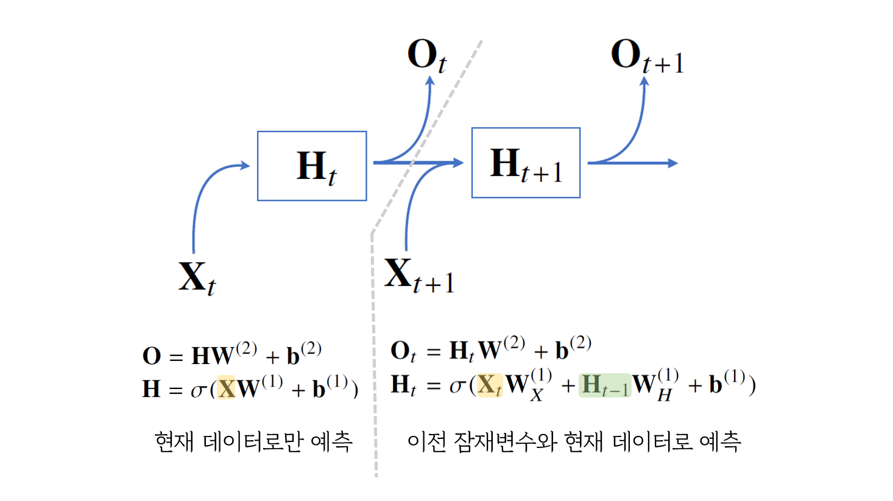

RNN은 이전 잠재변수 $H_{t-1}$과 현재 입력 데이터 $X_t$ 총 2개의 입력을 받아 모델링을 한다.

- $O_t$는 예측한 결과이다.
- 가중치 $W^{(2)}$, $W_X^{(1)}$, $W_H^{(1)}$는 $t$에 따라 변하지 않는다.
  - 순서 $t$마다 존재하는 것이 아니고 각 Layer마다 가중치가 존재한다.
  - **순서 $t$와 Layer를 헷갈리지 말 것!**

#### BPTT (Backpropagation Through Time)

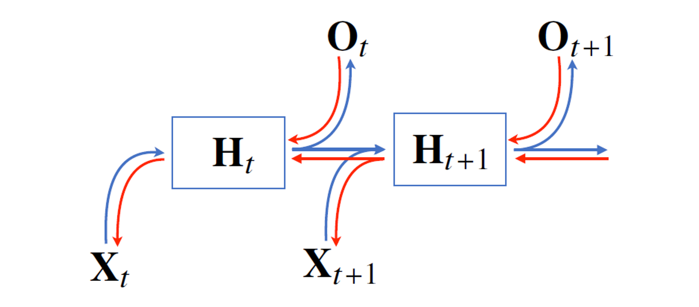

위의 그림에서 `🔵순전파`와 반대로 흐르는 빨간색 화살표가 `🔴역전파`이다. 그림처럼 RNN의 역전파는 최근의 결과 노드부터 시작해 과거로 거슬러 올라가며 순차적으로 계산한다. 그래서 RNN에서의 역전파를 특별히 **시간에 따른 역전파, BPTT**라고 부른다.

BPTT를 통해 RNN의 가중치 행렬을 미분을 계산해보면 다음과 같다.

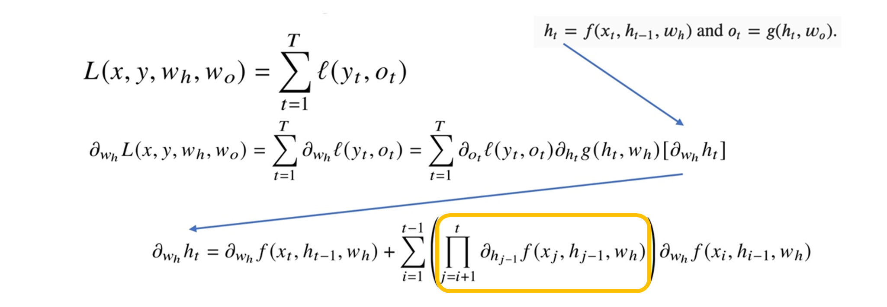

여기서 노란색 박스에 있는 부분이 1보다 클 경우 미분값이 엄청 커지고 1보다 작을 경우 엄청 작아질 가능성이 있다. 즉, 시퀀스의 길이가 길어질수록 기울기가 소실되거나 과거 정보를 잃어버릴 수 있다.

이를 해결하기 위해 특정 시점에서 역전파를 끊는 것이 필요하다. 이를 **Trucated BPTT**라고 하며, 이를 적용한 대표적인 모델이 바로 `LSTM`과 `GRU`이다.

## 시퀀스 모델

### 시퀀스 모델들

#### Naive Sequence model

과거의 모든 정보를 고려하여 예측한다.

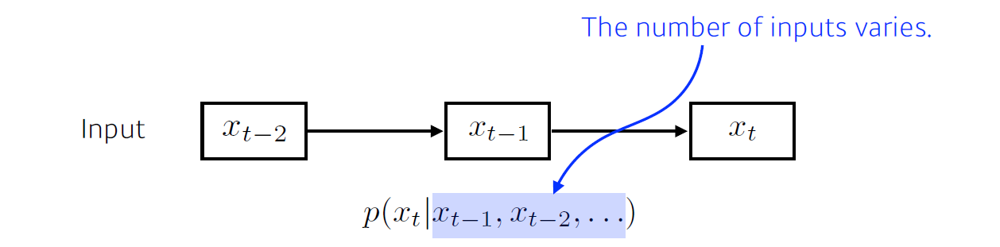

#### Autoregressive Model

바로 이전 과거부터 $\tau$만큼의 과거 정보를 고려하여 예측한다.

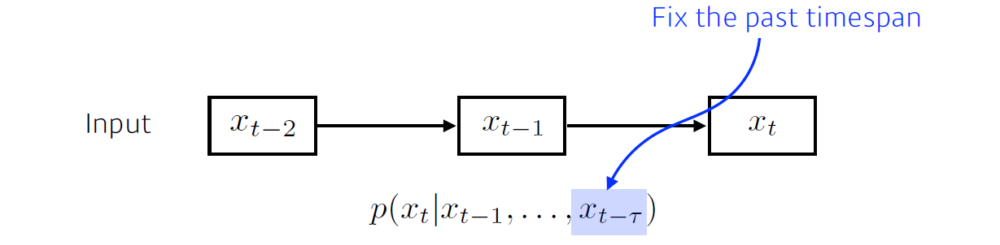

#### Markov Model (First-order Autoregressive Model)

바로 직전의 과거를 가지고만 예측한다.

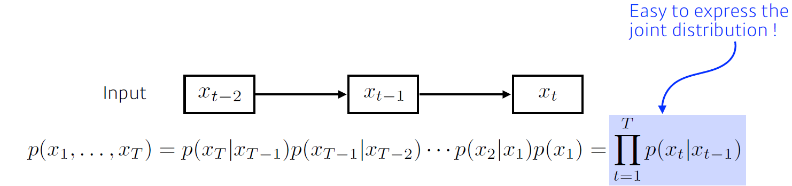

#### Latent Autoregressive Model

과거의 정보를 요약한 $h_t$와 현재 입력을 가지고 예측한다.

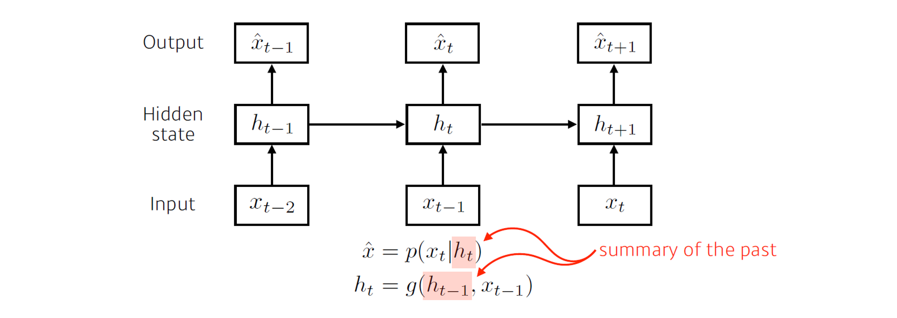

### RNN (Recurrent Neural Network)

잠재 자기회귀모델에서 $h_t$를 <u>신경망으로 인코딩한 것</u>이 바로 RNN이다. RNN은 다음과 같이 출력이 다음 입력으로 들어가는 **순환 구조**를 띄고 있다.

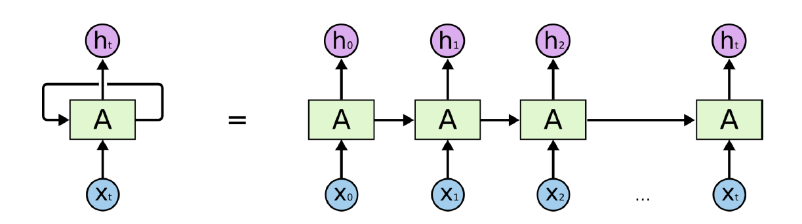
<small class="src" markdown=1>

출처: [Understanding LSTM Networks](http://colah.github.io/posts/2015-08-Understanding-LSTMs/)

</small>

> 오른쪽 그림은 시간순으로 푼 것

RNN은 큰 단점을 갖고 있는데 바로 너무 오래된 과거 정보를 기억하지 못하는 **Short-term Dependencies** 문제가 있다.

- 만약 활성화 함수가 `sigmoid` 나 `tanh`면 입력으로 들어온 값이 0과 1사이의 값으로 계속 압축이 되면서 **기울기 소실(Vanishing Gradient)**가 발생한다.
- 만약 `ReLU`라면 ReLU는 입력이 양수이면 기존의 값을 가져가기 때문에 계속 곱해지면서 값이 커져 **기울기 폭주(Exploding Gradient)**가 발생한다. (그래서 RNN에서는 ReLU를 쓰지 않는다🙅‍♀️)

### LSTM (Long Short Term Memory)

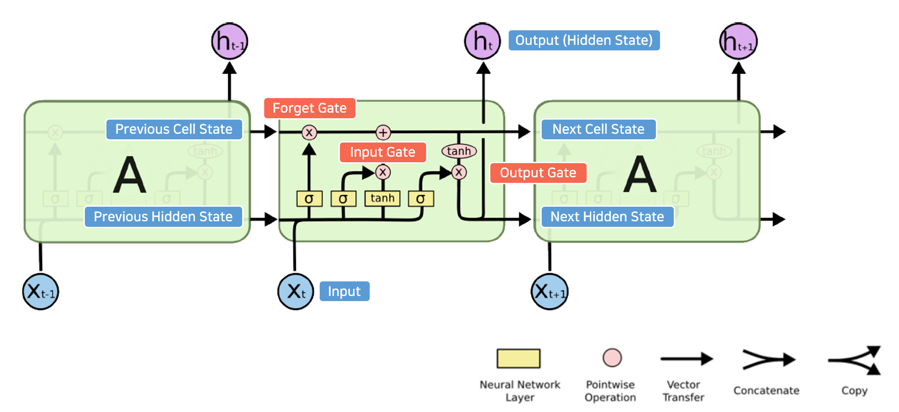
<small class="src" markdown=1>

출처: [Understanding LSTM Networks](http://colah.github.io/posts/2015-08-Understanding-LSTMs/)

</small>

LSTM은 RNN과 달리 장기기억(Long-term Dependencies)이 가능하도록 설계되었다. LSTM은 **①이전 Cell State ②이전 Hidden State ③현재 입력데이터**로 3개의 입력을 받으며, 현재 Hidden State는 **출력**하는 동시에 **다음 입력**으로 들어간다.

LSTM의 아이디어는 컨베이어 벨트처럼 이전 Cell State에서 유용한 정보만 걸러내고(=Forget Gate) 현재 데이터에서 괜찮은 정보를 가져와(=Input Gate) 새로운 Cell State를 만들어 전달한다.

#### Forget Gate

이전 Cell State에서 어떤 것을 버릴 것인지에 대한 기준 $f_t$를 계산한다.

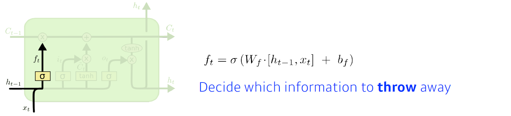
<small class="src" markdown=1>

출처: [Understanding LSTM Networks](http://colah.github.io/posts/2015-08-Understanding-LSTMs/)

</small>

#### Input Gate

과거 데이터와 현재 데이터를 합친 데이터에서 어떤 것이 유용한지에 대한 기준 $i_t$와 과거 정보인 $h_{t-1}$과 현재 정보인 $x_t$를 합친 Cell State 후보군 $\widetilde{C}_t$를 생성한다.

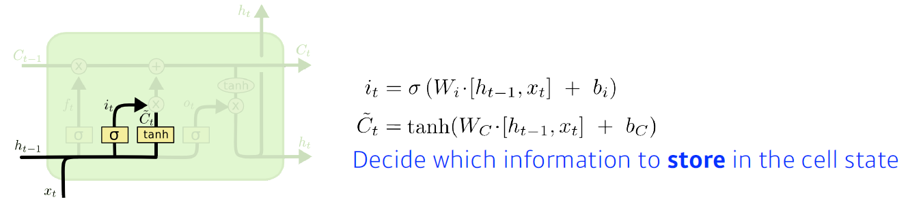
<small class="src" markdown=1>

출처: [Understanding LSTM Networks](http://colah.github.io/posts/2015-08-Understanding-LSTMs/)

</small>

#### Update Cell

Forget Gate에서 얻은 $f_t$와 Input Gate에서 얻은 $i_t$를 가지고 기존 Cell State $C_{t-1}$에서 버릴 것을 버리고 새로운 Cell State $\widetilde{C}_t$에서 유용한 것만 걸러 최종 Cell State $C_t$를 계산한다.

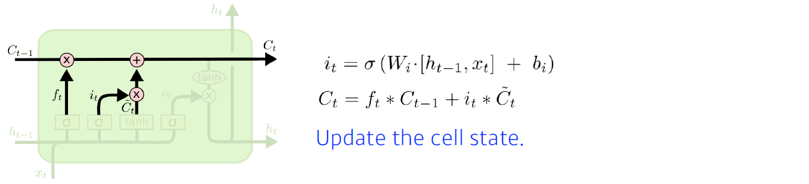
<small class="src" markdown=1>

출처: [Understanding LSTM Networks](http://colah.github.io/posts/2015-08-Understanding-LSTMs/)

</small>

#### Output Gate

업데이트된 Cell State로 계산한 $h_t$를 출력과 다음 Hidden State로 내보낸다.

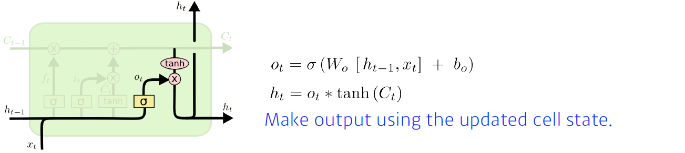
<small class="src" markdown=1>

출처: [Understanding LSTM Networks](http://colah.github.io/posts/2015-08-Understanding-LSTMs/)

</small>

### GRU (Gated Recurrent Unit)

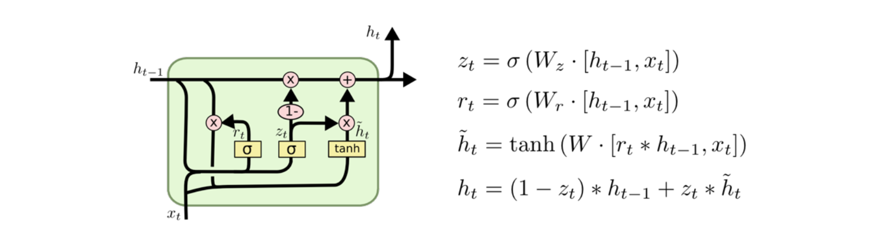
<small class="src" markdown=1>

출처: [Understanding LSTM Networks](http://colah.github.io/posts/2015-08-Understanding-LSTMs/)

</small>

GRU는 LSTM을 **조금 더 효율적으로 만든 버전**이다.

- LSTM에 비해 파라미터 수가 적어 조금 더 효율적인 학습이 가능하다.
- Reset Gate, Update Gate 총 2개의 Gate만 갖는다.
- GRU의 Hidden State는 LSTM의 Hidden State와 Cell State의 합친 것이다.

## Attention is all you need

내용이 너무 어려워 다음의 동영상을 보고 추가 공부를 했다😥

<iframe width="560" height="315" src="https://www.youtube.com/embed/AA621UofTUA" frameborder="0" allow="accelerometer; autoplay; clipboard-write; encrypted-media; gyroscope; picture-in-picture" allowfullscreen></iframe>

### 기존 Seq2Seq와 트랜스포머의 차이

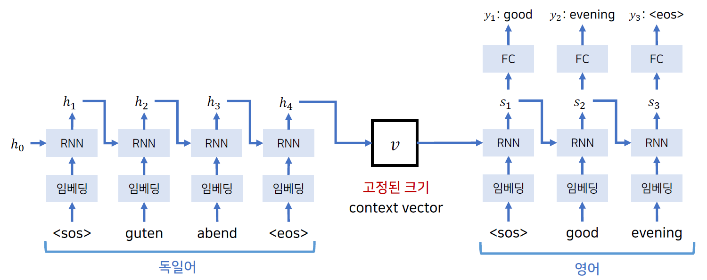

<small class="src" markdown=1>

출처: [Deep-Learning-Paper-Review-and-Practice](https://github.com/ndb796/Deep-Learning-Paper-Review-and-Practice/blob/master/lecture_notes/Transformer.pdf)

</small>

기존 Seq2Seq는 입력 시퀀스를 순차적으로 받아 고정된 크기의 context vector로 입력 시퀀스의 정보를 압축한 후 디코더의 입력으로 넣어줬다. 이 모델의 가장 큰 단점은 **하나의 context vector가 입력 시퀀스의 모든 정보를 가지고 있는 것**이었다. 왜 문제가 될까? 긴 문자을 고정된 벡터로 표현하기에는 부족하기 때문이다.

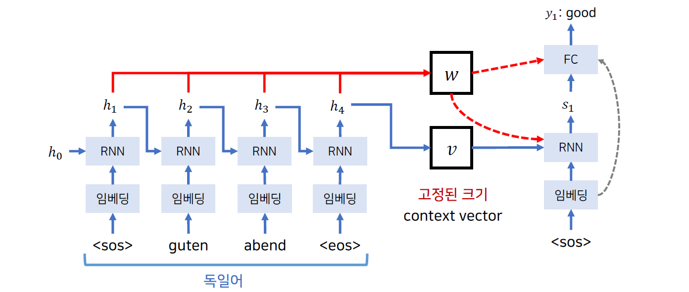

<small class="src" markdown=1>

출처: [Deep-Learning-Paper-Review-and-Practice](https://github.com/ndb796/Deep-Learning-Paper-Review-and-Practice/blob/master/lecture_notes/Transformer.pdf)

</small>

이에 대한 해결책으로 어탠션(Attention) 방법을 사용하여 <u>인코더에서 만들어진 모든 Hidden State 정보를 디코더에 넣어준다.</u> (정확히는 각 단어별 에너지의 비율을 구하여 넣어준다) 이렇게 하면 고정된 길이의 벡터의 압축으로 인한 정보 손실 문제를 해결하여 기존 Seq2Seq보다는 더 좋은 성능을 보여준다.

여기서 더 나아가 RNN을 없애고 **어텐션 기법**만 사용한 모델이 바로 `트랜스포머`이다! 트랜스포머는 순차적으로 입력을 받는 RNN과 달리 <u>시퀀스를 한 번에</u> 입력을 받고 RNN의 문제점인 기울기 소실문제를 해결한다.

### 트랜스포머의 구조

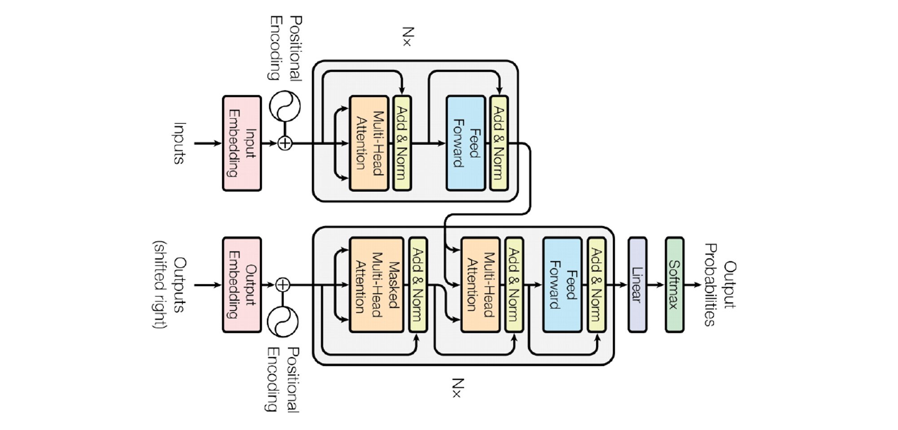

트랜스포머는 RNN을 사용하지 않고 여러 개의 인코더와 디코더를 사용하여 최종 예측 결과를 출력한다.

#### 임베딩(Embedding)

임베딩 단계에서는 위치 정보를 포함하여 시퀀스를 행렬로 임베딩한다.

- **Step 1.** 시퀀스를 `(단어개수, 임베딩시킬 차원)`크기의 행렬로 표현한다.
- **Step 2.** 순차적으로 단어를 입력 받는 RNN과 달리 입력 시퀀스를 한 번에 받기 때문에 위치를 표시할 **Positional Encoding**이 필요하다. 위치 정보를 담은 **Positional Encoding**을 임베딩된 단어 행렬에 element-wise 덧셈을 한다.

#### 인코더(Encoder)

인코더는 어텐션(Attention)과 정규화(Normalization) 과정을 반복하여 마지막 인코더 Layer의 출력을 모든 디코더 Layer로 보낸다.

- `어텐션 - 정규화 - 피드포워드 - 정규화`로 인코더 하나가 구성되며 여러 개의 인코더를 쌓아 층을 만든다. 이 때, 각 층은 서로 다른 파라미터를 가진다.
- 어텐션 Layer에서는 입력 시퀀스의 단어 간의 **어텐션 점수(Attention Score)**를 구해 단어 간의 연관성을 학습한다.
- 정규화 Layer에서는 성능을 위해 어탠션 Layer의 결과 외에 어탠션 Layer 직전의 값도 입력으로 받아 **잔여학습(Residual Learning)**을 수행한다.

#### 디코더(Decoder)

디코더는 인코더와 비슷한 구조를 띄며 출력 시퀀스의 단어간의 연관성과 입력 시퀀스 단어간의 연관성을 파악하여 최종 예측 단어를 출력한다.

- `<sos>`를 **첫 입력**으로 받아 나온 결과를 다시 디코더의 입력으로 넣는다.
- 위의 과정을 반복해서 수행하다 입력으로 `<eos>`가 들어오면 연산을 멈춘다.
- 통상적으로 디코더의 개수는 인코더의 개수와 **통일**한다.

💡

sos와 eos

sos(start of string)는 시퀀스의 시작을, eos(end of string)은 시퀀스의 끝을 나타낸다.

### Positional Encoding

Positional Encoding은 다음과 같이 주기 함수를 활용한 수식으로 구할 수 있다.

$$
PE_{(pos, 2i)} = sin(pos / 10000^{2i/d_{model}})
$$

$$
PE_{(pos, 2i+1)} = cos(pos / 10000^{2i/d_{model}})
$$

$pos$는 몇 번째 단어인지, $i$는 몇 번째 차원인지를 뜻하며, 이렇게 구한 Positional Encoding을 임베딩된 입력 시퀀스에 더하여 위치 정보를 추가할 수 있다.

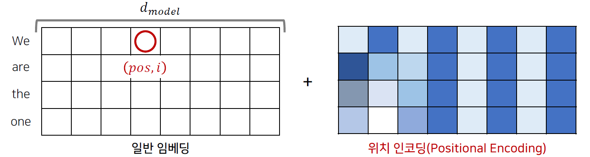

<small class="src" markdown=1>

출처: [Deep-Learning-Paper-Review-and-Practice](https://github.com/ndb796/Deep-Learning-Paper-Review-and-Practice/blob/master/lecture_notes/Transformer.pdf)

</small>

### Multi-head Attention

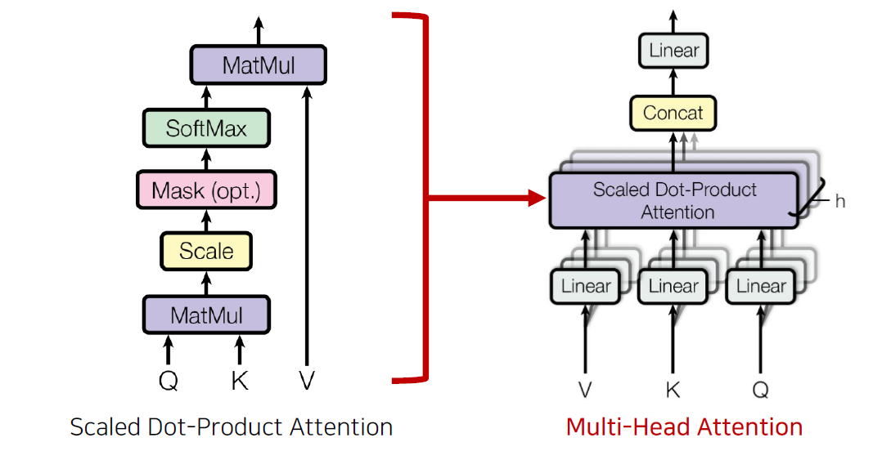

<small class="src" markdown=1>

출처: [Deep-Learning-Paper-Review-and-Practice](https://github.com/ndb796/Deep-Learning-Paper-Review-and-Practice/blob/master/lecture_notes/Transformer.pdf)

</small>

인코더와 디코더는 Multi-head Attention Layer를 사용한다. Multi-head Attention Layer는 여러 개의 어탠션을 학습하며 각 어탠션 Layer의 결과를 합쳐 출력한다.

여기서 어텐션은 **어떤 단어가 다른 단어와 어떤 연관성을 나타내는지에 대한 것**으로, 입력으로 `Query`, `Key`, `Value`을 받는다. `Query`는 연관성을 물어보는 주체를, `Key`는 연관성을 물어보는 대상을 말한다.

예를 들어, *"I am a cat"*이라는 시퀀스가 있고 *"I"*와 다른 단어 사이의 관계를 알고 싶을 때, *"I"*가 `Query`가 되고 다른 모든 단어 _"I"_, _"am"_, _"a"_, *"cat"*이 `Key`가 된다. `Query`와 `Key`로 구한 Attention Score에 `Value`를 곱해서 Attention Value를 얻게 된다.

Multi-head Attention Value를 구하는 과정을 설명하기 전에 하이퍼파라미터를 한번 짚고 넘어가자. 아래 예시에서는 $d_{models} = 4, n_{heads} = 2$로 설정한다.

- $d_{model}$ : 임베딩 벡터의 차원 = 인코더/디코더의 입출력 크기
- $n_{heads}$: Multi-head Attention의 head의 개수

#### 1단계: Q, K, V 구하기

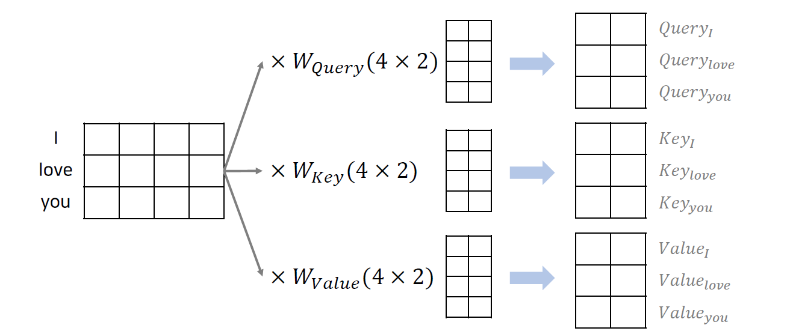
<small class="src" markdown=1>

출처: [Deep-Learning-Paper-Review-and-Practice](https://github.com/ndb796/Deep-Learning-Paper-Review-and-Practice/blob/master/lecture_notes/Transformer.pdf)

</small>

Multi-head Attention 값을 구하기 위한 첫걸음은 각 단어를 쿼리 $Q$, 키 $K$, 값 $V$로 나타내는 것이다. 이는 $(d_{model}, n_{heads})$ 크기의 $W_{query}$, $W_{key}$, $W_{value}$와의 행렬곱을 통해 계산할 수 있다. 물론 $W$는 학습을 통해 개선된다.

#### 2단계: Attention Value 구하기

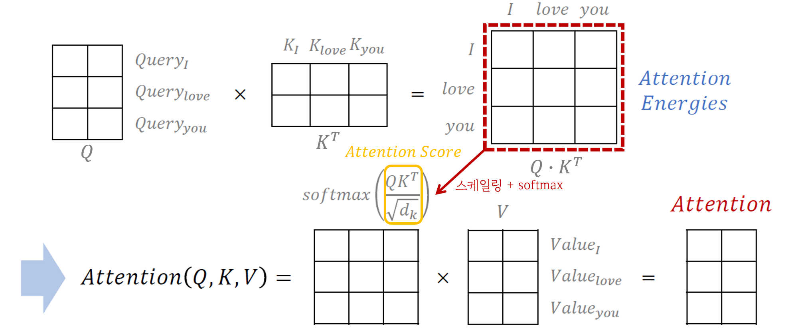
<small class="src" markdown=1>

출처: [Deep-Learning-Paper-Review-and-Practice](https://github.com/ndb796/Deep-Learning-Paper-Review-and-Practice/blob/master/lecture_notes/Transformer.pdf)

</small>

**Attention Value**는 다음의 수식을 통해 구할 수 있다.

$$
Attention(Q, K, V) = softmax \left( \frac{Q K^T}{\sqrt{d_k}} \right) V
$$

- 앞에서 구한 $Q$, $K$를 곱해서 각 단어 간의 연관성을 나타낸 **Attention Energy**를 구한다.
- 이를 $\frac{1}{\sqrt{d_{k}}}$으로 나눠 정규화시켜 **Attention Score**를 구한다.
  - $d_k = d_{model} / n_{heads}$이며, 아래 사례의 경우 $d_k$ = 4 / 2 = 2이다.
- Attention Score를 softmax에 통과시킨 후 Value와 곱하면 **Attention Value**를 구할 수 있다.

#### 2.5단계: Masking하기

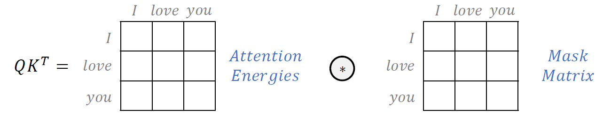
<small class="src" markdown=1>

출처: [Deep-Learning-Paper-Review-and-Practice](https://github.com/ndb796/Deep-Learning-Paper-Review-and-Practice/blob/master/lecture_notes/Transformer.pdf)

</small>

꼭 해도 되진 않지만 $QK^T$에 **마스크 행렬**을 곱해 특정 단어를 무시할 수 있다.

- 무시하려는 위치의 마스크행렬 값은 $- \infty$이다.
- 나중에 softmax 함수에 넣게 되면 결과값이 0에 가까워지게 된다.

#### 3단계: 여러 개의 Attention Value 합치기

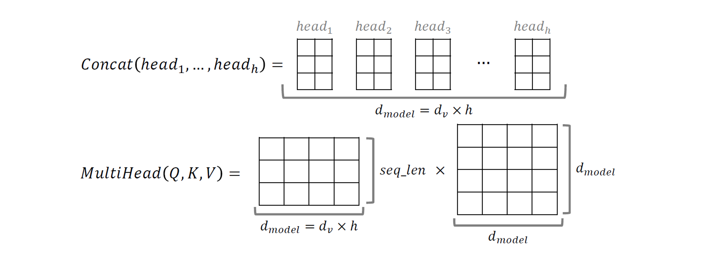

<small class="src" markdown=1>

출처: [Deep-Learning-Paper-Review-and-Practice](https://github.com/ndb796/Deep-Learning-Paper-Review-and-Practice/blob/master/lecture_notes/Transformer.pdf)

</small>

다음의 수식을 통해 최종 Multi-head Attention Value를 구할 수 있다.

$$
MultiHead(Q, K, V) = Concat(head_1, ... , head_h) \cdot W^O
$$

- 각 head별 Attention Value인 $head_h$를 합친다.
- $(d_{model}, d_{model})$ 크기의 가중치 행렬 $W^O$를 곱해 **Multi-head Attention Value**를 구할 수 있다!

### Attention의 종류

트랜스포머에서는 3가지 종류의 Attention Layer가 사용되며, 각각의 Attention Layer는 다음을 계산한다.

- **Encoder Self-Attention**: 입력 시퀀스의 단어가 서로 어떤 연관성을 갖는지
- **Masked Decoder Self-Attention**: 디코더의 출력이 이전 출력과 어떤 연관성을 갖는지
- **Encoder-Decoder Attention**: 디코더의 출력이 어떤 입력 시퀀스의 단어와 더 연관성을 갖는지

### 다시 돌아가: 트랜스포머 인코딩/디코딩

트랜스포머의 구조를 간단히 살펴보았다. 이제 시퀀스가 인코딩/디코딩되는 과정을 보며 위의 내용을 요약해보자.

<small class="src" markdown=1>

출처: [The Illustrated Transformer](http://jalammar.github.io/illustrated-transformer/)

</small>

- 입력 시퀀스를 받아 $d_{model}$ 차원의 벡터로 임베딩시키고 Positional Encoding을 더해 위치 정보를 추가한다.
- 임베딩된 시퀀스를 인코더에 넣고 나온 Attention Value를 디코더의 Encoder-Decoder Attention Layer의 입력으로 넣는다.
- `<sos>`를 디코더의 입력으로 넣어 나온 출력을 다시 디코더의 입력으로 넣는다.
- `<eos>`가 출력되면 디코더의 입력을 멈춘다.

## References

- [RNN, LSTM, GRU - 라온피플 머신러닝 아카데미](https://blog.naver.com/laonple/221027194402)
- [Difference between cell state and hidden state - StackExchange](https://datascience.stackexchange.com/questions/82808/difference-between-cell-state-and-hidden-state)
- [When to use GRU over LSTM? - StackExchange](https://datascience.stackexchange.com/questions/14581/when-to-use-gru-over-lstm)
- [Transformer: Attention Is All You Need - 동빈나](https://www.youtube.com/watch?v=AA621UofTUA)
- [트랜스포머 - 딥러닝을 이용한 자연어처리 입문](https://wikidocs.net/31379)
- [The Illustrated Transformer](http://jalammar.github.io/illustrated-transformer/)
