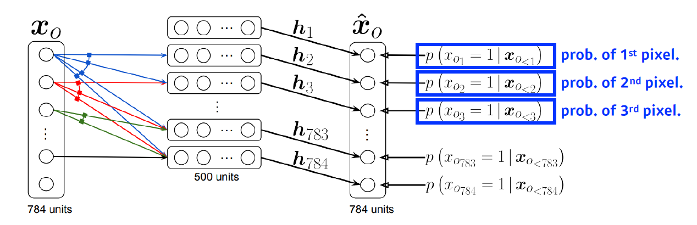
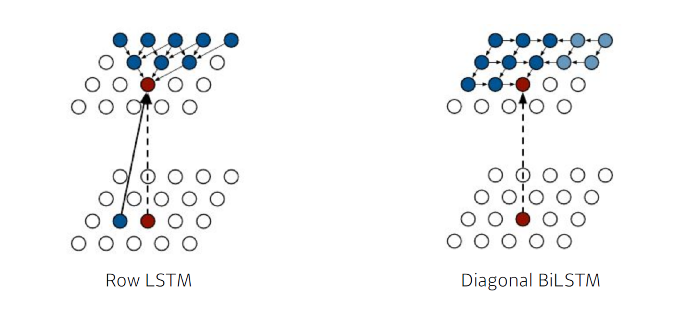
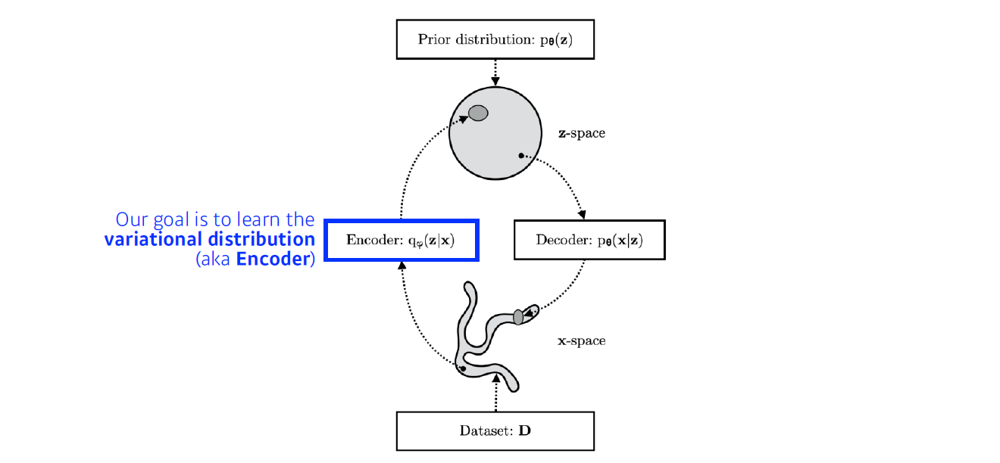
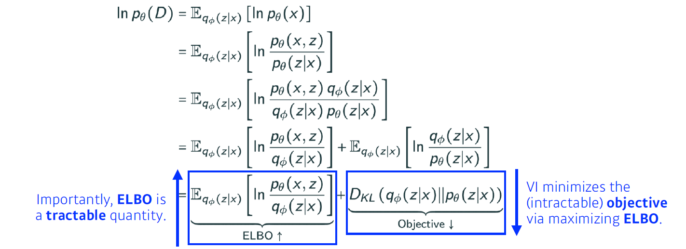
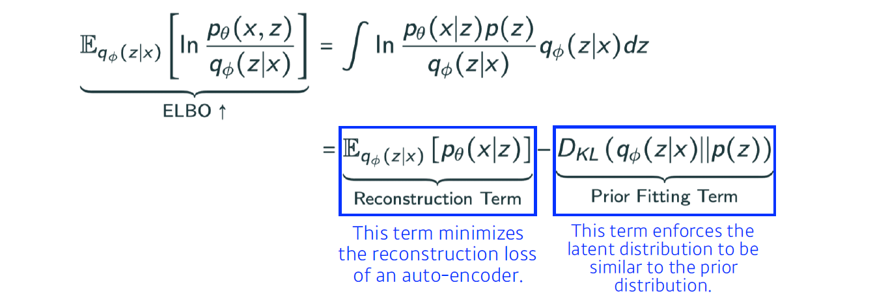
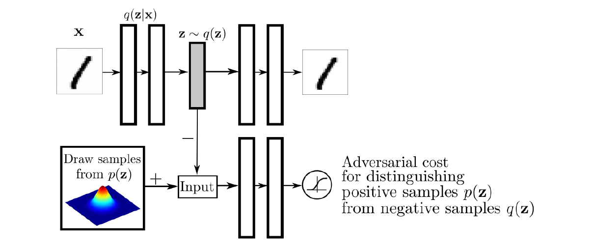
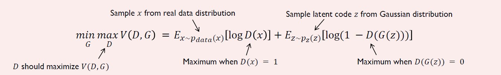
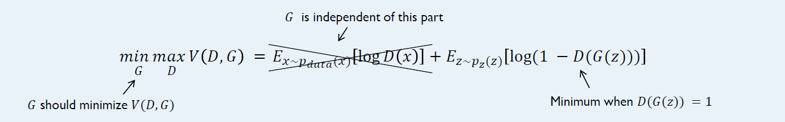
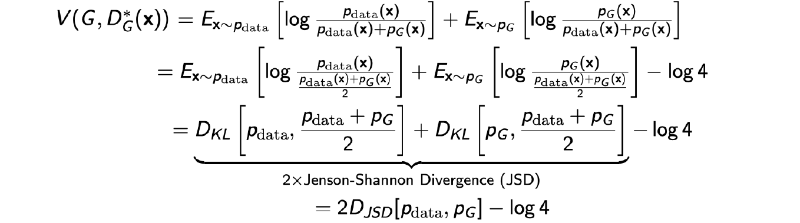

> 🙌은 **QnA에 있는 질문-답변**을 통해 얻은 지식을 표시합니다.

## [👉 피어 세션](https://github.com/boostcamp-ai-tech-4/peer-session/issues/60)

### 질문

- [[후미] (트랜스포머) 멀티헤드에서 사용되는 Wo, 디코더에 들어가는 인풋](https://github.com/boostcamp-ai-tech-4/peer-session/issues/59)
- [[히스] generative model 에서 generator 로 실제 아웃풋 생성](https://github.com/boostcamp-ai-tech-4/peer-session/issues/58)

### 기록

- 오늘 강의는 짧지만, 내용이 너무 어려웠다. 생성기(Generator)는 GAN이 뭔지 찾아보면서 간단히 본 터라 이를 수식으로 보니 머리가 너무 아팠다. 다행히 집에 [미술관에 GAN 딥러닝 실전 프로젝트](http://www.yes24.com/Product/Goods/81538614?OzSrank=1)을 미리 사둬서 이걸 읽으면서 추가 공부를 해야겠다.
- 어제 말한 닮은꼴 연예인 분류기 프로젝트에 관한 이야기를 나눴다. 닮은꼴 연예인으로 조유리즈(조유리, 최예나, 김채원)을 선정했고 다음 주에 데이터셋을 만들기로 했다. 모델은 아마 각자 만들 듯하다.

## Table of Contents

- [Generative Model](#generative-model)
- [Autoregressive Model](#autoregressive-model)
- [Variational AutoEncoder](#variational-autoencoder)
- [Generative Adversarial Network](#generative-adversarial-network)
- [References](#references)

## Generative Model

생성모델(Generative Model)은 <u>학습데이터가 따르는 확률분포에 근사한 모델</u>을 말한다. 이렇게 근사한 확률분포에서 샘플링해 그럴듯한 데이터를 생성해낼 수 있다.

예를 들어, `🐶귀여운 강아지 이미지 데이터셋🐶`이 있다고 가정해보자. 생성모델은 다음과 같은 것을 할 수 있다.

- **Generation**: 학습데이터에 있지 않은, 강아지와 비슷한 이미지를 만들어낸다.
  - $p(x)$ 확률분포에서 샘플링한 데이터 $x_{new}$는 강아지와 비슷한 이미지이다.
- **Density Estimation**: 강아지 이미지와 비슷하면 $p(x)$는 높고, 그렇지 않으면 $p(x)$는 낮다. = 이상치 탐지(Anomaly Detection)
- **Unsupervised Representation Learning**: 강아지의 대표적인 특징(ex. 귀, 꼬리)을 학습할 수 있다.

💡

Implicit Model vs Explicit Model

- Implicit Model: 생성만 하는 모델
- Explicit Model: 생성 뿐만 아니라 다른 것도 하는 모델

### 이산확률분포를 표현하기 위한 파라미터 수

그럼 확률분포 $p(x)$는 어떻게 나타내야 할까? 그 전에 대표적인 이산확률분포를 살펴보자.

- **베르누이 분포**

베르누이 분포는 확률변수가 ${0, 1}$이 나오는 확률분포이다. 베르누이 분포의 확률질량함수는 파라미터 $p$ 1개로 표현할 수 있다.

$$
P(X = 0) = p, \quad P(X = 1) = 1 - p
$$

- **카테고리 분포**

카테고리 분포는 확률변수가 ${1, ...., m}$이 나오는 확률분포이다. 카테고리 분포의 확률질량함수는 m-1개의 파라미터로 표현할 수 있다. 이 때, $P(X=1) + ... + P(X=m) = 1$이다.

$$
P(X = 1) = p_1, \; ... \; , P(X = m-1) = p_{m-1},
$$

$$
P(X=m) = 1 - (p_1 + ... + p_{m-1})
$$

#### 예시 1: RGB 결합분포

❓

서로 독립인 $r, g, b$ 확률변수의 RGB 결합분포 $p(R, G, B)$에 필요한 파라미터의 개수는 몇 개일까?

우선 한 픽셀이 표현할 수 있는 색은 각 확률변수 $r, g, b$는 256개의 정수를 가질 수 있으므로 $256 \times 256 \times 256$이다. 이제 $r, g, b$는 카테고리 분포를 띄고 각 확률변수의 질량함수는 255개의 파라미터로 표현할 수 있으므로, 필요한 파라미터의 수는 $255 \times 255 \times 255$개 이다.

여기서 중요한 것은 **한 픽셀의 색을 표현하기 위한 파라미터 수가 많다는 것**이다!

#### 예시 2: Binary 이미지

❓

$n$개의 픽셀을 가진 Binary 이미지가 있다고 해보자. 이 때 각 픽셀을 확률변수로 보면 우리는 $X_1, ..., X_n$을 얻을 수 있다. 그럼 결합분포 $p(X_1, ... , X_n)$에 필요한 파라미터의 개수는 몇 개 일까?

우선 한 픽셀이 가질 수 있는 색은 검정색(0), 흰색(1)이므로 만들 수 있는 이미지의 개수는 $2 \times ... \times 2 = 2^n$이다. 이제 $X_1, ... , X_n$은 베르누이 분포를 따르고 각 확률변수는 서로 Fully Dependent하므로, 필요한 파라미터의 수는 $2^n-1$이다. (자세한 내용은 [여기](#예시-2-binary-이미지--연쇄법칙-적용)에서!)

만약 $X_1, ... X_n$이 서로 독립이면 어떨까? 그럼 결합분포는 $p(X_1, ... , X_n) = p(X_1) p(X_2) ... p(X_n)$이 되므로 $2^n$ 경우의 수를 표현하기 위해 필요한 확률변수는 $n$개이다.

여기서 중요한 것은 **Fully Independent를 취하면 파라미터의 수가 많이 줄어든다는 것**이다!

### 조건부 독립

Fully Dependent이면 파라미터 수가 너무 많고 Fully Independept이면 파라미터의 수가 적지만 현실과 많이 동 떨어진다는 단점이 있다. 그래서 우리는 **Fully Dependent와 Fully Independent 사이의 중간 지점**을 찾고자 한다! 이를 찾기 위해서 `조건부 독립`을 이용하면 된다.

우선 그 지점을 찾기 전에 중요한 법칙 3가지를 알고 가자.

- **연쇄 법칙(Chain Rule)**

연쇄법칙은 확률변수가 독립이든 아니든 항상 만족한다.

$$
p(x_1, ..., x_n) = p(x_1)p(x_2 | x_1) p(x_3|x_1, x_2) \cdots p(x_n|x_1, \cdots , x_{n-1})
$$

- **베이즈 법칙(Bayes' Rule)**

$$
p(x|y) = \frac{p(x, y)}{p(y)} = \frac{p(y|x)p(x)}{p(y)}
$$

- **조건부 독립(Conditional Independence)**

$z$가 주어질 때 $x$와 $y$가 독립이라 가정하면, $y, z$가 주어질 때의 $x$의 확률분포는 $z$가 주어질 때 $x$의 확률분포와 같다.

$$
if x \perp y | z, p(x | y, z) = p(x|z)
$$

💡

조건부 독립이 이해가 안 된다..😭

관련 찾던 중 정말 이해가 잘 되는 [자료](https://actruce.com/conditional-independence/)를 찾았다! 상사의 명령과 부하의 이행을 사례로 잘 설명을 해놓았다. 이해가 안 된다면 꼭 볼 것!

#### 예시 2: Binary 이미지 + 연쇄법칙 적용

베르누이 분포를 따르는 $X_1, ..., X_n$ 확률변수의 결합분포 $p(X_1, ... , X_n)$를 `연쇄 법칙`으로 나타내면 다음과 같다.

$$
p(X_1, ... , X_n) = p(X_1)p(X_2 | X_1)p(X_3|X_1, X_2)...p(X_n | X_1, \cdots, X_{n-1})
$$

그럼 몇 개의 파라미터가 필요할까?

- $p(X_1)$는 $X_1$은 베르누이 분포를 따르므로 **1개**가 필요하다.
- $p(X_2 | X_1)$는 $p(X_2 | X_1 = 0)$일 때와 $p(X_2 | X_1 = 1)$를 표현할 파라미터 **2개**가 필요하다.
- $p(X_3 | X_1, X_2)$는 $p(X_3 | X_1=0, X_2=0)$, $p(X_3 | X_1=0, X_2=1)$, $p(X_3 | X_1=1, X_2=0)$, $p(X_3 | X_1=1, X_2=1)$를 표현할 파라미터 **4개**가 필요하다.

계속해서 $p(X_n|X_1, \cdots , X_{n-1})$까지 파라미터의 수를 구하면 $1 + 2 + 2^2 + ... + 2^{n-1} = 2^n - 1$개가 된다. 하지만 앞서 구했던 파라미터의 개수와 달라진 게 없다. 왜냐면 <u>아무 가정도 해지 않았고 아직 Fully Dependent한 상태</u>이기 때문이다!

#### 예시 2: Binary 이미지 + Markov 가정 적용

이제 확률변수가 $X_{i+1} \perp X_1, ... , X_{i-1} | X_i$인 `Markov 가정`을 따른다고 하자. 이 때의 결합분포를 나타내면 다음과 같다. $X_i$는 $X_{i-1}$에만 Dependent하기 때문에 그 이전의 확률변수는 고려하지 않는다.

$$
p(X_1, ... , X_n) = p(X_1)p(X_2 | X_1)p(X_3| X_2)...p(X_n | X_{n-1})
$$

그럼 이 때는 몇 개의 파라미터가 필요할까?

- $p(X_1)$는 $X_1$은 베르누이 분포를 따르므로 **1개**가 필요하다.
- $p(X_2 | X_1)$는 $p(X_2 | X_1 = 0)$일 때와 $p(X_2 | X_1 = 1)$를 표현할 파라미터 **2개**가 필요하다.
- $p(X_3 | X_2)$는 $p(X_3 | X_2=0)$와 $p(X_3 | X_2=1)$를 표현할 파라미터 **2개**가 필요하다.

계속해서 $p(X_n | X_{n-1})$까지 파라미터의 수를 구하면 $1 + 2 + ... + 2 = 1 + 2(n - 1) = 2n - 1$이다. 그럼 이전에 비해 <u>파라미터 수가 많이 줄어든 것</u>을 볼 수 있다.

## Autoregressive Model

자기회귀모델(Autoregressive Model)은 **조건부 독립**을 이용한다. 다만 어떤 가정을 하느냐 즉, 얼마만큼의 정보에 의존하냐에 따라 모델의 구조가 조금씩 달라진다. 바로 이전의 정보만 Dependent하면 `AR(1) 모델`, 이전 $n$개의 정보에 Dependent하면 `AR(n)모델`이라고 한다.

### NADE (Neural Autoregressive Density Estimator)

<small class="src" markdown=1>

출처: [Neural Autoregressive Distribution Estimation](https://arxiv.org/pdf/1605.02226.pdf)

</small>

#### NADE는 AR 모델이다

NADE는 이전 픽셀 정보에만 Dependent하고 기울기의 크기는 가변적이다. 예를 들면, 모델이 $\hat{x_2}$의 픽셀값을 예측하려고 하면 $x_1$ 총 1개의 입력을 받고, $\hat{x_{100}}$을 예측하려 하면 $x_1, ... , x_{99}$ 총 99개의 입력을 받아야 하기 때문에 가중치의 크기가 점점 커진다.

#### NADE는 Explicit Model이다

$$
p(x_{1:784}) = p(x_1)p(x_2|x_1)p(x_3|x_{1:2}) \cdots p(x_{784} | x_{1:783})
$$

> 이 때, 각 조건부 확률 $p(x_i | x_{1:i-1})$은 서로 독립적으로 계산된다.

NADE는 위의 식을 통해 이미지의 밀도(density) 측정 즉, **결합 분포**를 계산할 수 있다. 그렇게 계산한 확률로 이미지를 판별하는 식별기(Discriminator)의 역할을 수행한다.

### Pixel RNN

이미지 픽셀을 RNN을 사용하여 생성하는 AR모델이다. $n \times n$의 RGB 컬러 이미지의 결합확률분포는 다음과 같이 정의된다.

$$
p(x) = \prod^{n^2}_{i=1}\textcolor{red}{p(x_{i,R}|x_{<i})}\textcolor{green}{p(x_{i,G}|x_{<i},x_{i,R})}\textcolor{blue}{p(x_{i,B}|x_{<i},x_{i,R},x_{i,G})}
$$

Pixel RNN은 연쇄법칙에서 어떻게 순서를 매길 건지에 따라 모델 구조가 바뀐다.

- **Row LSTM**: 위쪽 픽셀에 의존
- **Diagonial BiLSTM**: 이전의 모든 픽셀에 의존

<small class="src" markdown=1>

출처: [Pixel Recurrent Neural Networks](https://arxiv.org/pdf/1601.06759.pdf)

</small>

## Variational AutoEncoder

### VI (Variational Inference)

Variational Inference(VI)의 목적은 사후확률분포(Posterior Distribution) $p_\theta(z | x)$을 찾는 것이다. 하지만 사후확률분포는 계산하기가 힘들어서 그 대신 사후확률분포에 근사한 **확률분포 $q_\phi(z|x)$**를 찾고자 한다. 이 과정을 바로 VI라고 한다. (Encoder가 이 과정을 수행한다.)

<small class="src" markdown=1>

출처: [Variational inference & deep learning](https://dare.uva.nl/search?identifier=8e55e07f-e4be-458f-a929-2f9bc2d169e8)

</small>

이제 사후확률분포에 근사한 확률분포를 찾기 위해 **목적함수**를 설정하는데, 이는 두 확률분포의 차이인 $p_\theta(z | x)$와 $q_\phi(z|x)$의 KL-Divergence이다! 우리는 <u>목적함수인 KL-Divergence를 줄여 근사한 확률분포를 찾고자 한다.</u>

#### ELBO를 최대화시키자

근데 타겟인 사후확률분포도 모르는데 어떻게 근사를 하는가? 우선 데이터 $x$의 분포(Evidence)에 로그를 취해 전개하면 다음과 같이 `ELBO Term`과 `Objective Term`으로 유도할 수 있다.

<small class="src" markdown=1>

출처: [Variational inference & deep learning](https://dare.uva.nl/search?identifier=8e55e07f-e4be-458f-a929-2f9bc2d169e8)

</small>

우리의 목적은 `Objective Term`인 KL-Divergence를 줄이는 것인데 그것이 불가능하므로, 반대급부로 `ELBO Term`을 최대화하여 KL-Divergence를 줄일 수 있다!

여기서 더 나아가 `ELBO Term`은 `Reconstruction Term`과 `Prior Fitting Term`으로 나눌 수 있다.

<small class="src" markdown=1>

출처: [Variational inference & deep learning](https://dare.uva.nl/search?identifier=8e55e07f-e4be-458f-a929-2f9bc2d169e8)

</small>

- `Reconstruction Term`: AutoEncoder의 Reconstruction Loss를 최소화한다.
  - Reconstruction Loss란 입력과 Decoder에서 나온 출력의 차이를 말한다. 즉, 얼마나 잘 복원했는지를 나타낸다.
- `Prior Fitting Term`: 입력 $x$를 잠재공간에 나타냈을 때 점들이 이루는 분포를 잠재공간의 사전분포(Prior Distribution)와 비슷하게 만든다.

### AE(AutoEncoder)는 생성모델인가?

앞서 정리한 VI를 요약해보자💪💪

- 우리는 $x$를 잘 표현하는 $z$라는 잠재공간을 만들고 싶다.
- 근데 $p(z|x)$를 계산하기 힘드니 이에 최대한 근사한 확률분포를 찾고자 한다.
- 하지만 타겟인 $p(z|x)$을 모르니까 목적함수인 확률분포 차이를 줄일 수가 없다.
- 그래서 VI를 통해 사후확률분포에 근사한 $q(z|x)$를 구한다.

이런 과정으로 사후확률분포에 근사하면 <u>입력을 잠재공간에 나타냈을 때 잠재공간의 사전확률분포에 분포하도록 제한</u>한다. 이렇게 하면 학습데이터 외의 무작위 입력을 넣더라도 그럴싸한 출력이 나오게 된다.

이를 구현한 것이 바로 **Variational AutoEncoder(VAE)**고 학습데이터 외에 새로운 데이터를 만들기 때문에 생성모델이라고 볼 수 있다.

하지만 **AutoEncoder(AE)**는 <u>단순히 입력을 잠재공간으로 매핑한 후 디코더로 복원하는 것</u>이므로 생성모델이라고 볼 수 없다. AE에 무작위 데이터를 넣으면 이상한 출력이 나오는 것을 볼 수 있다.

### VAE의 한계

목적함수인 KL-Divergence를 최소화시키기 위해서는 `ELBO Term`을 최대화시켜 하는데 이 때 `Prior Fitting Term`이 미분이 가능해야 한다. 하지만, `Prior Fitting Term`은 KL-Divergence를 포함하고 있어 대부분의 경우에는 미분이 잘 안 되어 Closed Form으로 나타내기가 힘들다.

이 때 사전확률분포가 Isotropic Gaussian분포를 따른다고 가정하면 `Prior Fitting Term`이 미분이 가능해지고 다음과 같이 목적함수를 예쁘게 나타낼 수 있다.

$$
D_{KL}(q_\phi(z|x)\Vert \mathcal{N}(0,1)) = \frac{1}{2}\sum^D_{i=1}(\sigma^2_{z_i}+\mu^2_{z_i}-\ln(\sigma^2_{z_i})-1)
$$

### AAE(Adversial AutoEncoder)

VAE의 큰 단점은 인코더에서 `Prior Fitting Term`이 KL-Divergence를 사용한다는 것이다. 그럼 사전확률분포를 Gaussian 분포로 제한해야하므로 다른 분포에서는 활용하기가 힘들다.

AAE는 `Prior Fitting Term`을 `GAN Objective`로 바꿔 아무 확률분포를 사전확률분포로 사용할 수 있다.

<small class="src" markdown=1>

출처: [Adversarial Autoencoders](https://arxiv.org/abs/1511.05644)

</small>

## Generative Adversarial Network

다음과 같이 위조지폐범(Generator)와 경찰(Discriminator)가 있다고 하자.

- 위조지폐범은 위조 지폐를 만들고 경찰은 진짜와 가짜를 판별할 것이다.
- 그것을 보고 위조지폐범은 더 정교한 지폐를 만들고 경찰은 또 판별을 할 것이다.

이것을 계속 반복하다보면 정말 진짜 같은 가짜 지폐를 만들 수 있을 것이다!

이와 비슷하게 GAN(Generative Adversarial Network)도 Generator가 데이터를 생성하고 그 데이터를 Discriminator가 진짜인지 가짜인지 판별한다. 이렇게 함으로써 Discriminator의 성능은 점차 좋아지며 GAN의 목적인 Generator의 성능도 좋아진다.

💡

GAN과 VAE의 차이

- **VAE**: 입력데이터를 인코더와 디코더에 통과시켜 인코더와 디코더를 학습시킨 후 잠재공간에서 무작위로 샘플링해 그것을 디코더에 통과시켜 데이터를 생성한다.
- **GAN**: 잠재분포에서 시작해 Generator로 데이터를 생성하고 Discriminator로 판별하고 그를 바탕으로 Generator의 성능을 개선시키며 더 정교한 데이터를 생성한다.

### GAN의 목적함수

GAN의 목적함수는 다음과 같다. **Generator**는 더 정교한 가짜 이미지를 만들기 위해
<u>목적함수를 최소화</u>하려 하고, **Discriminator**는 더 잘 감별할 수 있도록 <u>목적함수를 최대화</u>하려 한다.

$$
\underset{G}{\min}\ \underset{D}{\max}\ V(D,G) = \mathbb{E}_{x\sim p_{data}(x)}[\log D(x)] + \mathbb{E}_{z\sim p_z(z)}[\log(1- D(G(z)))]
$$

- $D(x)$: 1이면 Discriminator가 진짜라고 판단, 0이면 가짜라고 판단한 것이다.
- $G(z)$: Generator가 만들어낸 가짜 데이터이다.

#### Discriminator 입장에서

<small class="src" markdown=1>

출처: [1시간만에 GAN(Generative Adversarial Network) 완전 정복하기](https://www.slideshare.net/NaverEngineering/1-gangenerative-adversarial-network)

</small>

Discriminator는 진짜 데이터를 1(True)로, 가짜 데이터를 0(False)로 잘 판별하기 위한 학습을 한다. 학습이 진행될수록 목적함수의 값은 증가한다.

- 진짜 데이터 $x$의 판별 결과 $D(x)$가 1에 가까워지도록 한다.
- 가짜 데이터 $G(z)$의 판별 결과 $D(G(z))$가 0에 가까워지도록 한다.

#### Generator 입장에서

<small class="src" markdown=1>

출처: [1시간만에 GAN(Generative Adversarial Network) 완전 정복하기](https://www.slideshare.net/NaverEngineering/1-gangenerative-adversarial-network)

</small>

Generator는 Discriminator를 속일 수 있는 정교한 가짜 데이터를 만들도록 학습을 한다. 학습이 진행될수록 목적함수의 값은 감소한다.

- 가짜 데이터 $G(z)$의 판별결과 $D(G(z))$가 1에 가까워지도록 한다.

### 확률적 관점에서의 목적함수

목적함수는 실제 데이터의 분포와 모델링한 분포 사이의 Jenson-Shannon Divergence로 유도할 수 있다. 그러므로 목적함수를 최소화시키는 것은 확률분포 거리를 최소화하는 것과 같다.

<small class="src" markdown=1>

출처: [Generative Adversarial Networks](https://arxiv.org/abs/1406.2661)

</small>

### 여러 GAN 모델들

|        모델         | Key Points                                                                                                                                              |
| :-----------------: | :------------------------------------------------------------------------------------------------------------------------------------------------------ |
|      **DGGAN**      | ◾ 이안 굿펠로우(Ian Goodfellow)가 발표한 최초의 GAN모델 ◾ Generator에서 Deconvolution / Leaky ReLU / 다양한 하이퍼파라미터                        |
|    **Info-GAN**     | ◾ $z$로 데이터를 생성해내는 것 뿐만 아니라 $c$라는 클래스를 집어 넣어 특정 모드에 집중하여 학습할 수 있도록 한다.                                      |
|   **Text2Image**    | ◾ 문장이 주어지면 이미지를 생성하는 모델                                                                                                               |
|    **CycleGAN**     | ◾ 이미지 사이의 도메인을 바꾸는 모델 ◾ **[Cycle-consistency Loss](https://theailearner.com/tag/cycle-consistency-loss/)** / 2개의 GAN 모델을 사용 |
|    **Star-GAN**     | ◾ 이미지를 원하는 형태로 컨트롤할 수 있게 하는 모델                                                                                                    |
| **Progressive-GAN** | ◾ coarse한 이미지부터 시작해 점진적으로 해상도를 높여 고해상도의 이미지를 생성하는 모델                                                                |

## References

- [1시간만에 GAN(Generative Adversarial Network) 완전 정복하기 - Youtube](https://www.youtube.com/watch?v=odpjk7_tGY0)
- [1시간만에 GAN(Generative Adversarial Network) 완전 정복하기 - Slideshare](https://www.slideshare.net/NaverEngineering/1-gangenerative-adversarial-network)
- [생성모델이란 무엇일까? - 인공지능 연구소](https://minsuksung-ai.tistory.com/12)
- [Deep Generative Models](https://deepgenerativemodels.github.io/)
