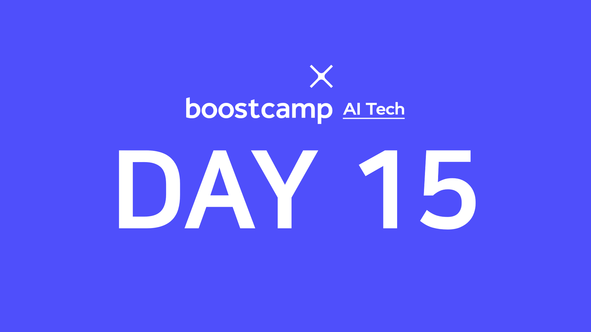

> 🙌은 **QnA에 있는 질문-답변**을 통해 얻은 지식을 표시합니다.

## [👉 피어 세션](https://github.com/boostcamp-ai-tech-4/peer-session/issues/60)

### 질문

- [[후미] (트랜스포머) 멀티헤드에서 사용되는 Wo, 디코더에 들어가는 인풋](https://github.com/boostcamp-ai-tech-4/peer-session/issues/59)
- [[히스] generative model 에서 generator 로 실제 아웃풋 생성](https://github.com/boostcamp-ai-tech-4/peer-session/issues/58)

### 기록

- 오늘 강의는 짧지만, 내용이 너무 어려웠다. 생성기(Generator)는 GAN이 뭔지 찾아보면서 간단히 본 터라 이를 수식으로 보니 머리가 너무 아팠다. 다행히 집에 [미술관에 GAN 딥러닝 실전 프로젝트](http://www.yes24.com/Product/Goods/81538614?OzSrank=1)을 미리 사둬서 이걸 읽으면서 추가 공부를 해야겠다.
- 어제 말한 닮은꼴 연예인 분류기 프로젝트에 관한 이야기를 나눴다. 닮은꼴 연예인으로 조유리즈(조유리, 최예나, 김채원)을 선정했고 다음 주에 데이터셋을 만들기로 했다. 모델은 아마 각자 만들 듯하다.

## Table of Contents

- [Generative Model](#generative-model)
- [Autoregressive Model](#autoregressive-model)
- [Latent Variable Model](#latent-variable-model)
- [Generative Adversarial Network](#generative-adversarial-network)
- [References](#references)

## Generative Model

## Autoregressive Model

## Latent Variable Model

## Generative Adversarial Network

<iframe width="560" height="315" src="https://www.youtube.com/embed/AVvlDmhHgC4" frameborder="0" allow="accelerometer; autoplay; clipboard-write; encrypted-media; gyroscope; picture-in-picture" allowfullscreen></iframe>

## References
