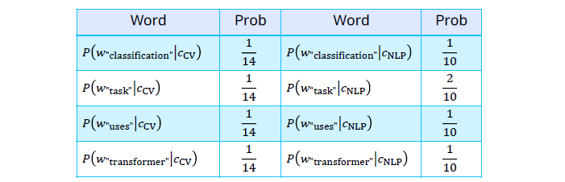
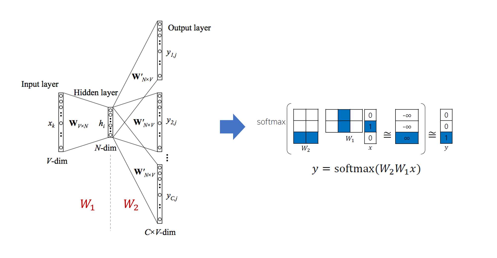
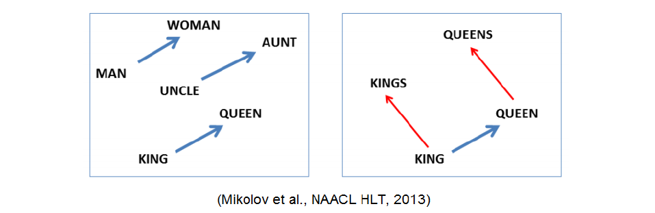

> 🙌은 **QnA에 있는 질문-답변**을 통해 얻은 지식을 표시합니다.

## [👉 피어 세션](https://github.com/boostcamp-ai-tech-4/peer-session/issues/64)

### 질문

- [[펭귄] Distributional Hypothesis의 의미](https://github.com/boostcamp-ai-tech-4/peer-session/issues/62)
- [[히스] GloVe 와 Word2Vec 의 차이가 무엇인가요?](https://github.com/boostcamp-ai-tech-4/peer-session/issues/61)
- [[MJ] 똑같은 단어가 있으면 Word2vec이 어떻게 동작하는지?](https://github.com/boostcamp-ai-tech-4/peer-session/issues/63)

### 기록

- 오늘은 자연어처리 수업 첫 날이었다! 문자열을 모델이 인식할 수 있는 벡터로 바꾸는 법을 배웠다. 본격적인 모델 내용이 안 나와서 그런지 나름 들을만 했다.
- 오늘 피어세션의 **🔥Hot Issue**는 Word2Vec의 CBOW와 SkipGram이었다. 강의에서 설명은 없고 실습 코드 때 잠깐 본거라 이해가 잘 안 됐다. 그러다 [이 사이트](http://jalammar.github.io/illustrated-word2vec/)를 찾았는데 저번 Transformer 때도 큰 도움이 된 사이트였다. SkipGram 방식을 시각화해놨는데 정말 이해가 잘 됐다.
- 오늘은 [서폿](https://github.com/keepRainy)님의 심리학의 잘못됨(?)을 깨주는 강의를 들었다. 저번에 서폿님이 말씀하신 거에 연장선인데 꽤 흥미롭게 들었다. 모든 정보든 한 번씩 의심을 해봐야겠다.

## Table of Contents

- [Intro to NLP](#intro-to-nlp)
- [Bags of Words](#bags-of-words)
- [Word Embedding](#word-embedding)
- [References](#references)

## Intro to NLP

NLP(Natural Language Processing)은 **자연어를 이해하는 것(NLU)**과 **자연어를 생성하는 것(NLG)**을 목표로 하는 자연어 처리 분야이다.

### NLP 응용 분야

#### NLP

유명한 컨퍼런스로 ACL, EMNLP, NAACL이 있고 최신 딥러닝 기술을 바탕으로 연구가 진행되고 있다.

- `Low-Level Parsing`
  - **Tokenization**: 문장을 의미가 있는 최소 단위의 토큰으로 쪼갠다.
  - **Stemming**: 단어의 어근을 찾는다.
- `Word and Phrase Level`
  - **Named Entity Recognition(NER)**: 단일 단어로 이루어진 고유명사 파악하는 것
  - **POS Tagging**: 문장 내의 단어의 품사를 식별한다.
- `Sentence Level`
  - **Sentiment Analysis**: 문장의 긍정/부정을 판별한다.
  - **Machine Translation**: 문장을 다른 언어로 번역한다.
- `Multi-sentence and Paragraph Level`
  - **Entailment Prediction**: 두 문장 간의 논리적 모순을 판단한다.
  - **Question Answering**: 자연어로 작성된 질문의 응답을 만들어낸다.
  - **Dialogue System**: 챗봇과 같이 컴퓨터와 대화를 할 수 있는 시스템
  - **Summarization**: 문단 혹은 문서를 한 줄로 요약한다.

#### Text Mining

빅데이터 분석 쪽에 가까우며, 유명 컨퍼런스로는 KDD, The WebConf(이전 WWW), WSDM, CIKM, ICWSM이 있다.

- 문서에서 유용한 정보나 인사이트를 추출한다. 예를 들면, 페이스북 데이터를 바탕으로 트렌드 분석하는 것이 있다.
- 비슷한 키워드로 문서를 클러스터링 한다. 예를 들면, 기사를 토픽으로 묶는 것이 있다.
- 사회과학과 밀접한 관련이 있다.

#### Information Retrieval

정보 검색 분야로 유명 컨퍼런스로는 SIFIR, WSDM, CIKM, RecSys가 있다.

- 추천키워드와 같이 추천시스템 분야 쪽으로 발전하고 있다.

### NLP 트랜드

- 단어를 벡터로 표현하는 기술인 **Word2Vec, GloVe**를 사용한다.
- NLP 주요 모델 설계로 RNN 기반의 **LSTM**과 **GRU**를 사용한다.
- RNN을 Attention 모듈로 대체한 **Transformer 모델**로 NLP 성능이 많이 향상되었다. 특히, 기계번역 쪽의 성능이 많이 좋아졌다.
- 원래는 NLP Task 별로 개별화된 모델이 필요했으나 Transformer 이후로 Self-supervised 학습이 가능한 **일반화된 모델**(ex. GPT, BERT)이 나왔다.
  - 하지만 GPU성능이 좋아야하고 많은 양의 데이터셋이 필요하는 등 필요한 리소스의 양이 매우 커져 그런 리소스를 다룰 수 있는 큰 회사들이 이런 모델을 설계하는 추세.

## Bags of Words

### 단어 인코딩 과정

다음과 같은 문장 데이터가 있다고 하자.

```
"John really really loves this movie"
"Jane really likes this song"
```

#### 1단계. 중복 단어를 제거 후 사전(Vocabulary) 생성

데이터로 들어온 모든 문장을 단어 단위로 쪼개고 **중복 단어를 제거**하여 다음과 같이 `사전(Vocabulary)`를 만든다.

```
{"John", "really", "loves", "this", "movies", "Jane", "likes", "song"}
```

#### 2단계. 사전을 원-핫 인코딩

사전의 각 단어를 `원-핫 벡터(One-hot Vector)`로 변환한다. 이 때의 차원은 사전의 단어 개수이다.

```
John: [1, 0, 0, 0, 0, 0, 0, 0]
really: [0, 1, 0, 0, 0, 0, 0, 0]
loves: [0, 0, 1, 0, 0, 0, 0, 0]
this: [0, 0, 0, 1, 0, 0, 0, 0]
...
```

- 이 때, 모든 단어 사이의 유클리드 거리(Euculidean Distance)는 $\sqrt{2}$이고, 코사인 유사도(cosine similarity)는 0이다.
- 즉, 각 단어의 의미와 상관없이 <u>동일한 연관성</u>을 가지고 있다는 단점이 있다.

#### 3단계. 원-핫 벡터로 각 문장을 표현

각 단어에 해당하는 인덱스에 있는 숫자는 **각 단어의 빈도수**가 된다.

```
"John really really loves this movie" → [1, 2, 1, 1, 1, 0, 0, 0]
"Jane really likes this song" → [0, 1, 0, 1, 0, 1, 1, 1]
```

### Naive-Bayes로 분류를 해보자!

#### Naive-Bayes 모델

Naive-Bayes 분류기는 다음 공식을 통해 문서 $d$의 클래스 $c$로 분류한다. 우리는 문서 $d$의 각 클래스 $c$일 조건부 확률을 구해 **그 중 가장 높은 확률을 가진 $c$**를 해당 문서의 클래스로 분류한다!

$$
c_{MAP} = \underset{c \in C}{argmax} P(c|d)
$$

이 식을 베이즈 정리로 다음과 같이 나타낼 수 있다.

$$
c_{MAP} = \underset{c \in C}{argmax} \frac{P(d|c) P(c)}{P(d)}
$$

이 때, 여기서 $d$는 고정된 값이므로 $P(d)$는 상수 취급을 할 수 있다. 그러므로 $P(d)$를 제거하여 다음과 같이 식을 정리할 수 있다.

$$
c_{MAP} = \underset{c \in C}{argmax} P(d|c) P(c)
$$

그럼 $P(d|c) P(c)$는 어떻게 구할까? 각 단어가 서로 독립적이라고 가정하고 **클래스 $c$일 때 단어가 등장할 결합확률분포**를 구하면 된다. 이 때, 서로 독립이라고 했으므로 결합확률분포는 클래스 $c$일 때의 각 단어의 확률분포의 곱으로 나타낼 수 있다.

$$
P(d|c)P(c) = P(w_1, w_2, ... , w_n | c) P(c) \rightarrow P(c) \prod_{w_j \in W} P(w_i|c)
$$

#### 사례: CV와 NLP 논문 분류


다음과 같은 논문 제목 데이터 4개가 있고, 클래스는 `CV`, `NLP` 2개가 있다고 하자. 이 때 테스트 데이터인 5번째 논문 제목은 무엇으로 분류될까?

위의 식을 그대로 가져와 계산하면 된다. 우선 각 클래스의 확률을 구하면 다음과 같다.

$$
P(c_{CV}) = \frac{2}{4} = \frac{1}{2}, \qquad P(c_{NLP}) = \frac{2}{4} = \frac{1}{2}
$$

이제 각 단어 $w_i$에 대해 각 클래스별 $w_i$가 나타날 조건부 확률을 구해준다. 이 때 각 확률은 각 클래스에 있는 해당 단어의 빈도수를 전체 단어의 개수에 나눈 것이다.



이를 바탕으로 5번째 논문제목이 각 클래스에 속한 조건부 확률을 구하면 다음곽 같다. $P(c_{NLP}) | d_5)$의 확률이 더 높으므로 해당 데이터는 `NLP`로 분류된다.

$$
P(c_{CV} | d_5) = P(c_{CV}) \prod_{w\in W} P(w|c_{CV}) \approx 0.000013
$$

$$
P(c_{NLP} | d_5) = P(c_{NLP}) \prod_{w\in W} P(w|c_{NLP}) \approx 0.0001
$$

<div class="quote-block">
<div class="quote-block__emoji">💡</div>
<div class="quote-block__content" markdown=1>

Bags-of-Word의 단점과 Laplace Smoothing

Bags-of-Word의 단점은 해당 클래스에 관련 단어가 하나라도 없으면 확률이 0이 된다는 것이다. 그렇게 되면 아무리 연관성 높은 확률이 곱해져도 0이 되버린다. 그래서 확률이 극단적으로 가지 않게 적당히 작은 값을 단어를 카운트할 때 더해준다. 이 방법은 **Laplace Smoothing**기법이라고 한다.

</div>
</div>

## Word Embedding

단어를 벡터로 표현하는 방법이다. 이렇게 표현할 경우 **두 단어간의 유사도**를 측정할 수 있다.

- `cat`과 `kitty`는 비슷한 벡터 표현을 가지므로 두 벡터간의 거리는 가깝다.
- `hamburger`와 `cat`은 다른 벡터 표현은 가지므로 두 벡터간의 거리는 멀다.

Word Embedding도 하나의 신경망이며 단어를 최적화된 벡터로 표현할 수 있도록 학습된다. 그렇게 학습된 모델에 단어를 입력으로 넣으면 단어를 표현한 벡터가 출력된다.

### Word2Vec

Word Embedding 방식 중 하나이다. Word2Vec은 **인접한 단어일수록 비슷한 의미를 가진다**고 가정하고 이를 바탕으로 주변 단어로 의미를 추론한다!

예를 들어, "고양이는 \_\_\_를 잡는다"라는 문장이 있다고 하자. Word2Vec은 주변 단어인 "고양이는"과 "잡는다"로 빈칸에 들어갈 단어를 찾는 것이다. 빈칸에 들어갈 단어로는 "쥐"가 들어갈 수도 있고 "나비"가 될 수도 있다.

#### Word2Vec의 구조


<small class="src" markdown=1>

출처: [Distributed Representations of Words and Phrases and their Compositionality](https://arxiv.org/pdf/1310.4546.pdf)

</small>

- 단어를 어떤 차원으로 매핑하고 싶은지를 결정하는 **Hidden Layer의 차원 $N$**을 결정한다.
- $V$차원의 원-핫 벡터로 표현된 단어 $x$를 첫 번째 가중치행렬 $W_{V \times N}$에 통과시켜 $N$ 차원으로 매핑한다.
- $h_{dim}$차원의 벡터를 $W'_{N \times V}$ 행렬을 통과시켜 나온 결과를 softmax함수에 통과시켜 확률값 $o$을 얻는다.
- $x$의 쌍인 $y$의 원-핫 벡터를 하나의 확률로 보고 출력인 $o$와의 차이를 줄이는 방향으로 가중치 행렬 $W, W'$을 학습시킨다.

#### Word2Vec의 특징

$N$ 공간 상의 벡터는 **단어들 간의 관계**를 잘 표현한다. 아래 그림에는 의미는 같지만 성별이 다른 3개의 단어쌍이 있다. 여기서 파란색 벡터는 $v(woman) - v(man)$, $v(aunt) - v(uncle)$, $v(queen) - v(king)$을 표현한 것이며 이 때 3개의 벡터의 크기와 방향이 비슷한 것을 볼 수 있다.


<small class="src" markdown=1>

출처: [Linguistic Regularities in Continuous Space Word Representations](https://www.aclweb.org/anthology/N13-1090.pdf)

</small>

#### Word2Vec의 구현방식: CBOW vs Skipgram

Word2Vec은 슬라이딩 윈도우 방식으로 `(input, output)` 단어쌍을 뽑아 학습시킨다. 이 때 <u>어떤 방식으로 단어쌍을 만드냐</u>에 따라 **CBOW**와 **Skipgram** 방식으로 나뉜다.

설명을 위해 다음과 같은 문장이 있고 윈도우의 크기는 2라고 하자. 이 때의 주변 단어는 "by", "a", "bus", "in"이 되고, 중심단어는 "red"가 된다.


<small class="src" markdown=1>

출처: [The Illustrated Word2vec](http://jalammar.github.io/illustrated-word2vec/)

</small>

- **CBOW**: 주변 단어를 가지고 중심 단어를 예측한다.

  - 단어쌍 `(by, red)`, `(a, red)`, `(bus, red)`, `(in, red)`가 생성된다.

- **Skipgram**: 중심 단어를 가지고 주변 단어를 예측한다.

  - 단어쌍 `(red, by)`, `(red, a)`, `(red, bus)`, `(red, in)`이 생성된다.

### GloVe

GloVe는 윈도우 슬라이딩 방법으로 동시 등장 행렬(co-occurence matrix)를 계산하여 두 단어의 동시등장확률을 구하여 다음과 같은 손실함수를 계산한다. 이 때 **임베딩된 두 단어의 내적이 전체 말뭉치에서의 동시 등장 확률이 되도록** 하여 손실함수값을 최소화한다.

$$
J(\theta) = \frac{1}{2} \sum_{i, j =1}^W f(P_{ij})(u_i^Tv_j - \log P_{ij})^2
$$

- $u_j$: 입력 단어 $i$의 임베딩 벡터
- $v_j$: 출력 단어 $j$의 임베딩 벡터
- $P_ij$: 윈도우 내에서 단어 $i$가 있을 때 $j$가 있을 확률 (= 동시등장확률)

## References

- [NLU/NLP/NLG에 대한 간단한 개념 - 쟈누이](https://snepbnt.tistory.com/5)
- [PyTorch로 시작하는 딥러닝 입문](https://wikidocs.net/book/2788)
- [빈도수 세기의 놀라운 마법 Word2Vec, Glove, Fasttext - ratsgo](https://ratsgo.github.io/from%20frequency%20to%20semantics/2017/03/11/embedding/)
- [The Illustrated Word2vec - Jay Alammar](http://jalammar.github.io/illustrated-word2vec/)
