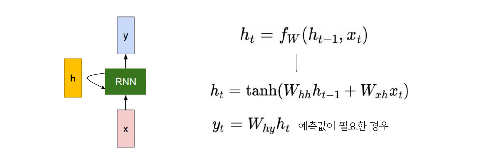
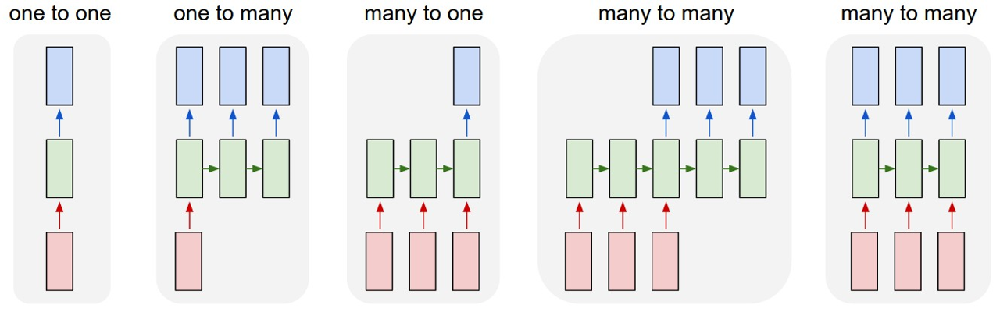
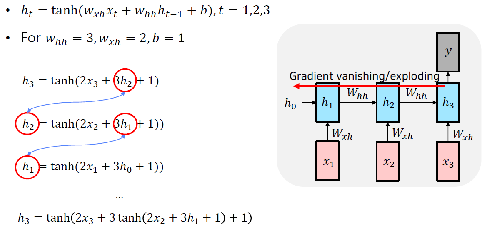
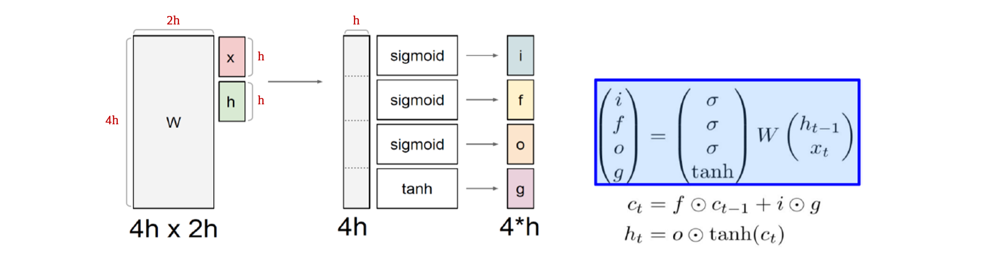

> 🙌은 **QnA에 있는 질문-답변**을 통해 얻은 지식을 표시합니다.

## [👉 피어 세션](https://github.com/boostcamp-ai-tech-4/peer-session/issues/64)

### 질문

- [[히스] LSTM과 GRU 는 백프로파게이션을 셀 스테이트에 대해서만 하나요?](https://github.com/boostcamp-ai-tech-4/peer-session/issues/66)
- [[히스] Word2Vector 의 목적](https://github.com/boostcamp-ai-tech-4/peer-session/issues/65)
- [[펭귄] 양방향 RNN/LSTM은 어떤 식으로 학습을 하나요?](https://github.com/boostcamp-ai-tech-4/peer-session/issues/67)
- [[펭귄] (FQ) RNN/LSTM/GRU과 BPTT](https://github.com/boostcamp-ai-tech-4/peer-session/issues/68)
- [[펭귄] (FQ) Word2Vec과 GloVe의 단점](https://github.com/boostcamp-ai-tech-4/peer-session/issues/69)

### 기록

- 오늘은 **저번 RNN, LSTM/GRU의 복습 시간같은 강의**였다. 공부는 하긴했어도 살짝 헷갈리는 부분이 있었는데 그런 부분을 마스터님께서 예시를 들어서 잘 설명해주셔서 이해할 수 있었다. 특히 Vanishing Gradient 문제는 완전히 이해했다!
- 피어세션에서는 내일 있을 마스터님께 드릴 질문을 정하고 강의에서 궁금했던 점을 물어보는 시간을 가졌다. 그 중 [Teacher Forcing](https://machinelearningmastery.com/teacher-forcing-for-recurrent-neural-networks/)에 관련된 질문이 나왔는데 팀원들끼리 이야기하는 것을 듣다보니 나도 이해못한 부분이 이해가 되서 그것을 말했더니 "설명을 깔끔하게 했다"고 칭찬을 받았다😊

## Table of Contents

> ✍ [DAY 14. Recurrent Neural Network](../day14-20210204)에 있는 내용 외의 것만 정리합니다!

- [RNN](#rnn)
- [LSTM과 GRU](#lstm과-gru)
- [References](#references)

## RNN

[👀 DAY 14의 RNN 내용 보러가기](../day14-20210204/#rnn-recurrent-neural-network)

### Hidden State

<small class="src" markdown=1>

출처: [CS231n Lecture 10. Recurrent Neural Network](http://cs231n.stanford.edu/slides/2017/cs231n_2017_lecture10.pdf)

</small>

- hidden state인 $h_t$는 현재의 입력 $x_t$와 이전 time의 hidden state $h_{t-1}$의 선형 결합을 통해 만들 수 있다.
  - 이 때, $x_t \rightarrow h_t$로 바꿔주는 가중치 행렬을 $W_{xh}$, $\; h_{t-1} \rightarrow h_t$로 바꿔주는 가중치 행렬을 $W_{hh}$라고 한다.
  - 각 행렬과의 연산 결과를 concat하면 $h_t$가 된다.
- 만약 $y$를 출력해야 한다면, 비활성화 함수 `tanh`를 통과시키고 출력값으로 바꿔주는 가중치 행렬 $W_{hy}$를 통과시켜 계산한다.

💡

hidden state의 역할이 무엇인가요?

hidden state는 **이전 time step의 정보를 기억하는 역할**을 한다. 예를 들면, C언어 코드를 생성하는 RNN 모델이 있다고 하자. 여기서 hidden state의 한 노드는 중괄호 `{}`가 열렸는지 혹은 닫혔는지를 기억한다. 자세한 내용은 [여기](http://karpathy.github.io/2015/05/21/rnn-effectiveness/)에서 hidden state를 visualizing한 부분을 참고!

### RNN의 종류

<small class="src" markdown=1>

출처: [The Unreasonable Effectiveness of Recurrent Neural Networks](http://karpathy.github.io/2015/05/21/rnn-effectiveness/)

</small>

- **one-to-one**: 입출력에 time step이 없는 일반적인 모델이다.
- **one-to-many**: 1개의 입력을 받아 여러 time step의 출력을 내보내는 모델이다. 두 번째 time step부터는 입력 크기와 동일한 영벡터가 입력으로 들어간다.
  - `ex` 이미지 캡셔닝
- **many-to-one**: time step이 있는 입력을 넣어 1개의 출력을 내보내는 모델이다. 마지막 hidden state에 가중치 행렬을 통과시켜 최종 출력값을 계산한다.
  - `ex` 감정 분석
- **many-to-many**: 입출력이 모두 시퀀스인 모델로 입력 시퀀스를 모두 넣은 다음 순차적으로 출력 시퀀스를 내보낸다.
  - `ex` 기계번역
- **many-to-many**: 입력이 주어질 때마다 출력을 하는 delay가 없는 모델이다.
  - `ex` PoS 태깅, 영상 프레임 분류

### Vanishing/Exploding Gradient 문제

RNN은 순환구조로 <u>전 time step의 hidden state를 다시 모델의 입력으로 넣어 새로운 hidden state를 만드는 구조</u>이다. 이를 명심하고 다음과 같이 3번의 입력을 받는 단순한 RNN 모델이 있다고 해보자.

---

---

BPTT로 기울기 $\frac{\partial{L}}{\partial h_1}$을 구한다고 할 때, $\frac{\partial{L}}{\partial h_1} = \frac{\partial{L}}{\partial h_3} \cdot \frac{\partial{h_3}}{\partial h_1}$으로 나타낼 수 있다. 이 때 $\frac{\partial{h_3}}{\partial h_1}$을 구하면 다음과 같다.

$$
\frac{\partial{h_3}}{\partial h_1} = tanh'(X) \cdot 3tanh'(Y) \cdot 3
$$

<small markdown=1>

$$
(X = 2x_3+3tanh(Y)+1, \quad Y = 2x_2+3h_1+1)
$$

</small>

위의 식을 보면 기울기 $W_{hh}$인 3이 두 번 곱해진 것을 볼 수 있다. 만약 시퀀스의 길이가 3개가 아닌 100개, 1000개 였다면 $W_{hh}$가 100번, 1000번 누적이 될 것이다.

이 때문에 $W_{hh}$의 값이 1보다 크면 `Exploding Gradient`문제가, 1보다 작으면 `Vanishing Gradient`문제가 발생한다.

## LSTM과 GRU

[👀 DAY 14의 LSTM/GRU 내용 보러가기](../day14-20210204/#lstm-long-short-term-memory)

### 행렬로 보는 LSTM

앞서 봤던 Input Gate, Forget Gate, Output Gate를 다음과 같이 $W$와의 선형결합과 비활성함수로 구할 수 있다.

- $i$: Input Gate로, $g$에서 필요있는 정보를 필터링하는 역할을 한다.
- $f$: Forget Gate로, $c_{t-1}$에서 필요없는 정보를 걸러내는 역할을 한다.
- $o$: Output Gate로, $c_t$에서 얼마만큼을 출력으로 내보낼 건지 결정한다.
- $g$: Gate Gate로, 입력으로 들어온 $x_t$와 $h_{t-1}$로 만든 cell state 후보군을 말한다.

### 어떻게 Vanishing/Exploding Gradient 문제를 해결할까?

LSTM을 생각해보자. LSTM의 cell state에 대한 계산식은 다음과 같다.

$$
C_t = f_t * C_{t-1} + i_t *  \widetilde{C}_t
$$

이 때, $C_T$를 $C_t$에 대해 미분하면 다음과 같다. $(T > t)$

$$
\frac{\partial C_T}{\partial C_t} = \frac{\partial C_T}{\partial C_{T-1}}  \frac{\partial C_{T-1}}{\partial C_{T-2}}  \cdots  \frac{\partial C_{t+1}}{\partial C_t}
$$

$\frac{\partial C_T}{\partial C_{T-1}} = f_T, ... , \frac{\partial C_{t+1}}{\partial C_t} = f_{t+1}$이므로, 위의 식은 다음과 같이 정리할 수 있다.

$$
\frac{\partial C_T}{\partial C_t} = \prod_{i=t+1}^T f_i
$$

앞서 보았던 $W_{hh}$와 tanh의 곱으로 표현된 RNN의 미분식과 달리 오직 시그모이드 함수의 결과값인 $f_i$의 곱으로만 이루어지므로 RNN보다는 Vanishing/Exploding Gradient 문제가 어느 정도 해결된다. GRU도 LSTM과 비슷한 이유로 해당 문제가 해결된다.

💡

LSTM/GRU는 궁극적으로 Vanishing/Exploding Gradient 문제를 해결했을까?

당연히 아니다! 위의 식으로만 봐도 시그모이드에 의해 기울기는 조금씩 소실될 것이다. 다만, RNN과 달리 가중치 $W$가 곱해지지 않기 때문에 문제가 늦게 올 뿐이다.

[여기](https://imgur.com/gallery/vaNahKE)를 보면 LSTM도 오래된 과거 step까지 거슬로 올라갔을 때 기울기가 소실되는 것을 볼 수 있다.

## References

- [LSTM가 gradient vanishing에 강한이유? - Hello Blog!](https://curt-park.github.io/2017-04-03/why-is-lstm-strong-on-gradient-vanishing/)
- [How does LSTM prevent the vanishing gradient problem? - StackExchange](https://stats.stackexchange.com/questions/185639/how-does-lstm-prevent-the-vanishing-gradient-problem)
