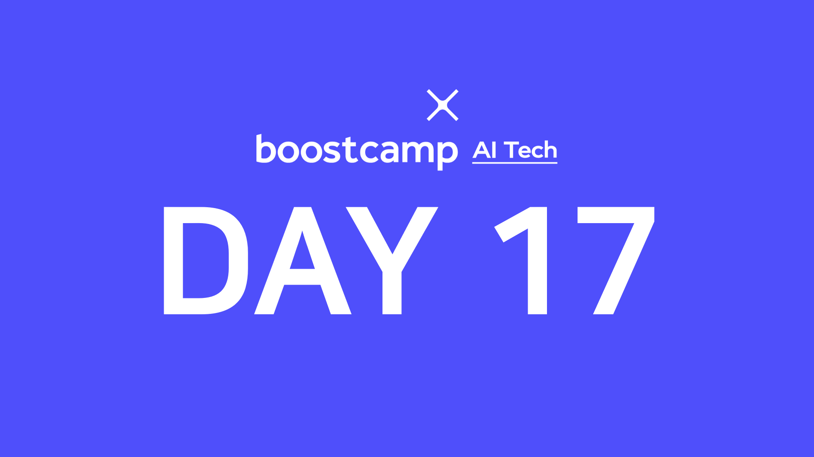

> 🙌은 **QnA에 있는 질문-답변**을 통해 얻은 지식을 표시합니다.

## [👉 피어 세션](https://github.com/boostcamp-ai-tech-4/peer-session/issues/64)

### 질문

- [[펭귄] Distributional Hypothesis의 의미](https://github.com/boostcamp-ai-tech-4/peer-session/issues/62)
- [[히스] GloVe 와 Word2Vec 의 차이가 무엇인가요?](https://github.com/boostcamp-ai-tech-4/peer-session/issues/61)
- [[MJ] 똑같은 단어가 있으면 Word2vec이 어떻게 동작하는지?](https://github.com/boostcamp-ai-tech-4/peer-session/issues/63)

### 기록

- 오늘은 자연어처리 수업 첫 날이었다! 문자열을 모델이 인식할 수 있는 벡터로 바꾸는 법을 배웠다. 본격적인 모델 내용이 안 나와서 그런지 나름 들을만 했다.
- 오늘 피어세션의 **🔥Hot Issue**는 Word2Vec의 CBOW와 SkipGram이었다. 강의에서 설명은 없고 실습 코드 때 잠깐 본거라 이해가 잘 안 됐다. 그러다 [이 사이트](http://jalammar.github.io/illustrated-word2vec/)를 찾았는데 저번 Transformer 때도 큰 도움이 된 사이트였다. SkipGram 방식을 시각화해놨는데 정말 이해가 잘 됐다.
- 오늘은 [서폿](https://github.com/keepRainy)님의 심리학의 잘못됨(?)을 깨주는 강의를 들었다. 저번에 서폿님이 말씀하신 거에 연장선인데 꽤 흥미롭게 들었다. 모든 정보든 한 번씩 의심을 해봐야겠다.

## Table of Contents

## RNN

[👀 DAY 14의 RNN 내용 보러가기](../day14-20210204/#rnn-recurrent-neural-network)

## LSTM

[👀 DAY 14의 LSTM 내용 보러가기](../day14-20210204/#rnn-recurrent-neural-network)

## GRU

[👀 DAY 14의 GRU 내용 보러가기](../day14-20210204/#rnn-recurrent-neural-network)
