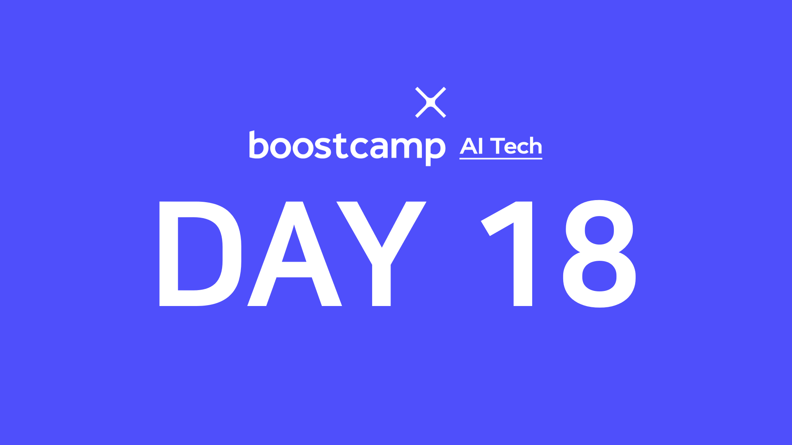

> 🙌은 **QnA에 있는 질문-답변**을 통해 얻은 지식을 표시합니다.

## [👉 피어 세션](https://github.com/boostcamp-ai-tech-4/peer-session/issues/72)

### 질문

- [[히스] Seq2seq with Attention 에서 Decoder 의 step 중 context vector 생성](https://github.com/boostcamp-ai-tech-4/peer-session/issues/71)

### 기록

- TED세미나 시간에 **"데이터분석 해볼까?"했던 이야기**라는 주제로 데이터분석 공부를 했던 일화들을 소개했다. 데이터분석과 데이터아이디어 부문의 차이와 개인적인 경험담 위주로 발표를 했고 다음에 기회가 된다면 데이터분석 스터디를 해보자는 이야기를 들었다. 빨리 트라우마가 극복되길..!

## Table of Contents
