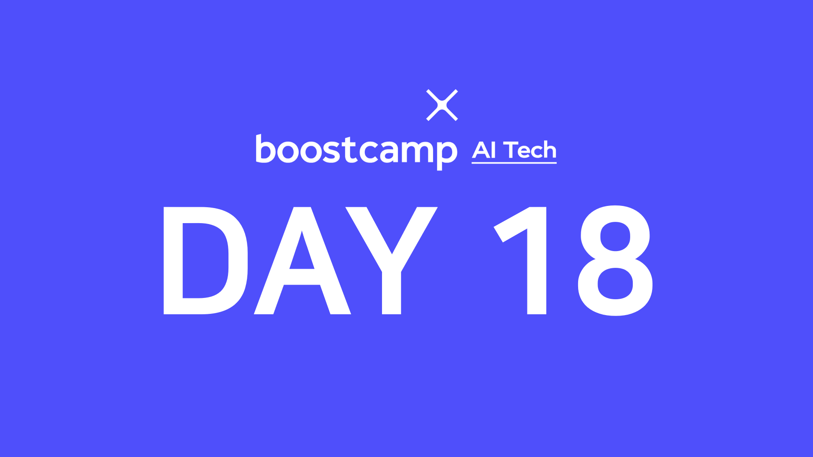

> 🙌은 **QnA에 있는 질문-답변**을 통해 얻은 지식을 표시합니다.

## [👉 피어 세션](https://github.com/boostcamp-ai-tech-4/peer-session/issues/72)

### 질문

- [[히스] Seq2seq with Attention 에서 Decoder 의 step 중 context vector 생성](https://github.com/boostcamp-ai-tech-4/peer-session/issues/71)

### 기록

## Table of Contents
