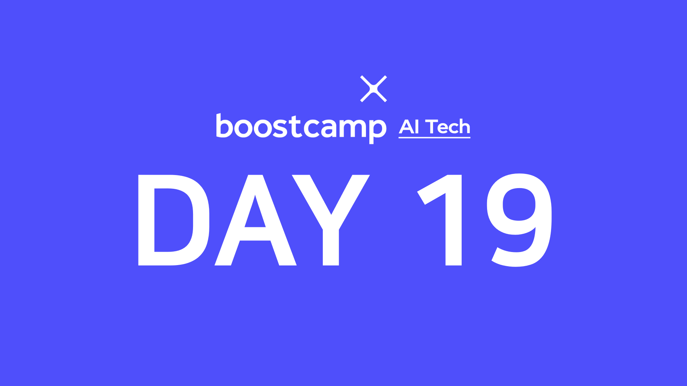

> 🙌은 **QnA에 있는 질문-답변**을 통해 얻은 지식을 표시합니다.

## [👉 피어 세션](https://github.com/boostcamp-ai-tech-4/peer-session/issues/77)

### 질문

- [[MJ] Transformer에서 Batch normalization 대신 layer normalization을 사용하는 이유](https://github.com/boostcamp-ai-tech-4/peer-session/issues/73)
- [[MJ] position encoding](https://github.com/boostcamp-ai-tech-4/peer-session/issues/74)
- [[원딜] (FQ) BLEU score의 단점](https://github.com/boostcamp-ai-tech-4/peer-session/issues/75)
- [[원딜] (FQ) Attention](https://github.com/boostcamp-ai-tech-4/peer-session/issues/76)

### 기록

- 다시 돌아온 Transformer! 다행히 저번에 [안경잡이 개발자님의 강의](https://www.youtube.com/watch?v=AA621UofTUA)를 들으며 미리 공부를 해놔서 크게 어렵지는 않았다. 만약 듣지 않았다면 이해하지 못했을 것 같다.
- 다만 이론과 실습과의 갭이 좀 있어서 힘들었다. 이번 실습과제는 [Byte Pair Encoding](https://ratsgo.github.io/nlpbook/docs/tokenization/bpe/)이었는데 정작 BPE관련 내용을 설명해주지 않아서 [딥러닝을 이용한 자연어 처리 입문](https://wikidocs.net/22592)을 참고해서 과제를 했다.

## Table of Contents
