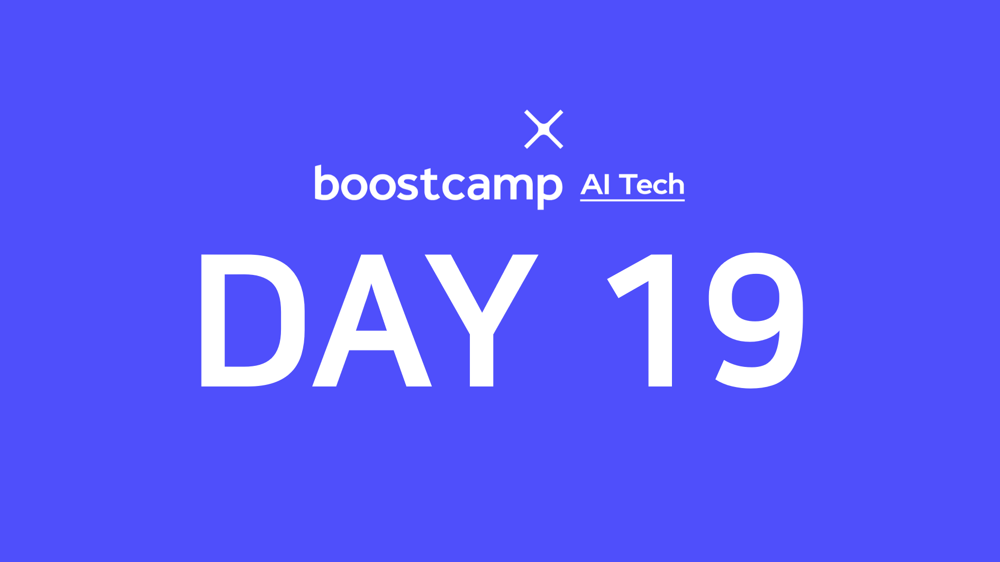

> 🙌은 **QnA에 있는 질문-답변**을 통해 얻은 지식을 표시합니다.

## [👉 피어 세션](https://github.com/boostcamp-ai-tech-4/peer-session/issues/77)

### 질문

- [[MJ] Transformer에서 Batch normalization 대신 layer normalization을 사용하는 이유](https://github.com/boostcamp-ai-tech-4/peer-session/issues/73)
- [[MJ] position encoding](https://github.com/boostcamp-ai-tech-4/peer-session/issues/74)
- [[원딜] (FQ) BLEU score의 단점](https://github.com/boostcamp-ai-tech-4/peer-session/issues/75)
- [[원딜] (FQ) Attention](https://github.com/boostcamp-ai-tech-4/peer-session/issues/76)

### 기록

## Table of Contents
