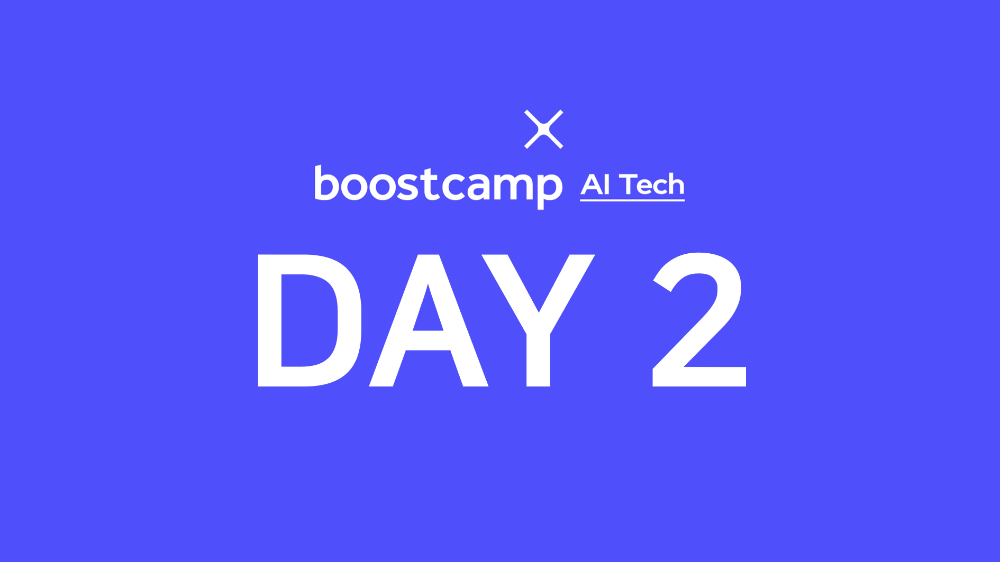

> 🙌은 **QnA에 있는 질문-답변**을 통해 얻은 지식을 표시합니다.

## [👉 피어 세션](https://github.com/boostcamp-ai-tech-4/peer-session/issues/6)

### 질문

- [[MJ] -5 ~ 256 사이의 숫자의 저장 방식](https://github.com/boostcamp-ai-tech-4/peer-session/issues/2)
- [[MJ] 리눅스를 많이 사용하는 이유](https://github.com/boostcamp-ai-tech-4/peer-session/issues/3)
- [[펭귄] global 키워드는 언제 사용하나요?](https://github.com/boostcamp-ai-tech-4/peer-session/issues/4)
- [[히스] mock 이 뭘까요?](https://github.com/boostcamp-ai-tech-4/peer-session/issues/7)
- [[히스] 파이썬 unittest 모듈](https://github.com/boostcamp-ai-tech-4/peer-session/issues/8)

### 기록

- 궁금한 부분에 대한 질문을 하고 Issue로 기록을 남겼다.
- 히스님이 질문하신 것을 보고 `unittest`와 `mock`의 사용법을 따로 공부했다. 이제 테스팅도 자주 해야지..

## 📝 내용 정리

- [파이썬의 변수](../../python/python-variables)
- [파이썬의 자료구조](../../python/python-data-structures)
