> 🙌은 **QnA에 있는 질문-답변**을 통해 얻은 지식을 표시합니다.

## [👉 피어 세션](https://github.com/boostcamp-ai-tech-4/peer-session/issues/84)

### 질문

- [[히스] 작은 세상 그래프의 지름과 전역 군집 계수](https://github.com/boostcamp-ai-tech-4/peer-session/issues/83)

### 기록

- **불닭볶음면 더 매운 맛🔥**이 저번 주였다면 이번 주의 시작은 **진라면 순한맛💧**정도여서 간만에 여유를 느낄 수 있었다. (근데 언제 매워질지 모른다..!) 이번 주 주제가 추천시스템인데 [NHN Forward](../../penguin/nhn-forward-2019/)에서 들은 한양대 교수님 특강 내용을 본격적으로 배울 수 있을 것 같아 기대된다.
- 저번 주 BERT와 관련된 질문들을 [히스](https://github.com/Heeseok-Jeong)님이 잘 대답해주셔서 큰 도움이 됐다. 역시 자연어처리 전문가👍!

## Table of Contents

- [그래프](#그래프)
- [그래프 기초 개념 이해하기](#그래프-기초-개념-이해하기)
- [실제 그래프와 랜덤 그래프](#실제-그래프와-랜덤-그래프)
- [파이썬으로 그래프 다루기](#파이썬으로-그래프-다루기)

## 그래프

### 그래프란?

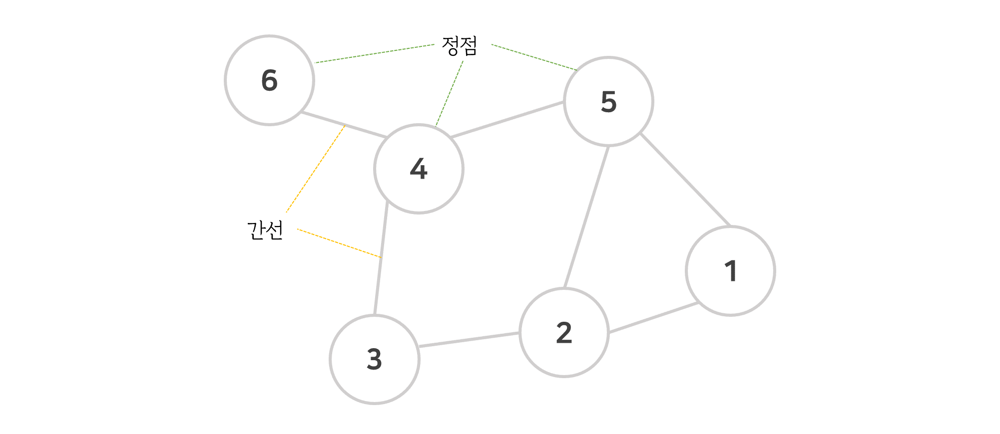

그래프(Graph)는 `정점 집합`과 `간선 집합`으로 이루어진 수학적 구조를 말한다.

- 하나의 간선(Edge)은 두 개의 정점(Vertex)을 연결한다.
- 모든 정점 쌍이 반드시 간선으로 직접 연결되는 것은 아니다.

### 그래프가 중요한 이유

우리 주변에는 많은 복잡계(Complex System)이 있다. 예를 들면, 사회는 70억 인구로 구성된 복잡계이며, 통신 시스템은 전자기기로 이루어진 복잡계이다. 이러한 복잡계에서는 **구성 요소 간의 복잡한 상호작용**이 이루어진다. 복잡계의 요소와 상호작용을 표현하기 위해 우리는 `그래프`를 사용한다.

### 관련 인공지능 문제

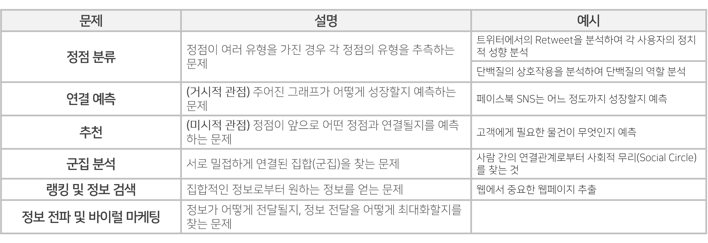

## 그래프 기초 개념 이해하기

### 그래프의 유형

#### 방향

- **방향이 없는 그래프(Undirected Graph)**: 간선에 방향이 없는 그래프 (같은 위치)
  - `ex` 협업 관계, 페이스북 친구
- **방향이 있는 그래프(Directed Graph)**: 간선에 방향이 있는 그래프 (다른 위치)
  - `ex` 논문 인용, 트위터 팔로우

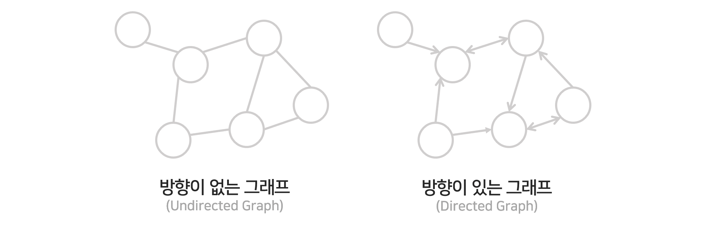

#### 가중치

- **가중치가 없는 그래프(Unweighted Graph)**: 간선에 가중치가 없는 그래프
  - `ex` 웹 그래프, 페이스북 친구
- **가중치가 있는 그래프(Weighted Graph)**: 간선에 가중치가 있는 그래프
  - `ex` 전화 그래프, 유사도 그래프

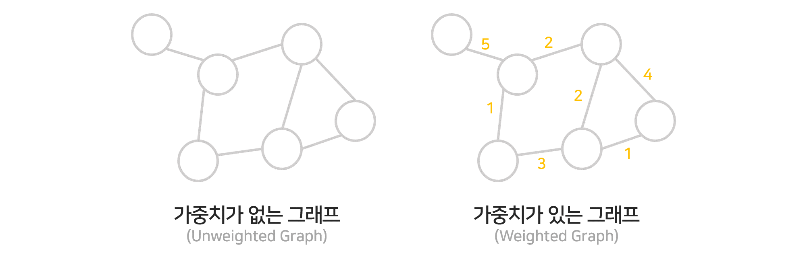

#### 정점의 종류

- **동종 그래프(Unpartite Graph)**: 한 종류의 정점을 가지는 그래프
  - `ex` 웹 그래프, 페이스북 친구
- **이종 그래프(Bipartite Graph)**: 두 종류의 정점을 가지는 그래프로 다른 종류의 정점 사이에만 간선이 열결된다.
  - `ex` 정자 상거래 구매내역(사용자, 상품), 영화 출연 그래프(배우, 영화)

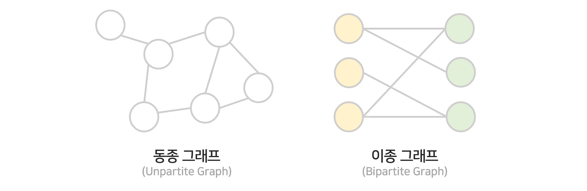

### 그래프의 수학적 표현

정점들의 집합을 $V$, 간선들의 집합을 $E$, 이 두 개로 이루어진 그래프를 $G = (V,E)$로 나타낸다.

#### 정점의 이웃(Neighbor)

정점의 이웃이란 **그 정점과 연결된 다른 정점** 의미한다.

- 정점 $v$의 이웃들의 집합을 $N(v)$ 혹은 $N_v$로 나타낸다.
  - `ex` 정점 3이 정점 4, 5와 연결되어 있으면 $N(3) = {4, 5}$로 나타낸다.
- 방향이 있는 그래프일 경우 정점 $v$에서 간선이 나가는 이웃을 $N_{out}(v)$로, 들어오는 이웃을 $N_{in}(v)$로 나타낸다.
  - `ex` 정점 3으로 들어오는 정점은 4, 5이고 나가는 정점이 1, 2라면 $N_{in}(3) = {4, 5}, N_{out}(3) = {1, 2}$로 나타낸다.

## 실제 그래프와 랜덤 그래프

실제 그래프(Real Graph)란 **다양한 복잡계로 부터 얻은 그래프**를 의미한다. 예를 들어, SNS, 전자상거래 구매 내역, 인터넷, 웹, 뇌, 단백질 상호박용, 지식 그래프 등이 있다.

랜덤 그래프(Random Graph)란 **확률적 과정을 통해 생성한 그래프**를 의미한다. 여기서는 에르되스와 레니가 제안한 `에르되스-레니 랜덤 그래프`를 사용한다. 랜덤 그래프 $G(n, p)$는 임의의 두 개의 정점 사이에 간선이 존재할 확률이 $p$이며, 정점 간의 연결은 서로 독립적이라고 가정한다.

<div class="quote-block-simple">
<div class="quote-block-simple__emoji">❓</div>
<div class="quote-block-simple__content" markdown=1>

$G(3, 0.3)$에 의해 생성될 수 있는 그래프와 각각의 확률은?

</div>
</div>

총 8개의 그래프가 생성될 수 있으며 각 그래프 별 생성 확률은 다음과 같다.


### 작은 세상 효과

#### 경로, 거리, 지름

|                       |                                                                                                                                                                                                        |
| :-------------------: | :----------------------------------------------------------------------------------------------------------------------------------------------------------------------------------------------------: |
|   **경로**<br/>Path   | 정점 $u$와 $v$ 사이의 경로는 다음의 조건을 만족하는 정점들의 순열(Sequence)을 말한다.<br/> `조건 1` $u$에서 시작해서 $v$에서 끝나야 한다.<br/> `조건 2` 순열에서 연속된 정점은 간선으로 연결되야 한다. |
| **거리**<br/>Distance |                                   정점 $u$와 $v$ 사이의 거리는 $u$와 $v$ 사이의 최단 경로의 길이를 말한다.<br/>이 때, 경로의 길이 = 해당 경로 상에 놓이는 간선의 수                                    |
| **지름**<br/>Diameter |                                                                                점정 간 최단경로 거리의 최댓값을 말한다.                                                                                |

<details markdown="1">

<summary><strong>👀 경로, 길이, 거리, 지름 예시</summary></strong>

이제 예시를 살펴보자.
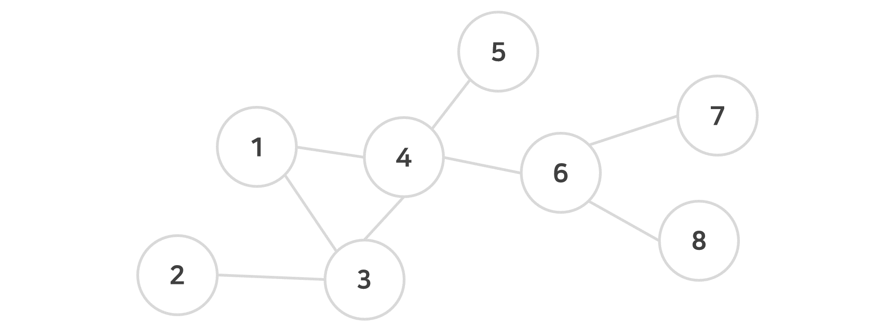

- **정점 1과 8사이의 경로는?**

  - `1-4-6-8`, `1-3-4-6-8`, `1-4-3-4-6-8`, ... 로 여러 개가 될 수 있다.

- **경로 `1-4-6-8`의 길이는?**

  - 1-4-6-8에 놓이는 간선의 수가 3이므로 경로의 길이는 3이다.

- **정점 1과 8 사이의 최단 경로는?**

  - 경로의 길이가 3으로 가장 짧은 `1-4-6-8`이다.

- **그래프에서의 지름은?**

  - 정점 2와 8 사이의 최단경로의 길이인 4이다.

</details>

#### 작은 세상 효과

<u>임의의 두 정점 사이의 거리가 작은 효과</u>를 `작은 세상 효과`라고 한다. 예를 들면, 스탠리 밀그램의 여섯 다리 분리 실험이 있다. 이 실험에서는 오마하와 위치타 주에서 보스턴까지 편지가 도착하려면 평균적으로 **6명의 지인**을 거치면 도착한다고 한다.

**하지만 모든 그래프에서 작은 세상 효과가 나타나는 것은 아니다.** 다음의 체인(Chain), 사이클(Cycle), 격자(Grid) 그래프의 경우 서로 거리가 먼 정점 쌍이 존재하며 그래프의 크기가 커질수록 거리가 더 멀어진다.

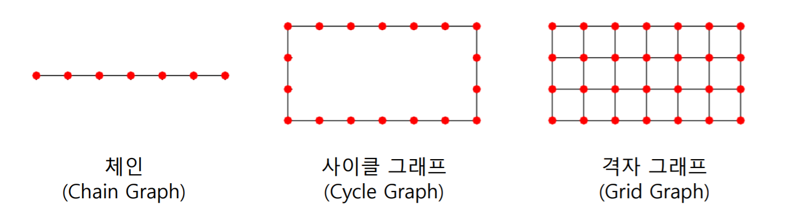

### 연결성의 두터운-꼬리 분포

#### 연결성

정점의 연결성(Degree)는 <u>그 정점과 연결된 간선의 수</u>를 의미한다. 이 때, 정점 $v$의 연결성은 **정점 $v$의 이웃들의 수**이다.

- 정점 $v$의 연결성은 $d(v), d_v, |N(v)|$로 나타낸다.
  - 정점 3이 정점 4, 5와 연결되어 있는 경우, $d(3) = 2$로 나타낼 수 있다.
- 방향성이 있는 정점일 경우 정점 $v$의 나가는 연결성은 $d_{out}(v), |N_{out}(v)|$로, 들어오는 연결성은 $d_{in}(v), |N_{in}(v)|$으로 나타낸다.
  - 정점 3으로 들어오는 정점이 1, 2이고 나가는 정점이 5인 경우, $d_{in}(3) = 2, d_{out}(3) = 1$로 나타낼 수 있다.

#### 두터운 꼬리

**실제 그래프**의 연결성 분포는 <u>두터운 꼬리(Heavy Tail)</u>을 갖는다. 🙌즉, 연결성이 매우 높은 소수의 `허브(Hub)` 정점이 존재함을 의미한다.

반면, **랜덤 그래프**의 연결성 분포는 높은 확률로 <u>정규 분포</u>와 유사하다. 이 경우 연결성이 매우 높은 허브 정점이 존재할 가능성이 0에 가깝다. 즉, 한 정점에 쏠리는 그런 경우는 거의 없다.

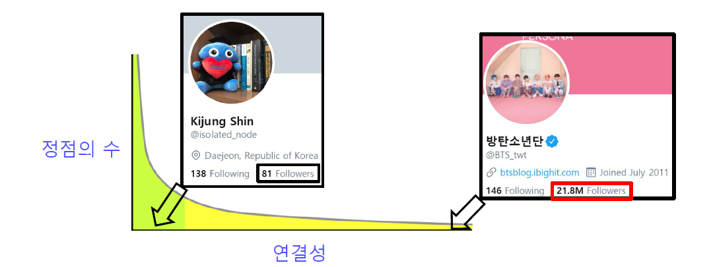

### 거대 연결 요소

#### 연결 요소

연결 요소(Connected Component)는 다음 조건을 만족하는 정점들의 집합을 말한다.

- `조건1` 연결 요소에 속하는 정점들은 경로로 연결될 수 있다.
- `조건2` 1의 조건을 만족하면서 정점을 추가할 수 없다.

<details markdown="1">
<summary><strong>👀 연결 요소 예시</strong></summary>

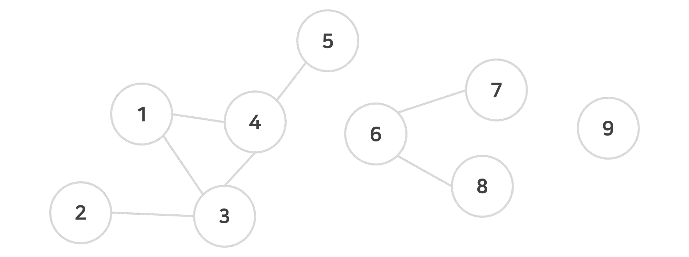

- 그래프에는 `{1, 2, 3, 4, 5}`, `{6, 7, 8}`, `{9}`의 3가지 연결 요소가 존재한다.
- `{1, 2, 3, 4}`는 정점 5를 추가해도 조건 1을 만족하므로 조건 2에 위배된다.
- `{6, 7, 8, 9}`는 9가 연결될 수 없으므로 조건 1에 위배된다.

</details>

#### 거대 연결 요소

실제 그래프에는 대부분의 정점과 연결된 정점인 **거대 연결 요소(Giant Connected Component)**가 존재한다. 그리고 이 거대 연결 요소는 대다수의 정점을 포함한다. 단, 정점들의 평균 연결성이 1보다 충분히 커야 한다. 즉, 적어도 모든 정점의 간선의 수가 1보다는 커야 한다. 자세한 이유는 [Random Graph Theory](https://en.wikipedia.org/wiki/Random_graph)를 참고!

### 군집 구조

#### 군집

군집(Community)은 다음을 만족하는 정점들의 집합을 말한다.

- 집합에 속하는 정점 사이에는 많은 간선이 존재한다.
- 집합에 속하는 정점과 그렇지 않은 정점 사이에는 적은 수의 간선이 존재한다.

#### 군집 계수

지역적 군집 계수(Local Clustering Coefficient) $c_i$는 **정점 $i$에서 군집의 형성 정도**를 말하며, <u>정점 $i$의 이웃 쌍 중 간선으로 직접 연결된 비율</u>로 계산된다.

- 지역적 군집 계수는 간선이 늘어날 때마다 증가한다.
- 단, 연결성이 0인 정점은 0으로 나눠지므로 지역적 군집 계수를 정의하지 않는다.

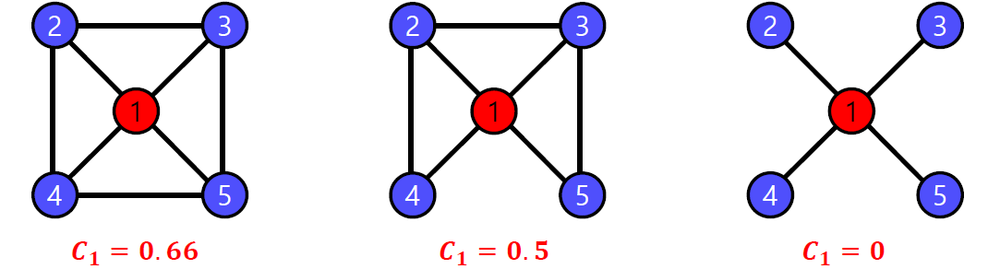

전역 군집 계수(Global Clustering Coefficient)는 **전체 그래프에서 군집의 형성 정도**를 말하며, <u>각 정점에서의 지역적 군집 계수의 평균</u>으로 계산된다. 이 때, 지역적 군집 계수가 정의되지 않는, 연결성이 0인 정점은 제외한다.

<div class="quote-block">
<div class="quote-block__emoji">🙌</div>
<div class="quote-block__content" markdown=1>

정점의 연결성이 1인 경우 지역적 군집계수의 정의는 어떻게 될까?

군집 계수는 이웃쌍을 고려해야 한다. 그러므로 보통 연결성이 2보다 작은 경우 군집계수 식의 분모가 0이 되므로 군집계수를 정의할 수 없다. 다만 사용자에 따라 군집계수로 0이나 NaN으로 취급하기도 한다.

</div>
</div>

#### 높은 군집 계수

**실제 그래프**는 많은 군집이 존재하므로 <u>군집 계수가 높다.</u> 실제 그래프는 다음과 같은 특성을 같는다.

- `동질성(Homophily)`: 서로 유사한 정점끼리 간선으로 연결될 가능성이 높다.
- `전이성(Transivity)`: 공통 이웃이 있는 경우, 공통 이웃이 매개 역할을 해줄 수 있다.

반면 **랜덤 그래프**는 전이성, 동질성의 성질이 없으므로 <u>군집 계수가 높지 않다.</u> 왜냐하면 랜덤 그래프는 간선 연결을 서로 독립적이라 가정하므로 공통 이웃의 존재 여부가 간선 연결 확률에 영향을 미치지 않기 때문이다.

### 균일 그래프 vs 작은 세상 그래프 vs 랜덤 그래프

- **균일 그래프(Regular Graph)**: 각 정점이 균일하게 4개의 정점과 연결되어 있으며, 그 연결은 어떤 패턴을 따른다.
- **작은 세상 그래프(Small-world Graph)**: 균일 그래프의 간선 일부를 임의로 선택한 간선으로 대체한 그래프로, 현실에 있는 그래프와 가장 비슷한 그래프이다.
- **랜덤 그래프(Random Graph)**: 간선이 존재할 확률 $p$에 따라 임의로 간선을 생성하여 만든 그래프

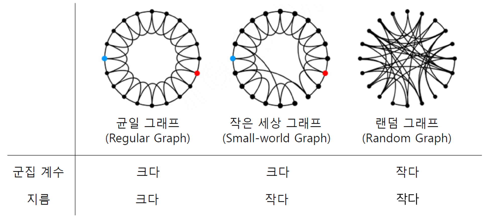

## 파이썬으로 그래프를 다루기

그래프를 다루는 대표적인 라이브러리로 [NetworkX](https://networkx.org/documentation/stable/index.html)가 있다. [NetworkX](https://networkx.org/documentation/stable/index.html)는 그래프 생성, 변경, 시각화가 가능하며 그래프의 구조 변화까지 살펴볼 수 있다.

### 그래프 표현 방식

#### 간선 리스트

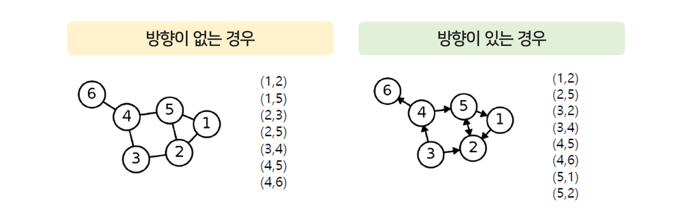

그래프의 간선들을 리스트로 저장하는 방식으로 간선이 연결된 두 정점의 쌍을 리스트에 저장한다.

- 방향성이 있는 경우 `(출발, 도착)` 순으로 저장된다.
- 간선 리스트는 매우 단순하지만 원하는 간선을 찾을 때마다 리스트를 순회해야한다는 단점이 있다.

#### 인접 리스트

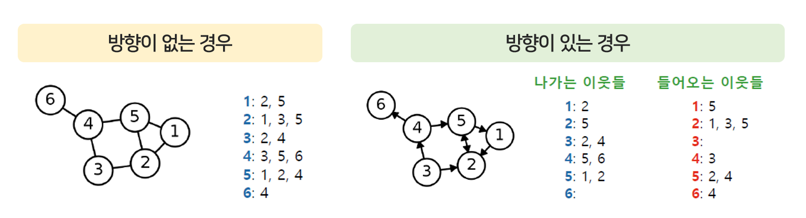

각 정점의 이웃들을 리스트에 저장한다.

- 예를 들어, 정점 1이 3, 4에 연결되어 있다면 `{1: [3, 4]}`로 저장된다.
- 방향성이 있는 경우 나가는 이웃을 저장하는 리스트와 들어오는 이웃을 저장하는 리스트 2개를 둔다.

#### 인접 행렬

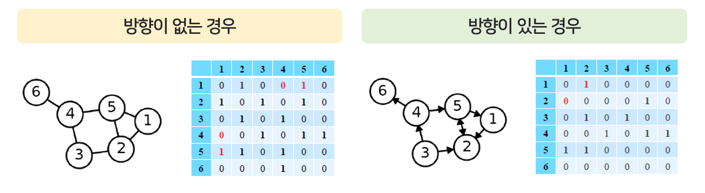

정점 수만큼의 행과 열을 가진 행렬 `arr[i][j]`를 생성하여 `i`와 `j`가 연결되어 있는 경우 1을, 아닌 경우 0을 할당한다.

- 방향성이 없는 경우 `i`와 `j`의 순서를 신경쓰지 않으므로 `arr[i][j]`와 `arr[j][i]`는 같은 값을 가진다(=대각행렬).
- 방향성이 있는 경우 `arr[i][j]`와 `arr[j][i]`는 완전히 다르다.

### NetworkX로 그래프 다루기

```python
import networkx as nx
import numpy as np
import matplotlib.pyplot as plt
```

- 그래프 초기화

```python
G = nx.Graph()          # 방향성이 없는 그래프 초기화
DiGraph = nx.DiGraph()  # 방향성이 있는 그래프 초기화
```

- 정점 추가/제거

```python
# 정점 추가
for i in range(1, 6):
  G.add_node(i)
print(G.number_of_nodes())  # 정점 수: 5
print(G.nodes)              # 정점 리스트: [1, 2, 3, 4, 5]
```

```python
# 정점 제거
G.remove_node(5)
print(G.number_of_nodes())  # 정점 수: 4
print(G.nodes)              # 정점 리스트: [1, 2, 3, 4]
```

- 간선 추가/제거

```python
# 간선 추가
for i in range(1, 5):
  G.add_edge(i, i+1)
print(G.edges)              # 간선 리스트: [(1, 2), (2, 3), (3, 4), (4, 5)]
```

```python
# 간선 제거
G.remove_edge(1, 2)
print(G.edges)              # 간선 리스트: [(2, 3), (3, 4), (4, 5)]
```

- 간선 리스트/인접 리스트/인접 행렬로 표현

```python
nx.to_edgelist(G)             # 간선 리스트
nx.to_dict_of_lists(G)        # 인접 리스트
nx.to_numpy_array(G)          # 인접 행렬 (일반 행렬)
nx.to_scipy_sparse_matrix(G)  # 인접 행렬 (회소 행렬)
```

<div class="quote-block-simple">
<div class="quote-block-simple__emoji">💡</div>
<div class="quote-block-simple__content" markdown=1>

희소행렬(Sparse Matrix)이란 **대부분의 값이 0인 행렬**을 말한다. 그래프를 희소 행렬인 인접 행렬로 변환하면 0이 아닌 원소만을 저장하므로 일반 행렬보다는 메모리를 절약할 수 있다.

</div>
</div>

- 그래프 시각화

```python
pos = nx.spring_layout(G)   # 정점 위치를 결정
im = nx.draw_networkx_nodes(G, pos, node_color="red", node_size=100)  # 정점의 색과 크기를 지정하여 출력
nx.draw_networkx_edges(G, pos)  # 간선 출력
nx.draw_networkx_labels(G, pos, font_size=10, font_color="black")     # 각 정점의 라벨을 출력
plt.show()
```

<details markdown="1">
<summary><strong>👀 시각화 결과 보기</strong></summary>

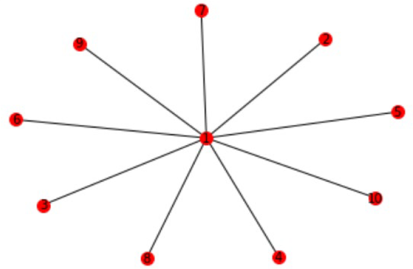

</details>
