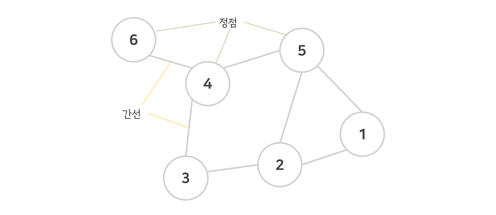
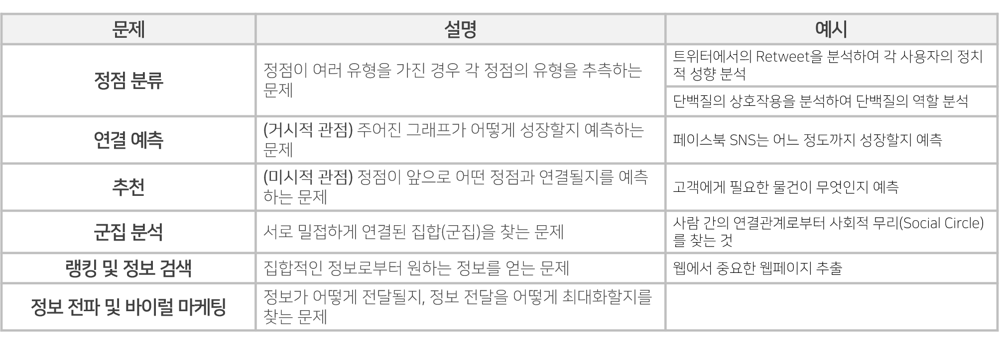
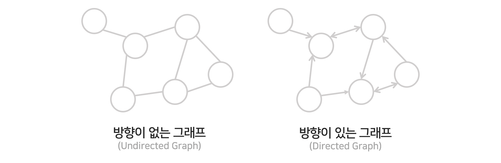
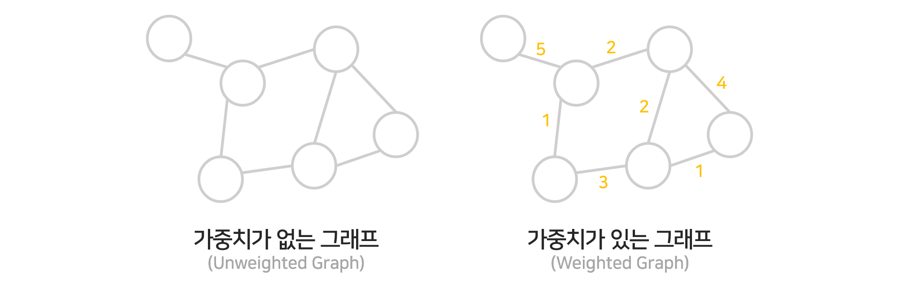
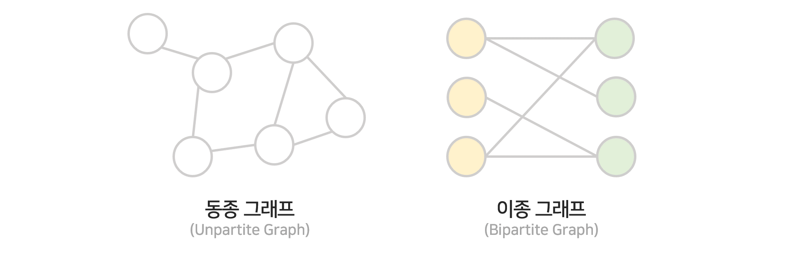
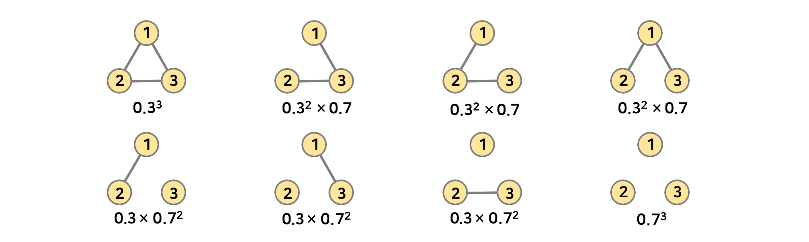

> 🙌은 **QnA에 있는 질문-답변**을 통해 얻은 지식을 표시합니다.

## [👉 피어 세션](#)

### 질문

### 기록

## Table of Contents

## 그래프가 무엇인가요?

### 그래프란?

그래프(Graph)는 `정점 집합`과 `간선 집합`으로 이루어진 수학적 구조를 말한다.

- 하나의 간선(Edge)은 두 개의 정점(Vertex)을 연결한다.
- 모든 정점 쌍이 반드시 간선으로 직접 연결되는 것은 아니다.

### 그래프가 중요한 이유

우리 주변에는 많은 복잡계(Complex System)이 있다. 예를 들면, 사회는 70억 인구로 구성된 복잡계이며, 통신 시스템은 전자기기로 이루어진 복잡계이다. 이러한 복잡계에서는 **구성 요소 간의 복잡한 상호작용**이 이루어진다. 복잡계의 요소와 상호작용을 표현하기 위해 우리는 `그래프`를 사용한다.

### 관련 인공지능 문제

## 그래프 기초 개념 이해하기

### 그래프의 유형

#### 방향

- **방향이 없는 그래프(Undirected Graph)**: 간선에 방향이 없는 그래프 (같은 위치)
  - `ex` 협업 관계, 페이스북 친구
- **방향이 있는 그래프(Directed Graph)**: 간선에 방향이 있는 그래프 (다른 위치)
  - `ex` 논문 인용, 트위터 팔로우

#### 가중치

- **가중치가 없는 그래프(Unweighted Graph)**: 간선에 가중치가 없는 그래프
  - `ex` 웹 그래프, 페이스북 친구
- **가중치가 있는 그래프(Weighted Graph)**: 간선에 가중치가 있는 그래프
  - `ex` 전화 그래프, 유사도 그래프

#### 정점의 종류

- **동종 그래프(Unpartite Graph)**: 한 종류의 정점을 가지는 그래프
  - `ex` 웹 그래프, 페이스북 친구
- **이종 그래프(Bipartite Graph)**: 두 종류의 정점을 가지는 그래프로 다른 종류의 정점 사이에만 간선이 열결된다.
  - `ex` 정자 상거래 구매내역(사용자, 상품), 영화 출연 그래프(배우, 영화)

### 그래프의 수학적 표현

정점들의 집합을 $V$, 간선들의 집합을 $E$, 이 두 개로 이루어진 그래프를 $G = (V,E)$로 나타낸다.

#### 정점의 이웃(Neighbor)

정점의 이웃이란 **그 정점과 연결된 다른 정점** 의미한다.

- 정점 $v$의 이웃들의 집합을 $N(v)$ 혹은 $N_v$로 나타낸다.
  - `ex` 정점 3이 정점 4, 5와 연결되어 있으면 $N(3) = {4, 5}$로 나타낸다.
- 방향이 있는 그래프일 경우 정점 $v$에서 간선이 나가는 이웃을 $N_{out}(v)$로, 들어오는 이웃을 $N_{in}(v)$로 나타낸다.
  - `ex` 정점 3으로 들어오는 정점은 4, 5이고 나가는 정점이 1, 2라면 $N_{in}(3) = {4, 5}, N_{out}(3) = {1, 2}$로 나타낸다.

## 실제 그래프와 랜덤 그래프

실제 그래프(Real Graph)란 **다양한 복잡계로 부터 얻은 그래프**를 의미한다. 예를 들어, SNS, 전자상거래 구매 내역, 인터넷, 웹, 뇌, 단백질 상호박용, 지식 그래프 등이 있다.

랜덤 그래프(Random Graph)란 **확률적 과정을 통해 생성한 그래프**를 의미한다. 여기서는 에르되스와 레니가 제안한 `에르되스-레니 랜덤 그래프`를 사용한다. 랜덤 그래프 $G(n, p)$는 임의의 두 개의 정점 사이에 간선이 존재할 확률이 $p$이며, 정점 간의 연결은 서로 독립적이라고 가정한다.

❓

$G(3, 0.3)$에 의해 생성될 수 있는 그래프와 각각의 확률은?

총 8개의 그래프가 생성될 수 있으며 각 그래프 별 생성 확률은 다음과 같다.

### 경로, 거리, 지름

#### 경로

정점 $u$와 $v$ 사이의 경로(Path)는

### 실제 그래프의 구조적 특성

#### 작은 세상 효과

#### 연결성의 두터운-꼬리 분포

#### 거대 연결 요소

#### 군집 요소

## 파이썬으로 그래프를 그려보자

## References
