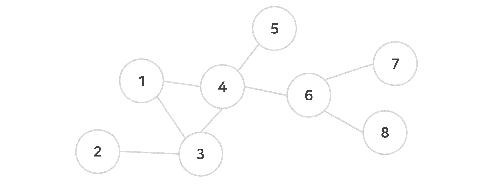
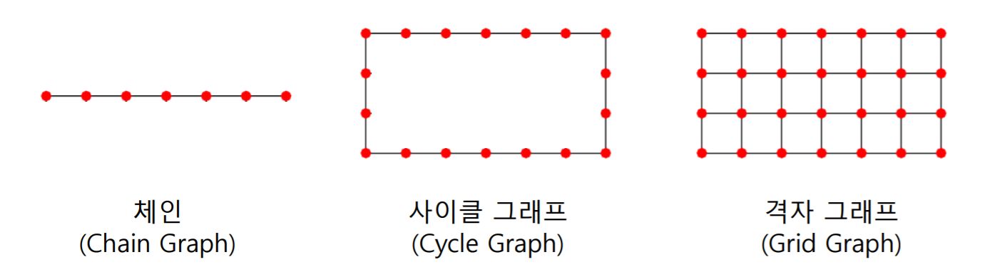
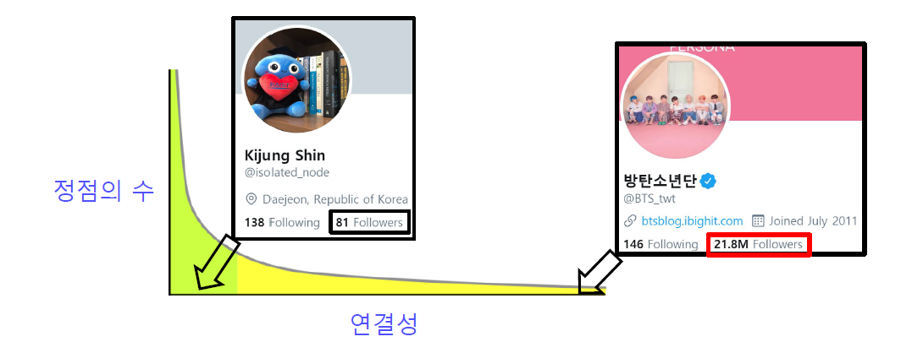
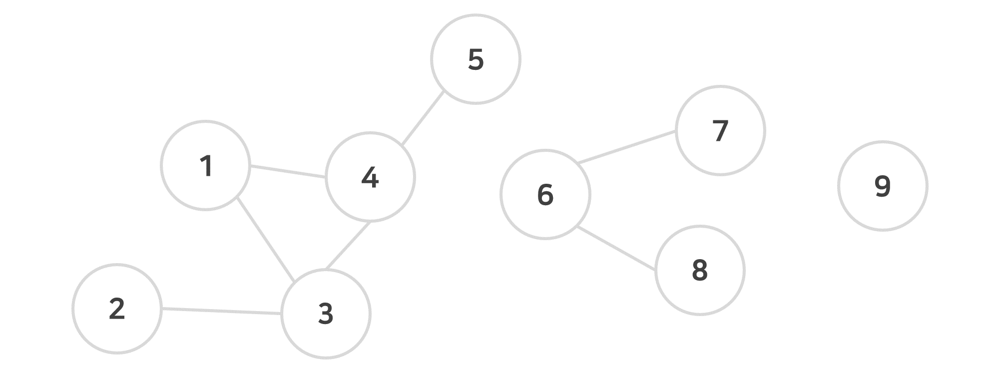

> 🙌은 **QnA에 있는 질문-답변**을 통해 얻은 지식을 표시합니다.

## [👉 피어 세션](#)

### 질문

### 기록

## Table of Contents

## 그래프가 무엇인가요?

### 그래프란?

그래프(Graph)는 `정점 집합`과 `간선 집합`으로 이루어진 수학적 구조를 말한다.

- 하나의 간선(Edge)은 두 개의 정점(Vertex)을 연결한다.
- 모든 정점 쌍이 반드시 간선으로 직접 연결되는 것은 아니다.

### 그래프가 중요한 이유

우리 주변에는 많은 복잡계(Complex System)이 있다. 예를 들면, 사회는 70억 인구로 구성된 복잡계이며, 통신 시스템은 전자기기로 이루어진 복잡계이다. 이러한 복잡계에서는 **구성 요소 간의 복잡한 상호작용**이 이루어진다. 복잡계의 요소와 상호작용을 표현하기 위해 우리는 `그래프`를 사용한다.

### 관련 인공지능 문제

## 그래프 기초 개념 이해하기

### 그래프의 유형

#### 방향

- **방향이 없는 그래프(Undirected Graph)**: 간선에 방향이 없는 그래프 (같은 위치)
  - `ex` 협업 관계, 페이스북 친구
- **방향이 있는 그래프(Directed Graph)**: 간선에 방향이 있는 그래프 (다른 위치)
  - `ex` 논문 인용, 트위터 팔로우

#### 가중치

- **가중치가 없는 그래프(Unweighted Graph)**: 간선에 가중치가 없는 그래프
  - `ex` 웹 그래프, 페이스북 친구
- **가중치가 있는 그래프(Weighted Graph)**: 간선에 가중치가 있는 그래프
  - `ex` 전화 그래프, 유사도 그래프

#### 정점의 종류

- **동종 그래프(Unpartite Graph)**: 한 종류의 정점을 가지는 그래프
  - `ex` 웹 그래프, 페이스북 친구
- **이종 그래프(Bipartite Graph)**: 두 종류의 정점을 가지는 그래프로 다른 종류의 정점 사이에만 간선이 열결된다.
  - `ex` 정자 상거래 구매내역(사용자, 상품), 영화 출연 그래프(배우, 영화)

### 그래프의 수학적 표현

정점들의 집합을 $V$, 간선들의 집합을 $E$, 이 두 개로 이루어진 그래프를 $G = (V,E)$로 나타낸다.

#### 정점의 이웃(Neighbor)

정점의 이웃이란 **그 정점과 연결된 다른 정점** 의미한다.

- 정점 $v$의 이웃들의 집합을 $N(v)$ 혹은 $N_v$로 나타낸다.
  - `ex` 정점 3이 정점 4, 5와 연결되어 있으면 $N(3) = {4, 5}$로 나타낸다.
- 방향이 있는 그래프일 경우 정점 $v$에서 간선이 나가는 이웃을 $N_{out}(v)$로, 들어오는 이웃을 $N_{in}(v)$로 나타낸다.
  - `ex` 정점 3으로 들어오는 정점은 4, 5이고 나가는 정점이 1, 2라면 $N_{in}(3) = {4, 5}, N_{out}(3) = {1, 2}$로 나타낸다.

## 실제 그래프와 랜덤 그래프

실제 그래프(Real Graph)란 **다양한 복잡계로 부터 얻은 그래프**를 의미한다. 예를 들어, SNS, 전자상거래 구매 내역, 인터넷, 웹, 뇌, 단백질 상호박용, 지식 그래프 등이 있다.

랜덤 그래프(Random Graph)란 **확률적 과정을 통해 생성한 그래프**를 의미한다. 여기서는 에르되스와 레니가 제안한 `에르되스-레니 랜덤 그래프`를 사용한다. 랜덤 그래프 $G(n, p)$는 임의의 두 개의 정점 사이에 간선이 존재할 확률이 $p$이며, 정점 간의 연결은 서로 독립적이라고 가정한다.

❓

$G(3, 0.3)$에 의해 생성될 수 있는 그래프와 각각의 확률은?

총 8개의 그래프가 생성될 수 있으며 각 그래프 별 생성 확률은 다음과 같다.

### 작은 세상 효과

#### 경로, 거리, 지름

|                       |                                                                                                                                                                                                        |
| :-------------------: | :----------------------------------------------------------------------------------------------------------------------------------------------------------------------------------------------------: |
|   **경로** Path   | 정점 $u$와 $v$ 사이의 경로는 다음의 조건을 만족하는 정점들의 순열(Sequence)을 말한다.  `조건 1` $u$에서 시작해서 $v$에서 끝나야 한다.  `조건 2` 순열에서 연속된 정점은 간선으로 연결되야 한다. |
| **거리** Distance |                                   정점 $u$와 $v$ 사이의 거리는 $u$와 $v$ 사이의 최단 경로의 길이를 말한다. 이 때, 경로의 길이 = 해당 경로 상에 놓이는 간선의 수                                    |
| **지름** Diameter |                                                                                점정 간 최단경로 거리의 최댓값을 말한다.                                                                                |

<strong>👀 경로, 길이, 거리, 지름 예시
</strong>

이제 예시를 살펴보자.

- **정점 1과 8사이의 경로는?**

  - `1-4-6-8`, `1-3-4-6-8`, `1-4-3-4-6-8`, ... 로 여러 개가 될 수 있다.

- **경로 `1-4-6-8`의 길이는?**

  - 1-4-6-8에 놓이는 간선의 수가 3이므로 경로의 길이는 3이다.

- **정점 1과 8 사이의 최단 경로는?**

  - 경로의 길이가 3으로 가장 짧은 `1-4-6-8`이다.

- **그래프에서의 지름은?**

  - 정점 2와 8 사이의 최단경로의 길이인 4이다.

#### 작은 세상 효과

<u>임의의 두 정점 사이의 거리가 작은 효과</u>를 `작은 세상 효과`라고 한다. 예를 들면, 스탠리 밀그램의 여섯 다리 분리 실험이 있다. 이 실험에서는 오마하와 위치타 주에서 보스턴까지 편지가 도착하려면 평균적으로 **6명의 지인**을 거치면 도착한다고 한다.

**하지만 모든 그래프에서 작은 세상 효과가 나타나는 것은 아니다.** 다음의 체인(Chain), 사이클(Cycle), 격자(Grid) 그래프의 경우 서로 거리가 먼 정점 쌍이 존재하며 그래프의 크기가 커질수록 거리가 더 멀어진다.

### 연결성의 두터운-꼬리 분포

#### 연결성

정점의 연결성(Degree)는 <u>그 정점과 연결된 간선의 수</u>를 의미한다. 이 때, 정점 $v$의 연결성은 **정점 $v$의 이웃들의 수**이다.

- 정점 $v$의 연결성은 $d(v), d_v, |N(v)|$로 나타낸다.
  - 정점 3이 정점 4, 5와 연결되어 있는 경우, $d(3) = 2$로 나타낼 수 있다.
- 방향성이 있는 정점일 경우 정점 $v$의 나가는 연결성은 $d_{out}(v), |N_{out}(v)|$로, 들어오는 연결성은 $d_{in}(v), |N_{in}(v)|$으로 나타낸다.
  - 정점 3으로 들어오는 정점이 1, 2이고 나가는 정점이 5인 경우, $d_{in}(3) = 2, d_{out}(3) = 1$로 나타낼 수 있다.

#### 두터운 꼬리

**실제 그래프**의 연결성 분포는 <u>두터운 꼬리(Heavy Tail)</u>을 갖는다. 즉, 연결성이 매우 높은 `허브(Hub)` 정점이 존재함을 의미한다.

반면, **랜덤 그래프**의 연결성 분포는 높은 확률로 <u>정규 분포</u>와 유사하다. 이 경우 연결성이 매우 높은 허브 정점이 존재할 가능성이 0에 가깝다. 즉, 한 정점에 쏠리는 그런 경우는 거의 없다.

### 거대 연결 요소

#### 연결 요소

연결 요소(Connected Component)는 다음 조건을 만족하는 정점들의 집합을 말한다.

- `조건1` 연결 요소에 속하는 정점들은 경로로 연결될 수 있다.
- `조건2` 1의 조건을 만족하면서 정점을 추가할 수 없다.

<strong>👀 연결 요소 예시</strong>

- 그래프에는 `{1, 2, 3, 4, 5}`, `{6, 7, 8}`, `{9}`의 3가지 연결 요소가 존재한다.
- `{1, 2, 3, 4}`는 정점 5를 추가해도 조건 1을 만족하므로 조건 2에 위배된다.
- `{6, 7, 8, 9}`는 9가 연결될 수 없으므로 조건 1에 위배된다.

#### 거대 연결 요소

실제 그래프에는 대부분의 정점과 연결된 정점인 **거대 연결 요소(Giant Connected Component)**가 존재한다. 그리고 이 거대 연결 요소는 대다수의 정점을 포함한다. 단, 정점들의 평균 연결성이 1보다 충분히 커야 한다. 즉, 적어도 모든 정점의 간선의 수가 1보다는 커야 한다. 자세한 이유는 [Random Graph Theory](https://en.wikipedia.org/wiki/Random_graph)를 참고!

### 군집 구조

#### 군집과 군집 계수

군집(Community)는 다음을 만족하는 정점들의 집합을 말한다.

- 집합에 속하는 정점 사이에는 많은 간선이 존재한다.
- 집합에 속하는 정점과 그렇지 않은 정점 사이에는 적은 수의 간선이 존재한다.

#### 높은 군집 계수

## 파이썬으로 그래프를 그려보자

## References
