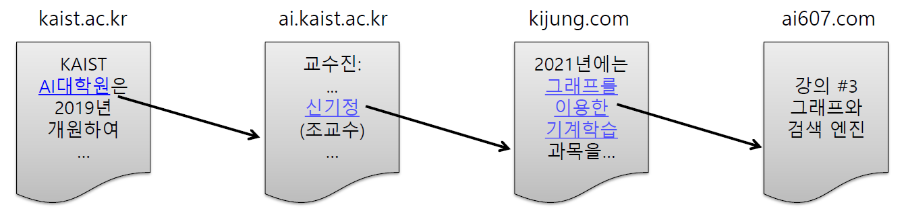
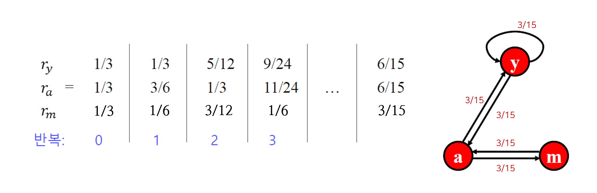
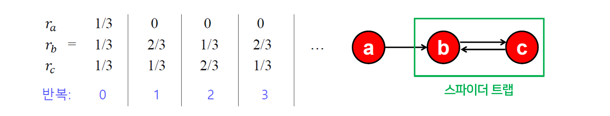
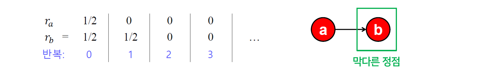
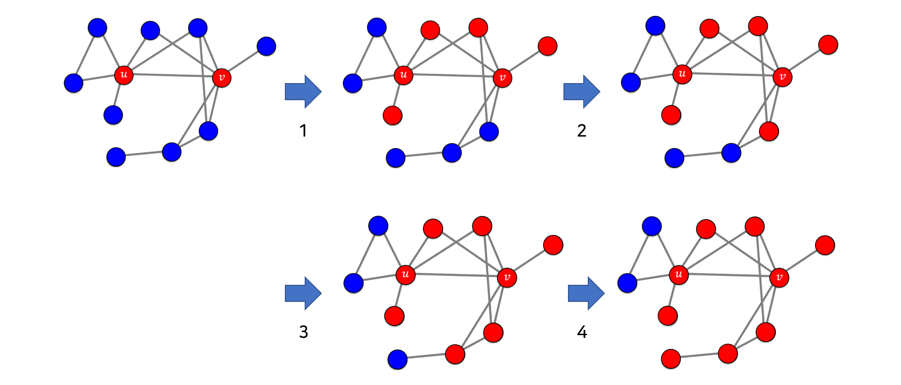
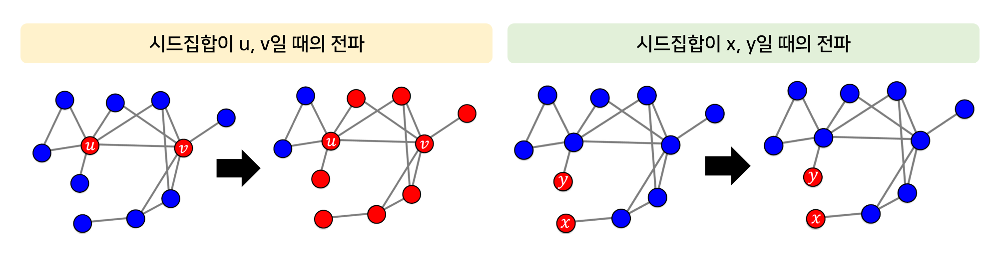
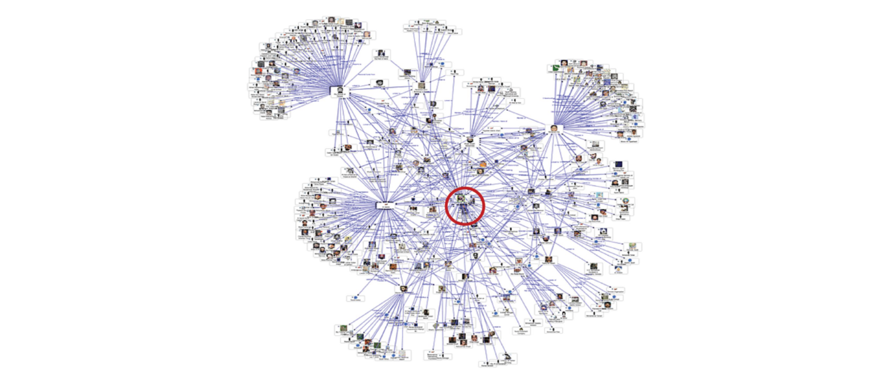
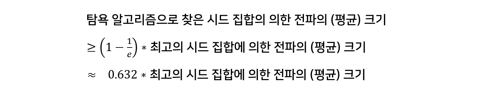

> 🙌은 **QnA에 있는 질문-답변**을 통해 얻은 지식을 표시합니다.

## [👉 피어 세션](https://github.com/boostcamp-ai-tech-4/peer-session/issues/85)

### 질문

- [[펭귄] 페이지랭크 알고리즘에서 1-α가 의사코드에서는 1-S로 대체되는 이유](https://github.com/boostcamp-ai-tech-4/peer-session/issues/86)

### 기록

- 교수님이 여러 예시를 들어서 설명해주셔서 `교양+전공` 느낌으로 듣고 있다. 간만에 여유를 가지면서 재미있게 공부해서 너무 좋다. 오늘은 **페이지랭크 알고리즘**에 대해서 배웠는데 "이런 아이디어는 어디서 얻었을까?"하는 생각이 들었다.
- 오늘 Further Question으로 **환자의 회복을 고려한 전파 모델**에 관한 이야기를 나누었다. 회복이 되면 간선을 끊으면 되지 않을까 생각했는데 SIR모델, SIS모델을 보니 그렇게는 하면 안 되는 것 같았다. 신기해라..

## Table of Contents

- [페이지랭크](#페이지랭크)
- [전파](#전파)

## 페이지랭크

웹페이지를 정점(Vertex), 하이퍼링크를 간선(Edge)로 보면 웹은 이 두 가지로 구성된 **거대한 방향성 있는 그래프**라고 볼 수 있다. 다만, 웹페이지인 정점의 경우 추가적으로 키워드 정보를 포함하고 있다.

### 페이지랭크 이전의 검색엔진

- `방법 1` 웹페이지를 미리 정의한 카테고리로 정리하는 방법
  - 웹페이지가 증가함에 따라 카테고리의 수와 깊이도 무한정 깊어지는 문제 발생
  - 카테고리 구분이 모호한 경우가 많아 페이지 저장과 검색이 어려움
- `방법 2` 입력 키워드를 여러 번 포함한 웹페이지를 반환하는 방법
  - 악의적인 웹페이지에 취약하다는 단점 有
  - 예를 들어, 불법 사이트에 **축구**라는 키워드를 여러 번 포함하게 되면 **축구**를 검색했을 때 해당 페이지가 결과로 나올 수 있음

### 페이지랭크 정의: 투표 관점

#### 투표를 하자!

**투표**를 통해 사용자 키워드와 관련성이 높고 신뢰할 수 있는 웹페이지를 찾는다!

- 투표의 주체는 `웹페이지`, 투표하는 행위는 `하이퍼링크`가 된다.
- 입력 키워드를 포함한 웹페이지 $u$에서 $v$로 가는 하이퍼링크가 있다면, $u$가 $v$에게 투표했다고 할 수 있다.
- 즉, 들어오는 간선이 많을수록 그 페이지의 신뢰도는 높아진다.



하지만 **들어오는 간선 수만 세는 것**은 악용의 소지가 있다. 예를 들면, SNS 팔로워를 늘리기 위한 서비스가 있듯이 인위적으로 웹페이지를 많이 만들어 하이퍼링크를 달아 간선의 수를 부풀릴 수 있다.

그래서 이를 막기 위해 단순 투표가 아닌 **가중 투표**를 한다. 관련성이 높고 실뢰할 수 있는 웹사이트가 던지는 투표를 더 중요하게 생각하고 그렇지 않은 사이트의 투표는 덜 중요하게 생각한다.

#### 페이지랭크 점수

그럼 웹페이지의 관련성 및 신뢰도를 어떻게 측정할까? 바로 `페이지 랭크 점수`를 계산해서 측정한다.

$$
r_j = \sum_{i \in N_{in}(j)} \frac{r_i}{d_{out}(i)}
$$

- 각 웹페이지는 각각의 나가는 이웃에게 **(자신의 페이지 랭크 점수) / (나가는 이웃의 수)**를 나눈 만큼의 가중치로 투표를 한다.
- 각 웹페이지의 페이지랭크 점수는 받은 투표의 가중치 합으로 계산된다.

예를 들어, 다음과 같은 방향성 있는 그래프가 있다고 하자. 이 때, 정점 $j$의 페이지 랭크 점수 $r_j$는 $j$로 들어오는 정점의 투표 가중치인 $r_i/3$과 $r_k/4$의 합이다.


<small class="src" markdown=1>

출처: [Link Analysis](http://infolab.stanford.edu/~ullman/mmds/ch5.pdf)

</small>

### 페이지랭크 정의: 임의 보행 관점

먼저 임의 보행을 통해 웹을 서핑하는 `웹서퍼`를 가정하자. 이 웹서퍼는 현재 웹페이지에 있는 하이퍼링크 중 하나를 균일한 확률로 클릭하는 방식으로 웹을 서핑한다.

웹서퍼가 $t$번째 방문한 웹페이지가 웹페이지 $i$일 확률을 $p_i(t)$라고 할 때, $p(t)$는 $\left[ \; p_1(t), \; p_2(t), ... \; \right]$이 된다. 이 때, $t$번째 시간에 정점 $i$에 있다가 $t+1$번째 시간에 $j$에 있을 확률은 다음과 같이 계산할 수 있다.

$$
p_j(t+1) = \sum_{i \in N_{in}(j)} \frac{p_i(t)}{d_{out}(i)}
$$

웹서퍼가 이 과정을 무한히 반복하면 $t$가 무한으로 가면서 확률분포 $p(t)$는 수렴하게 된다. 이렇게 되면 $p(t) = p(t+1) = p$가 성립이 되고 이 때의 $p$를 정상 분포(Stationary Distribution)이라고 한다. 이를 위의 식에 적용하면 다음과 같다.

$$
p_j = \sum_{i \in N_{in}(j)} \frac{p_i}{d_{out}(i)}
$$

#### 투표 관점과 임의 보행관점

투표 관점에서 정의한 페이지랭크 점수 $r$은 다음과 같이 계산되는 것을 보았다.

$$
r_j = \sum_{i \in N_{in}(j)} \frac{r_i}{d_{out}(i)}
$$

임의 보행관점에서 정의한 정상분포 $p$는 다음과 같이 계산되었다.

$$
p_j = \sum_{i \in N_{in}(j)} \frac{p_i}{d_{out}(i)}
$$

**결론!** 투표 관점에서 정의한 페이지 랭크 점수 $r$과 임의 보행 관점에서의 정상 분포 $p$가 같음을 알 수 있다.

### 페이지랭크의 계산

페이지랭크 점수를 계산할 때는 **반복곱(Power Iteration)**을 사용한다.

- `1단계` 0번째 iteration 즉 처음에는 각 웹페이지 $i$의 페이지랭크 점수 $r_i^{(0)}$을 동일하게 **1 / (웹페이지 수)**로 초기화한다.

- `2단계` $r_j = \sum_{i \in N_{in}(j)} \frac{r_i}{d_{out}(i)}$을 이용하여 각 웹페이지의 페이지랭크 점수를 갱신한다.

- `3단계` 계속 2번째 단계를 반복하다가 페이지랭크 점수가 이전 iteration과 다르지 않다면 수렴한 것이므로 종료한다.

<details>
<summary><strong>👀 반복곱 예시 보기</strong></summary>



- `1단계` 총 웹피이지의 수는 3이므로 모든 웹피이지의 페이지랭크 점수를 $1/3$으로 초기화한다.
- `2단계` 각 정점으로 들어오는 정점의 페이지랭크 점수를 고려하여 웹페이지의 페이지랭크 점수를 갱신한다.
- `3단계` 어느 정도 반복하다 보면 페이지랭크 점수가 $r_y = 6/15, r_a = 6/15, r_m = 3/15$로 수렴한다.

</details>

### 문제점

#### 스파이더 트랩

하지만 반복곱이 항상 수렴을 보장할까? **아니다!** 다음과 같은 경우 페이지랭크 점수는 수렴하지 않고 발산한다. iteration이 짝수일 때, 홀수일 때 각각의 페이지랭크 점수가 번갈아 나오는 것을 볼 수 있다. 이 때, 들어오는 간선만 있고 나가는 간선이 없는 정점 집합을 `스파이더 트랩`이라고 한다.



#### 막다른 정점

반복곱이 수렴한다고 치자. 그럼 반복곱이 <u>합리적인 점수</u>로 수렴하는 것을 보장할 수 있을까? **아니다!** 다음의 경우 페이지랭크 점수가 0으로 수렴하는 것을 볼 수 있다. 이 때, 들어오는 간선은 있지만 나가는 간선이 없는 정점을 `막다른 정점`이라고 한다.



### 해결책: 순간이동

스파이더 트랩 문제와 막다른 정점 문제의 해결책으로 **순간이동(Teleport)**이 있다. 임의 보행 관점에서, 웹서퍼는 다음과 같이 서핑을 하게 된다.

- `1단계` 현재 웹페이지에 하이퍼링크 여부를 확인한다.

  - 만약 없다면, 임의의 페이지로 순간이동을 한다.
  - 만약 있다면, 앞면이 나올 확률이 $\alpha$인 동전을 던진다.

- `2단계` 동전의 면을 확인한다.
  - 만약 앞면이라면, 하이퍼링크 중 하나를 균일한 확률로 선택해 클릭한다.
  - 만약 뒷면이라면, 임의의 웹페이지로 순간이동 한다.

여기서 $\alpha$를 **감폭 비율(Damping Factor)**라고 하며 보통 0.8을 사용한다. 이렇게 순간이동을 사용함으로써 스파이더 트랩이나 막다른 정점에 갇히는 일을 없애줄 수 있다. 이를 반영하여 페이지랭크 공식을 다시 쓰면 다음과 같다.

$$
r_j = \textcolor{blue}{\sum_{i \in N_{in}(j)} \left( \alpha \frac{r_i}{d_{out}(i)} \right)} + \textcolor{red}{(1 - \alpha) \frac{1}{|V|}}
$$

- $|V|$: 전체 웹페이지 수
- 🔵파란색 부분: 하이퍼링크를 따라 정점 $j$에 도착할 확률
- 🔴빨간색 부분: 순간이동을 통해 정점 $j$에 도착할 확률

### 구현

NetworkX, Numpy 등의 라이브러리가 import되었다고 가정한다.

- `방법 1` NetworkX의 페이지랭크 함수 사용

```python
H = G.subgraph(sub_vertices)    # 키워드가 있는 정점들만 있는 서브그래프 추출
pr = nx.pagerank(H, alpha=0.9)  # 페이지랭크 계산

# 페이지랭크 점수를 기준으로 역순으로 정렬 후 점정만 추출
result = [key for key, value in sorted(pr.items(), key=lambda x:x[1], reverse=True)]
```

- `방법 2` 직접 페이지랭크 알고리즘 구현

```python
def pagerank(graph, damping_factor, maxiters, tol):
  vec = defaultdict(float)            # 페이지랭크 벡터
  len_of_nodes = len(graph.nodes())   # 정점의 수

  # 1. 모든 정점의 페이지랭크 점수 초기화한다.
  for j in graph.nodes():
    vec[j] = 1 / len_of_nodes

  # 2. maxiters만큼 다음을 반복하여 각 노드 별 페이지랭크 점수를 구한다.
  for itr in range(maxiters):
    sum_of_rank = 0               # 한 iteration에서의 모든 정점이 하이퍼링크를 통해 올 누적 확률
    vec_new = defaultdict(float)  # 새로 갱신될 페이지랭크 벡터
    for j in graph.nodes():
      vec_new[j] = 0
      # 2-1. 이웃 노드 i에서 노드 j로 하이퍼링크를 타고올 확률을 계산한다.
      for i in graph.in_neighbor(j):
        vec_new[j] += damping_factor * (vec[i] / graph.out_degree(i))
      sum_of_rank += vec_new[j]
    for j in graph.nodes():
      # 2-2. 순간이동을 통해 노드 j로 올 확률을 계산한다.
      vec_new[j] += (1- sum_of_rank) / len_of_nodes

  # 3. 새로 구한 페이지랭크 벡터와 이전 벡터와의 차이를 계산한다.
  delta = l1_distance(vec_new, vec)
  # 4. 만약 tol보다 작다면 수렴했으므로 종료한다.
  if delta < tol:
    break

  # 5. 수렴하지 않았을 경우 페이지랭크 벡터를 갱신해준다.
  vec = vec_new

  return dict(vec)
```

## 전파

### 의사결정 기반의 전파 모형

<u>주변 사람들의 의사결정을 고려하여 각자 의사결정을 내리는 경우</u>에 **의사결정 기반의 전파 모형**을 사용한다. 예를 들어, 아이폰과 갤럭시 중 어느 것을 살지 고민할 때 주변 사람에게 물어봐서 결정하는 경우가 있다.

#### 선형 임계치 모형

의사결정 기반의 전파 모형 중 하나인 선형 임계치 모형(Linear Threshold Model)은 $A$와 $B$를 선택해야하는 상황에서 이웃 정점이 $A$를 선택한 비율이 임계치 $q$를 넘을 때 $A$를 선택한다.

- 이 모형은 전부 $B$를 사용하는 상황을 가정한다.
- 처음 $A$를 사용하는 얼리어답터(Early Adopter)를 가정한다.
- 시드 집합(Seed Set)에 속하는 얼리어답터들은 항상 $A$를 고수한다고 가정한다.

<details>
<summary><strong>👀 선형 임계치 모형 예시 보기</strong></summary>

임계치 $q$가 55%이고 $u$와 $v$가 시드 집합이라고 가정하자. $u$와 $v$ 부터 시작해 이웃노드들이 영향을 받아 임계치가 넘어 $A$를 선택하게 되고 이게 반복되어 4번째 전파 때 단 두 개의 정점을 제외하고 전파가 된 것을 볼 수 있다.


<small class="src" markdown=1>

출처: [CS224W - Network Effects and Cascading Behavior](https://web.stanford.edu/class/cs224w/slides/12-cascades.pdf)

</small>

</details>

### 확률적 전파 모형

이번에는 COVID의 전파 모형을 만든다고 하자. 이 때 의사결정 기반의 전파 모형을 쓰는 것이 맞을까? 당연히 아니다. 누가 COVID에 걸리기로 "결정"을 하겠는가? COVID의 전파는 **확률적 과정**이기 때문에 확률적 전파 모형을 고려해야 한다.

#### 독립적 전파 모형


<small class="src" markdown=1>

출처: [CS224W - Network Effects and Cascading Behavior](https://web.stanford.edu/class/cs224w/slides/12-cascades.pdf)

</small>

방향성이 있고 가중치기 있는 그래프를 가정하자. 두 정점 $u$, $v$을 이어주는 간선의 가중치 $p_{uv}$는 <u>$u$가 감염됐을 때 $u$가 감염되지 않은 $v$를 감염시킬 확률</u>이다. 즉, 각 정점 $u$가 감염됐을 때, 그 이웃 $v$는 $p_{uv}$ 확률로 감염된다.

이 때, **서로 다른 이웃이 전염되는 확률은 독립적**이라고 가정한다! 이것이 무슨 말이냐? 보통 전염되는 확률은 독립적이라고 할 수 없다. 예를 들면, 가족 중 한 명이 감염되었다면 감염될 확률이 더 높을 것이다. 하지만 여기서는 독립적이라고 가정한다.

감염의 시작은 **시드 집합(Seed Set)**에 속하는 최초감염자부터 시작한다. 최초 감염자가 $p_{uv}$의 확률로 이웃을 감염시키고 감염된 이웃이 또 $p_{uv}$ 확률로 감염시킨다. 이렇게 전파를 하다가 더이상의 감염자가 없으면 종료한다.

### 바이럴 마케팅

바이럴 마케팅은 소비자들로 하여금 상품에 대한 긍정적인 입소문을 퍼지게 하는 기법을 말한다. 바이럴 마케팅이 효과적으로 이루어지기 위해서는 **소문의 시작점**이 정말 중요하다. 시작점이 어디인지에 따라서 입소문이 전파되는 범위가 달라지기 때문이다.

다음은 선형 임계치 모형에서 시드집합에 따른 전파의 크기를 보여주는 그림이다. 그림에 보이듯이 시드집합이 무엇이냐에 따라 전파의 크기가 많이 달라지는 것을 볼 수 있다.


<small class="src" markdown=1>

출처: [CS224W - Network Effects and Cascading Behavior](https://web.stanford.edu/class/cs224w/slides/12-cascades.pdf)

</small>

#### 전파 최대화 문제

그래프, 전파 모형, 시드집합의 크기가 주어졌을 때 <u>전파를 최대화하는 시드집합을 찾는 문제</u>를 **전파 최대화(Influence Maximization) 문제**라고 한다. 전파 모형은 선형 임계치 모형, 독립 전파 모형 등 다양한 모형을 사용할 수 있다.


<small class="src" markdown=1>

출처: [CS224W - Network Effects and Cascading Behavior](https://web.stanford.edu/class/cs224w/slides/12-cascades.pdf)

</small>

하지만 전파 최대화 문제는 굉장히 어려운 문제이다. 그래프에 $|V|$개의 정점이 있을 경우, 시드집합의 크기를 $k$개로 제한해도 경우의 수는 $_{|V|}C_k$이다. 만약 정점이 10000개, 시드집합의 크기가 10일 때의 경우의 수는 약 $2.7 \times 10^33$이다. 이론적으로 많은 전파 모형에 대해 전파 최대화 문제는 `NP-hard`임이 증명되었다.

결국 우리는 최고의 시드집합을 찾을 수 없다.

#### 정점 중심성 휴리스틱

전파 최대화 문제를 해결하기 위한 휴리스틱 방법으로 **정점의 중심성(Node Centrality)**를 사용한다. 시드 집합 크기가 $k$개일 때, <u>정점의 중심성이 높은 순으로 $k$개의 정점을 선택하는 방법</u>이다. 정점의 중심성으로는 페이지랭크 점수, 연결 중심성(연결성), 근접 중심성(평균 거리), 매개 중심성(정점 간 최단경로에서의 빈도수) 등이 있다.

모든 경우의 수를 고려하는 것보다는 합리적이지만 최고의 시드 집합을 찾는다는 보장은 없다.

#### 탐욕 알고리즘

다른 방법으로 **그리디 알고리즘(Greedy Algorithm)**을 사용하기도 한다. 그리디 알고리즘은 <u>최초전파자인 시드 집합의 원소를 한 번에 한 명씩 선택</u>한다. 만약 정점의 집합이 $\left\{1, 2, ..., |V|\right\}$인 경우 다음과 같이 시드 집합을 완성시킨다.

- `1단계` 집합 $\left\{1\right\}, \left\{2\right\}, ... \left\{|V|\right\}$를 비교해 전파가 최대화하는 시드 집합을 찾고 이 때 뽑힌 집합은 $\left\{x\right\}$이다.
  - 전파를 최대화한다는 것은 전파의 크기를 최대화하는 것이며 여러 번의 시뮬레이션을 통해 전파 크기의 평균값을 구해 이를 비교한다.
  - 평균값인 이유는 매 시뮬레이션마다 전파 결과 즉, 전파의 크기가 다르기 떄문이다.
  - 시뮬려이션은 충분히 많이 돌려주며 보통 10000번 정도 돌려준다고 한다.
- `2단계` 집합 $\left\{x, 1\right\}, \left\{x, 2\right\}, ... \left\{x, |V|\right\}$를 비교해 전파가 최대화하는 시드 집합을 찾고 이 때 뽑힌 집합은 $\left\{x, y\right\}$이다.
- `3단계` 집합 $\left\{x, y, 1\right\}, \left\{x, y, 2\right\}, ... \left\{x, y, |V|\right\}$를 비교해 전파가 최대화하는 시드 집합을 찾고 이 때 뽑힌 집합은 $\left\{x, y, z\right\}$이다.
- `k단계` 위의 과정을 목표한 시드집합의 크기 $k$에 도달할 때까지 반복한다.

이처럼 그리디 알고리즘은 근시안적으로 최초전파자를 선택한다. 그럼 그리디 알고리즘은 제대로된 시드집합을 찾아줄까? **어느 정도의 성능은 보장된다고 한다.** 독립 전파 모형의 경우 입력 그래프에 상관없이 다음과 같은 부등식이 성립한다.


