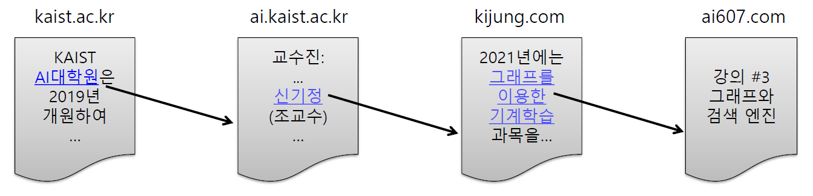

> 🙌은 **QnA에 있는 질문-답변**을 통해 얻은 지식을 표시합니다.

## [👉 피어 세션](https://github.com/boostcamp-ai-tech-4/peer-session/issues/85)

### 질문

- [[펭귄] 페이지랭크 알고리즘에서 1-α가 의사코드에서는 1-S로 대체되는 이유](https://github.com/boostcamp-ai-tech-4/peer-session/issues/86)

### 기록

## Table of Contents

## 페이지랭크

웹페이지를 정점(Vertex), 하이퍼링크를 간선(Edge)로 보면 웹은 이 두 가지로 구성된 **거대한 방향성 있는 그래프**라고 볼 수 있다. 다만, 웹페이지인 정점의 경우 추가적으로 키워드 정보를 포함하고 있다.

### 페이지랭크 이전의 검색엔진

- `방법 1` 웹페이지를 미리 정의한 카테고리로 정리하는 방법
  - 웹페이지가 증가함에 따라 카테고리의 수와 깊이도 무한정 깊어지는 문제 발생
  - 카테고리 구분이 모호한 경우가 많아 페이지 저장과 검색이 어려움
- `방법 2` 입력 키워드를 여러 번 포함한 웹페이지를 반환하는 방법
  - 악의적인 웹페이지에 취약하다는 단점 有
  - 예를 들어, 불법 사이트에 **축구**라는 키워드를 여러 번 포함하게 되면 **축구**를 검색했을 때 해당 페이지가 결과로 나올 수 있음

### 페이지랭크 정의: 투표 관점

#### 투표를 하자!

**투표**를 통해 사용자 키워드와 관련성이 높고 신뢰할 수 있는 웹페이지를 찾는다!

- 투표의 주체는 `웹페이지`, 투표하는 행위는 `하이퍼링크`가 된다.
- 입력 키워드를 포함한 웹페이지 $u$에서 $v$로 가는 하이퍼링크가 있다면, $u$가 $v$에게 투표했다고 할 수 있다.
- 즉, 들어오는 간선이 많을수록 그 페이지의 신뢰도는 높아진다.

하지만 **들어오는 간선 수만 세는 것**은 악용의 소지가 있다. 예를 들면, SNS 팔로워를 늘리기 위한 서비스가 있듯이 인위적으로 웹페이지를 많이 만들어 하이퍼링크를 달아 간선의 수를 부풀릴 수 있다.

그래서 이를 막기 위해 단순 투표가 아닌 **가중 투표**를 한다. 관련성이 높고 실뢰할 수 있는 웹사이트가 던지는 투표를 더 중요하게 생각하고 그렇지 않은 사이트의 투표는 덜 중요하게 생각한다.

#### 페이지랭크 점수

그럼 웹페이지의 관련성 및 신뢰도를 어떻게 측정할까? 바로 `페이지 랭크 점수`를 계산해서 측정한다.

$$
r_j = \sum_{i \in N_{in}(j)} \frac{r_i}{d_{out}(i)}
$$

- 각 웹페이지는 각각의 나가는 이웃에게 **(자신의 페이지 랭크 점수) / (나가는 이웃의 수)**를 나눈 만큼의 가중치로 투표를 한다.
- 각 웹페이지의 페이지랭크 점수는 받은 투표의 가중치 합으로 계산된다.

예를 들어, 다음과 같은 방향성 있는 그래프가 있다고 하자. 이 때, 정점 $j$의 페이지 랭크 점수 $r_j$는 $j$로 들어오는 정점의 투표 가중치인 $r_i/3$과 $r_k/4$의 합이다.

### 페이지랭크 정의: 임의 보행 관점

먼저 임의 보행을 통해 웹을 서핑하는 `웹서퍼`를 가정하자. 이 웹서퍼는 현재 웹페이지에 있는 하이퍼링크 중 하나를 균일한 확률로 클릭하는 방식으로 웹을 서핑한다.

#### 임의 보행 관점

### 계산: 반복곱

### 문제점과 해결책

### 구현

## 전파

### 전파의 예시

### 의사결정 기반의 전파 모형

#### 선형 임계치 모형

구현

### 확률적 전파 모형

#### 독립적 전파 모형

구현

### 바이럴 마케팅

#### 시드 집합

#### 전파 최대화 문제

#### 정점 중심성 휴리스틱

#### 탐욕 알고리즘
