> 🙌은 **QnA에 있는 질문-답변**을 통해 얻은 지식을 표시합니다.

## [👉 피어 세션](https://github.com/boostcamp-ai-tech-4/peer-session/issues/87)

### 기록

- 오늘은 드디어 기다리던 `추천시스템`을 배웠다! 내일은 얼마나 더 개선된 추천시스템을 배울지 궁금하다. [NHN Forward](../../penguin/nhn-forward-2019/)에서 대부분의 사람들은 평점을 매기지 않기 때문에 추천시스템은 **평점이 있는 4%의 데이터**에만 의존한다고 했다. 그럼 96%의 데이터는 버리게 되는 것인데 특강 교수님께서는 관심있는 상품이 아닌 **관심이 없는 상품**에 집중해서 평가를 하셨다. 이런 부분도 수업에서 제대로 배울 수 있으면 좋겠다.
- 오늘 마지막 TED 세미나에서 [MJ](https://github.com/mj950425)님이 "GAN을 통한 글꼴 만들기"를 주제로 발표하셨다! 정말 신기했고 생성된 글자도 꽤 예뻤다. 나도 인공지능을 가지고 저런 재미있는 프로젝트를 해보고 싶다.

## Table of Contents

- [군집 구조](#군집-구조)
- [추천시스템](#추천시스템)

## 군집 탐색 문제

**[👀 군집이 무엇일까?](../day21-20210222/#군집-구조)**

군집 탐색 문제(Community Detection)이란 **그래프를 여러 군집으로 잘 나누는 문제**를 말한다. 그래프 데이터가 있을 때 비슷한 성질의 정점들을 묶어 군집화하는 것이다.

💡

군집 탐색과 클러스터링의 차이는 무엇일까?

군집 탐색은 **그래프**를 입력으로 받고 <u>군집성이 최대가 되도록 정점을 묶는 것</u>을 말한다. 반면 클러스터링은 입력으로 **피처가 있는 데이터**를 받으며 <u>중심점(Centroid)를 옮겨가며 중심점과 데이터 간의 거리가 짧도록 학습</u>하여 군집화를 한다.

### 군집 탐색의 지표: 군집성

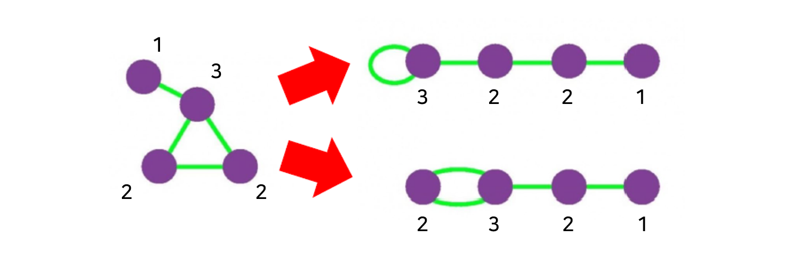

`배치 모형`이란 <u>각 정점의 **연결성을 보존**한 상태에서 **간선들을 무작위로 배치**하여 얻은 그래프</u>를 말한다. 이 때 배치 모형에서 임의의 두 정점 $i$와 $j$ 사이에 간선이 존재할 확률은 두 정점의 연결성에 비례한다.

군집 탐색의 성공 여부를 판단하는 지표로 **군집성(Modularity)**을 사용한다. 군집성은 다음의 수식으로 계산할 수 있다. 군집성이 높다는 것은 배치 모형과 비교했을 때 그래프에서 군집 내부 간선의 수가 많다는 것을 의미한다. <u>군집성이 높을수록 성공한 군집 탐색이라고 본다.</u>

---

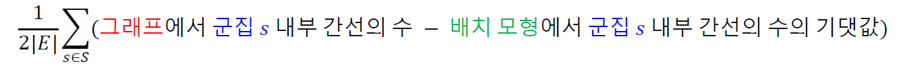

- $S$: 군집 $s$로 이루어진 군집들의 집합
- $|E|$: 간선들의 개수

---

이처럼 군집성은 무작위로 연결된 배치 모형과의 비교를 통해 **통계적 유의성**을 판단한다. 군집성은 -1과 1사이의 값을 가지며 보통 **0.3 ~ 0.7** 정도의 값을 가질 때 통계적으로 유의미한 군집을 찾았다고 할 수 있다.

💡

군집성을 계산할 때 배치모형에서 **기대값**을 사용하는 이유는 배치모형이 모작위성을 포함하기 때문이다!

### 군집 탐색 알고리즘

그럼 군집은 어떻게 만들어야 할까? 접근 방식에 따라 하향식(Top-Down)방식의 `Girvan-Newman 알고리즘`과 상향식(Bottom-Up)방식의 `Louvain 알고리즘`이 있다.

#### Girvan-Newman 알고리즘

Girvan-Newman 알고리즘은 <u>전체 그래프에서 탐색을 시작해 군집이 서로 분리되도록 간선을 순차적으로 제거</u>하는 방식을 사용한다.

그럼 어떤 간선을 제거할까? 바로 **매개 중심성(Betweenness Centrality)가 가장 높은 간선**을 제거한다. 매개 중심성이란 해당 간선이 정점 간의 최단 경로에 놓이는 횟수를 말한다. 간선 \$(y, y)의 매개 중심성은 다음과 같이 계산할 수 있다.

---

$$
\sum_{i < j} \frac{\sigma_{i, j} (x, y)}{\sigma_{i, j}}
$$

- $\sigma_{i, j}$: 정점 $i$로 부터 $j$로의 최단 경로 수
- $\sigma_{i, j}(x, y)$: 그 중 간선 $(x, y)$를 포함한 최단 경로 수

---

다음의 그림은 각 간선별 매개 중심성을 구해 정도에 따라 간선을 색칠한 그림이다. 매개 중심성이 높을수록 붉은 색을 띄는데, **다리 역할의 간선이 붉은 것**을 볼 수 있다.

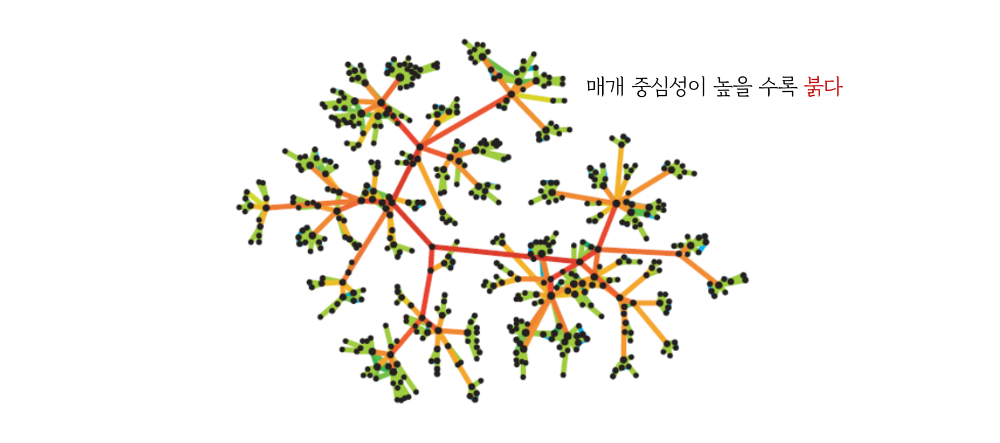
<small class="src" markdown=1>

출처: [Mining Social-Network Graphs](http://infolab.stanford.edu/~ullman/mmds/ch10n.pdf)

</small>

다시 돌아가 Girvan-Newman 알고리즘이 무엇인지 알아보자. Girvan-Newman은 다음과 같이 진행된다.

- `1단계` 현재 그래프간선의 매개 중심성을 계산한다.
- `2단계` 매개 중심성이 가장 높은 간선을 제거하고 제거 후의 군집성을 계산한다.
- `3단계` 1, 2단계를 간선 모두가 제거될 때까지 반복한다.

그럼 얼마만큼의 간선을 제거하면 될까? `2단계`에서 군집성을 기록하여 **군집성이 최대가 될 때**의 간선의 수 만큼을 제거한다.

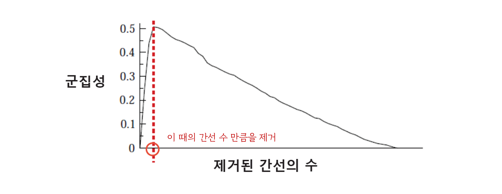
<small class="src" markdown=1>

출처: [Mining Social-Network Graphs](http://infolab.stanford.edu/~ullman/mmds/ch10n.pdf)

</small>

#### Louvain 알고리즘

Louvain 알고리즘은 <u>개별 정점에서 시작해 점점 큰 군집을 형성하는 방식</u>을 사용한다. Louvain 알고리즘은 다음과 같이 진행된다.

<small class="src" markdown=1>

출처: [Louvain method: Finding communities in large networks](https://sites.google.com/site/findcommunities/)

</small>

- `1단계` 개별 정점으로 구성된 크기 1의 군집에서 시작한다.
- `2단계` 각 정점 $u$를 군집성이 최대화되는 군집으로 이동시킨다.
- `3단계` 더이상 군집성이 증가하지 않을 때까지 2단계를 반복한다.
- `4단계` 각 군집을 하나의 정점으로 하는 군집레벨의 그래프를 얻은 뒤 2단계로 돌아간다.
- `5단계` 한 개의 정점이 남을 때까지 4단계를 반복한다.

### 중첩이 있는 군집 탐색

실제 그래프의 군집들은 **중첩**이 되어 있는 경우가 많다. 예를 들어, SNS에서 고등학교 친구이자 대학교 친구인 친구가 있는 것처럼 여러 군집에 속한 정점이 있을 수 있다.

#### 중첩 군집 모형

앞서 배운 Girvan-Newman 알고리즘과 Louvain 알고리즘은 <u>군집 간의 중첩이 없다</u>고 가정한다. 중첩이 있는 경우 다음과 같은 **중첩 군집 모형**을 가정한다.

- 각 정점은 여러 개의 군집에 속할 수 있다.
- 각 군집 $A$에 대해 같은 군집에 속하는 두 정점이 $P_A$ 확률로 연결된다.
- 두 정점이 여러 군집에 동시에 속할 경우 간선 연결 확률은 **독립적**이며, 군집 $A$와 군집 $B$에 동시에 속할 경우의 두 정점이 연결될 확률은 $1-(1- P_A)(1-P_B)$이다.
- 어느 군집에도 속하지 않는 두 정점은 낮은 확률 $\epsilon$로 연결된다.

이렇게 정의된 군집모형을 통해 **(그래프의 각 간선의 두 정점이 직접 연결될 확률) × (그래프에서 직접 연결되지 않은 각 정점쌍이 직접 연결되지 않을 확률)**을 곱한 확률을 가지고 간선을 이어 다음과 같은 그래프를 만들 수 있다.

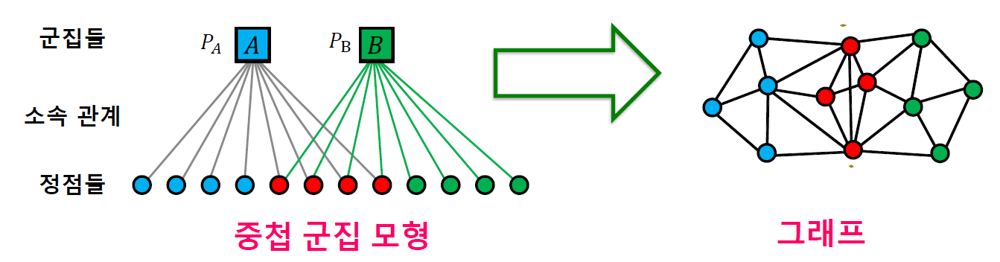
<small class="src" markdown=1>

출처: [Louvain method: Finding communities in large networks](https://sites.google.com/site/findcommunities/)

</small>

반대로 그래프가 주어졌을 때 그래프의 확률을 최대화하는 중첩 군집 모형을 찾는 과정을 **중첩 군집 탐색**이라고 한다. 즉, 최대 가능도 추정법(MLE)를 통해 중첩 군집 모형을 찾는다.

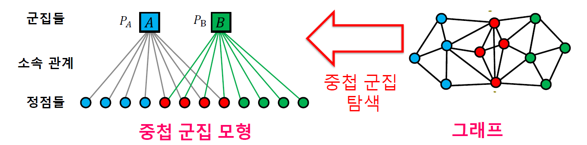
<small class="src" markdown=1>

출처: [Louvain method: Finding communities in large networks](https://sites.google.com/site/findcommunities/)

</small>

#### 완화된 중첩 군집 모형

하지만 최대 가능도 추정법으로 군집 모형을 찾는 것은 매우 어렵다. 왜냐하면 각 정점이 군집에 속하는지 여부는 **이산적(Discrete)**이므로 <u>연속적(Continuous)인 파라미터를 최적화하는 기술(ex. 경사하강법)을 사용할 수가 없기 때문</u>이다.

그래서 중첩 군집 탐색을 조금 더 쉽게 하기 위해 **완화된 중첩 군집 모형**을 사용한다. 완화된 중첩 군집 모형은 각 정점을 각 군집에 속해 있는 정도를 실수값을 표현하다. 이 실수값은 SNS로 치면 각 군집의 소속감으로 생각할 수 있다.

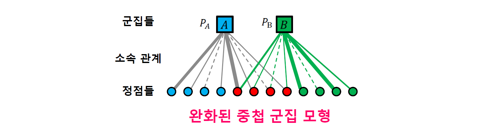
<small class="src" markdown=1>

출처: [Louvain method: Finding communities in large networks](https://sites.google.com/site/findcommunities/)

</small>

## 추천시스템

### 내용 기반 추천

내용 기반 추천(Content-based Recommendation)은 각 사용자가 구매/만족했던 상품과 유사한 것을 추천하는 방법이다.

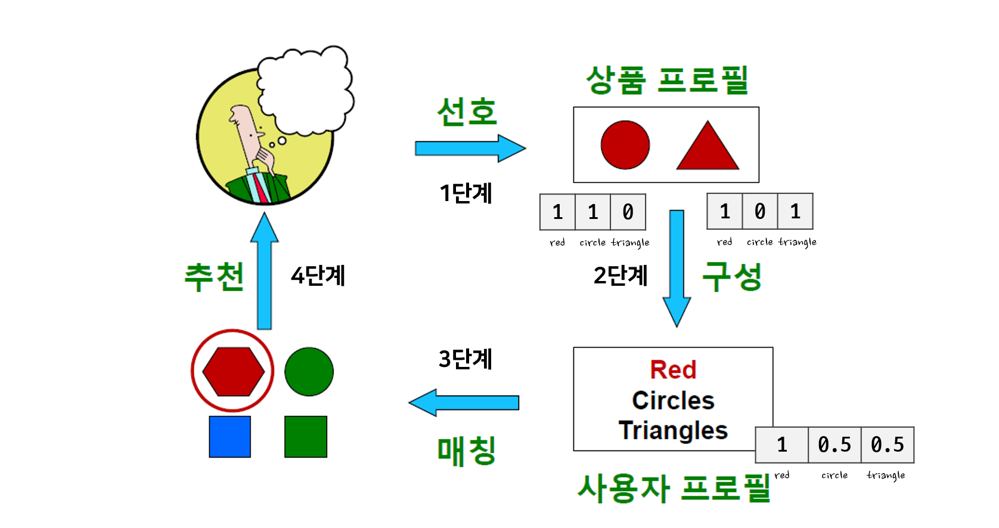
<small class="src" markdown=1>

출처: [Recommender Systems: Content-based Systems & Collaborative Filtering](http://www.mmds.org/mmds/v2.1/ch09-recsys1.pdf)

</small>

- `1단계` 사용자가 선호하는 상품들의 **상품 프로필**을 수집한다.
  - 상품프로필이란 해당 상품의 특성을 원-핫 인코딩으로 나타낸 벡터이다.
- `2단계` 상품 프로필을 바탕으로 **사용자 프로필**을 구성한다.
  - 사용자 프로필이란 상품 프로필을 선호도를 사용하여 가중 평균한 벡터이다.
- `3단계` 사용자 프로필 벡터 $\vec{u}$와 상품 프로필 벡터 $\vec{v}$의 코사인 유사도 $\frac{\vec{u} \cdot \vec{v}}{\lVert \vec{u} \rVert \lVert \vec{v} \rVert}$를 계산한다.
  - 코사인 유사도가 높을수록 사용자가 과거 선호했던 상품과 유사함을 의미한다.
- `4단계` 코사인 유사도가 높은 상품들을 사용자에게 추천한다.

### 협업 필터링

협업 필터링(Collaborative Filtering)은 <u>사용자와 비슷한 취향의 사용자들의 선호 상품을 찾아서 이를 추천해주는 방법</u>이다.

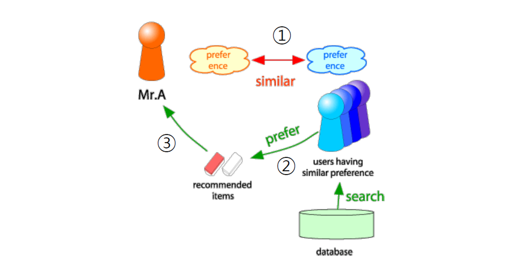
<small class="src" markdown=1>

출처: [Recommender Systems: Content-based Systems & Collaborative Filtering](http://www.mmds.org/mmds/v2.1/ch09-recsys1.pdf)

</small>

#### 1단계. 취향의 유사도 구하기

상관계수(Correlation Coefficient)를 사용해 **취향의 유사도**를 구하고 유사도가 높은 비슷한 취향의 사용자들을 찾는다. 유사도가 양이면 좋고 싫음의 취향이 비슷함을 의미하고 음이면 취향이 상반됨을 의미한다.

---

$$
sim(\textcolor{red}{x}, \textcolor{green}{y}) = \frac{\sum_{s \in S_{\textcolor{red}{x} \textcolor{green}{y}}} (r_{\textcolor{red}{x} s} - \overline{r_{\textcolor{red}{x}}})(r_{\textcolor{green}{y} s} - \overline{r_{\textcolor{green}{y}}})}{\sqrt{\sum_{s \in S_{\textcolor{red}{x} \textcolor{green}{y}}} (r_{\textcolor{red}{x} s} - \overline{r_{\textcolor{red}{x}}})^2}\sqrt{\sum_{s \in S_{\textcolor{red}{x} \textcolor{green}{y}}} (r_{\textcolor{green}{y} s} - \overline{r_{\textcolor{green}{y}}})^2}}
$$

- $r_{\textcolor{red}{x} s}$: 사용자 $\textcolor{red}{x}$의 상품 $s$에 대한 평점
- $\overline{r_{\textcolor{red}{x}}}$: 사용자 $\textcolor{red}{x}$가 매긴 평균 평점
- $S_{\textcolor{red}{x} \textcolor{green}{y}}$: 사용자 $\textcolor{red}{x}$와 $\textcolor{green}{y}$가 공동 구매한 상품

---

<strong>👀 취향의 유사도 예시 보기</strong>

다음과 같이 각 사용자의 영화 평점이 있다고 하자. 두 사용자 간의 취향 유사도는 평점이 매겨진 공통 영화를 대상으로 계산된다.

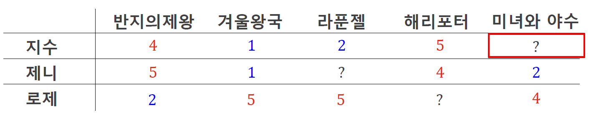

- 지수와 제니의 취향 유사도

$$
\frac{(4-3)(5-3) + (1-3)(1-3)+(5-3)(4-3)}{\sqrt{(4-3)^2+(1-3)^2+(5-3)^2}\sqrt{(5-3)^2+(1-3)^2+(4-3)^2}} = 0.88
$$

- 지수와 로제의 취향 유사도

$$
\frac{(4-3)(2-4) + (1-3)(5-4)+(5-3)(5-4)}{\sqrt{(4-3)^2+(1-3)^2+(2-3)^2}\sqrt{(2-4)^2+(5-4)^2+(5-4)^2}} = -0.94
$$

위의 결과를 통해 지수와 제니의 취향이 비슷하다는 것을 알 수 있고 비슷한 취향의 사용자인 제니가 미녀와 야수를 좋아하지 않으므로 지수도 좋아하지 않을 확률이 높다고 추정할 수 있다.

#### 2단계. 평점 추정하기

취향의 유사도를 가중치로 사용한 상품 평점의 가중 평균을 통해 평점을 추정한다. 다음은 사용자 $\textcolor{red}{x}$와 상품 $\textcolor{blue}{s}$에 대한 평점을 $r_{\textcolor{red}{x} \textcolor{blue}{s}}$를 추정하는 경우이다.

---

$$
\hat{r_{\textcolor{red}{x} \textcolor{blue}{s}}} = \frac{\sum_{y \in N(\textcolor{red}{x}; \textcolor{blue}{s})} sim(\textcolor{red}{x}, y) \cdot r_{y\textcolor{blue}{s}}}{\sum_{y \in N(\textcolor{red}{x}; \textcolor{blue}{s})} sim(\textcolor{red}{x}, y)}
$$

- $N(\textcolor{red}{x}; \textcolor{blue}{s})$: 상품 $\textcolor{blue}{s}$를 구매한 사용자 중에 $\textcolor{red}{x}$와 취향이 가장 유사한 $k$명의 사용자

---

#### 3단계. 상품 추천하기

앞에서 추정한 평점이 가장 높은 상품을 사용자에게 추천한다.

### 내용 기반 추천과 협업 필터링의 장단점

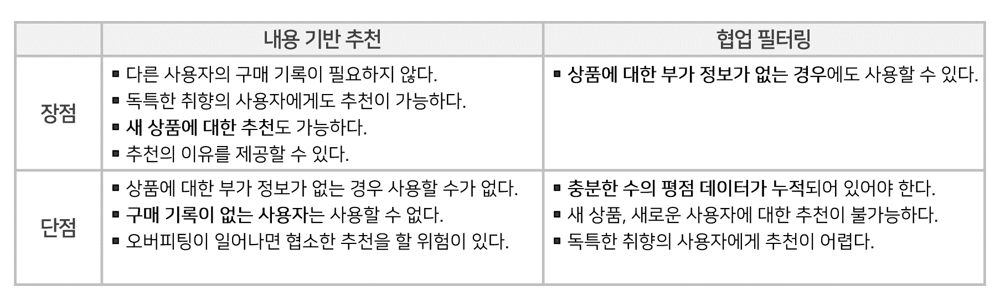

### 추천 시스템의 성능 평가

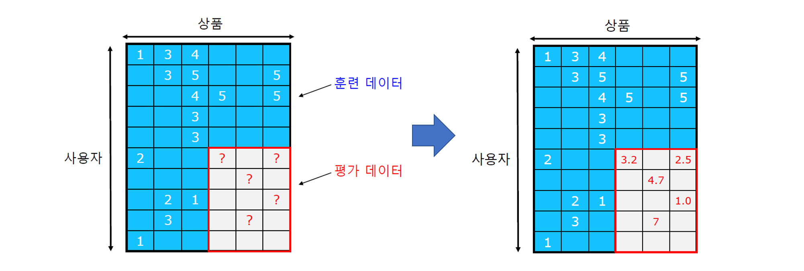
<small class="src" markdown=1>

출처: [Recommender Systems: Content-based Systems & Collaborative Filtering](http://www.mmds.org/mmds/v2.1/ch09-recsys1.pdf)

</small>

머신러닝이나 딥러닝의 모델을 평가하듯이 평가를 하기 위한 **평가 데이터**가 필요하다. 이를 위해 데이터를 <u>훈련 데이터(Train Data)와 평가 데이터(Test Data)로 분리</u>한다. 평가 데이터는 주어지지 않았다고 가정하고 학습을 한 뒤 평가 데이터의 평점을 추정한다.

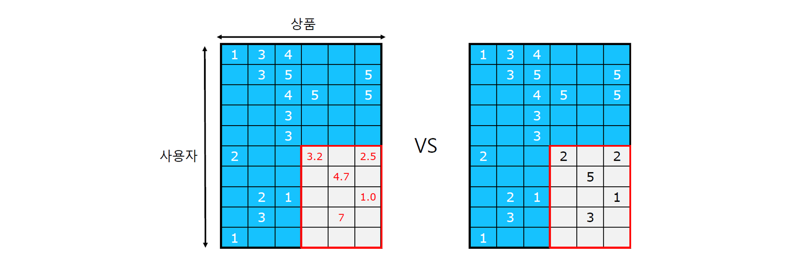
<small class="src" markdown=1>

출처: [Recommender Systems: Content-based Systems & Collaborative Filtering](http://www.mmds.org/mmds/v2.1/ch09-recsys1.pdf)

</small>

이렇게 <u>추정한 평점과 실제 평가 데이터를 비교하여 오차를 측정</u>한다. 이 때 오차를 측정하는 지표로 **평균 제곱 오차(Mean Squared Error, MSE)**를 사용한다. 이 외의 평가 지표로는 MSE에 루트를 씌운 **평균 제곱근 오차(Root Mean Squared Error, RMSE)**도 많이 사용되며, 순위, 실구매 비율 등 다양한 지표가 사용된다.

---

$$
MSE = \frac{1}{|T|} \sum_{r_{xi} \in T} (r_{xi} - \hat{r_{xi}})^2
$$

$$
RMSE = \sqrt{\frac{1}{|T|} \sum_{r_{xi} \in T} (r_{xi} - \hat{r_{xi}})^2}
$$

- $T$: 평가 데이터 내의 평점들의 집합

---
