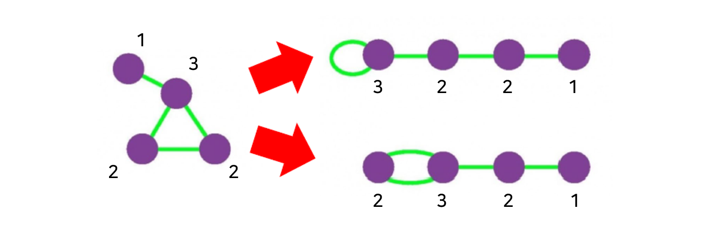
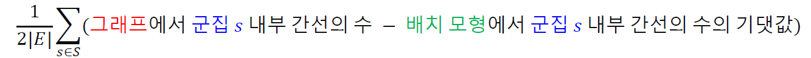
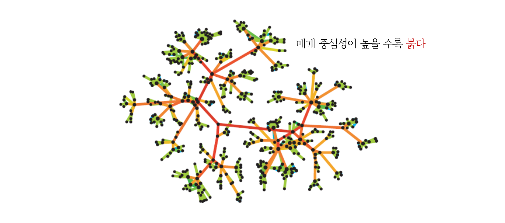
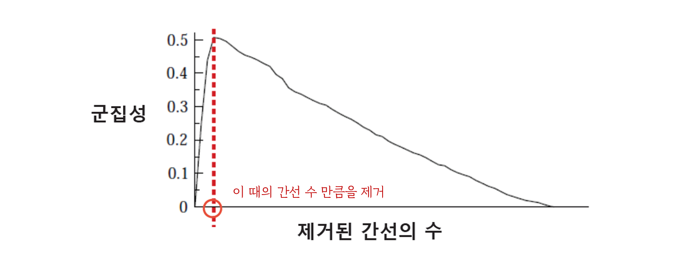
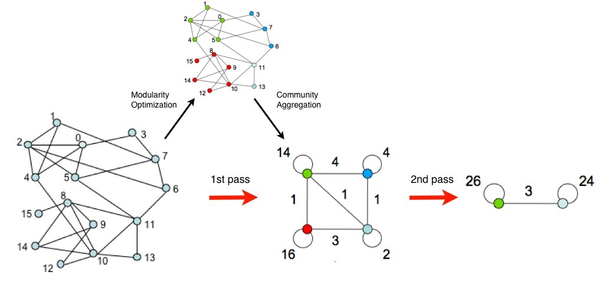
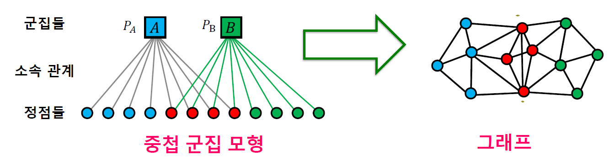
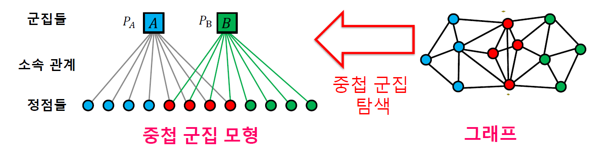
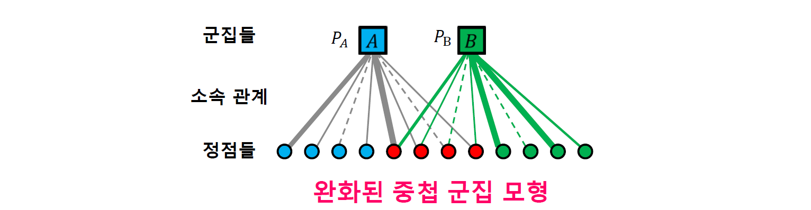
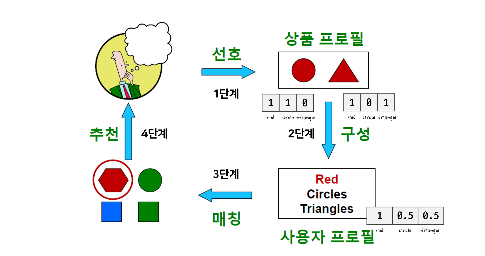

> 🙌은 **QnA에 있는 질문-답변**을 통해 얻은 지식을 표시합니다.

## [👉 피어 세션](https://github.com/boostcamp-ai-tech-4/peer-session/issues/85)

### 질문

### 기록

## Table of Contents

- [군집 구조](#군집-구조)
- [추천시스템](#추천시스템)

## 군집 탐색 문제

[👀 군집이 무엇일까?](../day21-20210222/#군집-구조)

군집 탐색 문제(Community Detection)이란 **그래프를 여러 군집으로 잘 나누는 문제**를 말한다. 그래프 데이터가 있을 때 비슷한 성질의 정점들을 묶어 군집화하는 것이다.

💡

군집 탐색과 클러스터링의 차이는 무엇일까?

군집 탐색은 **그래프**를 입력으로 받고 <u>군집성이 최대가 되도록 정점을 묶는 것</u>을 말한다. 반면 클러스터링은 입력으로 **피처가 있는 데이터**를 받으며 <u>중심점(Centroid)를 옮겨가며 중심점과 데이터 간의 거리가 짧도록 학습</u>하여 군집화를 한다.

### 군집 탐색의 지표: 군집성

`배치 모형`이란 <u>각 정점의 **연결성을 보존**한 상태에서 **간선들을 무작위로 배치**하여 얻은 그래프</u>를 말한다. 이 때 배치 모형에서 임의의 두 정점 $i$와 $j$ 사이에 간선이 존재할 확률은 두 정점의 연결성에 비례한다.

군집 탐색의 성공 여부를 판단하는 지표로 **군집성(Modularity)**을 사용한다. 군집성은 다음의 수식으로 계산할 수 있다. 군집성이 높다는 것은 배치 모형과 비교했을 때 그래프에서 군집 내부 간선의 수가 많다는 것을 의미한다. <u>군집성이 높을수록 성공한 군집 탐색이라고 본다.</u>

---

- $S$: 군집 $s$로 이루어진 군집들의 집합
- $|E|$: 간선들의 개수

---

이처럼 군집성은 무작위로 연결된 배치 모형과의 비교를 통해 **통계적 유의성**을 판단한다. 군집성은 -1과 1사이의 값을 가지며 보통 **0.3 ~ 0.7** 정도의 값을 가질 때 통계적으로 유의미한 군집을 찾았다고 할 수 있다.

💡

군집성을 계산할 때 배치모형에서 **기대값**을 사용하는 이유는 배치모형이 모작위성을 포함하기 때문이다!

### 군집 탐색 알고리즘

그럼 군집은 어떻게 만들어야 할까? 접근 방식에 따라 하향식(Top-Down)방식의 `Girvan-Newman 알고리즘`과 상향식(Bottom-Up)방식의 `Louvain 알고리즘`이 있다.

#### Girvan-Newman 알고리즘

Girvan-Newman 알고리즘은 <u>전체 그래프에서 탐색을 시작해 군집이 서로 분리되도록 간선을 순차적으로 제거</u>하는 방식을 사용한다.

그럼 어떤 간선을 제거할까? 바로 **매개 중심성(Betweenness Centrality)가 가장 높은 간선**을 제거한다. 매개 중심성이란 해당 간선이 정점 간의 최단 경로에 놓이는 횟수를 말한다. 간선 \$(x, y)의 매개 중심성은 다음과 같이 계산할 수 있다.

---

$$
\sum_{i < j} \frac{\sigma_{i, j} (x, y)}{\sigma_{i, j}}
$$

- $\sigma_{i, j}$: 정점 $i$로 부터 $j$로의 최단 경로 수
- $\sigma_{i, j}(x, y)$: 그 중 간선 $(x, y)$를 포함한 최단 경로 수

---

다음의 그림은 각 간선별 매개 중심성을 구해 정도에 따라 간선을 색칠한 그림이다. 매개 중심성이 높을수록 붉은 색을 띄는데, **다리 역할의 간선이 붉은 것**을 볼 수 있다.

다시 돌아가 Girvan-Newman 알고리즘이 무엇인지 알아보자. Girvan-Newman은 다음과 같이 진행된다.

- `1단계` 현재 그래프간선의 매개 중심성을 계산한다.
- `2단계` 매개 중심성이 가장 높은 간선을 제거하고 제거 후의 군집성을 계산한다.
- `3단계` 1, 2단계를 간선 모두가 제거될 때까지 반복한다.

그럼 얼마만큼의 간선을 제거하면 될까? `2단계`에서 군집성을 기록하여 **군집성이 최대가 될 때**의 간선의 수 만큼을 제거한다.

#### Louvain 알고리즘

Louvain 알고리즘은 <u>개별 정점에서 시작해 점점 큰 군집을 형성하는 방식</u>을 사용한다. Louvain 알고리즘은 다음과 같이 진행된다.

- `1단계` 개별 정점으로 구성된 크기 1의 군집에서 시작한다.
- `2단계` 각 정점 $u$를 군집성이 최대화되는 군집으로 이동시킨다.
- `3단계` 더이상 군집성이 증가하지 않을 때까지 2단계를 반복한다.
- `4단계` 각 군집을 하나의 정점으로 하는 군집레벨의 그래프를 얻은 뒤 2단계로 돌아간다.
- `5단계` 한 개의 정점이 남을 때까지 4단계를 반복한다.

### 중첩이 있는 군집 탐색

실제 그래프의 군집들은 **중첩**이 되어 있는 경우가 많다. 예를 들어, SNS에서 고등학교 친구이자 대학교 친구인 친구가 있는 것처럼 여러 군집에 속한 정점이 있을 수 있다.

#### 중첩 군집 모형

앞서 배운 Girvan-Newman 알고리즘과 Louvain 알고리즘은 <u>군집 간의 중첩이 없다</u>고 가정한다. 중첩이 있는 경우 다음과 같은 **중첩 군집 모형**을 가정한다.

- 각 정점은 여러 개의 군집에 속할 수 있다.
- 각 군집 $A$에 대해 같은 군집에 속하는 두 정점이 $P_A$ 확률로 연결된다.
- 두 정점이 여러 군집에 동시에 속할 경우 간선 연결 확률은 **독립적**이며, 군집 $A$와 군집 $B$에 동시에 속할 경우의 두 정점이 연결될 확률은 $1-(1- P_A)(1-P_B)$이다.
- 어느 군집에도 속하지 않는 두 정점은 낮은 확률 $\epsilon$로 연결된다.

이렇게 정의된 군집모형을 통해 **(그래프의 각 간선의 두 정점이 직접 연결될 확률) × (그래프에서 직접 연결되지 않은 각 정점쌍이 직접 연결되지 않을 확률)**을 곱한 확률을 가지고 간선을 이어 다음과 같은 그래프를 만들 수 있다.

반대로 그래프가 주어졌을 때 그래프의 확률을 최대화하는 중첩 군집 모형을 찾는 과정을 **중첩 군집 탐색**이라고 한다. 즉, 최대 가능도 추정법(MLE)를 통해 중첩 군집 모형을 찾는다.

#### 완화된 중첩 군집 모형

하지만 최대 가능도 추정법으로 군집 모형을 찾는 것은 매우 어렵다. 왜냐하면 각 정점이 군집에 속하는지 여부는 **이산적(Discrete)**이므로 <u>연속적(Continuous)인 파라미터를 최적화하는 기술(ex. 경사하강법)을 사용할 수가 없기 때문</u>이다.

그래서 중첩 군집 탐색을 조금 더 쉽게 하기 위해 **완화된 중첩 군집 모형**을 사용한다. 완화된 중첩 군집 모형은 각 정점을 각 군집에 속해 있는 정도를 실수값을 표현하다. 이 실수값은 SNS로 치면 각 군집의 소속감으로 생각할 수 있다.

## 추천시스템

### 내용 기반 추천시스템

내용 기반 추천(Content-based Recommendation)은 각 사용자가 구매/만족했던 상품과 유사한 것을 추천하는 방법이다.

- `1단계` 사용자가 선호하는 상품들의 **상품 프로필**을 수집한다.
  - 상품프로필이란 해당 상품의 특성을 원-핫 인코딩으로 나타낸 벡터이다.
- `2단계` 상품 프로필을 바탕으로 **사용자 프로필**을 구성한다.
  - 사용자 프로필이란 상품 프로필을 선호도를 사용하여 가중 평균한 벡터이다.
- `3단계` 사용자 프로필 벡터 $\vec{u}$와 상품 프로필 벡터 $\vec{v}$의 코사인 유사도 $\frac{\vec{u} \cdot \vec{v}}{\lVert \vec{u} \rVert \lVert \vec{v} \rVert}$를 계산한다.
  - 코사인 유사도가 높을수록 사용자가 과거 선호했던 상품과 유사함을 의미한다.
- `4단계` 코사인 유사도가 높은 상품들을 사용자에게 추천한다.

### 장단점

|          |                                                                                                                                                                                |
| :------: | :----------------------------------------------------------------------------------------------------------------------------------------------------------------------------: |
| `장점👍` | ◾ 다른 사용자의 구매 기록이 필요하지 않다. ◾ 독특한 취향의 사용자에게도 추천이 가능하다. ◾ **새 상품에 대한 추천**도 가능하다. ◾ 추천의 이유를 제공할 수 있다. |
| `단점👎` |      ◾ 상품에 대한 부가 정보가 없는 경우 사용할 수가 없다. ◾ **구매 기록이 없는 사용자**는 사용할 수 없다. ◾ 오버피팅이 일어나면 협소한 추천을 할 위험이 있다.      |

### 협업 필터링

### 추천 시스템의 성능 평가
