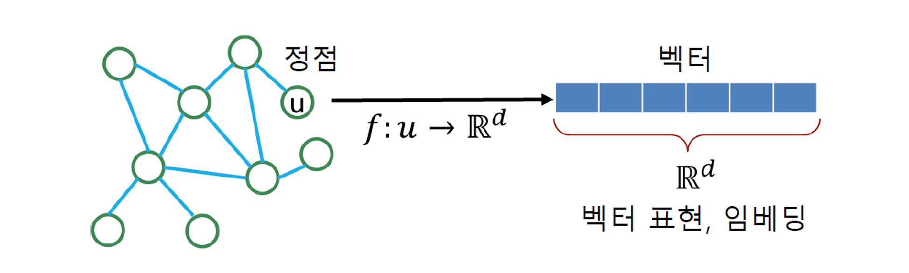
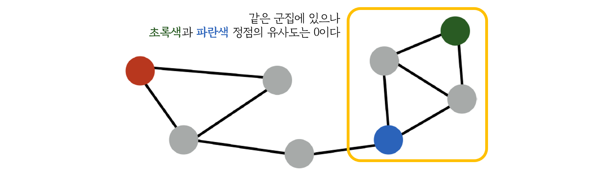
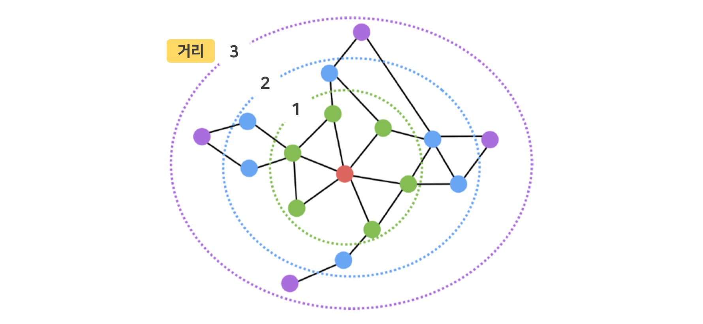
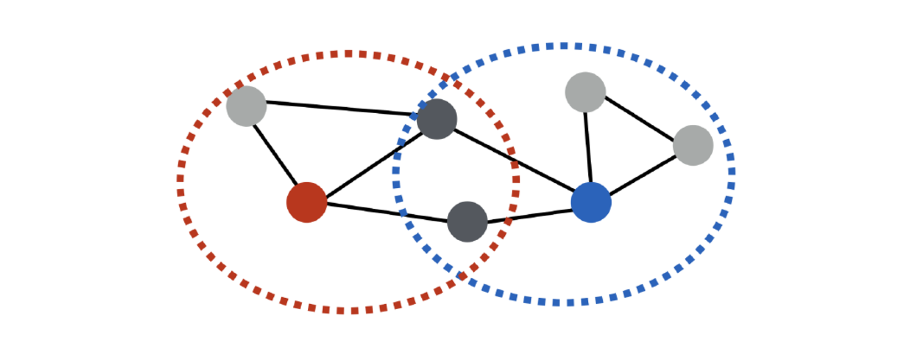

> 🙌은 **QnA에 있는 질문-답변**을 통해 얻은 지식을 표시합니다.

## [👉 피어 세션](https://github.com/boostcamp-ai-tech-4/peer-session/issues/89)

### 기록

- 오늘은 `네거티브 샘플링`과 수식에서 `모형 복잡도` 관련한 부분에 관해 이야기를 나누었다.
  - 네거티브 샘플링은 경사하강법에서 모든 데이터를 사용하지 않는 것처럼 일부 데이터만 사용하는 것이라 생각하긴 했는데 정확하지는 않다. 더군다나 NLP 쪽 내용 밖에 없어서 더 모르겠다ㅠ.ㅠ
  - 모형 복잡도 부분은 오버피팅을 막기 위한 Weight Decay로 준 패널티이다.
- 오늘 Further Question에서 "추천시스템 성능 향상을 위해 더 고려할 수 있는 것이 무엇인가?"라는 질문이 있었는데 [NHN Forward](../../penguin/nhn-forward-2019/)에서 한양대 교수님의 특강 내용을 공유했다. 보통 추천시스템의 경우 평점이 있는 데이터를 기반으로 하는데 평점 데이터는 전체 데이터에서 4% 정도이고 나머지 96%는 버린다고 한다. 교수님은 **버린 96%에 좀 더 초점을 둔 방식**을 말씀하셨고 피어세션에서 이 부분에 대해서 이야기를 했다.

## Table of Contents

## 정점 표현 학습

### 정점 표현 학습이란?

정점 표현 학습이란 **그래프의 정점들을 벡터의 형태로 표현하는 것**을 말한다.

- 정점 임베딩은 정점 표현 학습 혹은 임베딩된 벡터를 의미한다.
- 입력은 그래프이고 출력은 주어진 그래프의 정점 $u$에 대한 벡터 표현 $z_u$이다.

그럼 왜 정점 표현 학습을 할까? 바로 <u>벡터 형태의 데이터를 위한 도구들을 사용</u>하기 위해서다! 원래라면 그래프를 입력으로 받는 특수한 알고리즘만 사용할 수 있었지만 그래프를 벡터로 바꾸면 분류(ex. 로지스틱 회귀, 다층 퍼셉트론), 군집 분석 알고리즘(ex. K-Means, DBSCAN)과 같은 알고리즘을 사용할 수 있다.

#### 기준: 정점 유사도

정점 표현 학습은 그래프의 정점 간 유사도를 임베딩 공간에 그대로 반영이 되도록 학습을 한다. 즉, 그래프의 정점 간 유사도와 임베딩 공간의 벡터의 유사도가 같도록 학습을 한다.

먼저 임베딩 공간에서의 유사도를 정의하자. 임베딩 공간에서의 유사도는 임베딩 벡터 $u$와 $v$의 내적인 $z_v^Tz_u$이다. 두 벡터가 같은 방향을 향하고 크기가 클수록 유사도는 큰 값을 가진다.

$$
similarity(u, v) \approx z_v^Tz_u = \lVert z_u \rVert \cdot \lVert z_v \rVert \cdot cos(\theta)
$$

그럼 그래프의 정점 유사도인 $similarity(u, v)$는 무엇을 기준으로 정의할까? 여러 가지 방법이 있으며, 여기서는 인접성 기반 접근법, 거리/경로/중첩 기반 접근법, 임의보형 기반 접근법에 대해 알아보자.

### 인접성 기반 접근법

인접성 기반 접근법은 **두 정점이 인접할 때** 그래프의 정점이 유사하다고 간주한다.

- 두 정점 $u$와 $v$가 인접하다는 것은 <u>두 정점을 연결하는 간선이 있다</u>는 것을 의미한다.
- 인접 행렬 $A$의 요소 $A_{u, v}$는 정점 $u$와 $v$의 연결 여부를 나타내므로 $A_{u, v}$는 두 정점 $u$와 $v$의 유사도로 볼 수 있다.

#### 손실 함수

인접성 기반 접근법의 손실함수 $\mathcal{L}$은 다음과 같다. **정점 표현 학습은 이 손실 함수가 최소가 되는 임베딩 벡터를 찾는 것을 목표로 한다.** 이 때 최소화를 위해 확률적 경사 하강법(SGD) 등의 방법이 사용된다.

---

$$
\mathcal{L} = \sum_{(u, v) \in V \times V} \lVert z_u^Tz_v - A_{u, v} \rVert^2
$$

- $(u, v) \in V \times V$: 모든 정점 쌍
- $z_u^Tz_v$: 임베딩 공간에서의 두 벡터의 유사도
- $A_{u, v}$: 인접성 기반 접근법으로 본 그래프의 유사도

---

인접성 기반 접근법은 오직 인접성을 가지고만 유사성을 판단하기 때문에 한 간선으로만 연결되어 있지 않은 두 정점의 유사도는 0이 된다. 만약 두 정점이 같은 군집에 있더라도 직접 연결이 되어있지 않는다면 유사도는 0이다.

아래와 같은 그림에서 파란색 정점은 초록색 정점과 같은 군집에 있는 것을 볼 수 있는데 한 번에 갈 수 없으므로 이 두 정점의 유사도는 0으로 취급된다.

### 거리 기반 접근법

거리 기반 접근법은 **두 정점 사이의 거리가 충분히 가까운 경우** 유사하다고 간주한다.

위와 같은 그래프가 있고 충분히 가까운 경우의 기준을 **2**라고 하자.

빨간색 정점을 기준으로 봤을 때 초록색과 파란색 정점과의 거리는 2이하이므로 유사도는 1이고, 보라색 정점과의 거리는 3이므로 유사도가 0이다.

### 경로 기반 접근법

경로 기반 접근법은 **두 정점 사이의 경로가 많을 수록** 유사하다고 간주한다.

- 두 정점 $u$와 $v$ 사이의 경로 중 거리가 $k$인 경우의 수를 구한다.
- 이 경우의 수가 많을수록 두 정점은 유사도는 높다.

이 때, 두 정점 $u$와 $v$ 사이의 경로 중 거리가 $k$인 경우의 수는 인접 행렬 $A$의 $k$ 제곱의 $(u, v)$ 요소와 같다. 인접행렬 $A$를 가지고 손실 함수를 나타내면 다음과 같다.

$$
\mathcal{L} = \sum_{(u, v) \in V \times V} \lVert z_u^Tz_v - A^k_{u, v}\rVert^2
$$

- $A^k_{u,v}$: 정점 $u, v$사이의 경로 중 거리가 $k$인 경로의 개수
- $(u, v) \in V \times V$: 모든 정점 쌍을 고려

3### 중첩 기반 접근법

중첩 기반 접근법은 **두 정점이 많은 이웃을 공유할수록** 유사하다고 간주한다.

위와 같은 그래프가 있을 때, 빨간색 정점과 파란색 정점은 2개의 정점을 공유하고 있다. 이 때, 두 정점의 유사도는 2이다. 반면 연한 회색 정점은 아무 이웃도 공유하지 않으므로 유사도는 0이다.

#### 공통 이웃 수

두 정점의 공통 이웃 수 $S_{u,v}$는 다음과 같이 정의할 수 있다. 정점 $u$의 이웃집합 $N(u)$와 정점 $v$의 이웃집합 $N(v)$에서 공통된 이웃의 개수를 세면 된다.

$$
S_{u,v} = |N(u) \cap N(v)| = \sum_{w \in N(u) \cap N(v)} 1
$$

공통 이웃 수 $S_{u, v}$로 정의된 손실함수는 다음과 같다.

$$
\mathcal{L} = \sum_{(u, v) \in V \times V} \lVert z_u^Tz_v - S_{u,v}\rVert^2
$$

- $S_{u,v}$: 정점 $u$와 $v$의 공통 이웃 수
- $(u, v) \in V \times V$: 모든 정점 쌍을 고려

#### 자카드 유사도와 Adamic Adar 점수

공통 이웃 수 대신 자카드 유사도나 Adamic Adar 점수를 사용하기도 한다.

- 자카드 유사도: 공통 이웃의 비율

$$
\frac{|N(u) \cap N(v)|}{|N(u) \ cup N(v)}
$$

- Adamic Adar 점수: 공통 이웃 각각에 가중치를 부여하여 가중합을 계산한 결과

$$
\sum_{w \in N(u) \cap N(v)} \frac{1}{d_w}
$$

- $w$: 정점 $u$와 $v$의 공통 이웃 중 하나
- $d_w$: 정점 $w$의 간선의 수
  - 연결성이 높을수록 즉, 간선이 많을수록 가중치는 작아진다.
  - 왜? 인기 있는 가수의 인스타 계정이 수백만명의 팔로워를 갖고 있지만 그 팔로워들이 서로 친하지는 않는다. 오히려 팔로워 수는 적은 개인 계정의 경우 팔로워 사이에 친분이 있을 가능성이 높다.

### 임의보행 기반 접근법

임의보행 기반 접근법은 **한 정점에서 시작하여 임의 보행을 할 때 다른 정점에 도달할 확률**을 유사도로 간주한다.

#### 임의보행이란?

임의보행이란 **현재 정점의 이웃 중 하나를 균일할 확률로 선택하여 이동하는 과정**을 말한다.

기존의 거리/경로 기반의 접근법에서는 거리를 $k$로 제한했지만, 임의보행 접근법에서는 거리를 제한하지 않으므로 시작 정점 주변의 지역적 정보와 그래프 전역 정보 모두를 고려한다는 장점이 있다.

#### 임의보행 과정

임의보행 기반 접근법은 다음과 같은 과정을 거친다.

1. 각 정점에서 시작해 임의보행을 반복 수행한다.
2. 각 정점에서 시작한 임의보행 중 도달한 정점들의 리스트를 구성한다.

- 정점 $u$에서 시작한 임의보행 중 마주친 정점 리스트를 $N_R(u)$라고 한다.
- 한 정점을 여러 번 도달한 경우 해당 정점은 $N_R(u)$에 여러 번 포함될 수 있다.
- 손실함수가 최소화되도록 학습을 진행한다.
  - $P(v|z_u)$: $u$에서 시작한 임의보행이 $v$에 도달할 확률로 추정 결과를 의미한다.

#### 도달확률 \$P(v|z_u)는 어떻게 추정할까?

도달 확률 $P(v|z_u)$는 임베딩 벡터의 내적과 softmax함수를 사용하여 추정한다.

$$
P(v|z_u) = \frac{exp(z_u^Tz_v)}{\sum_{n \in V} exp(z_u^Tz_n)}
$$

- $P(v|z_u)$가 크다 → $-\log P(v|z_u)$는 작다 → 손실함수가 작다 → 추정이 잘 됐다👍
- $P(v|z_u)$가 작다 → $-\log P(v|z_u)$는 크다 → 손실함수가 크다 → 추정이 잘 안 됐다👎

위의 내용을 종합하여 나타낸 손실함수는 다음과 같다.

$$
\mathcal{L} = \sum_{u\in V}\sum_{u\in N_R(u)} -\log \left( \frac{exp(z^T_uz_v)}{\sum_{n\in V} exp(z^T_u z_n)} \right)
$$

#### Node2Vec

앞서 균일한 확률로 이동하는 것을 DeepWalk 방식이라고 한다. 반면 Node2Vec은 현재 정점과 직전에 머물렀던 정점을 모두 고려하여 다음 정점을 선택하는 2차 치우친 임의보행 방식을 사용한다.

Node2Vec은 직전 정점의 거리를 기준으로 차등적인 확률을 부여한다.
다음과 같은 그래프가 있고 $u$에서 시작해 임의보행으로 $v$에 도착했다고 가정해봦.
$x$는 $u$를 기준으로 봤을 때 거리가 유지되므로 거리는 1이고

### 변환식 정점 표현 학습의 한계

## 개선된 추천시스템

**[👀 내용 기반 추천시스템과 협업필터링 복습하기](../day23-20210224/#추천시스템)**

### 넷플릭스 챌린지

### 잠재 인수 모형

### 고급 잠재 인수 모형

#### 사용자와 상품의 편향을 고려

#### 시간적 편향을 고려
