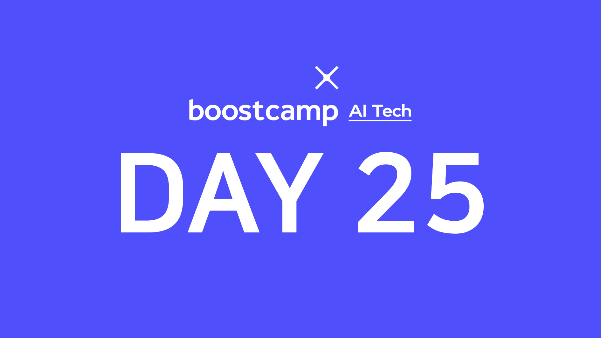

> 🙌은 **QnA에 있는 질문-답변**을 통해 얻은 지식을 표시합니다.

## [👉 피어 세션](https://github.com/boostcamp-ai-tech-4/peer-session/issues/91)

### 질문

- [[히스] CNN 과 GNN](https://github.com/boostcamp-ai-tech-4/peer-session/issues/90)

### 기록

오늘은 질문도 했지만 **서로의 고민을 나누는 시간**을 가졌다. 나도 그렇고 팀원 중에도 "모델링보다는 개발이 더 재밌다", "AI를 공부하면서 오히려 흥미가 조금 떨어진다"는 그런 고민이 있었다. 사실 AI모델링 쪽은 개발보다도 연구 쪽에 좀 더 초점이 맞춰진 거라 개발을 원하는 사람에게는 조금 힘든다는 생각도 든다.

어쨌든 `중간정검`을 할 겸 팀원들과 이야기를 나누었고 **나와 같은 고민을 하는 사람**을 만나서 너무 좋았다. 학교에서는 각자 진로도 천차만별이고 주변에 인공지능을 진로로 잡은 사람이 없어서 혼자 고민을 많이 했는데 이런 시간을 가지면서 나와 같은 사람이 있구나 하며 위안을 얻었다. 이런 시간을 자주는 아니더라도 가끔씩 가지면 좋겠다.
