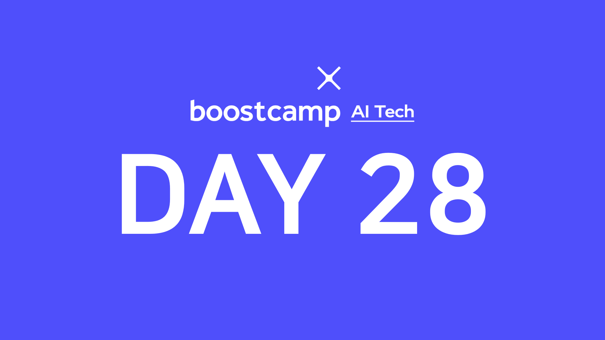

> 💡 이번 주는 부스트캠프와 [UpStage](https://www.upstage.ai/)에서 준비한 특강으로 수업이 진행됩니다!  
> 특강 자료는 비공개이므로 간단히 제 느낀점과 생각을 적습니다.

## [👉 피어 세션](https://github.com/boostcamp-ai-tech-4/peer-session/issues/92)

- 특강과 관련해서 자신의 생각을 이야기해보는 시간을 가졌다. 특히 나와 같이 **개발을 하고 싶은 분들**은 이번 강의가 정말 도움이 많이 되었다고 하셨다.
- 정말 재미있는 점은 모든 마스터세션 때 "AI 엔지니어가 되려면 석사를 해야될까요?"라는 질문이 있었는데 `대학 교수님`이신 마스터분들의 경우 석사를 하는 게 좋다고 하셨고 아직 두 분 밖에 안 뵈었지만 `기업`에서 일하시는 분들은 "학부생도 할 수 있다"고 하셨다. 사실 교수님도 그렇고 오늘 마스터분들도 하신 답변이 다 맞는 말이라고 생각한다. 석사든 학사든 가장 중요한 것은 자신의 역량을 기르는 것이 아닐까 한다.
- 내일은 **캐글 그랜드 마스터님의 꿀팁**과 **ML Fullstack Engineer** 와 관련된 특강이 준비되어 있다. 한 때 데이터분석을 공부했어서 그랜드 마스터인 마스터 분의 꿀팁이 궁금하기도 하고 현재 개발을 하고 싶은 나로썬 ML Fullstack Engineer 관련 이야기도 정말 기대가 된다. 각 특강마다 2개의 질문을 준비했고 내일 질문 마감시간 전에 더 좋은 질문이 있으면 추가하기로 했다!

## 특강 1: 서비스 향 AI 모델 개발하기

> lectured by [이활석 마스터님👨‍💻](https://github.com/hwalsuklee)

연구가 아닌 **AI 서비스를 출시하는 관점에서 어떤 과정을 거쳐야하는지** 세부적으로 알 수 있는 강의였다. 보통 AI를 한다고 하면 모델링을 떠올리고 서비스단까지 생각하면 프론트/벡엔드 정도를 떠올리는데, 실제 AI 서비스를 개발하는 과정을 보니 훨씬 더 많은 작업이 필요했다. 특히 AI 서비스의 경우 학습데이터가 없기 때문에 <u>학습데이터를 수집하는 과정이 필요</u>한데 외부업체와의 협력이 정말 중요했다. 그 외에도 여러 개의 작업을 거친다면 <u>모델이 2개 이상은 필요</u>했고 각 모델마다 기준을 정해야 했다.

이런 부분은 어느 강의에서도 배울 수 없었는데 AI서비스를 만들기까지의 모든 과정을 예시로 상세히 설명해주셔서 정말 좋았다.

## 특강 2: AI 시대의 커리어 빌딩

> lecture by [박은정 마스터님👩‍💻](https://www.lucypark.kr/)

"연구와 엔지니어링 중 어떤 걸 선택할지", "엔지니어링이라면 어떤 분야를 선택해야할지"에 대해 배울 수 있었다. 박은정 마스터님 강의도 좋았지만 마스터세션 때 `질문에 대한 답변`을 잘해주셔서 거기서 많은 것을 얻을 수 있었다.

특히 나의 경우 모델링, 연구보다는 개발을 더 하고 싶었고 **AI 서비스를 개발하는 프론트/백엔드 개발자**가 되고 싶은데, 마스터님께서 확실히 이 쪽 수요가 많고 개발을 잘 하고 거기에 AI역량도 어느 정도 갖춘 사람이라면 정말 많은 곳에서 원할 것이라고 말씀하셨다.

부스트캠프를 하면서 모델링이 내 쪽이 아닌 것 같은데 논문을 읽으면서 더 공부를 해야하나 싶었는데 그것보다는 <u>매일 주어진 강의와 과제를 하면서 잘 수료하고 내가 하고싶은 개발을 잘 병행</u>하면서 나머지 3, 4개월을 보내야겠다.
