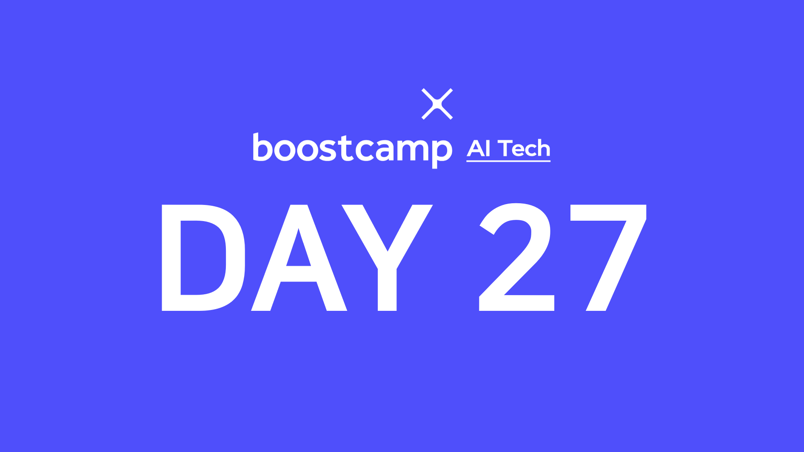

> 💡 이번 주는 부스트캠프와 [UpStage](https://www.upstage.ai/)에서 준비한 특강으로 수업이 진행됩니다!  
> 특강 자료는 비공개이므로 간단히 제 느낀점과 생각을 적습니다.

## [👉 피어 세션](https://github.com/boostcamp-ai-tech-4/peer-session/issues/93)

- Kaggle 관련 특강에서는 대부분 비슷한 생각을 가지고 있었다. 워낙 Kaggle 진입장벽이 높고 하드웨어 리소스도 잘 마련되어 있지 않아서 현실적으로 우리에게는 조금 힘들지 않을까 싶다. 그래도 좋은 꿀팁을 많이 알 수 있어서 좋았고 한 번쯤은 **나에게 맞는 Kaggle 대회를 찾아서 해보자**는 의견이 있었다.
- Full Stack ML Engineer 특가을 듣자마자 현재 `인공지능 부서`에 들어가신 팀원분이 말하기를 "사수가 ML엔지니어도 프론트엔드와 백엔드를 할 줄 알아야 한다"고 하는 것을 듣고 정말 신기했다. 카카오엔터프라이즈에서는 프로토타입 개발자를 따로 구하던데 조금 더 소규모인 경우는 이것저것 다 겸하는 것 같다.
- 내일은 자연어처리 언어 모델과 저작권법에 관련된 특강이 있다. 특히 최근에 있었던 [이루다](https://www.yna.co.kr/view/AKR20210210156500017) 사건으로 인해서 **데이터 수집에 관한 허락 혹은 저작권** 관련해서 더 Issue가 되고 있는 것 같은데 그런 부분에 대한 마스터님의 의견을 듣고 싶다.

## 특강 3: 캐글 그랜드마스터의 경진대회 노하우 대방출

> lectured by [김상훈 마스터님👨‍💻](https://blog.ebaykorea.com/archives/15516)

Kaggle을 시작한다면 **도움이 되는 여러 팁**을 얻을 수 있었다. 대부분 알고 있는 내용이긴 했지만 "싱글 모델부터 시작해 대회 마감 1, 2주 전에는 앙상블로 성능을 최대한 끌어올린다"든지, "Jupyter Notebook에서도 Terminal을 사용할 수 있다"든지 등을 배웠다.

사실 Kaggle 진입장벽이 은근 높기도 하고 정말 큰 대회의 경우 <u>Google Colab Pro를 사용하거나 비싼 GPU를 구매하는 것은 필수</u>인 것 같다. 하지만 현재 대학생 신분으로는 조금 불가능하지 않을까라는 생각한다.

또 강사님께서 `은메달`만 따도 취업하는데 있어서 많은 도움을 준다고 하셨는데 사실 국내 대회에서도 메달 한 번 못 따봤는데 "할 수 있을까?"라는 의문(?)이 좀 들었다. 그래도 조금 자신감을 갖고 나에게 맞는 Kaggle 대회를 찾아 도전해보는 것도 좋을 것 같다.

## 특강 4: Full Stack ML Engineer

> lecture by [이준엽 마스터님👨‍💻](http://www.aitimes.com/news/articleView.html?idxno=132810)

[DAY 27. 특강 첫째 날](../day27-20210302)에 언급했다 싶이 나는 모델링보다는 개발을 더 하고 싶다. 그래서 이번 특강의 경우 매우 흥미롭게 들었지만 살짝 나와 노선이 다른 느낌도 있었다. 여기서 말하는 **Full Stack ML Engineer**는 말 그대로 프론트, 백엔드, 모델링 등 다 할 수 있는 엔지니어를 말하고 초점을 두자면 `모델링`에 조금 떠 뿌리가 깊은 직무이다.

특강을 들어보면은 <U>혼자서 많이 일하시는 것</u> 같은데, 모델과 프론트엔드/백엔드를 연결시켜서 빨리 프로토타입을 내려면 어쩔 수 없는 것 같다. 사실 풀스택이란 말이 정말 멋져보이기는 하지만 하나를 깊게 파지 못하는 느낌이 조금 있고, 다른 것보다는 인공지능에 더 초점을 맞춘 거라서 나와는 조금 다르지 않을까하는 생각도 들었다. 참 진로가 많이 고민이 된다😥
