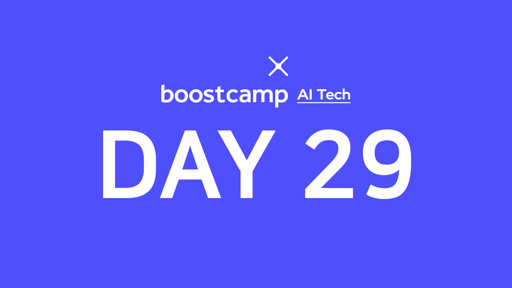

> 💡 이번 주는 부스트캠프와 [UpStage](https://www.upstage.ai/)에서 준비한 특강으로 수업이 진행됩니다!  
> 특강 자료는 비공개이므로 간단히 제 느낀점과 생각을 적습니다.

## [👉 피어 세션](https://github.com/boostcamp-ai-tech-4/peer-session/issues/94)

- NLP 특강은 4주차 자연어처리 내용의 연장선이라는 느낌의 의견이 많았다. 그래도 NLP 벤치마크와 마스터님이 현재 하고계신 한국어 벤치마크 관련 내용을 들을 수 있어서 흥미로웠다. 저작권 특강은 처음 접하는 내용이기도 해서 모두 유용하게 들었다고 한다.
- 내일은 종만북으로 유명하신 [구종만 마스터님](https://book.algospot.com/)의 **퀀트 트레이드 특강**과 카이스트 교수님이신 [오혜연 마스터님](https://uilab.kaist.ac.kr/)의 **AI윤리 특강**이 진행된다!
  - 아는 경제학부 후배가 퀀트 트레이드에 관심이 있어서 한 번 들어본 적 있는데 PPT를 봤지만 내용이 너무 어렵다😥 주식 용어도 은근 있어서 특강을 들어야 이해할 수 있을 것 같다.
  - AI윤리도 정말 기대되는 주제 중 하나인데 전통적인 윤리 문제(ex. 트롤리 문제)는 인공지능이 어떻게 대응하는지, 해결을 했는지 등을 듣고 싶다.
- 부캠을 하면서 코딩테스트도 준비해야하고 CS기초도 다져야 하고 개발도 해야하고 정말 할 게 많다. 나 뿐만 아니라 다른 팀원들도 할 게 너무 많아서 `부담감`을 느끼는 것 같다. 나도 아직 허덕이고 있지만 **"짧은 시간, 적어도 30분이라도 공부해보자"**는 의견을 내봤다. 부캠 하기 전에는 짧은 시간동안 꾸준히 공부해서 근 1달은 정말 꾸준히 공부를 했었다. 그 때의 경험을 다시 떠올려서 다시 열심히 해야겠다! (모두 화이팅💪💪)

## 특강 5: NLP를 위한 언어 모델의 학습, 평가

> lectured by [박성준 마스터님👨‍💻](https://brunch.co.kr/@learning)

언어 모델(Lanuage Model)과 NLP 밴치마크 GLUE 더 나아가 한국어 벤치마크 KLUE에 관해서 배울 수 있었다. 4주차 NLP 자연어처리 추가 내용같았지만 <u>헷갈렸던 언어 모델을 이번 특강에서 이해할 수 있었다.</u> 언어 모델이라는 게 결국 **사람이 텍스트를 이해하는 과정**이고 이것만 잘 해낸다면 QA, NER 등 다양한 Task를 수행할 수 있다는 것이 정말 신기했다.

또한 마스터님은 본전공이 심리학이시고 박사전공이 컴퓨터공학이신데 `전산심리학`이라는 자신만의 길을 개척하셨다. 팀원 중에도 심리학 전공이신 분이 있어 간간히 Smalltalk으로 심리학 관련 이야기를 듣고 있는데 <u>사람이 아닌 컴퓨터가 진단을 한다는 것을 심리학계에서는 매우 부정적으로 받아들인다</u>고 한다. 그런 상황에서 자신의 길을 개척하시는 것이 정말 멋있다고 생각하고 나도 내가 관심있는 분야와 인공지능을 결합시켜 나만의 무언가를 만들고 싶다는 생각이 들었다.

## 특강 6: AI와 저작권법

> lecture by [문지형 마스터님👩‍💻](https://inmoonlight.github.io/)

기대했던 특강 중 하나였는데 교양을 듣듯이 재미있게 들을 수 있었다! 개인 프로젝트든, 회사 프로젝트든 **데이터의 출처**가 정말 중요한데 제대로 지키지 않으면 나중에 법적으로 접촉될 수 있다. 예를 들면, 기사관련 모델을 만든다고 할 때 <u>기사 본문은 저작권을 가져서 저작자인 언론사의 허락 없이는 사용할 수 없다</u>고 한다. 다만 기사 제목의 경우 저작권을 갖지 않으므로 제목은 크롤링이 가능하다고 한다.

그 외에 `공공데이터`, `이루다`, `야놀자 소송`, `데이터3법` 등에 관련해서 마스터님의 의견을 들을 수 있었다. 들어보면 아직 우리나라의 데이터법은 인공지능 산업이 발전되는데 적절하지 않은 법이 많은 것 같다. 예를 들면, 데이터3법에 비식별화 가이드라인이 있는데 이를 마스킹할 경우 BERT같은 모델에서는 잘 인식을 못해서 학습 성능이 떨어진다고 한다. 또한 데이터에 따라 식별/비식별 조건도 다 다르게 해석되고 있다고 한다.

그 외에 재밌게 들은 문제는 "기사를 요약하는 모델이 만든 요약본의 저작권은 누가 갖는가?"였다. 즉, 생성모델이 만든 `결과물의 저작권`을 누가 가지냐인데 아직 한국에는 관련 법이 없다고 한다. 미국에는 관련 법이 있지만 주마다 다르게 판결한다고 한다. 곰곰히 생각해보면 **단순 요약**의 경우 우리가 책을 보고 요약정리를 하면 그게 우리에게 저작권이 없듯이 요약은 <u>원저작자가 저작권을 갖지 않을까</u> 생각한다. 그 외에 **새로운 이미지, 새로운 소설을 만드는 것**은 <u>인공지능에게 저작권이 있지 않을까</u> 조심히 생각해본다.
