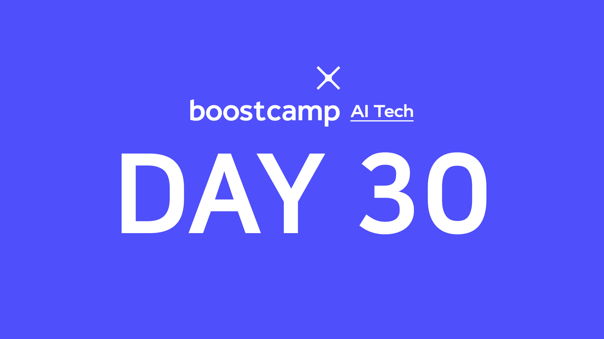

> 💡 이번 주는 부스트캠프와 [UpStage](https://www.upstage.ai/)에서 준비한 특강으로 수업이 진행됩니다!  
> 특강 자료는 비공개이므로 간단히 제 느낀점과 생각을 적습니다.

## [👉 피어 세션](https://github.com/boostcamp-ai-tech-4/peer-session/issues/95)

- 드디어 특강 마지막 날이다! 평소처럼 오늘 특강에 대한 의견을 나누었고 "인공지능은 경쟁상대가 아니라 협력상대이다"라는 오혜연 마스터님의 의견에 크게 공감을 했다.
- 마지막 날이어서 남은 시간에 네이버 입사 질문인 **"진짜 꿈이 뭔가요?"**에 대해 이야기를 나누었다. "이런 프로덕트를 만들고 싶다"는 개발에 대한 꿈부터 "건물주가 되고 싶다"처럼 인생 설계에 관한 꿈까지 정말 다양했다. 나의 꿈은 "대전에 정착하기"와 "친구들과 모여서 재밌는 프로덕트 만들기"인데, 첫 번째 꿈을 이루려면 "재택근무가 가능한 곳에 취업하기" 혹은 "카이스트 가기"를 먼저 이뤄야할 것 같다.
- 중간에 **[제리님🐹](https://github.com/jjerry-k)**이 깜짝 방문하셨다! 조교님께도 동일한 질문을 드렸는데 `장기적인 꿈`과 `단기적인 꿈`으로 나누어 답변을 해주셨다. 그래서 우리도 단기적인 목표가 무엇인지 이야기를 나누었다. 물론 내 단기적인 목표는 **졸업**이다^^ 바로 취업이 되면 좋겠지만 빨리 졸업하고 싶은 마음이 크다. 제발 이번 학기에 졸업하길🙏

## 특강 7: AI + ML 과 Quant Trading

> lectured by [구종만 마스터님👨‍💻](http://theyearlyprophet.com/)

머신러닝 모델을 이용하여 트레이딩하는 퀀텀 트레이딩을 엿볼 수 있었다. 다만 주식을 잘 몰라서 내용을 완벽히 이해하기 힘들었다. 그리고 구종만 마스터님은 일명 `종만북`으로 불리는 [알고리즘 문제 해결 전략 세트](http://www.yes24.com/Product/Goods/8006522)의 저자이신데 그래서 그런지 QnA 시간에 **알고리즘 관련 질문**이 꽤 나왔다. 예를 들면, "알고리즘 공부가 개발할 때 도움이 되는지?", "알고리즘은 재능인지? 노력인지?" 등이 있었다. 마스터님이 말씀하시길 "알고리즘이 개발에 직접적인 도움을 주지는 않지만 기초체력 다지듯 개발의 기본은 될 수 있다"고 하셨고 "경험적으로 재능이 있는 사람이 열심히 한다"고 하셨다.

QnA 시간에 가장 기억에 남는 말씀이 있었는데, **"나는 어디에 있고, 무엇을 향해 가야하는지 끊임없이 고민하는게 중요하다"**였다. 고입, 대입을 거쳐 현재까지 정말 쉴틈없이 달려왔는데 정작 "내가 어디를 향해 달려가고 있는지", "지금 내가 어디에 있는지" 고민한 적이 없었다. `취업`도 정말 중요하지만 주말에 시간을 내서라도 곰곰히 생각해봐야 겠다.

## 특강 8: AI Ethics

> lecture by [오혜연 마스터님👩‍💻](https://aliceoh9.github.io/)

처음 `인공지능 윤리학`이란 분야를 들었을 때 [디트로이트 비컴 휴먼](https://en.wikipedia.org/wiki/Detroit:_Become_Human)을 가장 먼저 떠올렸다. 로봇이 인간처럼 행동을 하고, 말을 하고, 생각을 하는 것은 아직 먼 나라의 이야기지만 로봇권(?)까지는 아니더라도 **인공지능이 미치는 영향을 고려하는 학문**이 바로 `인공지능 윤리학`이다.

지금은 물론이고 앞으로 많은 분야에서 특정 작업(task)이 인공지능으로 대체가 될 것이다. 불량품 검증과 같은 단순 분류 작업은 상관 없지만 **편향(Bias)이 들어가면 안 되는 작업**은 좀 더 신중히 해야한다. 예를 들면, 미국에서 범죄 에측 시스템을 만든 적이 있었는데 <u>이전 범죄 사실과는 무관하게 흑인이면 더 높은 범죄율을 예측</u>해 논란이 있었다. 이런 논란 때문에 바로 폐지가 됐지만 자칫 잘못하면 억울한 사람이 생길 수 있기 때문에 사람이 가지는 편견이 모델에 개입되지 않도록 정말 조심해야 한다.

혹시 인공지능 모델이 얼마만큼의 **이산화탄소**를 발생시키는지 아는가? <u>한 사람이 1년 동안 책임져야할 이산화탄소</u>는 **5톤**인 것에 반해 <u>트랜스포머 모델을 한 번 학습</u>시키는데 **284톤**의 이산화탄소를 발생시킨다고 한다. 기술이 발전할수록 인공지능 또한 기후변화의 책임으로부터 자유로울 수는 없을 것이다.

이처럼 인공지능은 많은 분야에 좋든 나쁘든 많은 영향을 끼치고 있다. 이로 발생하는 인공지능의 부작용을 보고 인공지능을 배척하는 것이 아니라 `좋은 방향`으로 가도록 하는 것이 중요하다. 그리고 이로 이끄는 것이 AI엔지니어의 의무라고 생각한다.
