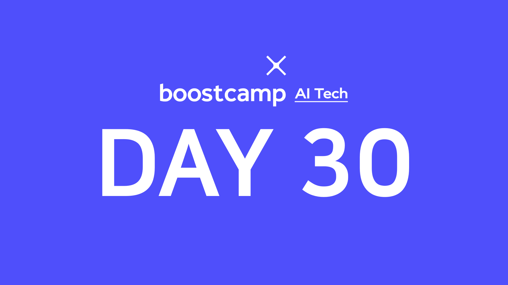

> 💡 이번 주는 부스트캠프와 [UpStage](https://www.upstage.ai/)에서 준비한 특강으로 수업이 진행됩니다!  
> 특강 자료는 비공개이므로 간단히 제 느낀점과 생각을 적습니다.

## [👉 피어 세션](https://github.com/boostcamp-ai-tech-4/peer-session/issues/95)

- 드디어 특강 마지막 날이다! 평소처럼 오늘 특강에 대한 의견을 나누었고 "인공지능은 경쟁상대가 아니라 협력상대이다"라는 오혜연 마스터님의 의견에 크게 공감을 했다.
- 마지막 날이어서 남은 시간에 네이버 입사 질문인 "진짜 꿈이 뭔가요?"에 대해 이야기를 나누었다. "이런 프로덕트를 만들고 싶다"는 개발에 대한 꿈부터 "건물주가 되고 싶다"처럼 인생 설계에 관한 꿈까지 정말 다양했다. 나의 꿈은 "대전에 정착하기"와 "친구들과 모여서 재밌는 프로덕트 만들기"이다. 첫 번째 꿈을 이루려면 "재택근무가 가능한 곳에 취업하기" 혹은 "카이스트 가기"를 먼저 이뤄야할 것 같다.
- 중간에 [Jerry님🐹](https://github.com/jjerry-k)이 깜짝 방문하셨다!

## 특강 7: NLP를 위한 언어 모델의 학습, 평가

> lectured by [구종만 마스터님👨‍💻](http://theyearlyprophet.com/)

## 특강 8: AI와 저작권법

> lecture by [오혜연 마스터님👩‍💻](https://aliceoh9.github.io/)
