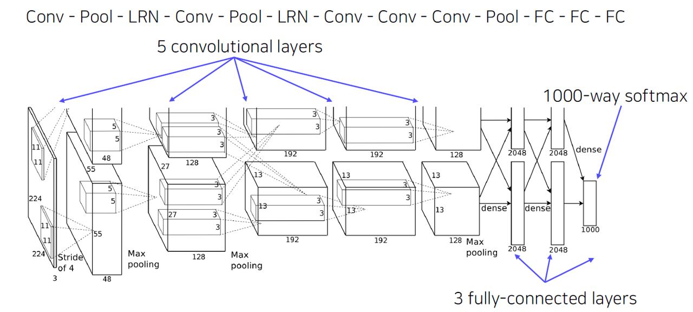
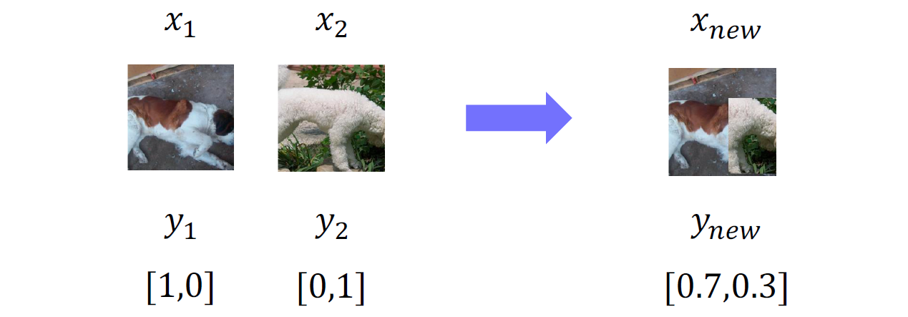
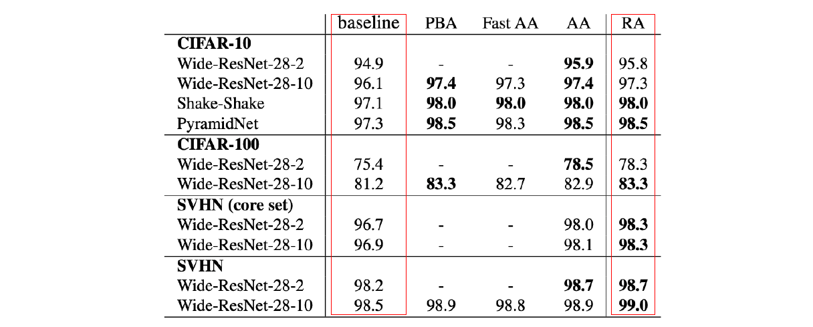
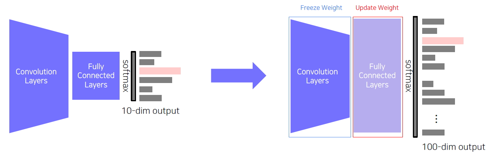
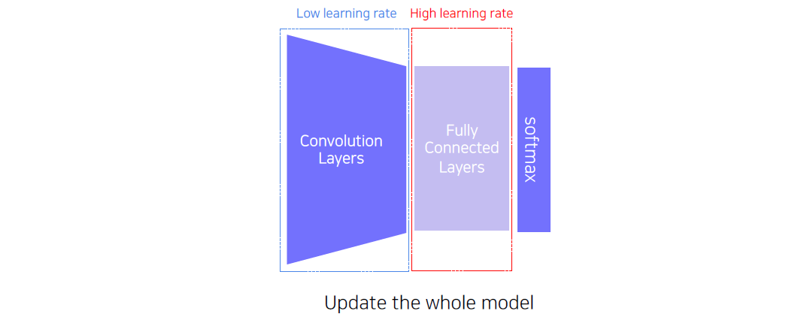
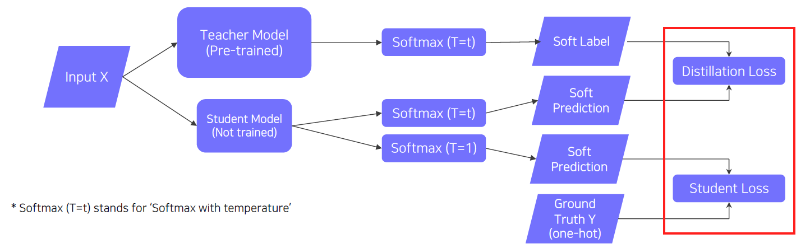
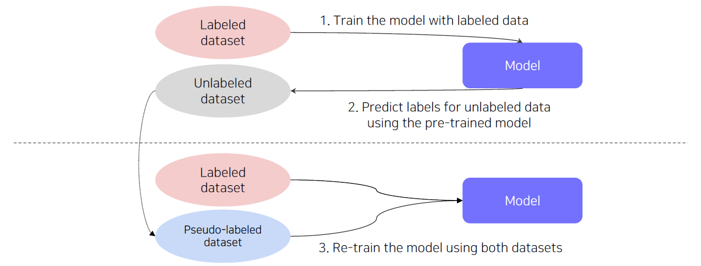
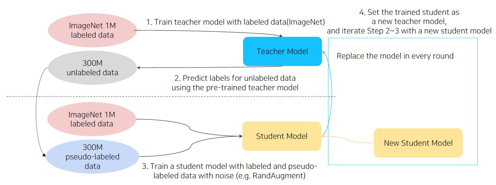
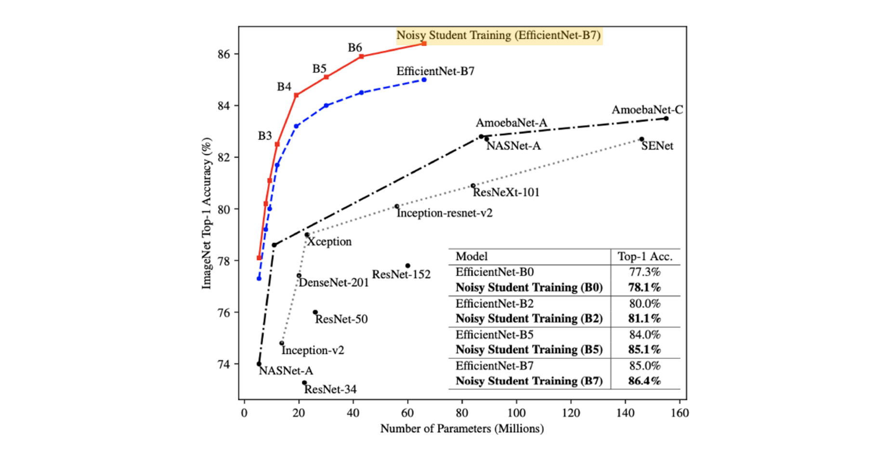

> 🙌은 **QnA에 있는 질문-답변**을 통해 얻은 지식을 표시합니다.

## [👉 피어 세션](https://github.com/boostcamp-ai-tech-4/peer-session/issues/96)

### 기록

- 드디어 CV 주가 시작됐다! Classification, Segmentation, Detection, GAN 등 다양한 작업(task)를 배울 예정이다. 첫 날은 이미지 분류 모델 중 AlexNet과 VGGNet을 살펴보고 적은 수의 데이터로 효율적으로 학습하는 여러 방법을 배웠다.
- 첫 날이라 그런지 질문이 그렇게 많지는 않았다. SmallTalk으로 **각자 만들어보고 싶은 서비스**를 발표했다. 저번에 **[조유리즈](https://post-phinf.pstatic.net/MjAxOTA0MTJfMjIy/MDAxNTU1MDYyMDI3MDMy.BQ4h_lMOS8kF8rirvhRQ8vOKszpb4HhcTa1d4nBEZ40g.hBi12gpMx9Jg3y5cac0mdbk6JSc8Wiu43CJHPx2T_s0g.JPEG/5.jpg?type=w1200) 분류 모델**을 만들지 못한 것이 아쉬워 사이드프로젝트로 하고 싶다고 했다. 모델을 만들고 `React`로 프론트를, `Django`로 백엔드를 만들어 "○○○일 확률이 ○○%입니다!"까지 보여주는 서비스를 만들고 싶다고 했다. 학습정리가 어느 정도 마무리가 되면 시작할 예정이다.

## Table of Contents

> ✍ [DAY 13. Convolutional Neural Network](../day13-20210203)에 있는 내용 외의 것만 정리합니다!

- [컴퓨터비전을 더 잘 이해해보자!](#컴퓨터비전을-더-잘-이해해보자)
- [이미지 분류 역사: AlexNet과 VGGNet](#이미지-분류-역사-alexnet과-vggnet)
- [적은 수의 데이터 다루기](#적은-수의-데이터-다루기)
- [더 가벼운 모델을 만들기](#더-가벼운-모델을-만들기)
- [라벨이 없는 데이터 활용하기](#라벨이-없는-데이터-활용하기)
- [References](#references)

## 컴퓨터비전을 더 잘 이해해보자!

- 컴퓨터비전은 인간의 눈처럼 **물체를 감지하고 해석하고 컴퓨터로 표현**한다.
  - 반대로 표현된 것을 다시 물체로 만드는 것을 렌더링(Rendering)이라고 하며 그래픽스에서 연구되고 있다.
  - 컴퓨터비전에서 하는 것은 렌더링의 역과정이므로 이 과정을 역 렌더링(Inverse Rendering)이라고 부르기도 한다.
- 컴퓨터비전에서의 **입력**은 이미지, 영샹과 같은 `시각 데이터`이고 **출력**은 색깔 인식, 모션 인식과 같은 `시각적인 이해`이다.
- 현재 이미지 분류는 특징 추출(Feature Extraction)과 분류(Classification)이 동시에 이루어지는 딥러닝 기반의 end-to-end 방식이다.
  - 기존 머신러닝 기반의 방식은 직접 짠 알고리즘으로 특징 추출을 하고 신경망을 통해 분류를 했다.

## 이미지 분류 역사: AlexNet과 VGGNet

**[👀 CNN 톺아보기 다시보기](../day13-20210203/#cnn-톺아보기)**

### AlexNet

<small class="src" markdown=1>

출처: [ImageNet Classification with Deep Convolutional Neural Networks](https://www.cs.toronto.edu/~kriz/imagenet_classification_with_deep_convolutional.pdf)

</small>

- `입력`: 12만개의 (224, 224) 크기의 [ImageNet](http://image-net.org/) 데이터셋 사용
- `구조`: 5개의 Convolutional Layer + 3개의 Fully-connected Layer
  - Conv Layer의 필터의 크기는 11×11, 5×5, 3×3, 3×3, 3×3을 사용
  - FC Layer로 피처맵을 넣기 위해 피처맵을 1차원 벡터로 평탄화(flatten)시킴

#### AlexNet의 특징

- 이전의 CNN모델인 LeNet에 비해 더 깊어지고 파라미터의 수가 크게 증가했다.
- ImageNet과 같은 많은 양의 데이터를 가지고 학습을 하였다.
- 활성화 함수로 sigmoid 대신 **ReLU**를 사용하여 sigmoid로 인한 기울기 소실 문제를 조금 해결했다.
- 오버피팅을 방지하기 위해 **Dropout기법**을 사용했다.
- 활성화 맵(Activation Map)에서 인접한 픽셀들을 정규화 시키는 **LRN(Local Response Normalization)**을 사용했다.
  - 매우 값이 튀는 픽셀이 주변 픽셀에 영향을 미치는 것을 막기 위해 사용했다.
  - 지금은 쓰이지 않고 대신 **BN(Batch Normalization** 방식을 사용한다.

### VGGNet

<small class="src" markdown=1>

출처: [VGG16 – Convolutional Network for Classification and Detection](https://neurohive.io/en/popular-networks/vgg16/)

</small>

- `입력`: AlexNet과 동일한 [ImageNet](http://image-net.org/) 데이터셋 사용
  - 각 채널의 평균값을 빼어 중심을 평균을 0으로 맞춤
- `구조`: VGG16 기준 13개의 Convolution Layer + 3개의 Fully-connected Layer
  - Conv Layer 필터의 크기는 3×3으로 모두 동일

#### VGGNet의 특징

- AlexNet보다 **훨씬 깊은 16층/19층의 모델 구조**를 갖는다.
- LRN을 사용하지 않고 3×3 `Conv 블록`과 2×2 `Max Pooling 블록`만 사용했다.
- AlexNet의 필터 크기보다 더 작은 3×3 크기의 필터를 여러 번 겹쳐 사용하여 다음과 같은 이점을 얻었다.
  - **더 넓은 receptive field**를 가졌다. (= 입력을 더 넓게 볼 수 있게 됐다.)
  - 더 깊게 쌓을 수 있어 **더 많은 비선형성**을 표현할 수 있다.
  - 크기가 큰 필터에 비해 **더 적은 수의 파라미터**를 가진다.

## 적은 수의 데이터 다루기

### Data Augmentation

#### 데이터셋 분포 vs 실제 데이터 분포

많은 양의 데이터를 가지면 좋겠지만, 그렇지 않은 경우가 훨씬 더 많다. 적은 수의 데이터를 가지고 학습한다면 오버피팅이 일어날 가능성이 높고 테스트 데이터를 넣었을 때 제 성능을 내지 못할 것이다.

<small class="src" markdown=1>

출처: [Antonio Torralba](https://groups.csail.mit.edu/vision/torralbalab/)

</small>

우리가 사용하는 데이터셋은 실제 데이터 분포를 모두 커버할 수 없는 정말 작은 데이터셋이다. 특히 이미지 데이터의 경우 대부분의 사람들이 예쁘게, 정확히 찍기 때문에 대부분의 이미지가 **비슷한 구도**를 갖는다. 위의 사진은 **각 카테고리 별 평균 이미지**이다. 가장 오른쪽 사진은 `공원` 카테고리를 가진 이미지의 평균 이미지인데 <u>가운데 사람이 있는 것</u>을 보아 사람을 가운데에 위치시킨 사진이 많다는 것을 알 수 있다.

#### 데이터를 불리자!

실제 데이터 분포와 가깝게 하기 위한 가장 단순한 방법은 <u>데이터를 불리는 것</u>이다. 이런 과정을 **Data Augmentation**이라고 한다.

그럼 어떻게 불릴까? 이미지를 회전시키거나 자르거나 밝기를 조절하는 등의 방법을 사용하여 다양한 구도의 이미지를 만든다. `OpenCV`와 `Numpy`를 사용하여 이미지를 변형할 수 있다.

<small class="src" markdown=1>

출처: [CutMix: Regularization Strategy to Train Strong Classifiers with Localizable Features](https://arxiv.org/pdf/1905.04899.pdf)

</small>

그 외에 서로 다른 카테고리의 이미지를 잘라 합성하는 **CutMix** 기법도 있다. 이 경우 라벨에 각 이미지의 비율을 반영해야 한다. 예를 들어, 고양이 사진의 70%와 개 사진의 30%를 잘라 합성했다면, 원-핫 인코딩된 라벨을 `[0.7, 0.3]`으로 바꿔준다.

이처럼 많은 Augmentation 기법들이 존재한다. 하지만 내 상황에 맞는 가장 좋은 기법을 찾는 것은 시간이 많이 걸린다. 어떤 기법을 사용할지 선택해야 하고 어느 정도의 크기(ex. 회전이라면 몇 도로 돌릴지)로 설정해야 할지 정해야 한다.

그래서 다양한 Augmentation 기법들을 랜덤으로 샘플링하여 적용하고 평가하는 **RandAugment 방식**을 사용한다. 이 방식은 랜덤 샘플링으로 N개의 Augmentation 기법을 뽑아 학습시키고 평가한 후 가장 좋은 Augmentation Sequence를 반환한다. 이 기법을 사용하지 않을 때보다 사용했을 때 더 높은 성능을 보여준다고 한다.

<small class="src" markdown=1>

출처: [Randaugment: Practical automated data augmentation with a reduced search space](https://openaccess.thecvf.com/content_CVPRW_2020/papers/w40/Cubuk_Randaugment_Practical_Automated_Data_Augmentation_With_a_Reduced_Search_Space_CVPRW_2020_paper.pdf)

</small>

### Transfer Learning

Data Augmentation을 한다고 해도 원래 데이터 수가 적다면 학습을 하기 힘들 것이다. 특히 컴퓨터비전은 정말 많은 양의 이미지 데이터를 요구하기 때문에 작은 양의 데이터로 학습한다면 분명히 오버피팅이 일어날 것이다.

이럴 때 사용하는 방법이 **전이 학습(Transfer Learning)**이다. 전이 학습이란 <u>큰 데이터셋으로 학습된 모델을 그대로 가져와 작은 데이터셋에 맞게 학습시키는 방법</u>이다. 이 방법을 사용하면 적은 양의 데이터라도 높은 성능을 낼 수 있다.

그럼 어떻게 가능한 것일까? 같은 물체라면 어떤 이미지든 간에 **비슷한 형태**를 띌 것이다. 예를 들면, 버스 이미지에서의 바퀴나 택시 이미지에서의 바퀴 모두 동그란 형태의 짙은 회색을 가질 것이다. 그렇기 때문에 <u>큰 데이터셋으로 학습된 모델은 물체의 특징을 잘 나타내는 가중치를 가지고 있으므로</u> 이를 그대로 가져와 적용시키는 것이다!

#### 방법 1. FC Layer만 학습시키기

<small class="src" markdown=1>

출처: [Is object localization for free?](https://openaccess.thecvf.com/content_cvpr_2015/papers/Oquab_Is_Object_Localization_2015_CVPR_paper.pdf)

</small>

첫 번째 접근법으로 **FC Layer만 학습시키는 방법**이 있다. Conv Layer의 가중치는 고정시켜두고 FC Layer만 제거하고 <u>새로 추가한 FC Layer만 학습</u>시킨다. 이럴 경우 앞선 모델의 미리 학습된 피처들의 특징을 그대로 가져온다. 보통 데이터 거의 없을 때 사용한다.

#### 방법 2. 각 Layer마다 다른 학습률로 학습하기

<small class="src" markdown=1>

출처: [Is object localization for free?](https://openaccess.thecvf.com/content_cvpr_2015/papers/Oquab_Is_Object_Localization_2015_CVPR_paper.pdf)

</small>

두 번째 접근법으로 **Conv Layer와 FC Layer에 다른 학습률을 주어 학습시키는 방법**이 있다. 되도록 미리 학습된 가중치를 최대한 보존하기 위해 Conv Layer는 <u>아주 작은 학습율을 주어 미세 조정</u>을 한다. FC Layer는 최종 판단을 하는 층이기 때문에 <u>Conv Layer보다는 큰 학습율을 주어 학습</u>을 한다. 데이터가 어느 정도 적을 때 사용하는 방법이다.

## 더 가벼운 모델을 만들기

모델이 클수록 층이 깊고 학습해야할 파라미터의 수가 많고 그만큼 Computational Complexity도 높다. 그러므로 비슷한 성능을 내면서 더 가벼운 모델을 만드는 것이 필요하다.

이처럼 미리 학습된 큰 모델(=Teacher Model)과 비슷한 더 작은 모델(=Student Model)을 학습시키는 것을 **지식 증류(Knowledge Distillation)**라고 한다. (혹은 Teacher Student Learning이라고도 부른다.) 이 때 Student Model은 Teacher 모델보다 작다.

💡

Knowledge Distillation은 모델 경량화 외에 **라벨이 없는 데이터셋의 슈도-라벨**을 만드는 데도 사용된다.

### Teacher Student Learning

> 이 때 사용되는 데이터셋은 라벨이 있는 데이터셋이라고 가정한다.

<small class="src" markdown=1>

출처: [Deep Learning NIPS'2015 Tutorial](https://media.nips.cc/Conferences/2015/tutorialslides/DL-Tutorial-NIPS2015.pdf)

</small>

여기서는 Softmax가 아닌 **Softmax with temperature**를 사용한다. temperature에 해당하는 $T$는 큰 차이가 나는 두 값의 softmax의 결과값을 부드럽게 만들어주기 위해 **예측값에 나누어주는 값**을 말한다. 이렇게 $T$를 나누어주면 큰 차이가 나는 값이더라도 softmax를 통과하면 비슷한 값을 갖게 된다.

$$
Softmax(T=t) = \frac{exp(z_i/t)}{\sum_j exp(z_j/t)}
$$

#### Distillation Loss

`Distillation Loss`는 Student Model이 Teacher Model의 Output을 따라하기 위해 사용된다. 이 때 사용되는 것이 **KL-Divergence**이며 <u>Student Model의 Soft Label과 Teacher Model의 Soft Label의 확률분포 차이를 좁히는 방향</u>으로 학습된다. 이 때 예측 라벨이 원래 이미지의 라벨과 일치하는지와 상관없이 오직 Teacher Model의 결과와 같도록 학습한다.

💡

Soft Label vs Hard Label

- `Soft Label`: [0.5, 0.32, 0.01, 0.2, 0.9]과 같이 벡터로 표현된 각 카테고리의 추론 확률을 나타낸 라벨이다.
- `Hard Label`: [0, 1, 0, 0, 0]과 같이 원-핫 벡터로 표현된 라벨로, 해당 클래스에 해당하는지 안하는지만을 나타낸다.

#### Student Loss

`Student Loss`는 Student Model이 Ground Truth에 가까운 예측값을 내도록 학습하는데 사용된다. 이 떄 사용하는 손실함수는 **Cross Entropy**이며, <u>Student Model의 Soft Label과 Ground Truth의 Hard Label에 가까워지도록</u> 학습된다.

💡

Back Propagation시 Student Model로만 기울기가 흐르며 최종 손실함수는 Distillation Loss와 Student Loss의 가중합이다.

## 라벨이 없는 데이터 활용하기

라벨이 있는 데이터는 전체 데이터 중 일부에 불과하다. 그럼 라벨이 없는 데이터는 어떻게 학습에 사용해야 할까? 바로 라벨이 없는 데이터도 활용하는 **준지도 학습(Semi-supervised)**을 사용하여 학습시킨다.

### Semi-supervised Learning

<small class="src" markdown=1>

출처: [Pseudo-Label : The Simple and Efficient Semi-Supervised Learning Method for Deep Neural Networks](https://citeseerx.ist.psu.edu/viewdoc/download?doi=10.1.1.664.3543&rep=rep1&type=pdf)

</small>

- `1단계` 라벨이 있는 데이터셋으로 모델을 학습시킨다.
- `2단계` 학습된 모델로 라벨이 없는 데이터의 라벨을 예측한다. 이 때 예측된 라벨을 **슈도-라벨**이라고 한다.
- `3단계` 라벨이 있는 데이터셋과 슈도-라벨이 있는 데이터셋을 합쳐 다시 모델을 학습시킨다.

### Self-training

Self-training이란 **Data Augmentation**과 **Teacher-Student Learning** 그리고 **Semi-supervised Learning**을 모두 사용한 학습 방법을 말한다.

<small class="src" markdown=1>

출처: [Adversarial Examples Improve Image Recognition](https://openaccess.thecvf.com/content_CVPR_2020/papers/Xie_Adversarial_Examples_Improve_Image_Recognition_CVPR_2020_paper.pdf)

</small>

- `1단계` 라벨링 된 ImageNet 데이터셋으로 Teacher Model을 학습시킨다.
- `2단계` 학습된 Teacher Model로 라벨이 없는 데이터의 라벨을 예측한 후 해당 라벨을 슈도-라벨로 사용한다.
- `3단계` ImageNet 데이터셋과 슈도-라벨 데이터셋을 합친 후 RandAugment와 같은 Data Augmentation 기법을 사용하여 데이터의 수를 불린다.
- `4단계` 이렇게 만든 데이터로 Student Model을 학습시킨다.
  - 이 때, Student Model은 Teacher Model보다 크다.
- `5단계` 이렇게 학습된 Student Model을 새로운 Teacher Model로 대체시킨다.
- `6단계` 2-5단계를 반복한다.

위의 방식으로 학습된 EfficientNet의 성능을 보면 다른 모델보다 파라미터 수가 적음에도 불구하고 좋은 성능을 보여주고 있다.

<small class="src" markdown=1>

출처: [Adversarial Examples Improve Image Recognition](https://openaccess.thecvf.com/content_CVPR_2020/papers/Xie_Adversarial_Examples_Improve_Image_Recognition_CVPR_2020_paper.pdf)

</small>

## References

- [LRN(Local Response Normalization)이란 무엇인가? (feat. AlexNet) - Taegu](https://taeguu.tistory.com/29)
- [VGG16 – Convolutional Network for Classification and Detection - Neurohive](https://neurohive.io/en/popular-networks/vgg16/)
- [딥러닝 모델 지식의 증류기법, Knowledge Distillation - Seongsu](https://baeseongsu.github.io/posts/knowledge-distillation/)
