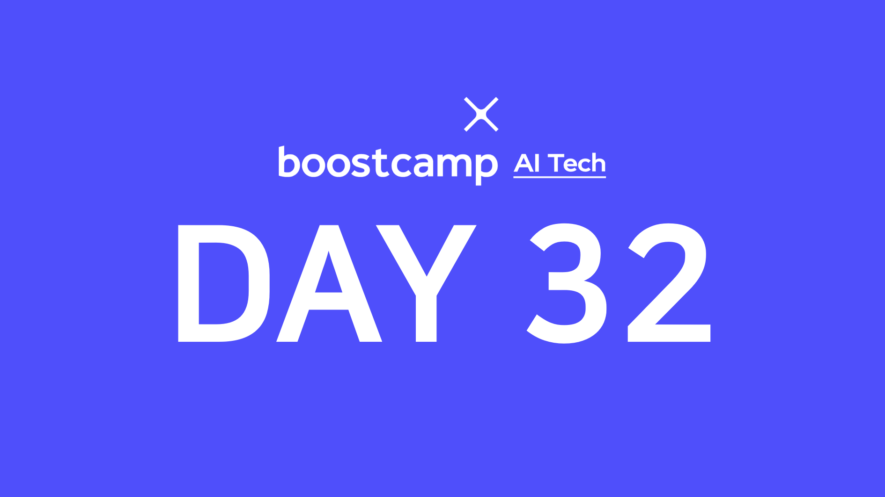

> 🙌은 **QnA에 있는 질문-답변**을 통해 얻은 지식을 표시합니다.

## [👉 피어 세션](https://github.com/boostcamp-ai-tech-4/peer-session/issues/97)

### 기록

- 오늘의 **Hot Issue🔥**는 Semantic Segmentation이었다. 특히 `Deconvolution` 부분과 `DeepLab` 모델 구조가 이해가 안 되서 이 부분과 관련된 질문이 많이 나왔다. 특히 Deconvolution 부분이 직관적으로 이해가 되지 않아서 많은 시간을 할애해 이야기를 하였다.
- Deconvolution의 문제점은 필터의 크기가 Stride로 나누어 떨어지지 않으면 결과 이미지가 꼭 체스보드 처럼 나오는 것이다. 이를 해결하기 위해 필터의 크기에 Stride가 나누어 떨어지도록 Stride의 크기를 수정하거나 **이미지를 Interpolation으로 Upscaling시키고 변형된 이미지를 Deconvolution시키는 방법**을 사용한다.
- Dilated Convolution은 Deconvolution이 아닌 **Convolution**이다!(그림이 비슷해서 헷갈린다😥) 그리고 Receptive Field는 내적될 때 사용하는 값의 범위가 아닌 **필터가 덮는 입력의 크기**이다. 헷갈리지 말 것!

## Table of Contents

> ✍ [DAY 13. Convolutional Neural Network](../day13-20210203)에 있는 내용 외의 것만 정리합니다!

- [이미지 분류 역사: GoogLeNet, ResNet, Beyond ResNet](#이미지-분류-역사-googlenet-resnet-beyond-resnet)
- [Semantic Segmenation](#semantic-segmentation)
- [FCN 모델들: U-Net, DeepLab](#fcn-모델들-u-net-deeplab)
- [References](#references)

## 이미지 분류 역사: GoogLeNet, ResNet, Beyond ResNet

**[👀 CNN 톺아보기 다시 보기](../day13-20210203/#cnn-톺아보기)**

### GoogLeNet

### ResNet

### Beyond ResNet

### CNN Backbone으로 적절한 모델은?

<strong>👀 이미지 분류 역사를 한 눈에 보기</strong>

 

## Semantic Segmentation

**[👀 Semantic Segmentation 다시 보기](../day13-20210203/#semantic-segmentation)**

### FC Layer를 1×1 Conv Layer로!

### Upsampling

#### Transposed Convolution의 문제점

#### 해결책: Interpolation + Convolution

### Skip-connection

#### Hypercolumns

## FCN 모델들: U-Net, DeepLab

### U-Net

### DeepLab

## References

- https://i-am-eden.tistory.com/14
- https://distill.pub/2016/deconv-checkerboard/
- https://3months.tistory.com/213
- https://gaussian37.github.io/vision-segmentation-aspp/
