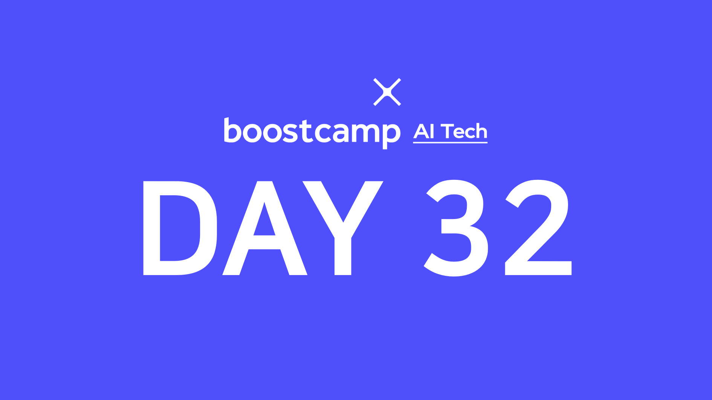
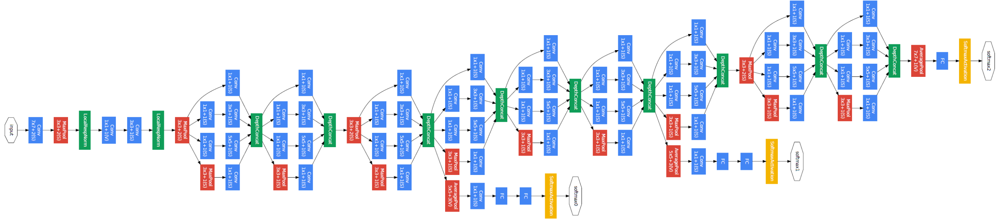

> 🙌은 **QnA에 있는 질문-답변**을 통해 얻은 지식을 표시합니다.

## [👉 피어 세션](https://github.com/boostcamp-ai-tech-4/peer-session/issues/96)

## Table of Contents

> ✍ [DAY 13. Convolutional Neural Network](../day13-20210203)에 있는 내용 외의 것만 정리합니다!

## 이미지 분류 역사: GoogLeNet, ResNet, Beyond ResNet

**[👀 CNN 톺아보기 다시보기](../day13-20210203/#cnn-톺아보기)**

### GoogLeNet

### ResNet

### Beyond ResNet
