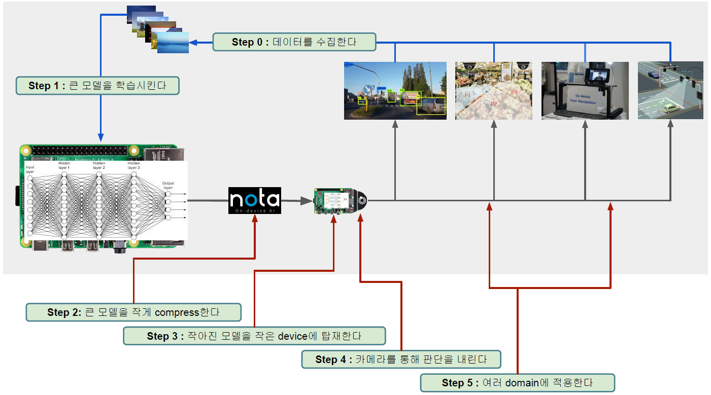

> 🙌은 **QnA에 있는 질문-답변**을 통해 얻은 지식을 표시합니다.

## [👉 피어 세션](https://github.com/boostcamp-ai-tech-4/peer-session/issues/103)

### 질문

- [[원딜] pth → onnx → pth 순으로 모델을 저장할 때 마지막 pth 파일의 크기가 커지는 이유?](https://github.com/boostcamp-ai-tech-4/peer-session/issues/102)

### 기록

- 오늘은 궁금했던 주제인 **경량화** 첫 날이었다! 우선 경량화에 있어서 기본으로 알아야할 주제를 배운 후 여러 경량화 기법을 배운다. 오늘 강의 주제는 약간 추상적인 개념이어서 질문은 거의 없었다.
- 각 강의마다 5개씩의 **Further Question**이 있는데 그에 대한 이야기를 진행했다.
  - [onnx](https://onnx.ai/)는 pytorch, tensorflow, keras 등을 다른 프레임워크로 변환을 해주는 라이브러리이다. pytorch 모델을 onnx 모델로 변환한 후 다른 프레임워크로 변환하면 233MB 정도의 일정한 크기를 보여줬다. TF Lite와 같은 경량화 모델은 58MB로 훨씬 작은 크기였다. 반면 계산 최적화에 특화된 TensorRT는 466MB로 큰 크기를 가졌다.
  - 여기서 든 의문은 `pytorch - onnx - pytorch`로 변환했을 때는 351MB로 모델의 크기가 다르다는 점이었다. 그래서 이 부분은 [Issue](https://github.com/boostcamp-ai-tech-4/peer-session/issues/102)로 올려서 각자 생각해보기로 했다.
- 과제는 **사람 얼굴에 Landmark를 표시하는 것**이었다. 10×2 크기의 subplot을 그려야 해서 오랜 만에 `matplotlib`를 공부하는 시간을 가졌다.

## Table of Contents

> ✍ 이번 주는 강의의 포인트와 마스터님의 학습 방향을 정리합니다.

- [가벼운 모델](#가벼운-모델)
- [동전의 뒷면](#동전의-뒷면)
- [가장 적당하게](#가장-적당하게)
- [References](#references)

## 가벼운 모델

### 연역적 결정 vs 귀납적 결정

- `연역적 결정`: 이미 알고 있는 판단을 근거로 새로운 판단을 유도하는 추론
  - "전제가 참이면, 결론도 참"이라는 논리로 결정한다.
- `귀납적 결정`: 개별적인 사실이나 현상에서 그러한 사례들이 포함되는 일반적인 결론을 이끌어내는 추론
  - 지금까지의 경험으로 내린 판단이기 때문에 언제든지 거짓이 될 가능성이 있다.

### 인공지능은 결정기이다!

결정기는 **어떤 데이터를 가지고 최종 판단을 내리는 것**을 말한다. 아래 예시에서의 모델이 결정기이다.

- `ex1` [70, 80, 90]으로 이루어진 데이터가 있을 때 이 데이터의 평균을 계산하는 모델을 통해 80이라 결정한다.
- `ex2` 강아지와 고양이 사진으로 이루어진 데이터가 있을 때 어떤 이미지의 강아지/고양이 여부를 모델이 결정한다.

어떤 판단을 내리는 것은 추천시스템과 같은 **가벼운 의사결정**부터 암 진단과 같은 **무거운 결정**까지 다양하다. 딥러닝이 발전하기 전에는 모델의 성능이 좋지 않았기 때문에 가벼운 결정만 가능하였지만 발전 이후 정확도가 거의 100%에 가까워지면서 무거운 의사결정가지 가능하게 되었다.

다만, 도덕적인 판단은 사람도 쉽게 판단을 내리지 못하기 때문에 아직 인공지능이 판단을 내릴 수 없는 영역으로 생각되고 있다.

### 가벼운 결정기

#### 경량화 vs 소형화

- `경량화`: 필요한 것만 갖고 불필요한 것을 제거하여 규모를 줄이거나 가볍게 만드는 것
- `소형화`: 필요/불필요한 것을 구분하지 않고 규모를 줄이거나 가볍게 만드는 것

#### 가벼운 결정기란?

가벼운 결정기(Lightweight Model)은 `경량화된 모델`을 뜻한다. BERT, GPT, ResNet 등을 보면 어마어마한 수의 파라미터를 갖는 크기가 큰 모델이 주로 개발되고 있다. 가벼운 모델은 이와 비슷한 성능(조금 떨어진 성능)을 가진 채 원래 모델의 규모를 줄인다.

이 때 Backbone 네트워크로 AlexNet, VGG, ResNet, SqueezeNet, DenseNet, Inception v3, GoogLeNet, ShuffleNet v2, MobileNet v2, ResNeXt, Wide ResNet, MNASNet을 사용한다.

#### 모델 경량화 과정

가벼운 결정기는 다음과 같이 개발된다.

### Edge Intelligence

#### Edge Device란?

Edge Device란 WAN(Wide Area Network)에 LAN(Local Area Network)를 연결하는 역할을 하는 구성 요소를 말한다. 가장 대표적인 Edge Device로는 라즈베리 파이(Raspberry Pi)가 있다.

그럼 왜 Edge Device가 필요할까? 크게 2가지 이유가 있다!

- `이유1` 컴퓨팅 파워가 낮지만 빠르고 적은 비용이 든다.
- `이유2` 인터넷에 연결되지 않아도 되므로 정보 유출관련 이슈가 없다.

#### Edge Intelligence

## 동전의 뒷면

### AI에서의 동전의 뒷면

### On-Device AI에서의 동전의 뒷면

## 가장 적당하게

### Decision과 Optimization

### Constraints

### 모델에 적용시켜보자!

## References
