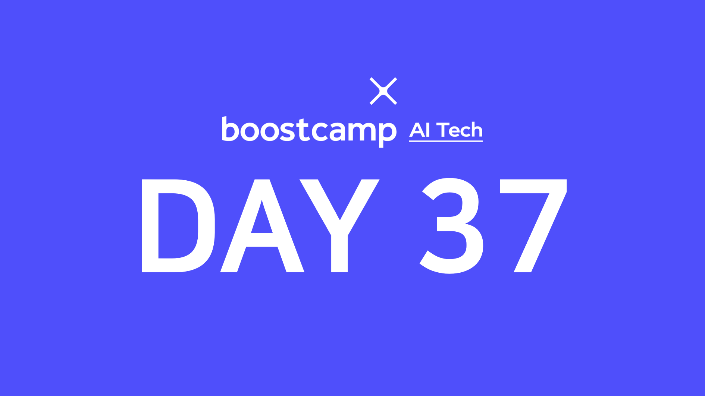

> ✍ 이번 주는 강의는 한 포스트에 필요한 내용을 스크랩하는 식으로 정리합니다.

## [👉 피어 세션](https://github.com/boostcamp-ai-tech-4/peer-session/issues/105)

### 질문

- [[원딜] Gaussian Process](https://github.com/boostcamp-ai-tech-4/peer-session/issues/104)

### 기록

- 강의
- 과제 student-teacher learning

## Table of Contents

- [모델의 시공간](#모델의-시공간)
- [알뜰히](#알뜰히)

## 모델의 시공간

## 알뜰히
