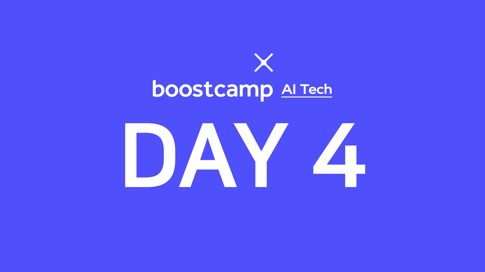

> 🙌은 **QnA에 있는 질문-답변**을 통해 얻은 지식을 표시합니다.

## [👉 피어 세션](https://github.com/boostcamp-ai-tech-4/peer-session/issues/15)

### 질문

- [[펭귄] OrderedDict를 굳이 사용해야하는 상황이 있을까요?](https://github.com/boostcamp-ai-tech-4/peer-session/issues/13)
- [[샐리] split() 함수의 default 인자](https://github.com/boostcamp-ai-tech-4/peer-session/issues/14)

### 기록

- 오늘은 화요일에 나온 과제를 **코드리뷰**하는 시간을 가졌다. 사람마다 구현하는 방식이 달라서 코드 보는 재미가 쏠쏠했다.
- while문을 사용할 때 항상 `while True`로 해놓고 내부에 종료 조건을 넣었는데, 내가 모든 경우의 수를 헤아리지 않는다면 무한 루프에 빠질 수 있으므로 되도록이면 `while 조건문`으로 쓰자.

## 📝 내용 정리

- [객체지향 프로그래밍](../../python/object-oriented-programming/)
- [데코레이터(Decorator)](../../python/decorator/)
- [모듈과 패키지](../../python/module-and-package/)
