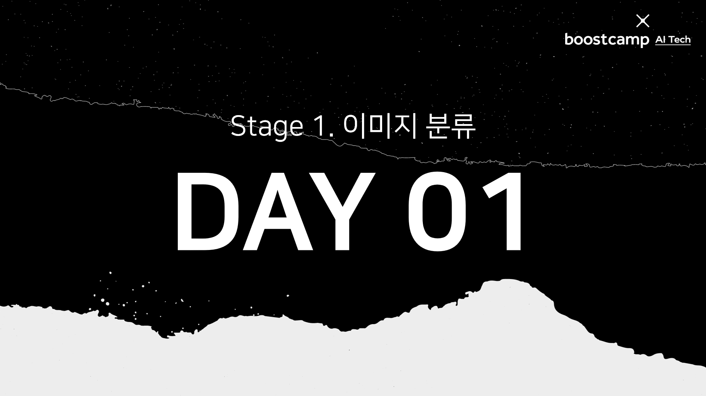
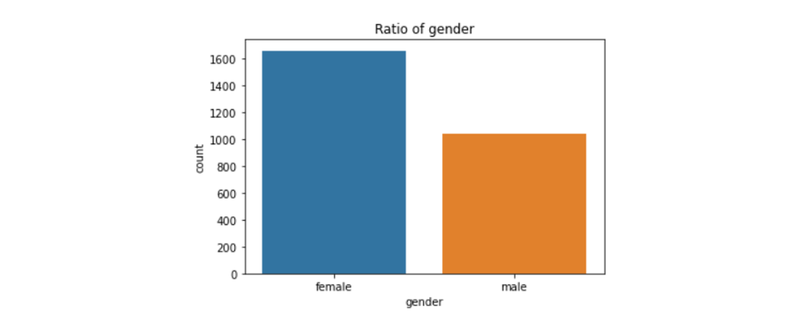
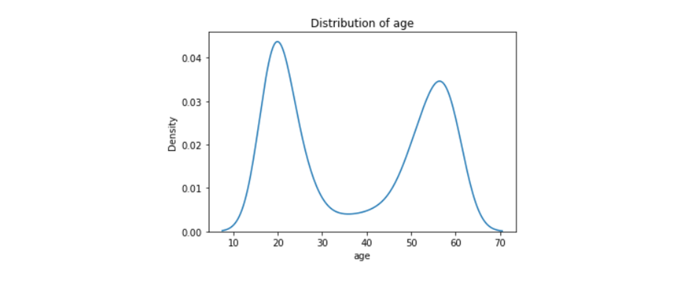
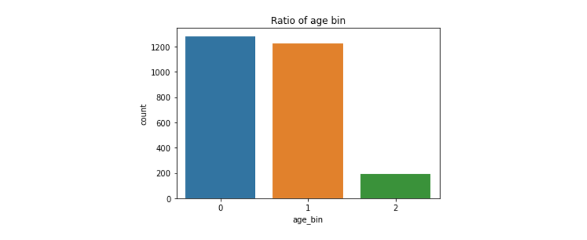
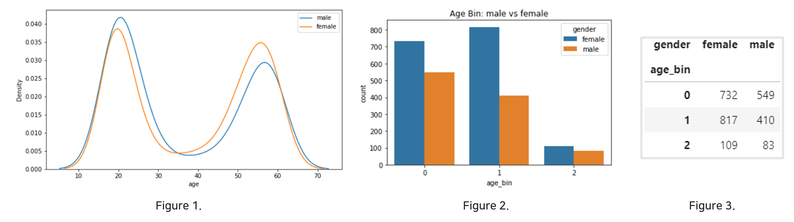
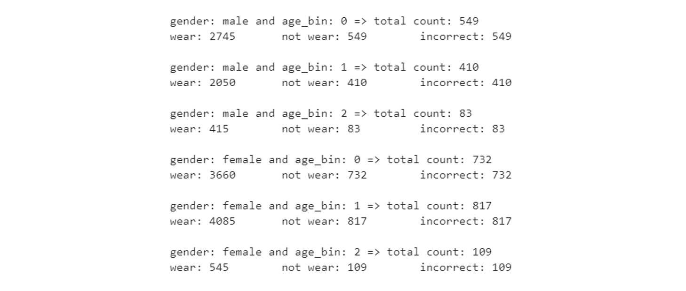

>

## Table of Contents

- [강의 정리](#-강의-정리)
- [오늘의 목표](#-오늘의-목표)
- [오늘의 도전](#-오늘의-도전)
- [오늘의 공부](#-오늘의-공부)
- [내일의 계획](#-내일의-계획)

## 📝 강의 정리

- 대회에 본격적으로 참가하기 전 **Overview 페이지**를 자세히 보자.
  - 데이터사이언스란 어떤 문제를 데이터를 기반으로 해결하는 것이다. 그러므로 문제를 파악하고 이를 데이터로 해결할 수 있는지 파악하는 것이 중요하다.
  - "어떤 도메인인지", "문제가 무엇인지", "문제가 왜 발생했는지" 등을 생각하고 방향성을 잡은 후 대회에 참여하자.
- 대회의 **Discussion**을 최대한 활용하고 `경쟁`보다는 `협력`을 우선으로 생각하자.
  - Discussion은 의아한 내용, 궁금한 내용, 내가 알아낸 도메인 지식 등을 공유하는 장으로 사용된다.
  - 리더보드 1등을 달성하고 자신의 역량을 키우는 것도 중요하지만 **공통된 문제를 같이 해결한다**는 목표를 잊지 말자.
  - 하지만 순위를 가려야하기 때문에 보통 대회 종료 1, 2주 전에는 Discussion에 글을 잘 올리지 않는다고 한다.
- EDA는 특별한 스킬이 아닌 **데이터를 파악하는 과정**을 말한다.
  - 데이터를 처음 접하면, 데이터가 어떤 분포를 갖는지, 몇 개가 있는지, 어떤 특징을 가지고 있는지 등 자세한 정보를 모른다. 즉, 데이터에 대한 궁금한 점이 생긴다.
  - 이런 궁금한 점들을 해결하는 과정이 EDA이다. 이 과정에는 직접 파이썬 코드를 구현해서 해결할 수도 있고 직접 데이터를 들여다보거나 Excel 등 다른 툴을 이용해서 해결할 수도 있다.
  - 데이터분석 단계에서만 EDA를 하는 것이 아닌 데이터 전처리, 모델링, 학습 단계에서 궁금증이 생기면 이 때에도 EDA를 할 수 있다. 그러니 궁금증이 생기면 바로 EDA를 해보자.
- `input`, `output`에 따라 작업(Task)가 정해진다.
  - 예를 들어, 입력이 이미지이고 출력이 카테고리형 변수라면 Image Classification Task가 된다. 만약 출력이 위치라면 Object Detection Task가 된다.

## 🔥 오늘의 목표

- 대회의 Overview를 읽고 문제를 정의하고 문제 해결의 방향성을 잡기
- Discussion에 글 남기기 (매일 과제로 설정!)
- 주어진 데이터에 대한 질문 생성 및 EDA를 통한 해결

## 👩‍💻 오늘의 도전

### 문제 정의하기

COVID-19의 감염 확산을 막기 위해서는 코와 입을 완전히 가려 마스크를 착용해 전파 경로를 원천 차단해야 한다. 이를 일일이 검사하는 것이 아니라 딥러닝을 통해 **사람들이 제대로 마스크를 착용했는지** 확인하는 분류 모델을 만들고자 한다.

- `입력`: (384, 512) 크기의 얼굴 이미지
  - 얼굴 뿐만 아니라 가슴까지 찍힌 상반신 이미지
- `출력`: 18개의 클래스
  - 마스크 착용여부(Wear, Incorrect, Not Wear), 성별(Male, Female), 나이( 30살 미만, 30살 이상 60살 미만, 60살 이상)로 나타낼 수 있는 모든 조합

### 모델 설계 계획 ver0.0

- 이미지를 18개의 클래스로 분류해야 하는데, 마스크 착용여부/성별/나이는 큰 연관이 없는 타겟값으로 <u>각 타겟 별로 모델을 생성해서 나온 결과를 종합해서 최종 라벨을 출력</u>한다. **총 3개의 모델** 필요!
- 이미지는 상반신 이미지이므로 마스크 착용 여부 판단시 얼굴 이외의 부위는 필요 없는 것으로 판단된다. 하지만 성별 혹은 나이를 판단할 때 상반신이 필요할 수 있다. 그러므로 <u>일단 원본 이미지로 학습을 하되 후에 시간이 되면 얼굴 ROI만 때서 학습</u>을 해보자.

### 학습 데이터 EDA

#### train과 eval 데이터

- train은 총 2700개의 데이터와 5개의 피처로 이루어져 있다. 각 데이터마다 마스크 쓴 이미지 5개, 마스크를 이상하게 쓴 이미지 1개, 마스크를 안 쓴 이미지 1개 총 7개의 이미지를 가진다.
- eval은 12600개의 데이터와 2개의 피처로 이루어져 있으며, 피처 2개는 이미지 id와 클래스 라벨이다. 그러므로 성별/나이/마스크 착용여부 3가지를 예측해야한다는 계획은 옳은 것으로 판단된다.

#### train 피처의 고유값

`train.csv`는 id, gender, race, age, path로 총 5개의 피처로 이루어져 있다. 각 피처는 다음과 같은 값(value)를 가지고 있다.

- gender는 male과 female로 구성되어 있다.
- race는 오직 Asian 하나의 value로만 구성되어 있다. → 학습 시 큰 의미가 없으므로 제거하자.
- age는 정수이고 18부터 60까지의 정수값으로 구성되어 있다.

#### train 피처의 분포

path는 이미지 폴더이름이고 id는 식별값이므로 gender, race, age에 대한 분포를 살펴보았다.

- gender의 비율을 보면 여성이 남성보다 약 1.5배 정도 많은 것을 볼 수 있다.
  
- age의 분포를 보면 20대 초반과 50대 중후반의 사람이 많은 것을 볼 수 있다.
  
- 타겟값으로 30대 미만, 30대 이상 60대 미만, 60대 이상으로 나누어 age_bin이라는 새로운 피처를 생성했으며, 각각은 0, 1, 2와 대응된다. 60대 이상의 경우 60살 밖에 없으므로 다른 값에 비해 데이터의 개수가 현저히 낮다.
  
- age와 gender의 관계가 있는지 살펴보았다. 여성/남성에 따라 나이의 분포가 달라지지 않았으나 `age_bin=1`에 대응하는 그룹이 거의 2배 가까이 여성이 더 많았다.
  
- 성별, 나이대, 마스크 착용여부를 가지고 각 클래스 라벨 별 개수를 세어보았다. 마스크를 쓴 이미지의 개수가 많으니 마스크를 쓴 라벨을 가진 데이터의 개수가 많았으며 나머지는 앞서 본 분포를 따랐다.
  

## 👀 오늘의 공부

- [F1 score vs accuracy, which metric is more important? - stackexchange](https://datascience.stackexchange.com/questions/65341/f1-score-vs-accuracy-which-metric-is-more-important/65342#65342?newreg=9e486ff21f2e409cb24b4b42e3b56b2f)
  - 데이터가 불균형(unbalanced)할 때 평가지표로 쓴다고 한다. 위의 EDA 결과로 볼 때 마스크를 쓴 데이터가 훨씬 많고 그 외는 적으므로 f1-score를 사용하는 듯 하다.
- [How to ignore hidden files using os.listdir()? - stackoverflow](https://stackoverflow.com/questions/7099290/how-to-ignore-hidden-files-using-os-listdir)
  - `os.listdir`을 하면 숨긴파일까지 모두 읽어 리스트로 반환한다. 만약 숨긴파일 외의 일반적인 파일의 리스트를 얻고 싶다면 `glob.glob`를 사용하자.

## 🚀 내일의 계획

- 데이터를 랜덤으로 뽑아서 실제 라벨과 일치하는지 확인하자. 즉, 데이터가 정말로 제대로 분류가 되었고 적절한 피처를 가지고 있는지 확인하자.
- 현재 id별 이미지가 6개씩 있는 형태인데 이미지가 로우인 데이터프레임을 생성하자. 이렇게 해야 학습할 때 훨씬 편하게 사용할 수 있다.
