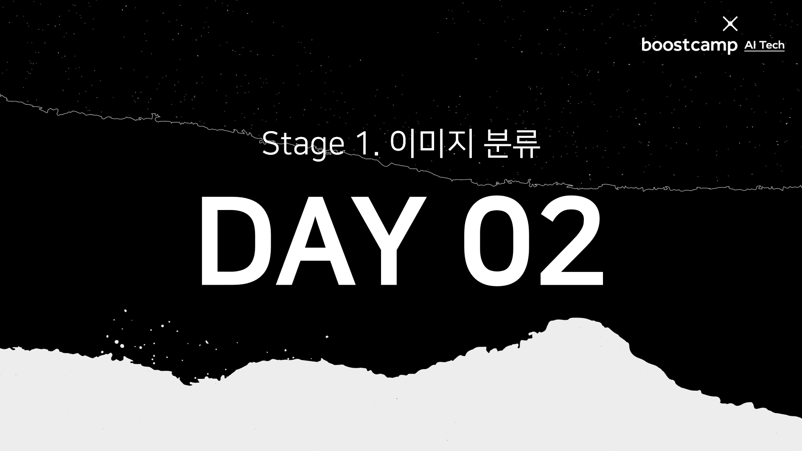
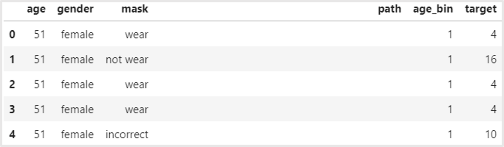
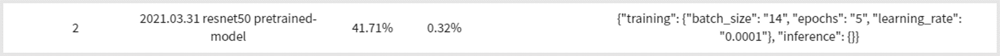

>

## Table of Contents

- [강의 정리](#-강의-정리)
- [피어 세션](#-피어-세션)
- [오늘의 목표](#-오늘의-목표)
- [오늘의 도전](#-오늘의-도전)
- [오늘의 결과](#-오늘의-결과)
- [내일의 계획](#-내일의-계획)

## 📝 강의 정리

- 바닐라 데이터와 데이터셋은 다르며, <u>바닐라 데이터를 데이터셋으로 만드는 과정</u>을 **전처리**라고 한다.
  - 전처리 작업의 목적은 모델에 넣기 좋은 데이터셋을 만드는 것이다.
  - 이미지의 경우 정형데이터에 비해 많은 전처리가 필요하지는 않지만 노이즈 제거, 리사이징, 가우시안 블러 등을 전처리 작업을 한다.
  - 이미지 전처리의 경우 특정한 도메인에서 좋은 결과를 내는 경우가 종종 있다. 예를 들면, 메디컬 이미지의 경우 이미지가 너무 어두우면 명도를 높여서 밝게 했을 때 결과가 더 잘 나오기도 한다.
- 이미지에서의 노이즈는 **대상 외의 나머지**를 말한다.
  - 그래서 어떤 데이터셋의 경우 대상의 Bounding Box를 그릴 수 있도록 위치(position)을 제공해준다.
  - [[STAGE 01] 첫째 날, EDA](../day41-20210329)에서 마스크 ROI만 뽑아내는 아이디어는 옳은 판단이라고 생각된다. 마스크 데이터는 정면으로 잘 찍혀있기 때문에 <u>Center Crop같은 단순한 처리도 적용 가능</u>할 것 같다.
- 오버피팅은 **높은 분산**을 가지며, 언더피팅은 **높은 편향**을 가진다.
  - 오버피팅은 <u>세세한 부분까지 피팅한다</u>는 관점에서 높은 분산을 갖는다.
  - 언더피팅은 데이터를 가지고 충분히 학습하지 못한 경우 즉, <u>실제 데이터와 다른 결과</u>를 갖기 때문에 높은 편향을 가진다.
- Augmentation은 데이터를 일반화하는 과정이지만 **항상 옳은 것은 아니다.**
  - Augmentation을 무작정 하기 보다는 <u>도메인을 고려해서 적절한 Augmentation 기법</u>을 적용하자.
  - `albumentations`는 외부 라이브러리로 `torchvision.transforms`보다 더 많은 Augmentation 기법과 더 빠른 처리를 제공한다.
  - `transform.Compose`를 사용하여 여러 기법을 합쳐서 적용할 때 <u>기법의 순서</u>에 따라 계산량이 달라질 수 있다. 예를 들면, 더 큰 이미지로 리사이징 하는 것을 앞으로 두면 뒤의 기법을 적용할 때 이미지가 크기 때문에 더 많은 계산량이 든다.
- 데이터 생성기를 만들 때 **모델이 처리할 수 있는 양을 고려**하여 만들어야 한다.
  - 모델이 처리할 수 있는 양보다 작으면 GPU가 낭비되고 너무 많으면 모델이 버거울 수 있다. **적절한 양**을 찾아야 한다.
- Dataset은 데이터를 하나씩 뽑아내기 위한, DataLoader는 모델에 맞는 데이터 생성을 위한 클래스이다.

## 🙌 피어 세션

- 클래스 라벨이 `train.csv`에 없기 때문에 직접 라벨링을 해야하는데 주의해서 계산할 것. 만약 모델 성능이 터무니없이 낮다면 라벨링을 의심해보자.
- Ground Truth는 float로 바꾸지 말고 int 그 자체로 놔두자. 만약 변환하면 나중에 loss 계산 시 에러가 발생한다.
- [Google Cloud Vision API](https://cloud.google.com/vision/docs/detecting-faces?hl=ko)를 사용해 얼굴을 Detection할 수 있다고 한다. 하지만 저작권과 비용 문제 때문에 사용하지 못할 듯 하다.
- `albumentations`를 쓰신 분 曰, "체감 상 그렇게 빠르다고 느끼지는 못했다"
- 외부 데이터를 가져와서 데이터를 보충한다는 의견이 나왔다. 하지만 개인적인 생각으로는 대회의 평가데이터로 사용하는 데이터 자체도 편향적이기 때문에 외부 데이터가 오히려 이상치로 취급될 것 같다.
- Attention 기법을 사용해서 이미지 분류를 시도하려는 분도 계셨다. 만약 Attention으로 분류한다면 [An Image is Worth 16X16 Words: Transformers for Image Recognition at Scake](https://arxiv.org/pdf/2010.11929.pdf)

## 🔥 오늘의 목표

- ~~**학습 데이터의 이미지의 특징 살펴보기**~~
  - 랜덤으로 이미지를 뽑아 학습 데이터를 살펴보기 ⭕
  - `Discussion`에 있는 다른 캠퍼들 EDA 살펴보기 ⭕
- ~~**eval에 있는 데이터와 같은 형태로 `(이미지 id, 클래스)` 형태로 데이터셋 구성하기**~~
  - 파일 이름과 이미지 id를 이용하여 각 이미지별 클래스 구하기 ⭕
  - 이를 데이터프레임으로 만들고 `train_modified.csv`로 저장하기 ⭕
- **Dataset 클래스로 최종 데이터셋 구축하기**
  - 구축된 Dataset을 pickle 파일로 저장하기 ⭕
  - 마스크 이미지에 맞는 Augmentation 기법 선정하기 ❌
- ~~**미리 학습된 ResNet으로 결과 확인하기**~~

## 👩‍💻 오늘의 도전

### 학습데이터의 이미지 특징

학습데이터에서 랜덤으로 1개를 추출하여 마스크 이미지를 살펴보았고 마스크 이미지는 다음과 같은 특징을 가지고 있다.

- 사진의 명도, 채도, 구도가 다양하다.
- 마스크의 디자인이 다양하다.
  - 색은 노란색, 하늘색, 하얀색, 핑크색, 검은색 등으로 다양하다.
  - 체크무늬, 도트무늬 손수건 등 다양한 패턴을 가지고 있다.
  - 마스크가 아닌 손수건을 두루고 있는 이미지도 있다.
- 잘못 착용하는 경우로 "턱까지 덮지 않음", "코를 덮지 않음", "눈에 착용", "얼굴 전체를 덮음", "턱스크지만 애매한 경우" 등으로 나눌 수 있다.
- 남성인데 여성으로, 여성인데 남성으로 표현된 데이터가 존재한다.

### 메타데이터 파일 구축

- `age`, `gender`, `mask`, `path`로 초기 데이터프레임 생성
- `age`로 `age_bin` 피처 생성 후 `age`, `gender`, `mask`로 `target` 계산
- Pretrained Resnet을 사용해 학습 시에는 `path`와 `target`만 가지고 학습



### Custom Dataset 구현 및 저장

- `Dataset`을 상속하여 `MaskDataset` 구현

```python
class MaskDataset(Dataset):
    def __init__(self, csv_file, transform=None):
        self.data = pd.read_csv(csv_file)
        self.transform = transform

    def __getitem__(self, idx):
        current_data = self.data.iloc[idx]
        target = current_data.target
        img = Image.open(current_data.path)
        img = np.asarray(img)

        if self.transform:
            img = self.transform(img)

        return img, target

    def __len__(self):
        return len(self.data)
```

- 데이터셋을 pickle 파일로 저장

```python
dataset = MaskDataset(f'{path.train}/train_modified.csv')
with open(f'{path.train}/train_dataset.pkl', "wb") as f:
    pickle.dump(dataset, f)
```

### 미리 학습된 ResNet으로 결과 확인

- 하이퍼파라미터 설정

```python
BATCH_SIZE = 14         # 배치 크기
EPOCHS = 5              # 에포크 수
LEARNING_RATE = 1e-5    # 학습률
NUM_WORKERS = 3         # worker(=thread)의 수
```

<div class="quote-block">
<div class="quote-block__emoji">💡</div>
<div class="quote-block__content" markdown=1>

Epoch vs Iteration

- `epoch`: 전체 데이터를 학습하는 횟수
- `iteration`: 한 epoch를 끝내는데 필요한 미니배치의 개수 or 파라미터 업데이트 횟수

</div>
</div>

- 미리 학습된 resnet50 모델 불러오기

```python
resnet = models.resnet50(pretrained=True, progress=False) # Jupyter 에러로 progress=False로 설정
num_features = resnet.fc.in_features
resnet.fc = nn.Linear(num_features, 18)
resnet = resnet.to(device)
```

- 손실함수와 최적화 알고리즘 설정

```python
criterion = nn.CrossEntropyLoss().to(device)
optimizer = optim.Adam(resnet.parameters(), lr=LEARNING_RATE)
```

## 🏆 오늘의 결과

- submission_202103311709



<details>
<summary><strong>👀 모델 및 하이퍼파라미터 설정 자세히 보기</strong></summary>

|                   |                                      |
| :---------------: | :----------------------------------: |
|     **model**     | pretrained resnet50 with fine-tuning |
|   **criterion**   |           CrossEntropyLoss           |
|   **optimizer**   |                 Adam                 |
|  **batch_size**   |                  14                  |
|    **epochs**     |                  5                   |
| **learning_rate** |                 1e-5                 |
|  **num_workers**  |                  3                   |
|  **transforms**   |                 None                 |

</details>

## 🚀 내일의 계획

- 마스크 이미지 데이터셋에 맞는 Augmentation 기법 선정 및 적용하기
- GrayScale 이미지로 전처리 후 RGB 이미지와의 성능 비교하기
