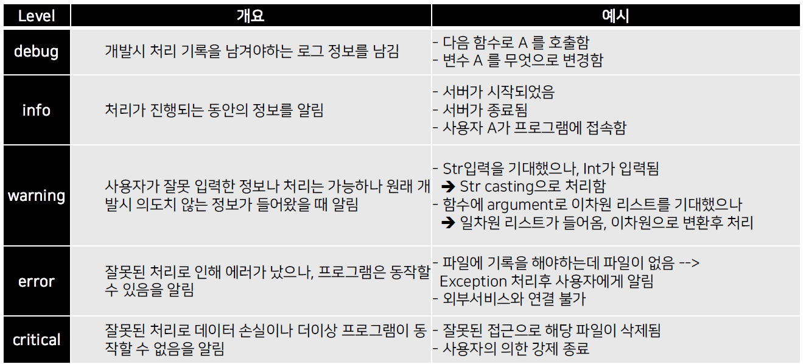

> 🙌은 **QnA에 있는 질문-답변**을 통해 얻은 지식을 표시합니다.

## [👉 피어 세션](https://github.com/boostcamp-ai-tech-4/peer-session/issues/17)

### 질문

- [[엠제이] iterator와 iterable 어떻게 다른가/리스트는 iterator가 아닌가](https://github.com/boostcamp-ai-tech-4/peer-session/issues/16)

### 기록

- 일주일의 마지막 날이라 **첫 주를 회고하는 시간**을 가졌다. 회고 중 팀원들이 "좋은 팀을 만나서 좋다"고 한 말이 가장 기억에 남았는데, 정말 좋은 팀원들을 만나서 정말 운이 좋다고 생각한다.
- 일주일 피어 세션을 바탕으로 **다음 피어세션은 어떻게 꾸려나갈 것인지에 대한 아이디어**를 받았다. 나는 짧은 세미나를 제안했는데 팀원분들이 좋아하셔서 다음 주부터 자유 주제로 짧은 세미나를 갖기로 했다! 나는 뭐하지..
- 목요일에 나온 **과제 코드리뷰**를 진행했다. 과제 자체가 쉬운 편이라서 괜찮았지만 다른 팀원분들의 코드를 보면서 몇 가지 아이디어를 얻을 수 있었다.
  - 불편하다면 함수로 만들자!
  - `모스부호 → 알파벳`으로 변환할 때 미리 reversed_dict를 만들어 놓자!
- 이번 주 모더레이터 마지막 날이라고 팀원분들이 나에게 많은 **감사의 인사🙌**를 전했다. 진행이 미숙하다고 생각했는데 좋게 봐주셔서 다행이다!

## Table of Contents

- [예외처리](#예외처리)
- [파일 I/O](#파일-io)
- [로그 처리](#로그-처리)
- [데이터 저장방식](#데이터-저장방식)
- [References](#references)

## 예외처리

인터프리터의 실행 과정에서 발생하는 예외를 처리할 수 있는 방법이다.

### 예외처리: try, except, finally

#### try ~ except

```python
try:
  # 예외 발생이 가능한 코드
except:
  # 예외 발생시 대응하는 코드
```

#### try ~ except ~ else

`if ~ else` 구문과 겹쳐보여서 그렇게 추천하지는 않는다.

```python
try:
  # 예외 발생이 가능한 코드
except:
  # 예외 발생시 대응하는 코드
else:
  # 예외가 발생하지 않았을 때 동작하는 코드
```

#### try ~ except ~ finally

```python
try:
  # 예외 발생이 가능한 코드
except:
  # 예외 발생시 대응하는 코드
finally:
  # 예외 발생 여부와 상관 없이 실행되는 코드
```

### 예외 발생: raise

`raise` 키워드를 사용해 `raise` 뒤에 명시된 예외를 발생시킬 수 있다.

```python
for i in range(0, 10, -1):
  if i == 0:
    raise ZeroDivisionError("0으로 나누었습니다.")
  print(100/i)
```

### 예외 종류

아래는 **필자가 만나본 예외(Exception)**만 정리한 것이다. 자세한 예외의 종류는 [여기](https://python.bakyeono.net/chapter-9-4.html)를 참고!

|        예외         | 내용                                         |
| :-----------------: | :------------------------------------------- |
| `ZeroDivisionError` | 0으로 나누려 할 떄                           |
|  `AssertionError`   | assert문에 의해 발생                         |
|     `EOFError`      | 파일에서 더이상 읽어들일 데이터가 없을 때    |
|    `IndexError`     | 잘못된 인덱스로 접근할 때                    |
|     `KeyError`      | 잘못된 Key값으로 접근할 떄                   |
|     `NameError`     | 잘못된 변수를 가리킬 때                      |
|  `FileExistsError`  | 이미 존재하는 파일/디렉터리를 새로 생성할 때 |
| `FileNotFoundError` | 존재하지 않는 파일/디렉터리에 접근하려 할 때 |
|  `RecursionError`   | 재귀 호출 단계가 허용 한계를 넘었을 때       |
|     `TypeError`     | 데이터의 유형이 잘못되었을 때                |
|    `ValueError`     | 데이터의 값이 잘못되었을 때                  |

## 파일 I/O

### 파일의 종류

기본적인 파일의 종류로 텍스트 파일(text)과 바이너리 파일(binary)이 존재한다.

- **바이너리 파일**: 이진 형식으로 저장된 파일
- **텍스트 파일**: 문자열 형식으로 저장된 파일

  - ASCII/Unicode 문자열 집합으로 실제로는 binary 형태이다.

### 파이썬 파일 입출력

#### 파일 열기와 닫기


파일은 `open("파일 이름", "접근 모드")`로 파일을 열 수 있다. 파일을 읽고 혹은 쓰고 난 뒤에는 항상 `close()`로 파일을 닫아줘야 한다.

```python
f = open('sample.txt', 'r)  # 읽기 모드로 파일 열기
text = f.read()             # 파일 전체 내용 읽기
print(text)
f.close()                   # 파일 닫기
```

만약 `close()`를 자주 까먹는다면 **with 구문**과 함께 사용하면 좋다. with 구문이 끝나면 종료 시 파일 객체에 있는 `__exit__()`를 호출하여 파일을 자동으로 닫아준다.

```python
with open('sample.txt) as f:  # 컨텍스트 진입 및 관련 객체 반환
  text = f.read()             # 파일 전체 내용 읽기
  print(text)
# with문이 끝나면 자동으로 파일을 닫아줌
```

#### 파일 읽기

파일을 읽기 위해서는 접근 모드를 `r`로 설정해야 한다. 파일을 읽기 위한 메소드는 다음과 같이 3개가 있다.

- `read()`: 파일 전체 내용을 하나의 문자열로 읽어온다. (바이너리 파일도 가능)
- `readline()`: 한 번에 한 줄만 읽어온다.
- `readlines()`: 파일 전체를 읽어 한 줄이 요소인 리스트를 반환한다.

#### 파일 쓰기

파일을 쓰기 위해서는 접근 모드를 `w`로 설정해야 한다. 파일을 쓰기 위한 메소드는 다음과 같이 2개가 있다.

- `write(data)`: 한 줄을 파일에 쓴다. (바이너리 파일도 가능)
- `writelines(data)`: 여러 개의 줄을 파일에 한 번에 쓴다.

### pathlib 모듈

Python3.4 전에는 `os`, `shutil`, `glob`로 파일 경로(Path)를 문자열로 나타냈지만, 이후로 `pathlib` 모듈이 생기면서 경로를 Path라는 객체로 나타낼 수 있다.

#### Path 객체 생성

```python
import pathlib
# 현재 경로를 포함한 Path 객체 생성
current_path = pathlib.Path.cwd()
# 직접 경로 설정해서 Path 객체 생성
my_path = pathlib.Path(r'C:\Users\Penguin\workspace')
```

여러 Path를 하나로 붙이고 싶다면 `/` 연산자나 `joinpath()` 메서드를 사용하면 된다.

```python
# 방법 1. \ 연산자
new_path1 = my_path / 'python' / 'sample.py'
# 방법 2. joinpath()
new_path2 = my_path.joinpath('python', 'sample.py')
# C:\Users\Penguin\workspace\python\sample.py
```

#### Path 객체로 파일 읽기/쓰기

- `open()`을 사용하는데 경로를 넣는 부분에 Path 객체를 넣는다.
- Path 객체의 읽기/쓰기 메서드를 사용한다.
  - 데이터 유형에 따라, 읽기/쓰기에 따라 4가지의 메서드를 제공한다.
  - `read_text()`(텍스트, 읽기), `read_bytes()`(바이너리, 읽기), `write_text()`(텍스트, 쓰기), `write_bytes()`(바이너리, 쓰기)

#### Path의 장점: 속성

Path 객체의 가장 큰 장점은 **경로에 대한 속성**을 가진 객체라는 점이다. 보통 문자열로 표현된 경로는 해당 경로의 특징을 다 담지 못하는데 이런 점을 Path 객체로 보완할 수 있다.

```python
print(my_path.name)   # 디렉토리 표시가 없는 순수 파일명
print(my_path.stem)   # 확장자이 없는 순수 파일명
print(my_path.suffix) # 확장자
print(my_path.parent) # 부모 경로의 Path 객체
```

### pickle

파이썬의 객체를 **영속화(persistence)하는 built-in 객체**를 말한다. 파이썬으로 구현된 객체, 데이터, 모델 등을 저장하고 불러와 그대로 사용할 수 있다.

가끔 JSON으로 정보를 저장하는 경우가 있는데 JSON은 자바스크립트 기반으로 만들어지는 파일이라 파이썬에서 저장했다가 다시 불러왔을 때 깨질 수 있다. 그러니 저장이 필요하다면 되도록 pickle로 저장하자!

```python
import pickle

# pickle 파일 저장
with open('list.pickle', 'wb') as f:
  lst = [1, 2, 3, 4, 5]
  pickle.dump(lst, f)

# pickle 파일 불러오기
with open('list.pickle`, 'rb') as f:
  new_lst = pickle.load(f)
  print(new_lst)
```

## 로그 처리

### 로깅(Logging)이란?

**프로그램이 실행되는 동안 일어나는 정보를 기록하는 것**을 말한다. 로그를 남기는 방법으로는 Consle 화면 출력, 파일 쓰기, DB에 기록 등 다양한 방법이 있다.

### 기본 설정: configparser, argparser

#### configparser

**프로그램 실행 설정**을 파일에 저장한다. `Section`, `Key`, `Value`로 구성되며 설정 파일을 딕셔너리로 호출하여 사용한다.

- config 파일

```
[SectionOne]  # Section 단위로 구분
Status: High  # 속성은 Key: Value로 표현
Name: Groot
Age: 20

[SectionTwo]
Military: Airforce
```

- configparser로 config파일 불러오기

```python
import configparser
config = configparser.ConfigParser()
# Section 리스트를 반환
print(config.sections())    # ['SectionOne', 'SectionTwo']

config.read('sample.cfg')         # config 파일 불러오기
for key in config['SectionOne']:  # SectionOne의 Key:Value 출력
  print(key, ":", config['SectionOne'][key])
```

#### argparser

**Console 창**에서 프로그램 실행 시의 설정(Setting) 정보를 저장한다. 거의 모든 Console 기반의 파이썬 프로그램은 기본으로 제공을 하고 있다.

자세한 내용은 [여기](https://docs.python.org/ko/3/library/argparse.html)를 참고!

### logging 모듈

#### logging level



프로그램 진행 상황에 따라 다른 레벨의 로그를 출력할 수 있다. logging 모듈에서는 이런 레벨을 설정할 수 있으며 레벨 간 우선순위는 다음과 같다.

> DEBUG > INFO > WARNING > ERROR > CRITICAL

#### logging 예시

```python
# 로그 메시지 포맷 설정: 시간-레벨-프로세스ID-메시지
formatter = logging.Formatter('%(asctime)s $(levelname)s %(process)d %(message)s')

logging.config.fileConfig('logging.conf') # 설정 파일 불러와서 세팅
logger = logging.getLogger()              # Logger 객체 생성

file_name = "sample.txt"
logger.info(f"Open file {file_name}")
try:
  with open(file_name, "r") as f:         # 파일 열기
    while True:
      text = f.readline()                 # 한 줄 씩 읽으면서
      if not text
        break
      logger.info("New lines added: {text}")  # 로그에 기록
except FileNotFoundError as e:
  logger.error(f"File Not found {e})
```

## 데이터 저장방식

- **csv**: 쉼표(,)로 구분한 텍스트 파일
  - 내장 csv 모듈로 읽기/쓰기를 할 수 있지만 큰 데이터를 다룰 때는 `pandas` 라이브러리를 쓴다.
- **html**: 웹 상의 정보를 구조적을 표현하기 위한 언어로 태그(Tag)로 구성되어 있다.
- **xml**: 데이터의 구조와 의미를 설명하는 태그를 사용하여 표시하는 언어로 HTML과 문법이 비슷하다.
  - 컴퓨터 간에 정보를 주고 받기 매우 유용한 저장 방식으로 쓰이고 있다.
- **json**: 자바스크립트의 객체(Object)를 저장하기 위한 파일
  - `json` 모듈로 쉽게 파싱 및 저장이 가능하며 파이썬에서는 딕셔너리로 호환된다.
  - 특히 대부분의 API가 응답으로 json파일을 보낸다.

## References

- [연오의 파이썬 - 예외의 분류·정의·발생](https://python.bakyeono.net/chapter-9-4.html)
- [with 문 컨텍스트 관리자](https://docs.python.org/ko/3/reference/datamodel.html#context-managers)
- [파일 읽기, .read() 메소드](https://wikidocs.net/14130)
- [컨텍스트 관리자 형](https://docs.python.org/ko/3/library/stdtypes.html#typecontextmanager)
- [Python 3's pathlib Module: Taming the File System](https://realpython.com/python-pathlib/)
