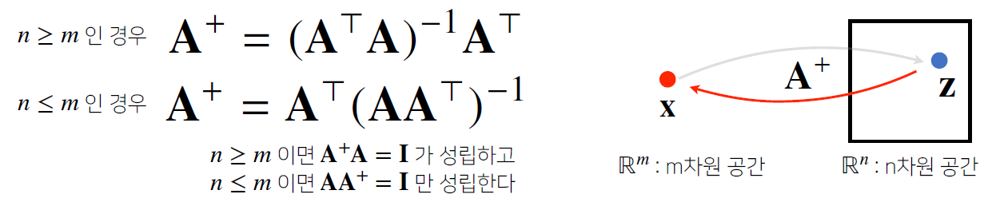

> 🙌은 **QnA에 있는 질문-답변**을 통해 얻은 지식을 표시합니다.

## [👉 피어 세션](https://github.com/boostcamp-ai-tech-4/peer-session/issues/18)

### 기록

- **무서운 `&nbsp`..** 팀원 분이 zoom에 코드를 올리셨는데 그걸 복붙해서 Jupyter에서 실행하면 돌아가지를 않았다. 그 이유가 공백이 `&nbsp`로 되서 그런 거였다.
- 내일부터 자기소개 TMI 시간을 갖기를 했다! CUAI에서 했던 것과 비슷하면서도 다른데 서로를 조금 더 깊이 알아갈 수 있는 시간이 될 것 같다.

## Table of Contents

- [Numpy](#numpy)
- [벡터](#벡터)
- [행렬](#행렬)
- [References](#references)

## Numpy

**👀 [Numpy Cheatsheet](https://github.com/CoodingPenguin/ai-template/blob/main/numpy/numpy-cheatsheet.ipynb)**

## 벡터

### 벡터란?

- **숫자**를 원소로 가지는 배열 혹은 리스트
- $R^n$ 공간에서의 한 점
- 원점으로부터의 상대적인 위치

### Norm

#### Norm의 정의

**원점에서부터의 거리**를 말한다. 기호 $\lVert \rVert$로 나타낸다.

- `L1 Norm`: 성분의 변화량의 절대값
  - $\lVert x \rVert_1 = \sum_{i=1}^d \left|x_i \right|$
  - **ex.** Robust 학습, 라쏘 회귀
- `L2 Norm`: 피타고라스 정리를 이용한 유클리드 거리
  - $\lVert x \rVert_2 = \sqrt{\sum_{i=1}^d \left|x_i \right|}$
  - **ex.** Laplace 근사, 릿지 회귀

#### Norm의 활용

- **L1 Norm의 활용**: 두 벡터 사이의 거리 → $\lVert y - x \rVert = \lVert x - y \rVert$

```python
import numpy as np
def l1_norm(vector):
    return np.linalg.norm(vector, ord=1)    # L1 Norm

x = np.array([1, 2])
y = np.array([2, 4])
print(l1_norm(y - x))   # 두 벡터사이의 거리: 3.0
```

- **L2 Norm의 활용**: 두 벡터 사이의 각도 → $\theta = \arccos\left({\frac{\langle x, y\rangle}{\lVert x \rVert_2 \lVert y \rVert_2}}\right)$

```python
import numpy as np
def l2_norm(vector):
    return np.linalg.norm(vector, ord=2)

x = np.array([1, 0])
y = np.array([1, 1])
print(np.dot(x, y) / (l2_norm(x) * l2_norm(y))) # 두 벡터사이의 각도: 0.7 (rad)
```

<div class="quote-block">
<div class="quote-block__emoji">💡</div>
<div class="quote-block__content" markdown=1>

벡터 내적의 표현: $\langle x, y \rangle$

벡터 내적을 다음과 같이 표현할 수 있다.  
$\langle x, y \rangle = x^Ty = \sum_{i=1}^d x_i y_i$

</div>
</div>

## 행렬

### 행렬이란?

- **벡터**를 원소로 가지는 2차원 배열
  - 행과 열이라는 인덱스를 가진다.
- $R^n$ 공간에서의 여러 점
  - 행렬의 한 행(=행벡터)은 i번째 데이터를 의미한다.
  - $x_{ij}$는 i번째 데이터의 j번쨰 변수의 값을 말한다.

<div class="quote-block">
<div class="quote-block__emoji">💡</div>
<div class="quote-block__content" markdown=1>

행렬, 벡터, 요소 표기법

- **$X_i$**: i번째 행벡터
- **$x_{ij}$**: i번쨰 행, j번째 열에 위치한 요소
- **$X^T$**: 행렬 $X$의 전치행렬

</div>
</div>

### 행렬의 곱셈

$$
XY = \left( \sum_k x_{ik} y_{kj} \right)
$$

**i번째 행벡터**와 **j번째 열벡터** 사이의 내적

- $X\cdot Y$ 곱셈을 한다고 할 때, **$X$의 열의 개수 == $Y$의 행의 개수**여야 한다.
- numpy에서는 `@ 연산자` 또는 `np.dot(X, Y)`로 계산이 가능하다.

```python
import numpy as np
X = np.array([[1, 2, 3], [4, 5, 6]], dtype=int)
Y = np.array([[-1, -1], [0, 0], [1, 1]], dtype=int)

print("@연산자 :", X@Y)
print("np.dot :", np.dot(X, Y))
```

### 행렬의 내적

$$
XY^T = \left( \sum_k x_{ik} y_{jk} \right)
$$

**i번째 행벡터와 j번째 행벡터** 사이의 내적

- $X$와 $Y$를 내적한다고 할 때, **$X$번째 열의 개수 == $Y$의 열의 개수**여야 한다.
- numpy에서는 `np.inner`로 내적을 구할 수 있다.

```python
import numpy as np
X = np.array([[1, 2, 3], [4, 5, 6]], dtype=int)
Y = np.array([[-1, -1, -1], [1, 1, 1]], dtype=int)

print("np.inner :", np.inner(X, Y))
```

### 행렬곱의 기하학적 의미


행렬은 **$R^n$의 벡터공간에서 사용되는 연산자**이다. 즉, $R^m$ 공간에 있는 벡터를 $R^n$ 공간으로 변환하는 것이다! 이를 이용해 패턴을 추출하거나 데이터를 압축할 수 있다.

### 역행렬


어떤 행렬 $X$의 연산을 **거꾸로 되돌리는 행렬**을 역행렬(Inverse Matrix)라고 하며, $X^{-1}$로 표기한다.

- numpy에서는 `np.linalg.inv()`로 역행렬을 구할 수 있다.

```python
import numpy as np
X = np.array([[1, 2, 3], [3, 1, 1], [1, 1, 1]], dtype=int)
print(np.linalg.inv(X))     # X의 역행렬
```

#### 역행렬의 조건

역행렬은 **다음의 조건**을 만족할 때만 만들 수 있다.

- `조건 1.` 행렬의 크기가 $N×N$인 정사각행렬이어야 한다.
- `조건 2.` 행렬의 행렬식(Determinant)가 0이 아니어야 한다.

#### 유사역행렬



`조건 1`을 만족하지 않는 즉, 정사각행렬이 아닌 다른 모양의 행렬에서는 역행렬 대신에 **유사 역행렬(Pseudo Inverse Matrix)**를 정의할 수 있다. 참고로 유사 역행렬을 구해서 대입해보면 값이 틀린 것을 볼 수 있다. 애초에 역행렬을 만들 수 없는 행렬을 가지고 **근사한 역행렬**을 만들었기 때문이다.

- $n ≤ m$인 경우, $Ax = b$ 방정식에서 $A$의 유사역행렬을 구해 만족하는 무수한 해 중 1개를 구할 수 있다.

```python
import numpy as np
A = np.array([[1, 2, 3, 4], [5, 6, 7, 8]], dtype=int)
b = np.array([1, 2], dtype=int)
A_pinv = np.linalg.pinv(A))     # A의 유사역행렬
print(A_pinv @ b)               # Ax=b를 만족하는 x
```

- $n ≥ m$인 경우, 데이터가 변수보다 많으므로 이 데이터를 대표할 선형회귀식을 유사역행렬로 근사할 수 있다.

```python
import numpy as np
X = np.random.randint(0, 50, size=(5, 2))     # 2차원 정규분포를 띈 무작위 데이터 X
X_ = np.array([np.append(x, [1]) for x in X]) # bias 추가
y = np.random.randint(0, 10, size=5)          # 1차원 정규분포를 띈 y

beta = np.linalg.pinv(X_) @ y    # 회귀 계수
y_predict = X_ @ beta            # 회귀식을 예측한 y
```

## References

- [공돌이의 수학정리노트 - 특이값 분해(SVD)](https://angeloyeo.github.io/2019/08/01/SVD.html)
- [공돌이의 수학정리노트 - 의사역행렬의 기하학적 의미](https://angeloyeo.github.io/2020/11/11/pseudo_inverse.html)
