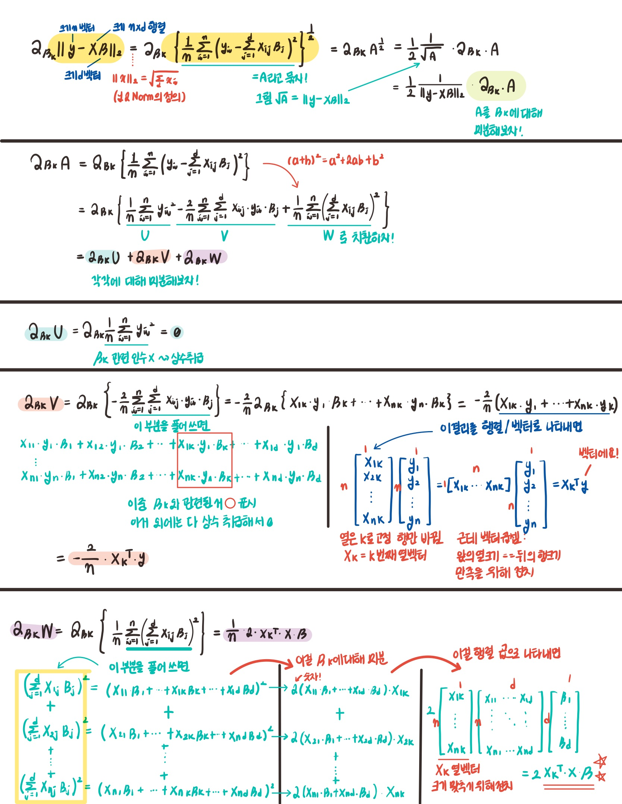
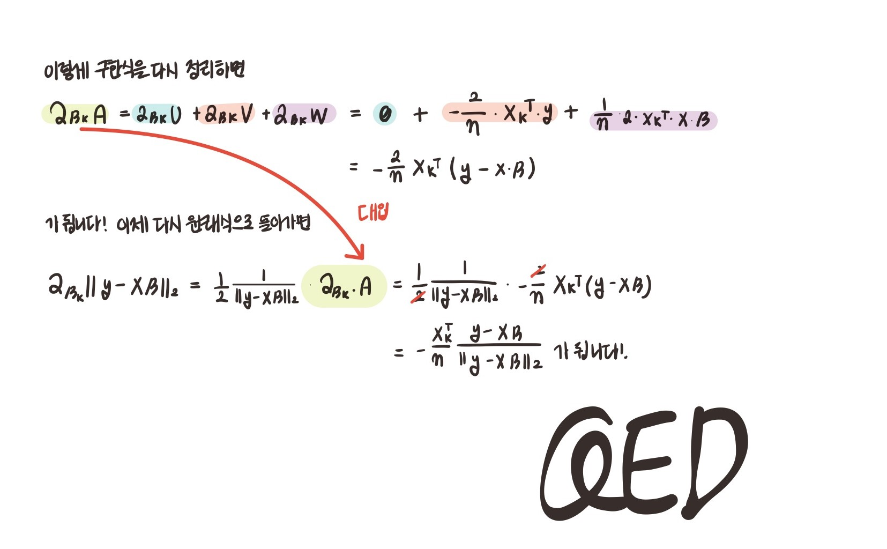

> 🙌은 **QnA에 있는 질문-답변**을 통해 얻은 지식을 표시합니다.

## [👉 피어 세션](https://github.com/boostcamp-ai-tech-4/peer-session/issues/26)

### 질문 & 꿀팁

- [[펭귄] 특정 axis 방향에서의 행렬 연산](https://github.com/boostcamp-ai-tech-4/peer-session/issues/20)
- [[히스] 벡터간 유사도와 내적](https://github.com/boostcamp-ai-tech-4/peer-session/issues/21)
- [[후미] 부동 소수점 처리](https://github.com/boostcamp-ai-tech-4/peer-session/issues/22)

### 기록

- 저번 주의 파이썬 문법이론이 끝나고 딥러닝을 맛보기 시작했는데 **수식**을 보니 되게 새롭다ㅋㅋ 결국 고등학교, 대학교 때 정리한 수학 노트를 꺼내서 다시 보고 있다..ㄸㄹㄹ
- 오늘 강의에서 수식이 정말 많이 나왔는데 그래서 그런지 피어세션 때도 수식관련 질문이 많이 나왔다. 많이 헷갈려서 답을 못했는데 그래서 학습 정리를 **조금 더 꼼꼼히** 했다.
- 오늘 첫 TMI 자기소개를 했다! 팀원의 새로운 면모(?)를 볼 수 있는 좋은 시간이었다. 다음 분도 기대가 된다.
- 다른 팀의 피어세션 기록을 우연히 보게 되었는데 그 팀은 [KPT(Keep-Problem-Try)](https://woowabros.github.io/experience/2020/05/13/birth-of-team-culture.html) 회고를 했다. 정말 좋은 방식이라고 생각해 이번 주 마지막 날 나도 이 방식에 맞춰서 회고를 해볼 예정이다.

## Table of Contents

- [일변수 함수의 미분](#일변수-함수의-미분)
- [다변수 함수의 미분](#다변수-함수의-미분)
- [경사하강법으로 선형회귀 계수 구하기](#경사하강법으로-선형회귀-계수-구하기)
- [확률적 경사하강법 (SGD)](#확률적-경사하강법-sgd)
- [References](#references)

## 일변수 함수의 미분

$$
f'(x) = \lim_{h \rightarrow 0}\frac{f(x+h) - f(x)}{h}
$$

- **변수의 움직임에 따른 함수값의 변화**를 측정하기 위한 도구
- 함수 $f$의 주어진 점 $(x, f(x))$에서의 **접선의 기울기**

### 경사하강법과 경사상승법


위의 그림을 보면 $f(x)$와 상관 없이 함수에 미분값을 더하면 함수값이 증가하고, 미분값을 빼면 감소하는 것을 볼 수 있다. 이 때 전자를 **경사상승법 (Gradient Ascent)**, 후자를 **경사하강법 (Gradient Descent)**라고 한다.

- 이 두 방법을 통해 함수의 극대값/극소값의 위치를 찾을 수 있다.
- 극대값/극소값에 도달하면 즉, 미분값이 0이 되면 업데이트를 멈춘다.

### 일변수 함수의 경사하강법 구현

다음의 코드를 실행해보면 미분값이 `epsilon`보다 작아질 때까지 함수값을 업데이트 시키고 다시 미분값을 구하는 것을 반복한다.

- 필요한 함수 정의

```python
def func(val):
    fun = sym.poly(x**2 + 2*x + 3)
    return fun.subs(x, val), fun    # x를 val변수로 대체

def func_gradient(fun, val):
    _, function = fun(val)
    diff = sym.diff(function, x)    # x에 대해 함수 미분
    return diff.subs(x, val), diff  # x를 val로 대체

def gradient_descent(fun, init_point, lr_rate=1e-2, epsilon=1e-5):
    cnt = 0
    val = init_point
    diff, _ = func_gradient(fun, init_point) # 첫 미분
    while np.abs(diff) > epsilon:
        val = val - lr_rate * diff           # 함수 업데이트
        diff,  _ = func_gradient(fun, val)   # 다시 미분
        cnt += 1
        print(f"[{cnt:^3}] val: {val:<10.5f}, diff: {diff:<10.5f}")
    print(f"함수: {fun(val)[1]}, 연산횟수: {cnt}, 최소점: ({val}, {fun(val)[0]})")
```

- 임의의 데이터 생성 및 경사하강법 수행

```python
gradient_descent(fun=func, init_point=np.random.uniform(-2, 2))
```

## 다변수 함수의 미분

### 변수가 벡터인 경우

앞선 경우는 변수가 $x$ 즉, 하나인 경우일 때의 미분이다. 그럼 변수가 $x, y, z$ 여러 개인 다변수 함수의 경우 어떻게 미분을 해야할까?
여기서 $x, y, z$를 묶어서 벡터로 만들 수 있으며, 이 벡터를 입력을 받는 다변수 함수는 **편미분**을 통해 미분을 할 수 있다.

$$
\partial_{x_i}f(x) = \lim_{h \rightarrow 0}\frac{f(x+he_i) - f(x)}{h}
$$

이렇게 각 변수 $x, y, z$ 별로 편미분한 결과를 벡터를 묶은 것을 **그레디언트 벡터(gradient vector)**라고 하며 이를 변수 변수 $x, y, z$를 업데이트 하는 데 사용한다.

$$
\nabla f = (\partial_{x_1}f, \partial_{x_2}f, ..., \partial_{x_d}f)
$$

<div class="quote-block">
<div class="quote-block__emoji">💡</div>
<div class="quote-block__content" markdown=1>

$e_i$의 의미

$i$번째 값만 1이고 나머지는 0인 단위벡터(unit vector)를 말한다. 예를 들어, $e_3 = [0, 0, 1, 0, 0, ...]$이다.

</div>
</div>

### 다변수 함수의 경사하강법 구현

일변수 함수의 코드와 크게 다르지 않지만 **입력값이 벡터라는 점**을 주의해야 한다. 학습 종료조건 부분을 보면 절대값인 일변수 함수와는 달리 **Norm**으로 그레디언트 벡터의 크기를 구해야한다.

- 필요한 함수 정의

```python
def eval_(fun, val):
    val_x, val_y = val                            # 다변수 x, y
    fun_eval = fun.subs(x, val_x).subs(y, val_y)  # x를 val_x변수로, y를 val_y로 대체
    return fun_eval

def func_multi(val):
    x_, y_ = val
    func = sym.poly(x**2 + 2*y**2)      # 다변수 함수 정의
    return eval_(func, [x_, y_]), func

def func_gradient(fun, val):
    x_, y_ = val
    _, function = fun(val)
    diff_x = sym.diff(function, x)      # x에 대한 편미분
    diff_y = sym.diff(function, y)      # y에 대한 편미분
    grad_vec = np.array([eval_(diff_x, [x_, y_]), eval_(diff_y, [x_, y_])], dtype=float)   # 그레디언트 벡터
    return grad_vec, [diff_x, diff_y]

def gradient_descent(fun, init_point, lr_rate=1e-2, epsilon=1e-5):
    cnt = 0
    val = init_point
    diff, _ = func_gradient(fun, init_point) # 첫 미분
    while np.linalg.norm(diff) > epsilon:
        val = val - lr_rate * diff           # 함수 업데이트
        diff,  _ = func_gradient(fun, val)   # 다시 미분
        cnt += 1
        print(f"[{cnt:^3}] val: {str(val):<30}, diff: {str(diff):<30}")
    print(f"함수: {fun(val)[1]}, 연산횟수: {cnt}, 최소점: ({val}, {fun(val)[0]})")
```

- 임의의 데이터 생성 및 경사하강법 수행

```python
pt = [np.random.uniform(-2, 2), np.random.uniform(-2, 2)]
gradient_descent(fun=func_multi, init_point=pt)
```

## 경사하강법으로 선형회귀 계수 구하기

다음과 같은 데이터 행렬 $X$, 회귀계수 벡터 $\beta$, 데이터의 결과값 벡터 $y$으로 이루어진 회귀식 $X\beta = y$이 있다고 하자.

$$
\left[
  \begin{array}{ccc}
    ── & x_{1} & ── \\
    ── & x_{2} & ── \\
       & \vdots&  \\
    ── & x_{n} & ──
  \end{array}
\right]
\left[
  \begin{array}{ccc}
    \beta_1 \\
    \beta_2 \\
     \vdots\\
    \beta_m
  \end{array}
\right]
=
\left[
  \begin{array}{ccc}
    y_1 \\
    y_2 \\
     \vdots\\
    y_n
  \end{array}
\right]
$$

### 목적식

우리는 최대한 실제 데이터에 가까운 즉, **|실제값-예측값|**이 가장 작을 때의 회귀계수 벡터 $\beta$를 찾아야 한다. 그러므로 선형회귀의 목적식은 $\lVert y - X\beta\rVert_2$이 된다.

### $\beta$에 대한 편미분

목적식 $\lVert y - X\beta\rVert_2$을 $\beta$의 요소 중 하나인 $\beta_k$에 대해 미분해보자.

- 🙌참고로 아래의 식은 L2 Norm이 아니라 **RMSE**이다. RMSE는 L2 Norm과 유사한데 데이터 개수만큼을 나눠줘야한다는 차이가 있다. 교수님 말씀으로는 관용적으로 RMSE를 L2 Norm처럼 쓴다고 한다.

$$
\partial_{\beta_k}\lVert y - X\beta\rVert_2 = \partial_{\beta_k}  \{ \frac{1}{n} \sum_{i=1}^{n} (y_i - \sum_{j=1}^{d}X_{ij}\beta_j)^2 \}^{\frac{1}{2}}
= -\frac{X^T_k(y-X\beta)}{n\lVert y-X\beta\rVert_2}
$$

<details markdown="1">
<summary><strong>👀 수식 유도과정</strong></summary>




</details>

위의 **👀 수식 유도과정**을 봤다면 회귀계수 벡터 $\beta$에 대한 미분인 그레디언트 벡터도 충분히 유도가 가능할 것이다. 그렇게 구한 그레디언트 벡터는 다음과 같다.

$$
\nabla_{\beta}\lVert y - X\beta\rVert_2 = (\partial_{\beta_1}\lVert y - X\beta\rVert_2, ... , \partial_{\beta_d} \lVert y - X\beta\rVert_2)
$$

$$
= \left( -\frac{X^T_1(y-X\beta)}{n\lVert y-X\beta\rVert_2}, ... , -\frac{X^T_d(y-X\beta)}{n\lVert y-X\beta\rVert_2} \right)
$$

$$
= -\frac{X^T(y-X\beta)}{n\lVert y-X\beta\rVert_2}
$$

$\lVert y - X\beta \rVert_2$ 대신 L2 Norm의 제곱인 $\lVert y - X\beta \rVert_2^2$을 쓰면 수식을 좀 더 간단히 만들 수 있다.

$$
\nabla_\beta \lVert y - X\beta \rVert_2^2 = (\partial_{\beta_1}\lVert y - X\beta\rVert_2^2, ... , \partial_{\beta_d} \lVert y - X\beta\rVert_2^2)
$$

$$
= - \frac{2}{n} X^T (y - X\beta)
$$

이제 **목적식을 최소화하는 $\beta$를 구하는 경사하강법 알고리즘**을 정리하면 다음과 같다.

$$
\beta^{(t+1)} ← \beta^{(t)}+ \frac{2\lambda}{n} X^T ( y- X\beta^{(t)})
$$

### 경사하강법 기반 선형회귀 알고리즘 구현

```python
X = np.array([[1, 1], [1, 2], [2, 2], [2, 3]])
y = np.dot(X, np.array([1, 2])) + 3

beta_gd = [10.1, 15.1, -6.5]                  # [1, 2, 3]이 정답
X_ = np.array([np.append(x, [1]) for x in X]) # bias를 가중치에 넣기 위해 1을 추가

for t in range(5000):
    error = y - X_ @ beta_gd
    grad = - np.transpose(X_) @ error  # 그레디언트 벡터 계산
    beta_gd = beta_gd - 0.01 * grad    # 회귀계수 벡터 업데이트
    print(f"[{t+1:^4}]   grad: {str(grad):<40} beta_gd: {str(beta_gd):<20}")

print(f"\n최종 beta_gd: {beta_gd}")
```

## 확률적 경사하강법 (SGD)

### 경사하강법의 한계

이론적으로 경사하강법은 **미분이 가능하고 볼록한(convex) 함수**에 대해서는 적절한 학습률과 학습횟수를 선택했을 때 수렴이 보장된다. 하지만 비선형회귀와 같이 목적식이 non-convex할 경우 global minimum 외에 local minimum이 존재할 수 있으므로 수렴이 보장되지 않는다.


> non-convex함수의 예

### 해결책: 확률적 경사하강법

$$
\theta^{(t+1)} ← \theta{(t)} - \widehat{\nabla_\theta\mathcal{L}}(\theta^{(t)})
$$

$$
E[\widehat{\nabla_\theta\mathcal{L}}] \approx \nabla_\theta\mathcal{L}
$$

확률적 경사하강법(stochastic gradient descent)은 **데이터 1개 혹은 일부를 가지고 업데이트 하는 방법**으로, 위와 같은 local minimum 문제를 해결해준다. 즉, 볼록이 아닌 함수도 이 방법을 통해 최적화(optimization)가 가능하다.

그럼 어떻게 가능한 것일까? 확률적 경사하강법(일명 SGD)는 데이터 일부에 해당하는 **미니 배치**를 뽑아 업데이트를 하는데 <u>계속 미니 배치의 구성이 바뀐다.</u> 그래서 한 epoch 전에 local minimum에 빠졌더라도 다음 epoch 때 구성이 바뀌어 기울기가 다라지면서 local minumum에서 빠져나올 수 있다.

🙌**그럼 global minimum에서도 비슷한 일이 일어나지 않을까?** 그럴 수도 있다. SGD의 큰 단점 중 하나가 global minimum 근처까지는 빠르게 수렴하지만 정작 <u>그 근처에서는 global minimum에 도달하지 못하고 진동하는 것</u>이다. 이럴 경우 점차 학습률을 줄여가는 방식을 사용하여 어느 정도 해결할 수 있다.

🙌참고로 SGD에서 미니배치를 사용할 때 전체 데이터를 한 번 섞은 후(shuffle) 배치 크기만큼 나누기 때문에 **한 iteration 내 중복되는 세트는 존재하지 않**는다.

### 하드웨어에서 GD vs SGD

최적화 알고리즘으로 **경사하강법(GD)**를 쓰고 **수 백장의 고해상도 이미지 데이터**를 가지고 학습을 한다고 하자. GD는 미분을 계산할 때 전체 데이터에 대해서 미분을 한다. 즉, 연산을 위해 데이터를 모두 메모리에 올려야 하는데, 이를 올리면 분명히 `메모리 부족 에러`가 뜰 것이다.

이에 비해 **확률적 경사하강법(SGD)**는 데이터의 일부만 사용하므로, GD보다는 훨씬 적은 양의 메모리가 들고 크기가 큰 데이터라도 학습을 시킬 수 있다.

## References

- [데이터사이언스스쿨 - 4.4. 행렬의 미분](https://datascienceschool.net/02%20mathematics/04.04%20%ED%96%89%EB%A0%AC%EC%9D%98%20%EB%AF%B8%EB%B6%84.html)
- [다크 프로그래머 - 백터 미분과 행렬 미분](https://darkpgmr.tistory.com/141)
- [공돌이의 수학정리노트 - 경사하강법](https://angeloyeo.github.io/2020/08/16/gradient_descent.html)
- [데이터사이언스스쿨 - 선형회귀분석의 기초](https://datascienceschool.net/03%20machine%20learning/04.02%20%EC%84%A0%ED%98%95%ED%9A%8C%EA%B7%80%EB%B6%84%EC%84%9D%EC%9D%98%20%EA%B8%B0%EC%B4%88.html?highlight=intercept)
- [Sympy Modules - abc](https://docs.sympy.org/latest/modules/abc.html)
