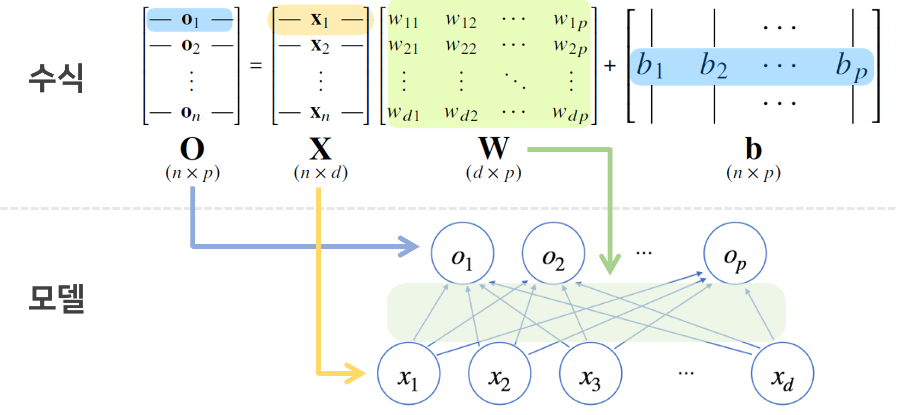
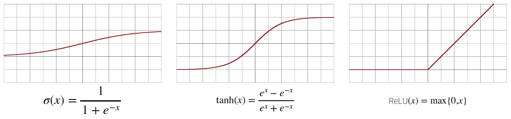
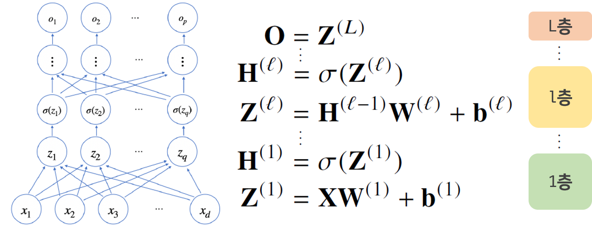
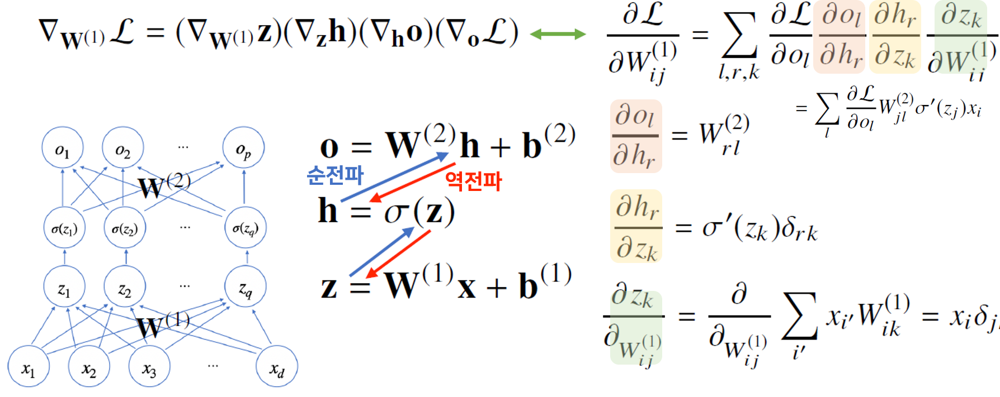

> 🙌은 **QnA에 있는 질문-답변**을 통해 얻은 지식을 표시합니다.

## [👉 피어 세션](https://github.com/boostcamp-ai-tech-4/peer-session/issues/29)

### 질문 & 꿀팁

- [🍯 [원딜] 무어-펜로즈 역행렬](https://github.com/boostcamp-ai-tech-4/peer-session/issues/27)
- [🍯 [서폿] NBSP](https://github.com/boostcamp-ai-tech-4/peer-session/issues/28)
- [❓ [히스] SGD 에서 미니배치](https://github.com/boostcamp-ai-tech-4/peer-session/issues/23)
- [❓ [히스] intercept 행 1 추가](https://github.com/boostcamp-ai-tech-4/peer-session/issues/24)
- [❓ [엠제이] 벡터의 미분](https://github.com/boostcamp-ai-tech-4/peer-session/issues/25)

### 기록

- Further Question에 나온 **선형회귀의 목적식의 편미분식 유도**에 성공했는데 팀원분들이 큰 도움이 되었다 해서 기분이 좋았다😊 처음에 수식을 봤을 때 두려웠는데 계속 쪼개니까 내가 아는 문제로 보여서 참 신기했다.
- 오늘 **첫 세미나 시간**을 가졌다. 후미님의 경험담은 정말 신기했고 원딜님의 확률통계 순한맛은 확통 복습하는 데 큰 도움이 되었다.
- 미적분은 고등학교와 대학교 때 많이 해봐서 어렵지는 않은데 **벡터와 행렬 미분**이 많이 어색하다..ㅠㅠ 그렇다고 미적분학을 다시 공부할 수는 없고 행렬 미분을 어떻게 하는지만 공부해봐야겠다.

## Table of Contents

- [Pandas](#pandas)
- [신경망](#신경망)
- [역전파 알고리즘](#역전파-알고리즘)
- [References](#references)

## Pandas Ⅰ

**[👀 Pandas Cheatsheet](https://github.com/CoodingPenguin/ai-template/blob/main/pandas/pandas-cheatsheet.ipynb)**

## 신경망

**선형모델**과 **활성화 함수(activation function)**을 합성한 함수

### 선형모델

#### 선형모델이란?

선형모델은 데이터 $x_i$와 가중치 행렬 $W$ 사이의 행렬곱과 절편 $b$ 벡터의 합인 행벡터 $o_i$로 나타낼 수 있다.

- 기하학적 의미에서 $n$개의 $d$차원 입력 데이터 $x_i$에 **$d \rightarrow p$으로 차원을 변환시키는 가중치 행렬**을 곱해 $n$개의 $p$차원 출력 데이터를 생성하는 것으로 볼 수 있다.
- 신경망으로 본다면 $d$개의 변수로 **$p$개의 선형모델**을 만들어서 $p$개의 잠재변수를 설명하는 모델로 볼 수 있다.

#### 소프트맥스 함수 vs 원-핫 벡터

$$
softmax(o) = ( \frac{exp(o_1)}{\sum^p_{k=1} exp(o_k)}, ..., \frac{exp(o_p)}{\sum^p_{k=1} exp(o_k)})
$$

- `소프트맥스 함수`: 모델의 출력을 확률로 해석할 수 있게 변환한다. 주로 분류 문제에서 쓰인다.
  - 🙌 소프트맥스 함수를 코드를 구현할 때 실제 식과는 달리 벡터 $o$의 모든 요소 중 가장 큰 값을 모든 요소에서 빼주는 데 이는 **지수함수로 인한 오버플로우를 방지**하기 위함이다.
- `원-핫 벡터`: 결과값 벡터의 요소 중 가장 큰 값을 가진 요소의 위치만 1로 출력한다. 라벨값을 표현하는 한 방식이다.

### 활성화 함수

활성화 함수 $\sigma$는 **비선형함수**로 선형모델의 출력인 잠재벡터 $z = (z_1, ..., z_q)$의 각 노드에 개별적으로 적용하여 새로운 잠재벡터 $H = (\sigma(z_1), ..., \sigma(z_n))$를 만든다.

#### 활성화 함수를 쓰는 이유

세상의 모든 문제는 선형함수로만 풀 수 없다. 예를 들면, XOR 문제의 경우 절대로 선형함수로 분류할 수 없다. 이런 <u>선형함수로 풀 수 없는 문제들을 해결</u>하기 위해 **비선형함수**인 **활성화 함수**를 쓰는 것이다! 🙌정확히 말하자면 비선형함수인 활성화 함수를 층에 두면 선형경계를 구부려 선형함수로 풀 수 없는 복잡한 문제를 해결할 수 있다.

만약 활성화 함수로 선형함수를 쓴다면 아무리 층이 깊어져도 모델 자체가 선형모델이기 때문에 XOR과 같은 문제는 풀 수 없다.

> 여러 가지 활성화 함수. 최근에는 ReLU를 많이 쓴다.

### 다층 신경망

다층 신경망(multi-layer)이란 **신경망이 여러층 합성된 함수**를 말한다. 그럼 왜 이렇게 여러 층을 쌓은 신경망을 만드는 걸까? 바로 목적함수를 근사하는데 <u>필요한 노드(뉴런)의 숫자가 훨씬 빨리 줄어들어 좀 더 효율적으로 학습이 가능</u>하기 때문이다. 반면 층이 얇으면 한 층에 많은 수의 뉴런이 필요하다. 그러므로 노드 수를 늘리는 것보다는 깊은 층을 쌓는 것이 더 효율적이다.

🙌예를 들어, 총 12개의 노드를 사용하여 모델을 만든다고 생각해보자. 만약 6개의 노드를 사용해서 2층을 쌓는다면 총 학습되는 가중치의 개수는 $6×6 = 36$이다. 만약 3개의 노드를 사용해서 3층을 쌓는다면 개수는 $3×3×3 = 81$로 더 많은 가중치를 학습시킬 수 있다.

근데 층이 깊으면 복잡한 함수를 표현할 수 있으나 최적화가 잘 된다는 말은 아니다. 그래서 깊을수록 학습이 어려워진다.

## 역전파 알고리즘

역전파(back propagation)은 순전파(forward propagation)와는 다르게 `출력 → 입력`으로 흐르는 것을 말한다. 역잔파 알고리즘은 합성함수의 미분법인 **연쇄법칙(chain-rule) 기반 자동미분**을 사용한다.

### 왜 필요할까?

손실함수에 대한 매개변수의 편미분을 효율적으로 빠르게 구하기 위해서이다. 각 층마다 있는 가중치 행렬 $W$와 편향 $b$를 생각하면 매개변수의 개수가 매우 많을 것이다. 우리가 아는 미분식 $f'(x) = \lim_{h \rightarrow 0} \frac{f(x+h)-f(x)}{h}$을 가지고 계산 시간이 장난 아니게 걸린다.

반면 역전파 알고리즘을 쓰면 `출력 → 입력`으로 거슬러 올라가면서 연쇄법칙에 의해 각 매겨변수의 편미분 결과를 쉽게 구할 수 있다. 🙌역전파는 **순전파를 한 후** 일어나는데 이는 순<u>전파의 계산 결과가 필요</u>하기 때문이다. 그래서 이런 계산 결과를 저장하기 때문에 메모리를 좀 더 사용하게 된다.

### 2층 신경망의 역전파

🙌위의 미분과정에 대한 설명을 덧붙이자면 같다.

- $\delta_{rk}$와 $\delta_{jk}$는 **미분 과정에서 발생하는 결과**이다. 예를 들면, $f(2x)$를 $x$에 대해 미분하면 $f'(2x) \cdot 2$가 나오는데 이 2가 $\delta$와 같은 것이다. 참고로 $\delta$는 단위행렬을 뜻하며, $\delta_{ij} = \begin{cases}1 & i = j\\0 & i ≠ j\end{cases}$이다.
- 마지막 곱할 때 $\delta$가 없어지는 이유는 **element-wise 연산** 때문이다. 예를 들면, $h_2$는 $\sigma(z_2)$이므로 $h_2$를 $z_2$가 아닌 다른 요소로 미분하면 0이 된다. 따라서 $r=k=j$가 아닌 경우 어짜피 0이 되기에 그렇지 않은 $\delta_{rk}$와 $\delta_{jk}$가 사라진다.
- $r=k=j$인 것만 고려하면 최종 미분 결과는 $W^2_{jl} \cdot \sigma'(z_j) \cdot \delta_{jj} \cdot x_i \cdot \delta_{jj}​​$이 되는데 $\delta_{jj}$는 1이므로 곱해도 똑같기 때문에 위와 같은 식이 나오게 된다.

## References

- [벡터 미분과 행렬 미분 - 다크 프로그래머](https://darkpgmr.tistory.com/141)
- [4.4 행렬의 미분 - 데이터 사이언스 스쿨](https://datascienceschool.net/02%20mathematics/04.04%20%ED%96%89%EB%A0%AC%EC%9D%98%20%EB%AF%B8%EB%B6%84.html)
