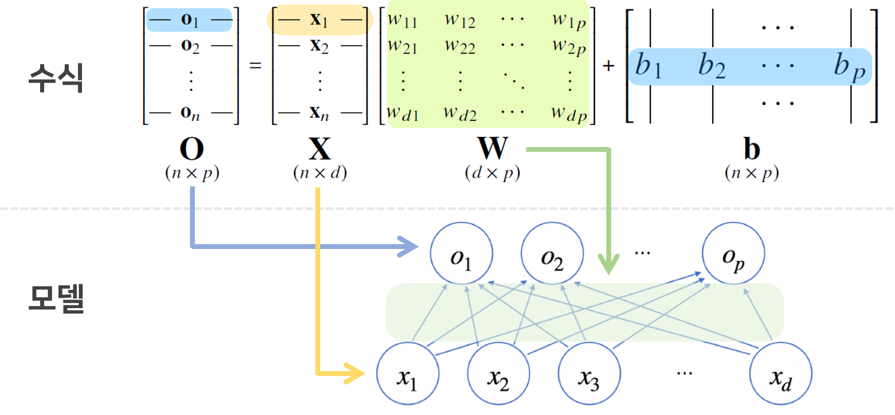
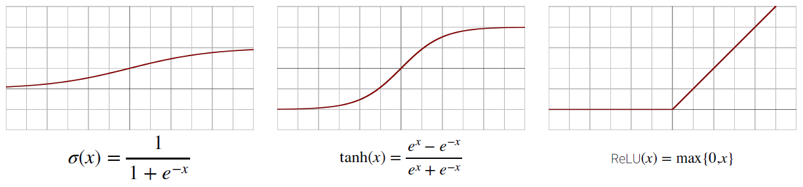

> 🙌은 **QnA에 있는 질문-답변**을 통해 얻은 지식을 표시합니다.

## [👉 피어 세션](#)

### 질문 & 꿀팁

- [🍯 [원딜] 무어-펜로즈 역행렬](https://github.com/boostcamp-ai-tech-4/peer-session/issues/27)
- [🍯 [서폿] NBSP](https://github.com/boostcamp-ai-tech-4/peer-session/issues/28)
- [❓ [히스] SGD 에서 미니배치](https://github.com/boostcamp-ai-tech-4/peer-session/issues/23)
- [❓ [히스] intercept 행 1 추가](https://github.com/boostcamp-ai-tech-4/peer-session/issues/24)
- [❓ [엠제이] 벡터의 미분](https://github.com/boostcamp-ai-tech-4/peer-session/issues/25)

### 기록

## Table of Contents

## Pandas

**[👀 Pandas Cheatsheet](#)**

## 신경망

**선형모델**과 **활성화 함수(activation function)**을 합성한 함수

### 선형모델

#### 선형모델이란?

선형모델은 데이터 $x_i$와 가중치 행렬 $W$ 사이의 행렬곱과 절편 $b$ 벡터의 합인 행벡터 $o_i$로 나타낼 수 있다.

- 기하학적 의미에서 $n$개의 $d$차원 입력 데이터 $x_i$에 **$d \rightarrow p$으로 차원을 변환시키는 가중치 행렬**을 곱해 $n$개의 $p$차원 출력 데이터를 생성하는 것으로 볼 수 있다.
- 신경망으로 본다면 $d$개의 변수로 **$p$개의 선형모델**을 만들어서 $p$개의 잠재변수를 설명하는 모델로 볼 수 있다.

#### 소프트맥스 함수 vs 원-핫 벡터

$$
softmax(o) = ( \frac{exp(o_1)}{\sum^p_{k=1} exp(o_k)}, ..., \frac{exp(o_p)}{\sum^p_{k=1} exp(o_k)})
$$

- `소프트맥스 함수`: 모델의 출력을 확률로 해석할 수 있게 변환한다. 주로 분류 문제에서 쓰인다.
- `원-핫 벡터`: 결과값 벡터의 요소 중 가장 큰 값을 가진 요소의 위치만 1로 출력한다. 즉, 추론을 할 때 쓰인다.

### 활성화 함수

활성화 함수 $\sigma$는 **비선형함수**로 선형모델의 출력인 잠재벡터 $z = (z_1, ..., z_q)$의 각 노드에 개별적으로 적용하여 새로운 잠재벡터 $H = (\sigma(z_1), ..., \sigma(z_n))$를 만든다.

#### 활성화 함수를 쓰는 이유

세상의 모든 문제는 선형함수로만 풀 수 없다. 예를 들면, XOR 문제의 경우 절대로 선형함수로 분류할 수 없다. 이런 <u>선형함수로 풀 수 없는 문제들을 해결</u>하기 위해 **비선형함수**인 **활성화 함수**를 쓰는 것이다!

만약 활성화 함수로 선형함수를 쓴다면 아무리 층이 깊어져도 모델 자체가 선형모델이기 때문에 XOR과 같은 문제는 풀 수 없다.

> 여러 가지 활성화 함수. 최근에는 ReLU를 많이 쓴다.

### 다층 신경망

다층 신경망 = 신경망이 여러층 합성된 함수 (이것만)

왜 여러 층을 쌓나?
목적함수를 근사하는데 필요한 노드의 숫자가 훨씬 빨리 줄어들어 좀 더 효율적으로 학슴이 가능
근데 층이 깊으면 복잡한 함수를 표현할 수 있으나 최적화가 잘 된다는 말은 아님
그래서 깊을수록 학습이 어렵다

## 역전파 알고리즘

### 왜 필요할까?

왜 필요? 손실함수에 대한 매개변수의 편미분을 구하기 위함
매개변수가 W+b에 각 층마다 있으니 개수가 장난 아닌데
그냥 우리가 아는 미분 식가지고 하면 시간 장난 아니게 걸림
좀 더 효율적으로 한 번에 쉽게 미분을 할 수 있는 방법이다.
가장 중요한 것은 Chain Rule을 사용한다는 것

### 예시

가장 쉬운 소재부터

역전파 알고리즘 - 신경망에 적용 2층 시경마
