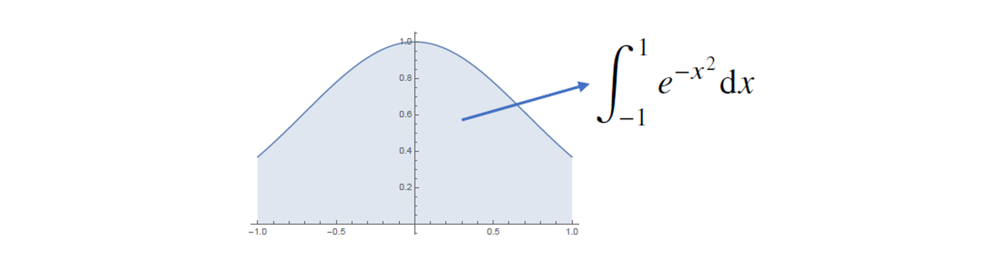

> 🙌은 **QnA에 있는 질문-답변**을 통해 얻은 지식을 표시합니다.

## [👉 피어 세션](https://github.com/boostcamp-ai-tech-4/peer-session/issues/37)

### 질문

- [[펭귄] 소프트맥스 함수와 원-핫 인코딩의 차이](https://github.com/boostcamp-ai-tech-4/peer-session/issues/31)
- [[엠제이] 몬테카를로](https://github.com/boostcamp-ai-tech-4/peer-session/issues/33)
- [[엠제이] 데코레이터@ 와 행렬곱@](https://github.com/boostcamp-ai-tech-4/peer-session/issues/34)
- [[후미] p(y|x)가 정확히 뭐죠?](https://github.com/boostcamp-ai-tech-4/peer-session/issues/35)
- [[펭귄] 회귀 분석의 손실함수 L2 Norm과 예측 오차의 분산](https://github.com/boostcamp-ai-tech-4/peer-session/issues/36)

### 기록

`확률변수`, `확률분포` 등의 용어가 나오면서 훨씬 더 어려워졌다. 그래서 설명을 하기도, 질문을 하기도 어려웠다. 이런 날은 추가 공부를 해서 최대한 이해해야지.

## Table of Contents

- [Pandas Ⅱ](#pandas-ⅱ)
- [확률론이 왜 필요하나요?](#확률론이-왜-필요하나요)
- [확률분포](#확률분포)
- [조건부 확률분포](#조건부-확률분포)
- [몬테카를로 샘플링](#몬테카를로-샘플링)
- [References](#references)

## Pandas Ⅱ

**[👀 Pandas Cheatsheet](https://github.com/CoodingPenguin/ai-template/blob/main/pandas/pandas-cheatsheet.ipynb)**

## 확률론이 왜 필요하나요?

딥러닝은 **확률론 기반의 머신러닝 이론**에 바탕을 두고 있다. 예를 들면, 손실함수(loss function)은 데이터 공간을 통계적으로 해석해서 유도한다.

- `ex1.` 회귀분석의 손실함수인 L2-Norm은 **예측 오차의 분산**을 가장 최소화하는 방향으로 학습한다.
  - 통계적 관점에서 보았을 때 예측값이 실제값에 가까워질수록 예측오차의 분산이 작아진다. 관련 논의는 [여기](https://github.com/boostcamp-ai-tech-4/peer-session/issues/36)를 참고!
  - 🙌 비슷한 질문이 올라왔는데 [한 캠퍼 분](https://www.notion.so/4632b800d3d144aeaf5dae64fc953932)께서 정말 잘 정리해주셨다. 정리하면 오차를 분해하면 **편향 + 분산 + 통제할 수 없는 에러**로 분해할 수 있는 데 통제할 수 없는 에러는 줄일 수 없으므로 편향과 분산을 줄이게 된다고 한다. 근데 이 둘을 줄이면서 둘 간의 트레이드오프가 일어나는데 이 내용은 [여기](https://ko.wikipedia.org/wiki/%ED%8E%B8%ED%96%A5-%EB%B6%84%EC%82%B0_%ED%8A%B8%EB%A0%88%EC%9D%B4%EB%93%9C%EC%98%A4%ED%94%84)를 참고!
- `ex2.` 분류 문제의 손실함수 교차엔트로피는 **모델 예측의 불확실성**을 최소화하는 방향으로 학습한다.
  - 교차엔트로피는 분류 문제의 성능을 측정할 때의 지표로 사용하며, 예측이 잘 맞으면 0에 가까워지고 예측이 틀리면 숫자가 커진다.
  - 분류 문제에서의 불확실성(uncertainty)란 **분류를 할 수 없는 상황**을 말한다. 예를 들면, 어떤 데이터에 대한 각 레이블 별 확률이 `[0.5, 0.5]`일 때와 같이 선택할 수 없을 때가 있다.

<br/>

회귀에서의 분산, 분류문제의 불확실성을 최소화하기 위해서 이를 측정하는 방법을 알아야 한다. 이를 측정하기 위해 **확률론**이 필요하다.

## 확률분포

확률 변수 $x$와 $y$로 이루어진 데이터 공간 $x × y$에서 **데이터를 추출하는 분포 $D$**를 말한다.

### 확률변수

$$
X: S \rightarrow R
$$

확률변수란 **표본 공간 $S$에서 실수 $R$로 출력하는 함수**를 말한다. 확률 변수 $x, y$로 이루어진 공간에서 확률분포 $D$를 가진 데이터를 $(x, y)$~$D$로 나타낼 수 있다. 확률변수를 정의하는 이유는 표본을 실수로 나타내어 확률분포함수를 정의하기 위해서이다.

확률변수는 확률분포에 따라 `이산형`과 `연속형` 확률변수로 구분된다.

#### 이산확률변수

확률변수 $X$가 유한하거나 가산가능한 정도로 무한 개의 가능한 값을 가질 때, 확률변수 $X$를 이산확률변수라고 한다.

이산확률변수의 예로 [베르누이 확률변수](https://datascienceschool.net/02%20mathematics/08.02%20%EB%B2%A0%EB%A5%B4%EB%88%84%EC%9D%B4%EB%B6%84%ED%8F%AC%EC%99%80%20%EC%9D%B4%ED%95%AD%EB%B6%84%ED%8F%AC.html#id3), [이항 확률변수](https://datascienceschool.net/02%20mathematics/08.02%20%EB%B2%A0%EB%A5%B4%EB%88%84%EC%9D%B4%EB%B6%84%ED%8F%AC%EC%99%80%20%EC%9D%B4%ED%95%AD%EB%B6%84%ED%8F%AC.html#id9), [포아송 확률변수](https://ko.wikipedia.org/wiki/%ED%91%B8%EC%95%84%EC%86%A1_%EB%B6%84%ED%8F%AC)가 있다.

|                                                    |                                                                                                         |
| :------------------------------------------------: | :-----------------------------------------------------------------------------------------------------: |
| **확률질량함수** <br/> (probability mass function) | $p(x_i) = P({X = x_i}) (i = 1, 2, 3, ... , N or \infty)$ <br/>단, $\sum^{N or \infty}_{i=1} p(x_i) = 1$ |
|           **기댓값**<br/> (expectation)            |                                     $E[X] = \sum_x x \cdot P(X=x)$                                      |
|              **분산**<br/>(variance)               |                    $Var[X] = \sum_x (x- \mu)^2 \cdot P(X=x)$<br/>이 때, $\mu = E[X]$                    |

#### 연속확률변수

확률변수 $X$가 임의의 실수집합 $B$에 포함되는 사건의 확률이 어떤 음이 아닌 함수 $f$의 적분 $P(x \in B) = \int_B f(x) dx$로 주어지는 경우, $X$를 연속확률변수라고 한다.

이 때, $f(x)$를 **확률밀도함수(probability density function)**라고 하며, $P(X \in R) = \int^\infty_{-\infty} f(x) dx = 1$을 만족해야 한다.

연속확률변수의 예로 [균일 확률변수](https://ko.wikipedia.org/wiki/%EC%97%B0%EC%86%8D%EA%B7%A0%EB%93%B1%EB%B6%84%ED%8F%AC), [정규 확률변수](https://ko.wikipedia.org/wiki/%EC%A0%95%EA%B7%9C_%EB%B6%84%ED%8F%AC), [지수확률변수](https://ko.wikipedia.org/wiki/%EC%A7%80%EC%88%98_%EB%B6%84%ED%8F%AC)가 있다.

|                                                         |                                                                                    |
| :-----------------------------------------------------: | :--------------------------------------------------------------------------------: |
| **누적분포함수**<br/>(cumulative distribution function) |      $F(a) = P(X ≤ a) = \int^a_{-\infty} f(x) dx$ <br/>이 때, $F'(x) = f(x)$       |
|              **기댓값**<br/> (expectation)              |                   $E[X] = \int^\infty_{-\infty} x \cdot f(x) dx$                   |
|                 **분산**<br/>(variance)                 | $Var[X] = \int^\infty_{-\infty} (x - \mu)^2 \cdot f(x) dx$<br/>이 때, $\mu = E[X]$ |

### 기댓값이 중요한 이유

기댓값을 가지고 여러 종류의 통계적 범함수를 계산할 수 있기 때문이다. 여기서 말하는 통계적 범함수란 기댓값으로 계산할 수 있는 분산, 공분산, 첨도 등을 말한다.

- **분산**: $Var[X] = E[x^2] - E[x]^2$
- **공분산**: $Con(X, Y) = E[(X-E[X])(Y-E[Y])]$
- **첨도**: $E[(\frac{X - E[X]}{\sqrt{Var[X]}})^3]$

### 결합확률분포와 주변확률분포

앞서 설명한 확률분포는 1개의 확률변수에 관한 확률분포에 관한 이야기였다. 하지만 대부분의 문제는 확률변수가 2개 이상이며, 이 두 변수에 관한 확률분포를 **결합확률분포(joint function)**라고 한다.

X의 주변확률함수는 $X=x$일 때의 모든 $Y$에 대한 결합확률함수의 합을 말한다. 반대로 Y의 주변확률함수는 $Y=y$일 때의 모든 $X$에 대한 결합확률함수의 합이다.

자세한 내용은 <u>확률및통계 Chapter 6. 결합분포</u>를 참고!

## 조건부 확률분포

조건부확률 $P(y|x)$는 입력변수 $x$에 대해 정답이 $y$일 확률을 의미한다.

- `ex1.` 분류문제에서 $softmax(W\phi+b)$은 데이터 $x$로부터 추출된 특징패턴 $\pi(x)$와 가중치행렬 $W$을 통해 조건부확률 $P(y|x)$를 계산한다.
- `ex2.` 회귀문제에서 조건부 기대값 $E[y|x]$는 조건부확률 $P(y|x)$을 사용하여 계산한다.
  - 조건부기대값은 $E\lVert y - f(x) \rVert_2$를 **최소화하는 함수 $f(x)$**와 일치한다.

## 몬테카를로 샘플링

대부분의 머신러닝 문제들은 확률분포를 모르는 경우가 많다. 이 때 기댓값을 계산하고 싶다면 **몬테카를로 샘플링(Monte Carlo sampling)**을 통해 기댓값을 계산할 수 있다.

$$
E_{x\sim P(x)}[f(x)] \approx \frac{1}{N} \sum^N_{i=1} f(x^{(i)}), \qquad x^{(i)} \sim x P(x) \quad i.i.d.
$$

<div class="quote-block">
<div class="quote-block__emoji">💡</div>
<div class="quote-block__content" markdown=1>

i.i.d. (independent and identically distributed)

확률변수가 여러 개 있을 때 각 변수들이 서로 상호독립적이며 모두 동일한 확률분포를 가질 때를 말한다.

</div>
</div>

### 몬테카를로 예제 1: 적분 계산

함수 $g(x) = e^{-x^2}$의 $[-1, 1]$ 상에서 적분값은?



$x$가 $U(-1, 1)$ 균등분포를 가진다고 가정할 때, $x$는 i.i.d이므로 몬테카를로 샘플링이 가능하다. $x$의 확률밀도함수 $f(x)$는 $\frac{1}{1-(-1)} = \frac{1}{2}$이다. 그럼 $E[g(x)]$를 계산하면 다음과 같다.

$$
E[f(x)] = \int^1_{-1} g(x)f(x) dx = \frac{1}{2} \int^1_{-1} g(x) = \frac{1}{2} \int^1_{-1} e^{-x^2}
$$

몬테카를로 샘플링 공식에 의해 함수 $g(x) = e^{-x^2}$의 적분은 다음과 같이 근사할 수 있다.

$$
\frac{1}{2} \int^1_{-1} e^{-x^2}  \approx \frac{1}{N} \sum^N_{i=1} g(x^{(i)})
$$

$$
\int^1_{-1} e^{-x^2}  \approx \frac{2}{N} \sum^N_{i=1} g(x^{(i)})
$$

### 몬테카를로 예제 2: 원주율 계산

비슷하게 원주율도 몬테카를로 샘플링 기법을 사용해 근사할 수 있다. 정사각형 안에 90도의 각을 가진 부채꼴이 있다고 할 때, 무작위로 점을 찍어 전체 **전체 점의 개수 중 부채꼴 안에 찍힌 점의 개수의 비율**을 구할 수 있는데 이 비율을 4배한 값이 원주율 $\pi$에 근사한다.

```python
import random
def mc_pi(repeat):
  count, count_in_circle = 0, 0
  for _ in range(repeat):
    x = random.random() # 표준정규분포를 따름
    y = random.random()
    if (x**2 + y**2) <= 1:
      count_in_circle += 1
    count += 1
  return count_in_circle / count * 4

print(mc_pi(1000000)) # 3.140848
```

## References

- [확률및통계 홍영훈 교수님 정말 감사드립니다🙇‍♀️](https://sites.google.com/site/hong0108/)
- [원주율 구하기 - 코딩으로 수학하기](https://wikidocs.net/21428)
