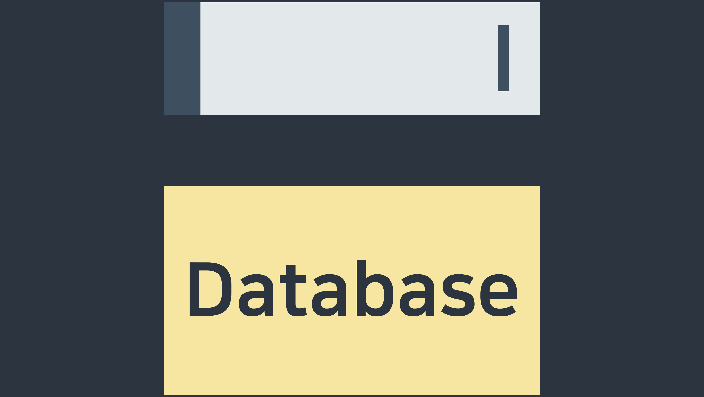

## SELECT

- 테이블에서 여러 컬럼 추출

```sql
SELECT col1_name, col2_name, col3_name FROM table_name
```

- 테이블에서 모든 컬럼 추출

```sql
SELECT * FROM table_name
```

- 컬럼 추출 후 컬럼명 바꾸기

```sql
SELECT col_name AS new_col_name FROM table_name
```

## LIMIT

- 앞의 N개의 데이터만 추출 \(N은 0이상의 정수\)

```sql
SELECT * FROM table_name
LIMIT 100
```

## WHERE

- 조건을 만족하는 데이터 추출

```sql
SELECT * FROM table_name
WHERE condition > 1
```

## Comparison Operators

### 숫자형 데이터

- `=` : 같다
- `<>` `!=` : 같지 않다
- `>` `<`: 크다, 작다
- `>=` `<=` : 크거나 같다, 작거나 같다

```sql
SELECT * FROM table_name
WHERE number_col_name > 100
```

### 비숫자형 데이터

- `=` : 문자열 전체가 동일하다
- `!=` : 문자열 전체가 동일하지 않다
- `>` `<` `>=` `<=` : 알파벳 순을 기준으로 필터링한다

```sql
--문자열 상수를 나타날 때 "가 아니라 '로 나타내야 한다.
SELECT * FROM table_name
WHERE nonnumber_col_name = 'January'
```

```sql
--알파벳을 기준으로 필터링을 할 때 굳이 문자열 전체를 다 쓸 필요 없고
--첫 글자만 써주면 더 간단히 나타낼 수 있다.
SELECT * FROM table_name
WHERE nonnumber_col_name > 'A'
```

## Arithmetic Operators

`+` `-` `×` `/` 로 컬럼 간의 산술 연산을 하여 새로운 컬럼을 생성하거나 새로운 조건 컬럼을 만들 수 있다.

```sql
SELECT col1_name,
			 col2_name,
			 col3_name + col4_name AS new_col_name
FROM table_name
```

```sql
SELECT * FROM table_name
WHERE col1_name + col2_name < 100
```

## References

- [Mode SQL Tutorial - MODE](https://mode.com/sql-tutorial/)
