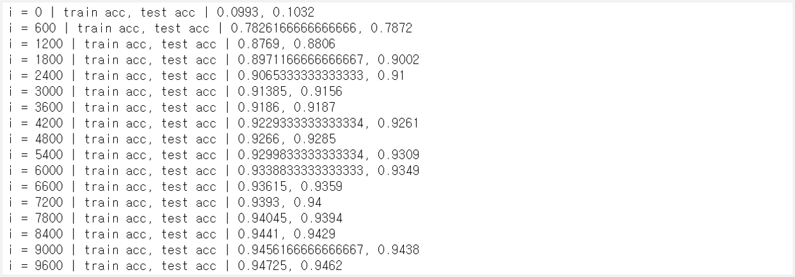

> 이 글은 필자가 [밑바닥부터 시작하는 딥러닝](http://www.yes24.com/Product/Goods/34970929?Acode=101)으로 딥러닝 개념을 공부하며 정리한 글입니다. 혹시 잘못된 부분이 있다면 친절히 가르쳐주시면 감사하겠습니다:)

## 1. 학습 알고리즘 구현하기

신경망 학습은 다음과 같이 이루어진다. 이 때 데이터를 무작위로 뽑아서 미니 배치를 뽑기 때문에 이 때의 경사하강법을 `확률적 경사하강법(SGD, Stochastic Gradient Descent)`라고 한다.

1. **미니 배치** : train 데이터에서 무작위로 데이터를 뽑는다. (=미니 배치를 선정한다.)
2. **기울기 계산** : weight 매개변수에 대한 미니 배치의 손실 함수의 기울기를 계산한다.
3. **매개변수 업데이트** : 앞에서 계산한 기울기의 방향으로 weight 매개변수를 업데이트 한다.
4. **반복** : 손실 함수의 값이 어느 정도 작아질 때까지 1, 2, 3을 반복한다.

## 2. 2층 신경망 클래스 구현

```python
import sys, os
sys.path.append(os.pardir)
from common.functions import *
from common.gradient import numerical_gradient

class TwoLayerNet:
    # 초기화 : 입력층 뉴런 수, 은닉층 뉴런 수, 출력층 뉴런 수
    def __init__(self, input_size, hidden_size, output_size, weight_init_std=0.01):
        self.params = {}   # 신경망의 매개변수
        self.params['W1'] = weight_init_std * np.random.randn(input_size, hidden_size)
        self.params['b1'] = np.zeros(hidden_size)
        self.params['W2'] = weight_init_std * np.random.randn(hidden_size, output_size)
        self.params['b2'] = np.zeros(output_size)

    # 출력값 예측
    def predict(self, x):
        W1, W2 = self.params['W1'], self.params['W2']
        b1, b2 = self.params['b1'], self.params['b2']

        a1 = np.dot(x, W1) + b1
        z1 = sigmoid(a1)
        a2 = np.dot(z1, W2) + b2
        y = softmax(a2)

        return y

    # 손실 함수의 값(=CEE) 계산
    def loss(self, x, t):
        y = self.predict(x)

        return cross_entropy_error(y, t)

    # 정확도 계산
    def accuracy(self, x, t):
        y = self.predict(x)
        y = np.argmax(y, axis=1)
        t = np.argmax(t, axis=1)

        accuracy = np.sum(y == t) / float(x.shape[0])
        return accuracy

    # weight에 대한 손실 함수의 기울기를 계산
    def numerical_gradient(self, x, t):
        loss_W = lambda W: self.loss(x, t)

        grads = {}   # 손실 함수의 기울기(= 각 매개변수에 대한 편미분 값)
        grads['W1'] = numerical_gradient(loss_W, self.params['W1'])
        grads['b1'] = numerical_gradient(loss_W, self.params['b1'])
        grads['W2'] = numerical_gradient(loss_W, self.params['W2'])
        grads['b2'] = numerical_gradient(loss_W, self.params['b2'])

        return grads

    # weight에 대한 손실 함수의 기울기를 계산 by 오차역전파법
    # 위의 numerical_gradient 방법은 너무 오래 걸리므로 이것을 일단 사용
    # 설명은 다음 Chapter에
    def gradient(self, x, t):
        W1, W2 = self.params['W1'], self.params['W2']
        b1, b2 = self.params['b1'], self.params['b2']
        grads = {}

        batch_num = x.shape[0]

        # forward
        a1 = np.dot(x, W1) + b1
        z1 = sigmoid(a1)
        a2 = np.dot(z1, W2) + b2
        y = softmax(a2)

        # backward
        dy = (y - t) / batch_num
        grads['W2'] = np.dot(z1.T, dy)
        grads['b2'] = np.sum(dy, axis=0)

        dz1 = np.dot(dy, W2.T)
        da1 = sigmoid_grad(a1) * dz1
        grads['W1'] = np.dot(x.T, da1)
        grads['b1'] = np.sum(da1, axis=0)


        return grads
```

## 3. 미니배치 학습

```python
from dataset.mnist import load_mnist

# train 데이터, test 데이터 분리
(x_train, t_train), (x_test, t_test) = load_mnist(normalize=True, one_hot_label=True)

# train 데이터에서 손실 함수값 기록
train_loss_list = []

# 하이퍼 파라미터 설정
iters_num = 10000    # 반복횟수
train_size = x_train.shape[0]
batch_size = 100     # 배치 크기
learning_rate =0.1   # 학습률

# 신경망 생성
network = TwoLayerNet(input_size=784, hidden_size=50, output_size=10)

# 반복 학습 -> weight값 업데이트
for i in range(iters_num):
    # 미니 배치 추출
    batch_mask = np.random.choice(train_size, batch_size)
    x_batch = x_train[batch_mask]
    t_batch = t_train[batch_mask]

    # 기울기 계산
    grad = network.gradient(x_batch, t_batch)

    # weight값 업데이트
    for key in ('W1', 'b1', 'W2', 'b2'):
        network.params[key] -= learning_rate * grad[key]

    # 학습 경과 기록 : 손실 함수 값 기록
    loss = network.loss(x_batch, t_batch)
    train_loss_list.append(loss)
```

## 4. Test 데이터로 모델 성능 평가하기

이 단계에서는 모델이 train 데이터에 너무 `오버피팅`이 되지 않았는지를 확인한다. 여기서 epoch라는 단어가 나오는데 epoch란 **학습에서 train 데이터를 모두 소진했을 때의 횟수**를 말한다.

- train 데이터 10000개, 미니배치 100개 : **1 epoch = 100 iters**
- train 데이터 60000개, 미니배치 100개 : **1 epoch = 600 iters**

```python
import sys, os
sys.path.append(os.pardir)
from dataset.mnist import load_mnist

# train 데이터와 test 데이터로 분리
(x_train, t_train), (x_test, t_test) = load_mnist(normalize=True, one_hot_label=True)

# 2층 신경망 생성
network = TwoLayerNet(input_size=784, hidden_size=50, output_size=10)

# 하이퍼 파라미터 설정
iters_num = 10000    # 반복 횟수
train_size = x_train.shape[0]
batch_size = 100     # 배치 크기
learning_rate = 0.1  # 학습률

train_loss_list = []    # train 데이터 손실 함수 값 기록
train_acc_list = []     # train 데이터 정확도 기록
test_acc_list = []      # test 데이터 정확도 기록

# 1 epoch 정의
iter_per_epoch = max(train_size / batch_size, 1)

# 반복 학습 -> weight값 업데이트
for i in range(iters_num):
    # 미니배치 추출
    batch_mask = np.random.choice(train_size, batch_size)
    x_batch = x_train[batch_mask]
    t_batch = t_train[batch_mask]

    # 기울기 계산
    grad = network.gradient(x_batch, t_batch)

    # 매개변수 업데이트
    for key in ('W1', 'b1', 'W2', 'b2'):
        network.params[key] -= learning_rate * grad[key]

    # train 데이터 손실함수 값 기록
    loss = network.loss(x_batch, t_batch)
    train_loss_list.append(loss)

    # 1 epoch당 정확도 기록
    if i % iter_per_epoch == 0:
        train_acc = network.accuracy(x_train, t_train)
        test_acc = network.accuracy(x_test, t_test)
        train_acc_list.append(train_acc)
        test_acc_list.append(test_acc)
        print("i = " + str(i) + " | train acc, test acc | " + str(train_acc) + ", " + str(test_acc))
```


<br>

오버피팅이 일어난다면, 어느 순간부터 test 데이터의 정확도가 점차 떨어진다. 그러므로 **떨어지기 전의 순간을 포착하는 것이 중요**하다. 이러한 기법을 `early stopping`이라고 하며, 그 외에 오버피팅을 예방하기 위한 방법으로 `weight decay`, `drop out`과 같은 방법이 존재한다.
