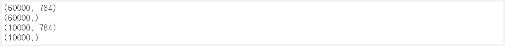
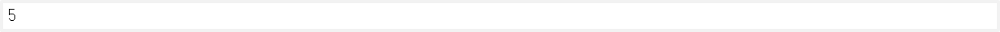
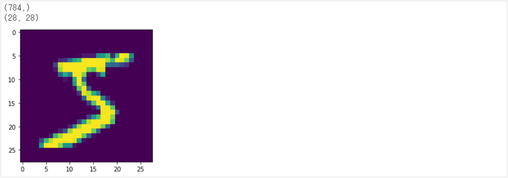
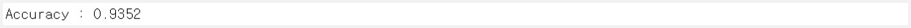
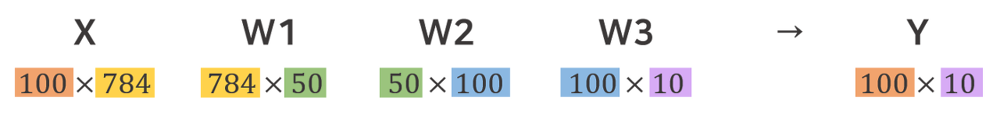
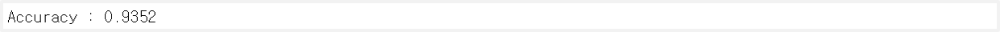

> 이 글은 필자가 [밑바닥부터 시작하는 딥러닝](http://www.yes24.com/Product/Goods/34970929?Acode=101)으로 딥러닝 개념을 공부하며 정리한 글입니다. 혹시 잘못된 부분이 있다면 친절히 가르쳐주시면 감사하겠습니다:)

## 1. 신경망으로 문제 해결하기

신경망은 두 단계를 거쳐서 문제를 해결한다.

- `학습` : 학습 데이터를 이용해 weight를 학습
- `추론` : 학습한 weight를 이용하여 입력 데이터를 분류

## 2. MNIST 데이터셋

0부터 9까지의 숫자 이미지로, train 이미지 60000장 그리고 test 이미지가 10000장이 준비되어 있다.

- 28\*28 크기의 **회색조** 이미지(1채널)로, 각 픽셀값이 0 - 255
- 각 이미지에 실제 의미한 숫자가 **레이블**이 붙어 있음

## 3. 데이터셋 불러오기

load_mnist로 데이터를 불러올 수 있다. 처음 호출 시 **인터넷에서 데이터를 로드**하고, 두 번째 호출부터는 **로컬에 저장된 pickle 파일을 로드**한다.

- `normalize` : True면 이미지 픽셀을 0.0 ~ 1.0 사이의 값을 정규화, False면 픽셀 원래값인 0 ~ 255
- `flatten` : True면 이미지 크기를 784개의 원소로 이루어진 1차원 배열로 변환, False면 1×28×28인 3차원 배열 그대로
- `one_hot_label` : True면 레이블을 원-핫 인코딩으로 변환, False면 레이블 그대로

```python
import sys, os
sys.path.append(os.pardir)
from dataset.mnist import load_mnist

# (train 이미지, train 이미지의 레이블), (test 이미지, test 이미지의 레이블)
(x_train, t_train), (x_test, t_test) = \
    load_mnist(flatten=True, normalize=False)

# 각 데이터의 크기 출력
print(x_train.shape)
print(t_train.shape)
print(x_test.shape)
print(t_test.shape)
```



## 4. 이미지 출력하기

PIL(Python Image Libary) 모듈을 이용해 화면에 이미지를 표시할 수 있다.

```python
from PIL import Image
from matplotlib.pyplot import imshow
%matplotlib inline

def img_show(img):
    pil_img = Image.fromarray(np.uint8(img))
    # pil_img.show()
    imshow(np.asarray(pil_img))


img = x_train[0]
label = t_train[0]
label
```



```python
print(img.shape)
img = img.reshape(28, 28)
print(img.shape)

img_show(img)
```



## 5. 레이블 추론하기

아래와 같이 3층 신경망을 구현한다. 이 때 은닉층의 뉴런의 수는 임의로 정한 값이다.

- **입력층(0)** : 784개의 뉴런 (28×28 px)
- **은닉층(1)** : 50개의 뉴런
- **은닉층(2)** : 100개의 뉴런
- **출력층(3)** : 10개의 뉴런 ([0-9])

```python
import pickle

# 데이터 로드를 한 뒤 train set과 test set으로 분리
def get_data():
    (x_train, t_train), (x_test, t_test) = load_mnist(normalize=True, flatten=True, one_hot_label=False)
    return x_test, t_test

# sample_weight.pkl에 저장된 weight와 bias를 불러옴
def init_network():
    with open("sample_weight.pkl", 'rb') as f:
        network = pickle.load(f)

    return network

# 3층 신경망 구성
def predict(network, x):
    W1, W2, W3 = network['W1'], network['W2'], network['W3']
    b1, b2, b3 = network['b1'], network['b2'], network['b3']

    a1 = np.dot(x, W1) + b1
    z1 = sigmoid(a1)
    a2 = np.dot(z1, W2) + b2
    z2 = sigmoid(a2)
    a3 = np.dot(z2, W3) + b3
    y = softmax(a3)

    return y
```

```python
x, t = get_data()         # 데이터 로드
network = init_network()  # weight와 bias

accuracy_cnt = 0          # 정확도 계산을 위한 카운트 : 맞춘 데이터 개수
for i in range(len(x)):
    y = predict(network, x[i])
    # 확률이 가장 높은 것의 인덱스 = 인식한 숫자
    p = np.argmax(y)
    if p == t[i]:
        accuracy_cnt += 1

print('Accuracy :', str(float(accuracy_cnt) / len(x)))
```



<br>

전처리는 입력 데이터에 특정 변환을 가한 것이다. 전처리를 통해서 식별 능력을 개선하고 학습 속도를 높일 수 있다. 보통 **데이터 전체의 분포를 고려해 전처리하는 경우**가 많다.

- `정규화` : 데이터를 특정 범위로 변환하는 처리
- `백색화` : 데이터를 균일하게 분포시킴

## 6. 배치 처리



<br>

배치란 **하나로 묶은 입력 데이터**를 말한다. 즉, 10000개의 28×28px의 이미지 데이터가 있다 할 때 10000×784 로 묶는 것과 같다. 출력은 **입력 데이터의 개수와 레이블 개수를 곱한 것**이다. 즉, 10000×10이 된다.

- `이유1` : 대부분의 라이브러리가 큰 배열을 효율적으로 처리할 수 있도록 최적화 되어 있어서
- `이유2` : 배치 처리를 함으로써 다음 신경망으로 데이터를 넘길 때 부하를 줄일 수 있어서

요약하자면 데이터 하나씩 처리하지말고 많이 묶어서 한꺼번에 처리하자는 말이다.

```python
x, t = get_data()         # 데이터 로드
network = init_network()  # weight와 bias

batch_size = 100          # 100개씩 묶어서 계산
accuracy_cnt = 0          # 정확도 계산을 위한 카운트 : 맞춘 데이터 개수
for i in range(0, len(x), batch_size):
    # 100 * 784
    x_batch = x[i:i+batch_size]    # 0-99, 100-199, ...
    # 100 * 10
    y_batch = predict(network, x_batch)

    # 확률이 가장 높은 것의 인덱스 = 인식한 숫자
    # 각 행(=각 데이터)의 가장 큰 확률을 가진 인덱스를 반환
    # 100 * 1 크기의 배열이 반환
    p = np.argmax(y_batch, axis=1)
    accuracy_cnt += np.sum(p == t[i:i+batch_size])

print('Accuracy :', str(float(accuracy_cnt) / len(x)))
```


