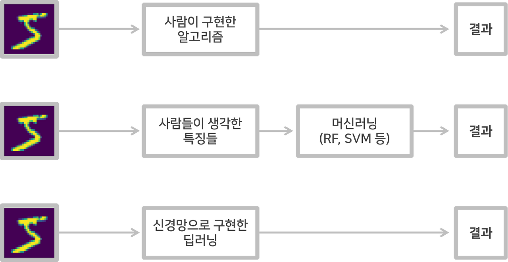
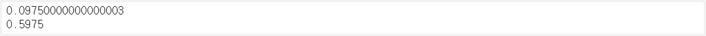
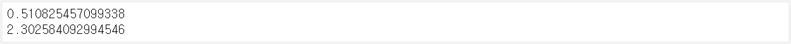
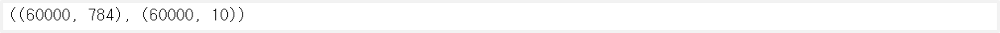
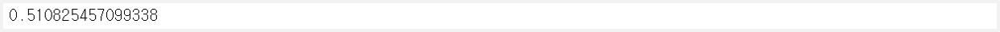

> 이 글은 필자가 [밑바닥부터 시작하는 딥러닝](http://www.yes24.com/Product/Goods/34970929?Acode=101)으로 딥러닝 개념을 공부하며 정리한 글입니다. 혹시 잘못된 부분이 있다면 친절히 가르쳐주시면 감사하겠습니다:)

## 1. 신경망에서의 학습

신경망에서의 학습이란 **train 데이터로부터 weight의 최적값을 구하는 것**을 말한다. 신경망은 다른 방법들과는 다르게 **거의 사람의 개입이 없**다.

### 알고리즘 vs 머신러닝 vs 신경망



<br>

- `알고리즘` : 처음부터 끝까지 사람이 이미지를 식별하는 알고리즘을 짜는 것
- `머신러닝` : 사람이 이미지에서 특징을 추출하고 그 특징의 패턴을 머신러닝으로 학습하는 것
- `딥러닝` : 신경망이 주어진 데이터를 학습하고 데이터의 패턴을 찾아내는 것 (=End-to-End Machine Learning)

### train 데이터와 test 데이터

머신러닝에서는 데이터를 train 데이터와 test 데이터로 나누어 학습과 검증을 하는 것이 일반적이다. 만약 하나의 데이터만 가지고 학습과 검증을 한다면 올바른 평가가 될 수 없다. 마치 **답을 보고 시험을 보는 것**처럼 그 데이터에 지나치게 최적화된 `오버피팅`이 일어날 수 있기 때문이다.

1. train 데이터를 통해서 최적의 weight값을 찾는다.
2. test 데이터를 이용해 앞에서 만든 모델의 성능을 평가한다.

## 2. 손실 함수 Cost Function

학습을 하는 것은 **최적의 weight값을 찾는 것**이라고 했는데, 어떻게 최적의 weight 값을 찾을 수 있을까? 즉, 어떤 기준으로 좋은 weight인지 아닌지를 알 수 있을까? 이에 대한 지표로 활용하는 것이 바로 **손실 함수**이다. 이 손실함수가 작을수록 최적의 weight값을 찾는 것이라 보면 된다.

대표적인 손실 함수로는 `평균 오차 제곱(MSE)`와 `교차 엔트로피 오차(CEE)`가 있다.

### 평균 제곱 오차 Mean Square Error

평균 제곱 오차(MSE, Mean Square Error)는 **예측값과 실제값의 차이를 제곱해 평균**을 한 것이라 보면 된다.

$$
E = \frac{1}{2}\sum_k(y_k - t_k)^2
$$

```python
def mean_squared_error(y, t):
    return 0.5 * np.sum((y-t)**2)
```

```python
# 실제값
t = np.array([0, 0, 1, 0, 0, 0, 0, 0, 0, 0])

# 예측값1
y1 = np.array([0.1, 0.05, 0.6, 0.0, 0.05, 0.1, 0.0, 0.1, 0.0, 0.0])
print(mean_squared_error(y1, t))

# 예측값2
y2 = np.array([0.1, 0.05, 0.1, 0.0, 0.05, 0.1, 0.0, 0.6, 0.0, 0.0])
print(mean_squared_error(y2, t))
```



<br>

### 교차 엔트로피 오차 Cross Entropy Error

$$
E = -\sum_kt_k\log{y_k}
$$

교차 엔트로피 오차(CEE, Cross Entropy Error)는 다음과 같다. $y_t$는 신경망의 출력값(=확률)이고, $t_k$는 레이블값이다. 이때 $t_k$는 정답에 해당하는 것의 요소만 1이고 나머지는 0인 **원-핫 인코딩 형태**이다. 출력값(=확률)이 1에 가까워질수록 $\log{y_k}$의 값이 0에 가까워지므로 오류가 0에 가까워지고, 0에 가까워질수록 해당 값이 무한대로 발산하므로 오류가 증가한다.

예를 들어, 다른 숫자는 동일하므로 2만 봐보자. 나머지 예측값은 원-핫 인코딩에 의해 0이 되고 정답 레이블 인덱스인 2의 계산값을 보자.

- `[0.1, 0.0, 0.9, 0.0, 0.0, 0.0, 0.1, 0.0, 0.0, 0.0]` : 2에 해당하는 부분만 보면 $-1\log{0.9} = 0.046$이므로 오류가 거의 없다.
- `[0.1, 0.0, 0.3, 0.0, 0.0, 0.0, 0.1, 0.0, 0.0, 0.0]` : 2에 해당하는 부분만 보면 $-1\log{0.3} = 0.52$이므로 오류가 매우 크다.

```python
def cross_entropy_error(y, t):
    # y가 0이 되어버리면 inf가 되므로 그걸 방지하기 위한 상수
    delta = 1e-7
    return -np.sum(t * np.log(y + delta))
```

```python
# 실제값
t = np.array([0, 0, 1, 0, 0, 0, 0, 0, 0, 0])

# 예측값1
y1 = np.array([0.1, 0.05, 0.6, 0.0, 0.05, 0.1, 0.0, 0.1, 0.0, 0.0])
print(cross_entropy_error(y1, t))

# 예측값2
y2 = np.array([0.1, 0.05, 0.1, 0.0, 0.05, 0.1, 0.0, 0.6, 0.0, 0.0])
print(cross_entropy_error(y2, t))
```



<br>

### 미니 배치의 필요성

위의 손실 함수는 <u>하나의 데이터의 손실 함수 값</u>을 구한 것과 같다. 하지만 우리는 100개 아니 수백만개의 데이터를 가지고 있기에 **모든 데이터를 대표할 손실 함수값이 필요**하다. 그래서 모든 데이터의 손실 함수값의 평균을 사용하면 된다.

$$
E = -\frac{1}{N}\sum_n\sum_kt_{nk}\log{y_{nk}}
$$

그렇지만 우리가 가지고 있는 데이터의 개수는 너무나도 많다. 모든 데이터의 손실 함수의 값을 구하려면 엄청난 시간이 걸리 것이다. 그래서 우리는 <u>근사값</u>을 이용한다. 전체 데이터에서 표본이 될만한 데이터를 랜덤으로 뽑는 것이다. 이러한 방식을 **미니배치 학습**이라고 한다.

```python
import sys, os
sys.path.append(os.pardir)
from dataset.mnist import load_mnist

(x_train, t_train), (x_test, t_test) = load_mnist(normalize=True, one_hot_label=True)

x_train.shape, t_train.shape
```



```python
# 무작위로 10개의 index 번호 추출
train_size = x_train.shape[0]    # 60000
batch_size = 10

#0 - 59999 중에 10개를 random으로 추출
batch_mask = np.random.choice(train_size, batch_size)
x_batch = x_train[batch_mask]
t_batch = t_train[batch_mask]
```

```python
# 원-핫 인코딩을 사용하는 경우
# 미니 배치를 활용한 CEE
def cross_entropy_error(y, t):
    # 1차원 -> 2차원 : 데이터가 하나인 경우
    if y.ndim == 1:
        t = t.reshape(1, t.size)
        y = y.reshape(1, y.size)

    # batch size = 데이터의 개수
    batch_size = y.shape[0]
    return -np.sum(t * np.log(y + 1e-7)) / batch_size
```

```python
# 레이블 값 자체를 사용하는 경우
# 미니 배치를 활용한 CEE
def cross_entropy_error_label(y, t):
    # 1차원 -> 2차원 : 데이터가 하나인 경우
    if y.ndim == 1:
        t = t.reshape(1, t.size)
        y = y.reshape(1, y.size)

    # batch size = 데이터의 개수
    batch_size = y.shape[0]
    # batch size만큼의 y 데이터를 추출 : 예를 들어, 5라면 0부터 4까지의 데이터
    # 거기의 예측값인 t값에 접근 : 내가 2랑 비교하고 싶다 하면 y의 2번째 column에 접근하면 예측값이 나옴
    return -np.sum(np.log(y[np.arange(batch_size), t] + 1e-7)) / batch_size
```

```python
t = np.array([0, 0, 1, 0, 0, 0, 0, 0, 0, 0])

# 2일 확률이 가장 높다고 예측
y = np.array([0.1, 0.05, 0.6, 0.0, 0.05, 0.1, 0.0, 0.1, 0.0, 0.0])
cross_entropy_error(y,t)
```



<br>

### 손실 함수의 필요성

신경망 학습 시 **미분**은 매우 중요한 역할을 한다. 학습 시 최적의 weight값과 bias값을 찾기 위해 손실 함수를 계산하고 **이를 가장 작게 하는(거의 0에 가까운) 매개변수** 찾는다. 그래서 매개변수를 살짝만 조정해도 그 효과가 고스란히 손실 함수에 일어나게 된다.

- 정확도의 경우 매개변수를 살짝 조정하더라도, 손실 함수의 변화가 잘 느껴지지 않는다.
- 계단 함수의 경우 어느 시점에 값이 `0→1`(`1→0`)으로 변화하여, 손실 함수의 변화가 잘 느껴지지 않는다.
