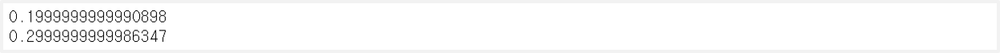
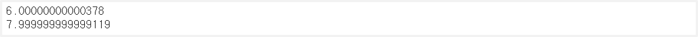
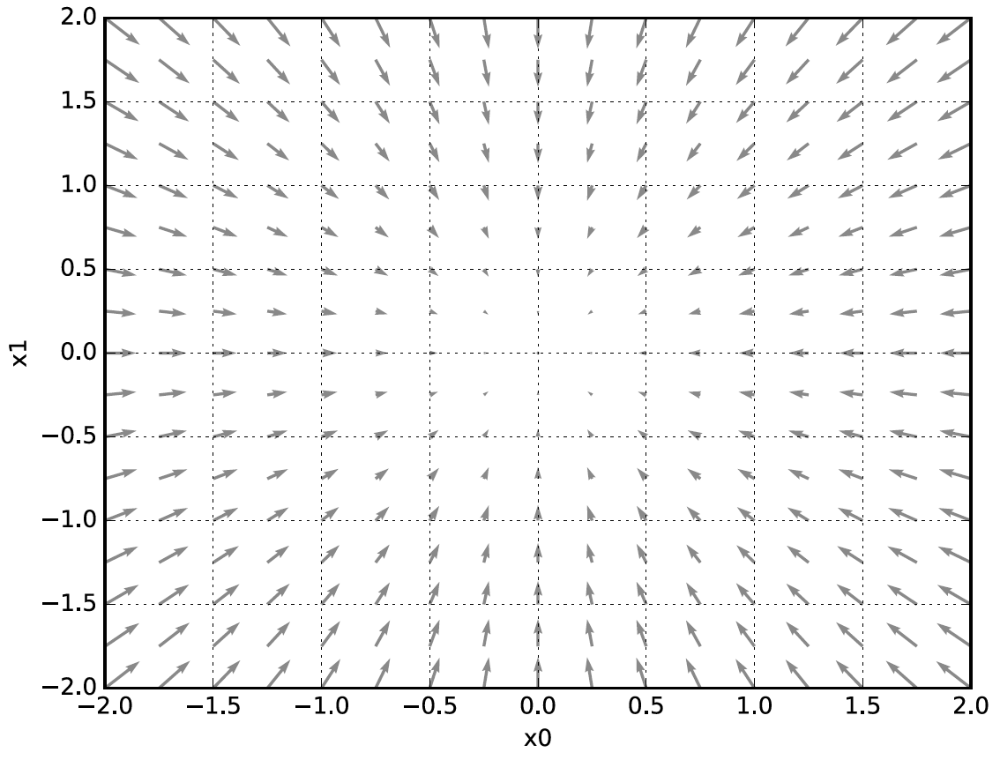
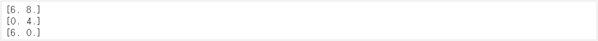
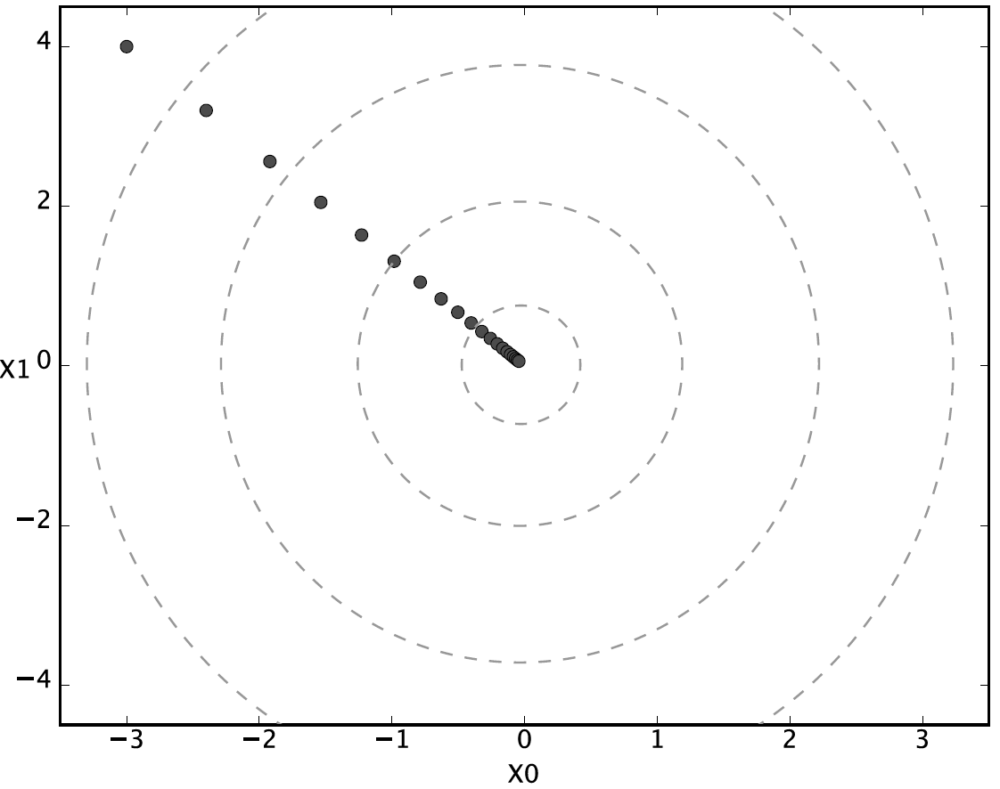
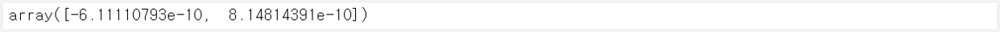
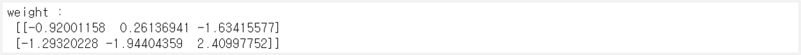
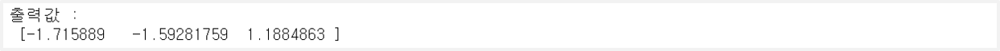
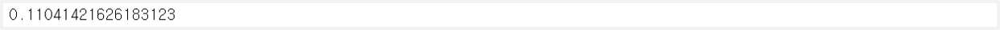
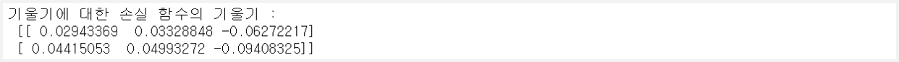

> 이 글은 필자가 [밑바닥부터 시작하는 딥러닝](http://www.yes24.com/Product/Goods/34970929?Acode=101)으로 딥러닝 개념을 공부하며 정리한 글입니다. 혹시 잘못된 부분이 있다면 친절히 가르쳐주시면 감사하겠습니다:)

## 1. 수치 미분 Numerical Difference

### 수치 미분

미분은 특정 순간의 변화량을 말한다. df(x)dx에서 **x의 변화가 함수 f(x)를 얼마나 변화시키느냐**를 의미한다. 하지만 우리는 미분을 직접적으로 구하기 어려우므로 그 근사값을 구한다. 이것을 `수치 미분`이라 한다. 그래서 어느 정도의 오차가 포함이 된다.

- $\lim_{h \rightarrow 0}\frac{f(x+h) - f(x)}{h}$ : $h$가 너무 작으면 반올림 오차 발생(작은 소숫점 생략)
- $\lim_{h \rightarrow 0}\frac{f(x+h) - f(x-h)}{2h}$ : $x$를 중심으로 그 전후의 차이를 구함

```python
def numerical_diff(f, x):
    h = 1e-4
    return (f(x+h) - f(x-h)) / (2*h)
```

```python
# y = 0.01x^2+0.1x
def func(x):
    return 0.01*x**2+0.1*x

print(numerical_diff(func, 5))     # func의 x값이 5일때의 기울기
print(numerical_diff(func, 10))    # func의 x값이 10일때의 기울기
```


<br>

### 편미분

편미분은 **변수가 2개 이상일 때** 하는 미분을 말한다. 이 때 다른 변수들의 값을 **고정**하고 **목표 변수 하나의 기울기**만 구하는 것이다.

```python
# y = x_0^2 + x_1^2
def func2(x):
    return x[0]**2+x[1]**2

# x_0에 대해 편미분 (x_1 = 4.0)
def func2_0(x0):
    return x0*x0 + 4.0**2

# x_1에 대해 편미분 (x_0 = 3.0)
def func2_1(x1):
    return 3.0**2 + x1*x1

print(numerical_diff(func2_0, 3.0))    # x_0에 대한 편미분
print(numerical_diff(func2_1, 4.0))    # x_1에 대한 편미분
```



## 2. 기울기

### 다변수 함수의 기울기


<br>

$x_0 = a, x_1 = b$에서의 기울기는 $(\frac{\partial f}{\partial x_0}, \frac{\partial f}{\partial x_1})$이라는 벡터에 대입을 한 것과 같다.

이 때 **이 벡터들이 가리키는 방향**이 **손실 함수의 값을 가장 크게 줄일 수 있는 방향**이다.

```python
# 2개 이상의 변수를 갖고 있을 때의 기울기 반환
def numerical_gradient(f, x):
    h = 1e-4
    grad = np.zeros_like(x)    # 변수의 개수만큼의 기울기 벡터 요소 생성

    for idx in range(x.size):
        tmp = x[idx]

        # f(x+h)
        x[idx] = tmp + h
        fxh1 = f(x)

        # f(x-h)
        x[idx] = tmp - h
        fxh2 = f(x)

        # 기울기
        grad[idx] = (fxh1 - fxh2) / (2*h)

        # 원래 x값 복원
        x[idx] = tmp

    return grad
```

```python
print(numerical_gradient(func2, np.array([3.0, 4.0])))
print(numerical_gradient(func2, np.array([0.0, 2.0])))
print(numerical_gradient(func2, np.array([3.0, 0.0])))
```


<br>

### 경사하강법 Gradient Descent


<br>

경사하강법(Gradient Descent)란 **현재 위치에서 기울어진 방향(=기울기가 가리키는 방향)으로 일정 거리만큼 이동하여 손실 함수의 값을 줄이는 법**을 말한다.

$$
x_0 = x_0 - \eta\frac{\partial f}{\partial x_0}
$$

$$
x_1 = x_1 - \eta\frac{\partial f}{\partial x_1}
$$

이 때 $\eta$는 학습률(learning rate)를 뜻하며, **매개 변수의 값을 얼마만큼 업데이트할지**를 말한다. 보통 0.01이나 0.001등으로 값을 고정한다.

- 학습률은 신경망이 알아서 구하는 매개변수가 아닌 사람이 정해야 하는 `하이퍼 파라미터(Hyper Parameter)`이다.
- 학습률이 너무 작으면 매개 변수 값이 거의 업데이트 되지 않고 끝이나고, 너무 크면 큰 값으로 발산을 한다. 적당히 하자.

```python
# f는 함수, init_x는 초기값, lr은 학습률, step_num은 얼마만큼 업데이트 할지
def gradient_descent(f, init_x, lr=0.01, step_num = 100):
    x = init_x

    for i in range(step_num):
        grad = numerical_gradient(f, x)
        x -= lr * grad

    return x
```

```python
init_x = np.array([-3.0, 4.0])
gradient_descent(func2, init_x=init_x, lr=0.1, step_num=100)   # 거의 0에 가깝다.
```


<br>

### 신경망에서의 기울기

$$
W = \begin{pmatrix}w_{11} & w_{12} & w_{13}\\w_{21} & w_{22} & w_{23} \end{pmatrix}
$$

$$
\frac{\partial L}{\partial W} = \begin{pmatrix}\frac{\partial L}{\partial w_{11}} & \frac{\partial L}{\partial w_{12}} & \frac{\partial L}{\partial w_{13}}\\\frac{\partial L}{\partial w_{21}} & \frac{\partial L}{\partial w_{22}} & \frac{\partial L}{\partial w_{23}} \end{pmatrix}
$$

신경망 학습 시의 기울기는 **weight 매개변수에 대한 손실 함수의 기울기**를 말한다. 다음은 간단한 신경망을 구현한 **simpleNet 클래스**이다.

- `predict` : weight값으로 출력값 예측
- `loss` : 예측값과 레이블값으로 손실 함수인 CEE를 구해 반환

```python
import sys, os
sys.path.append(os.pardir)
from common.functions import softmax, cross_entropy_error
from common.gradient import numerical_gradient

class simpleNet:
    def __init__(self):
        # weight 매개변수를 정규분포를 가진 random값으로 초기화
        self.W = np.random.randn(2,3)

    # 출력값을 예측
    def predict(self, x):
        return np.dot(x, self.W)

    # 손실 함수의 값을 계산
    def loss(self, x, t):
        z = self.predict(x)
        y = softmax(z)

        loss = cross_entropy_error(y, t)

        return loss
```

```python
# 신경망 생성
net = simpleNet()
print('weight :\n', net.W)
```



```python
# 출력값 예측
x = np.array([0.6, 0.9])
pred = net.predict(x)
print('출력값 :\n', pred)
```



```python
# 손실 함수값 계산
t = np.array([0, 0, 1])
net.loss(x, t)
```



```python
# 손실 함수 정의 : 더미 함수
f = lambda w : net.loss(x, t)

# weight에 대한 손실 함수의 기울기
dW = numerical_gradient(f, net.W)
print('기울기에 대한 손실 함수의 기울기 :\n', dW)
```


